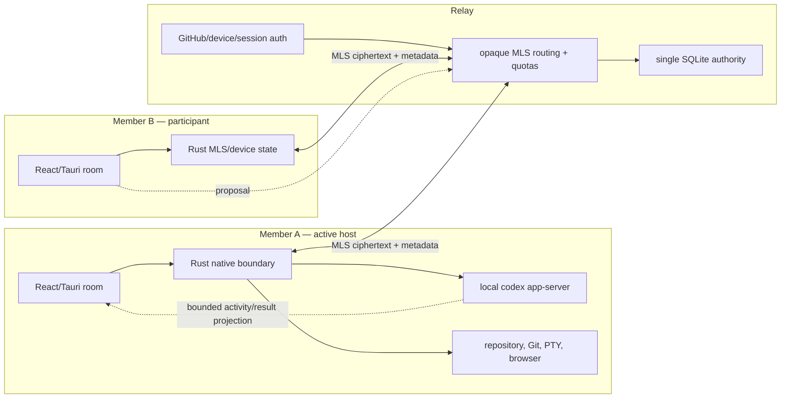

# multAIplayer teardown: encrypted collaboration around one local Codex host

- **Date:** 2026-07-18
- **Source:** [`maddiedreese/multAIplayer`](https://github.com/maddiedreese/multAIplayer)
- **Pinned default-branch commit:**
  [`156c55e51ab2db9d00c8eb418c4443a55ddb739e`](https://github.com/maddiedreese/multAIplayer/tree/156c55e51ab2db9d00c8eb418c4443a55ddb739e)
- **Pinned tree:** `28d79e596954e37ad3c28ff8498d1b5e2454afc0`
- **Commit date:** `2026-07-18T03:18:02-07:00`
- **Commit subject:** `fix(release): resolve private draft by tag (#311)`
- **Default branch:** `main`
- **Declared product version:** `0.1.0-alpha.7`
- **Nearest release tag:** `v0.1.0-alpha.7` at parent commit
  `f70d6c30294c4827f7a9639225a9fcce6acd350e`
- **License:** Apache-2.0
- **Study checkout:** `projects/repos/multAIplayer`
- **Study mode:** read-only external-reference teardown
- **Primary question:** How does multAIplayer turn one developer's local Codex
  process and repository into an end-to-end encrypted team room, which parts
  are genuine execution and durability authority, and which ideas should
  OpenAgents adapt or refuse?

## Executive verdict

multAIplayer is the strongest public reference in the current catalog for
**multi-human collaboration around one locally hosted coding-agent runtime**.
It is much more precise than the phrase “multiplayer Codex” first suggests.
Room members can discuss work, attach files, propose agent turns, observe a
bounded projection of Codex activity, inspect files and diffs, use workbench
surfaces, and transfer hosting. They do not all become equivalent operators of
the host machine. Exactly one active host supplies the repository, local Codex
app-server, account, model access, MCP environment, Git/GitHub credentials,
tools, and privileged native confirmations at a time. [source]

The product's most important law is therefore:

```text
room membership != execution authority

member proposal
    -> active host receives the proposed turn or action
    -> host policy and native confirmation apply locally
    -> host runtime performs the effect
    -> a bounded, room-safe result is shared
```

That is the right primitive for OpenAgents to learn. A collaborative room
should not flatten participant identity, execution attachment, runtime
authority, containment, acceptance, and visibility into a single “can send
messages” permission. OpenAgents already has the stronger canonical concepts—
Thread, Work Unit, claim/attachment, WorkContext, typed intents, Sync, and
receipts. multAIplayer supplies a concrete collaboration protocol and product
journey that can sit above them. [inferred]

The repository is unusually serious for a two-week-old alpha. Its Rust native
boundary owns MLS state, device keys, encrypted local storage, invite parsing,
Codex authorization, shell confirmation, filesystem confinement, Git/GitHub,
diagnostics, archives, browser windows, and updater verification. Its relay
stores routing and quota metadata plus opaque MLS messages, uses compare-and-
swap room epochs, durably records exact-message receipts, and deliberately
fails the whole process when persistence becomes unreliable. Its release
workflow pins third-party actions, signs the updater archive, notarizes and
staples the macOS app and DMG, checks a fixed asset contract, and requires a
manual signed-product journey before publication. [source] [test]

The same audit also requires restraint:

- the MLS integration is explicitly unaudited, so the code demonstrates a
  careful design intent, not a verified confidentiality guarantee. [Source]
- group content is encrypted, but relay-visible routing, account, membership,
  epoch, quota, timing, IP, and size metadata remain visible. [Source]
- retained local history keys deliberately trade forward secrecy for local
  history readability. [Source]
- the trusted main webview remains part of the Tauri trusted computing base,
  room IDs are scopes rather than unforgeable authorization tokens, and the
  host shell is constrained host-user execution rather than a general tenant
  sandbox. [Source]
- the relay is intentionally one Node process with one SQLite writer, not an
  active-active collaboration service. [Source]
- the product is Apple-Silicon-only alpha software tested on macOS 15, despite
  a minimum deployment target of macOS 11. [Source]
- a failed Codex `thread/resume` silently starts a new thread, which preserves
  availability while making continuity ambiguous. [Source]
- local preview uses a public Cloudflare quick tunnel, which turns an obscure
  preview URL into bearer-like access to a host service. [Source] [inferred]
- broad GitHub `repo` scope and an automated `git add -A` workflow are a poor
  fit for OpenAgents' narrower repository authority and main-branch rules.
  [source] [inferred]

The central OpenAgents decision is:

> **Adapt multAIplayer's proposal-versus-execution split, explicit active-host
> attachment, epoch-bound host handoff, bounded runtime projection,
> persist-before-publish outbox, exact acceptance receipts, and fail-stop
> durability posture into a target-native optional CollaborationScope. Keep
> OpenAgents' canonical thread, Sync, WorkContext, authority, containment,
> claims, and receipts underneath it. If private group rooms are admitted,
> use an audited group-messaging implementation and state exactly which content
> and metadata are protected. Do not copy the relay, trusted-webview model,
> shell posture, quick tunnel, broad OAuth scope, or Git workflow as product
> authority.**

## 1. Evidence boundary and repository shape

The canonical workspace sync script cloned the public repository from its
default branch immediately before inspection. Local `main`, `origin/main`, and
`origin/HEAD` resolved to the pinned commit, and the checkout was clean.
[source]

The declared alpha tag points to the pinned commit's parent. The pinned `main`
contains one subsequent release-workflow correction. This teardown therefore
describes exact source newer than the published alpha tag while retaining the
declared `0.1.0-alpha.7` product version. [source] [history]

| Measure | Pinned observation |
| --- | ---: |
| Repository age | 14 days |
| Commits in reachable history | 702 |
| Tracked files | 900 |
| Approximate TypeScript/TSX/Rust/MJS lines | 122,076 |
| TypeScript files | 531 |
| Rust files | 97 |
| TSX files | 87 |
| MJS files | 48 |
| Markdown files | 32 |
| Desktop/native files under `apps/` | 728 |
| End-to-end files | 41 |
| Documentation files | 29 |
| Tooling files | 27 |
| Shared-package files | 18 |
| Test/spec TypeScript files | 197 |
| Lexical Node `test`/`it` declarations | about 1,003 |
| Rust `#[test]` declarations | 244 |
| Rust property-test blocks | 4 |
| Typed native Tauri commands | 103 |
| Registered native commands | 108 |
| Default Tauri capability entries | 113 |

The history is concentrated: most commits are from one maintainer under two
email identities, with Dependabot supplying most of the remaining automated
changes. The commit stream contains repeated security audit, protocol repair,
release blocker, and journey-hardening rounds. The best explanation is an
intense AI-assisted implementation and review loop rather than a mature
multi-team development history. [history] [inferred]

That velocity cuts both ways. It explains how the repository accumulated an
impressive enforcement and test surface quickly, but it also means the design
has had little time in production, compatibility history is short, and one
maintainer/account remains a concentrated product and release risk.
[history] [inferred]

### Evidence labels

- **`[source]`** — observed directly in the pinned source or checked-in docs.
- **`[schema]`** — encoded in a typed schema, fixed manifest, or protocol
  definition.
- **`[test]`** — asserted by unit, integration, fuzz, journey, benchmark, or CI
  code. A test proves an intended and exercised contract, not universal
  correctness.
- **`[history]`** — supported by Git history or an accepted decision record.
- **`[inferred]`** — a reasoned explanation from multiple observations, not a
  direct upstream claim.
- **`[limitation]`** — a boundary on what the evidence can establish.

The repository was studied as source. No upstream install, build, test, relay,
OAuth, Codex, cloud tunnel, or release workflow was executed. Its docs and
prompts were evidence, not operational instructions. [limitation]

## 2. Product: a room around a host, not a distributed agent

The README calls the product “Multiplayer Codex for trusted teams.” The actual
architecture makes the “trusted” and “hosted” qualifications load-bearing.
[source]

A room combines:

- multi-member chat and attachments.
- agent-turn proposals and a visible follow-up queue.
- shared bounded Codex activity and results.
- file search, preview, editing, and diffs.
- a terminal, browser, local preview, Git, GitHub pull requests, and Actions.
- roster, device, invite, host-handoff, settings, history, diagnostics, and
  encrypted archive flows. And
- one current project and one current execution host. [source]

The host runs the ordinary locally installed `codex app-server`. multAIplayer
does not call the OpenAI API directly and does not transmit a room-wide API key.
The host's Codex login, model access, local configuration, repository, tools,
MCP connections, Git credentials, GitHub credentials, browser state, and
process environment remain local host resources. [source]

That yields a clean responsibility split:

| Concern | Authority |
| --- | --- |
| Who is in the private room? | MLS membership state plus relay account/device records |
| Who may propose work? | Room membership and room policy |
| Which machine owns the live project/runtime? | Current host attachment |
| Whether a privileged Codex request may proceed | Host-native policy and exact confirmation |
| Whether a shell command or PTY input may run | Host-native one-shot confirmation/grant |
| What team members can observe | Explicit room event and bounded activity projection |
| What the relay may accept | Device auth, membership/host rules, room epoch, quotas, and exact schema |
| What happened canonically in OpenAgents | Not answered by multAIplayer. OpenAgents receipts must remain authoritative |

The product does not distribute one runtime over multiple machines, move a
live process image, transfer a Codex account, transfer a shell, or give a new
host the old host's credentials. Host handoff changes who may execute future
room work. It is not live process migration. [source]

## 3. Architecture: five boundaries, one deliberate attachment



The repository has five meaningful layers:

1. **React desktop product.** Zustand owns presentation and interaction state.
   typed application actions cross the Tauri bridge. [source]
2. **Rust native capability boundary.** Tauri commands own secrets, crypto,
   filesystem and process access, native confirmation, Git/GitHub, browser,
   archives, diagnostics, updater authentication, and Codex process control.
   [source]
3. **`mls-core`.** A separate Rust crate owns group state, exact ciphersuite
   policy, membership, host rules, outbox transactions, exporter secrets,
   invite capabilities, HPKE sealing, and storage. [source]
4. **Relay.** An Express/WebSocket service authenticates devices, routes opaque
   messages, applies room/host/epoch rules and quotas, and persists normalized
   SQLite state. [source]
5. **Shared protocol.** Zod schemas define relay messages, invite data, Codex
   activity, and bounded application events. [schema]

This is not a pure zero-trust system. The relay still authenticates accounts,
assigns quotas, stores membership-adjacent records, validates MLS framing and
room epochs, and decides whether to route or retain messages. The main webview
is trusted product code with a broad but typed native capability surface. The
active host machine can see every plaintext it legitimately decrypts and
every local effect it executes. [source]

The design is better described as:

> **content-confidential team messaging plus explicit single-device execution
> attachment, not mutually distrusting computation.** [inferred]

## 4. MLS group state and the exact confidentiality claim

multAIplayer implements Messaging Layer Security using `mls-rs` `0.55.2`,
AWS-LC-backed cryptography, and a SQLCipher storage provider. The protocol is
pinned to the P-256/AES-128-GCM/SHA-256 ciphersuite identified as `0x0002`.
there is no negotiation surface. [source] [schema]

Each device has an MLS signing identity and HPKE identity kept in macOS
Keychain. A `BasicCredential` binds a GitHub user ID and device ID. The public
fingerprint is the full SHA-256 digest of the signature public-key SPKI, not a
short cosmetic code. [source]

The Rust boundary, not the webview, owns:

- MLS private keys and group state.
- group and history exporter secrets.
- KeyPackage generation and validation.
- membership Commit and Welcome processing.
- retained epoch material and blob keys.
- invite verification state. And
- exact encrypted outbox mutation. [source]

The webview receives typed plaintext application events after native
decryption and bounded public identity information. It does not receive raw
private keys, group secrets, history exporter secrets, or the SQLCipher
wrapping key. [source]

### 4.1 Host identity is inside the group context

The current host is not only a mutable relay field. A mandatory MLS
GroupContext extension identifies the active host leaf. The native group rules
allow only that leaf to produce membership Commits. The relay separately
checks active device and epoch state before accepting the transition. [source]

Duplicating the check is intentional. The cryptographic group state makes
host identity part of the authenticated room evolution. Relay enforcement
limits what the service will route and persist. Neither alone proves the host
machine applied OpenAgents authority correctly. [inferred]

### 4.2 The relay still sees metadata

The relay receives opaque MLS bytes, never the application event kind or
plaintext content. It still observes and stores enough metadata to operate:

- account, device, team, room, and active-host identifiers.
- KeyPackage and invite lifecycle records.
- message sender, room, epoch, digest, size, timing, and acceptance state.
- connection IP and session/rate-limit facts.
- membership and quota operations. And
- encrypted attachment/blob identifiers and sizes. [source]

The honest claim is “room content is E2EE” rather than “the relay learns
nothing.” OpenAgents must preserve that wording discipline if a group-private
mode is ever admitted. [inferred]

### 4.3 Retained history weakens forward secrecy by design

The desktop retains exporter-derived material for prior epochs so a returning
member can continue reading its locally retained history. That is an explicit
usability trade: compromise of retained local history material can expose the
corresponding retained history, even though current group evolution uses MLS.
New members do not receive pre-join history. A device that loses its state must
rejoin and loses access to history for which it no longer has retained keys.
[source]

Room archives make a separate trade. A user can export a passphrase-encrypted
`.multai.age` archive and import it read-only. The archive is not a live group,
does not restore authority, device identity, current room identifiers,
processes, or execution state, and is bounded to 16 MiB encrypted and 12 MiB
decrypted. [source]

### 4.4 The repository does not claim a completed audit

The threat model and cryptography docs explicitly say the MLS integration has
not been independently audited. The extensive tests, strict parser, fixed
ciphersuite, Rust isolation, and known-limitations prose are positive evidence
of engineering care. They are not a substitute for cryptographic review,
side-channel analysis, dependency review, or production incident history.
[source] [test] [limitation]

OpenAgents should never copy this crypto implementation. If group E2EE becomes
an admitted product lane, select an audited implementation, retain exact
protocol and library versions in receipts, and publish a metadata/retention/
device-compromise matrix as part of the product contract. [inferred]

## 5. Invite protocol: a capability, a pinned host, and no group secret

Invites use an HTTPS universal link with data in the fragment, conceptually:

```text
https://open.multaiplayer.com/invite#invite=...&multaiplayerJoin=...&approval=request
```

The fragment contains a random single-use bearer capability and a pinned host
identity/fingerprint. It contains no MLS group secret. Because URL fragments
are not sent in the HTTP request, the landing origin does not receive the
invite from normal navigation. The web landing page scrubs the fragment before
hydration and keeps a valid retry value in memory rather than persistent web
storage. [source]

The native parser accepts one exact HTTPS host and path, rejects credentials,
ports, query parameters, duplicates, and malformed singleton fields, and
normalizes the data before any room action. This is a good example of doing
deterministic parsing only after the product has selected a bounded invite
protocol. [source] [test]

The join flow is more than “send the bearer token”:

1. The joining device publishes a one-use MLS KeyPackage. [source]
2. It sends an RFC 9180 HPKE-sealed request to the host identity pinned in the
   invite. [source]
3. The v3 request uses fixed binary framing and domain-separated request and
   response authentication. [source]
4. The joiner persists exact request state before network send so retries reuse
   the same request rather than accidentally generating multiple meanings.
   [source]
5. The relay emits a content-free notification to the host. [source]
6. After explicit approval, the host creates an MLS Add Commit and Welcome.
   [source]
7. The relay refuses to persist the Welcome until it has accepted the epoch
   advance, preventing a Welcome from becoming authoritative ahead of the
   corresponding group transition. [source] [test]

The pattern worth adapting is not the exact invite wire format. It is the
combination of **single-use capability, pinned peer identity, persisted exact
retry, explicit approval, and atomic relationship to the state transition**.
That applies to OpenAgents device enrollment, runtime attachment, delegated
claims, and owner-approved collaboration. [inferred]

## 6. Host handoff: cryptographic execution attachment, not process migration

The accepted host-handoff decision record is the most reusable part of the
repository. The handoff protocol binds:

- room.
- exact candidate GitHub user ID and device ID.
- candidate MLS leaf.
- current and target epoch.
- one offer ID.
- outgoing host authorization. And
- the resulting MLS Commit. [source] [schema]

The candidate proposes. The outgoing host explicitly approves. The MLS Commit
changes the mandatory host GroupContext extension. The relay verifies the
signed authorization and atomically changes active device and room epoch. A
later `room.host.accepted` application event is informational. The Commit is
the completion boundary. [source]

Candidate selection is deterministic rather than dependent on whichever UI
event wins a race. The protocol has no automatic election or silent failover.
If the active host disappears, room execution stops until an explicit supported
recovery path is used. That is less available than leader election and much
more honest than two machines believing they can mutate the same room.
[source] [inferred]

### 6.1 Handoff transfers authority, not ambient state

The new host must independently establish or revalidate:

- its own MLS membership and device identity.
- its own selected repository and canonical root.
- its own Codex installation, account, model, and compatibility.
- its own MCP, Git, GitHub, browser, credential, network, and sandbox posture.
- room policy. And
- every still-pending privileged action. [source]

Credentials, Codex processes, sessions, terminal processes, browser cookies,
MCP servers, approvals, native grants, and host environment variables never
transfer. A Git patch may be staged as an optional handoff artifact, but the
new host applies it explicitly. The old host necessarily retains whatever
plaintext and local state it already observed. [source]

This is exactly the distinction OpenAgents' portable-session work needs:

```text
stable collaborative thread identity
              !=
current execution attachment
              !=
portable checkpoint/materialization
              !=
host credentials or authority grants
```

OpenAgents should bind an execution attachment to exact owner/device/runtime/
WorkContext/generation and change it through a receipted transition. Handoff
must invalidate or reauthorize pending approvals and side effects. A portable
checkpoint can move separately. Neither a room event nor a copied transcript
proves a live session moved. [inferred]

## 7. Persist before publish: MLS state, outbox, and exact receipts

The desktop treats an outbound encrypted room message as a state transition,
not an ephemeral socket write. It commits the MLS group mutation, retained
materials, and exact encrypted outbox record in one SQLCipher transaction
before attempting network delivery. Retry drains the exact recorded bytes.
[source] [test]

The relay returns exact-digest acceptance receipts and retains them for 180
days. Membership Commits have a separate pool from ordinary application
receipts. Relay Commit admission uses epoch compare-and-swap so two conflicting
advances cannot both become accepted state. Application messages are accepted
for the current or two prior epochs. Future and sufficiently stale epochs are
rejected according to typed rules. [source] [schema]

This is not exactly-once application processing by itself. It is a strong
foundation:

```text
local atomic intent + exact ciphertext
    -> idempotent network retry
    -> relay accepted digest/epoch receipt
    -> receiver-side MLS/application deduplication and projection
```

OpenAgents should adapt the shape while retaining Sync as the canonical
delivery authority. The receipt needs to distinguish locally admitted,
published, relay accepted, recipient delivered, recipient applied, effect
executed, reviewed, and accepted. A relay digest is important evidence, but it
does not prove a Codex effect, Git mutation, test result, or human acceptance.
[inferred]

## 8. Relay: bounded single-writer truth and deliberate fail-stop behavior

The hosted relay is intentionally one Node process and one SQLite writer.
Connection fanout, presence, counters, and some operational state are
process-local. Durable entity maps are normalized into SQLite tables rather
than treated as one monolithic JSON blob. Synchronous durable writes complete
before successful HTTP responses or broadcasts. [source]

If a non-compare-and-swap persistence write fails, the process permanently
poisons itself: readiness goes false, sockets close, new traffic is refused,
and production exits nonzero for supervisor restart. It does not continue
broadcasting from a memory state that SQLite failed to record. [source] [test]

This is one of the repository's best reliability decisions. The exact topology
will not scale horizontally, but its failure semantics are understandable. An
active-active system that continues from divergent memory would be worse.
[inferred]

### 8.1 Stored relay state

The schema includes tables for:

- metadata and schema state.
- teams, members, rooms, settings, epochs, and active hosts.
- invites and invite delivery/acknowledgement state.
- devices, KeyPackages, consumed KeyPackages, and retirements.
- join requests, responses, and receipts.
- durable message receipts.
- auth sessions, account restrictions, and quotas.
- encrypted blobs/attachments. And
- opaque MLS messages and backlog. [source]

The default capacity policy is explicit and bounded. Representative limits
include 250,000 durable entries globally, 25,000 per team, a 200-message room
backlog retained for 30 days, 1 MB per message, 50 MB global message backlog,
5 MB per blob, 30-day blob retention, 500 MB global blob storage, 25 devices
per account, 20 sessions per account, 250 live KeyPackages, and 100 invites.
[source] [schema]

The local rate limiters and live byte counters are process-local. TLS is
expected at an edge that cannot be bypassed. The checked-in deployment target
is Railway. The scaling decision is to shard whole teams onto independent
relays rather than make one room active-active. [source]

### 8.2 What OpenAgents should keep and refuse

Keep:

- durable-before-broadcast semantics.
- idempotency keys and exact digests.
- epoch compare-and-swap.
- bounded retention and quotas as schema, not marketing prose.
- readiness that fails when durability is unavailable. And
- whole-process fail-stop on an unrecoverable persistence split. [inferred]

Refuse:

- making this relay a second transcript or execution authority beside Sync.
- equating a single SQLite process with a portable or highly available
  session fabric.
- trusting process-local limits as global multi-replica enforcement. And
- using opaque encrypted payloads to hide weak metadata, deletion, backup, or
  account contracts. [inferred]

## 9. Codex adapter: exact versions, bounded projections, native approvals

multAIplayer launches the host's `codex app-server` as a child process and
speaks its JSON-RPC protocol. The pinned support policy admits Codex versions
`0.133.0` through `0.144.0`, with checked-in generated manifests for `0.133.0`,
`0.143.0`, and `0.144.0`. Newer versions are labeled unverified, and
contract-sensitive features fail closed rather than assuming compatibility.
[source] [schema]

A scheduled workflow installs `@openai/codex@latest`, generates the current
schema, compares it with the checked-in contract, and files a deduplicated
issue when drift is detected. That is a useful “track latest without admitting
latest” pattern. [source] [test]

### 9.1 Process and session lifecycle

The process/session key includes room, canonical working directory, model,
reasoning effort, service tier, sandbox mode, approval policy, and network
access. Sessions are cached for a bounded idle period of 20 minutes. The
adapter initializes app-server with experimental API support, then uses
thread start/resume and turn start while consuming notifications and reverse
requests. [source]

The dangerous edge is resume recovery. If `thread/resume` fails, the adapter
starts a new thread and emits a note. This avoids a dead room, but it changes
conversation identity and native history. OpenAgents should classify that as
an explicit recovery fork with lineage and loss, or require user approval. It
must not render the new thread as continuous with the old one. [source]
[inferred]

### 9.2 Reverse requests are an allowlist

The native boundary recognizes command, file, permission, user-input, MCP
elicitation, and legacy approval requests. Unknown methods, dynamic tool calls,
token-refresh requests, and other unsupported reverse calls are rejected.
Untrusted params do not pass wholesale into the webview. Method names and
payload sizes are bounded, pending requests are capped at 64 per session, and
requests expire after 15 minutes. [source]

Positive command, file, or permission authorization requires an OS-native
confirmation bound to the exact request key, room, and method. A negative
answer can be returned without an additional prompt. Permission requests also
receive structural checks: network widening is denied and paths must remain
inside the canonical root, with checks repeated after confirmation. [source]
[test]

This boundary is stronger than a React approval modal. A compromised renderer
cannot fabricate the positive native confirmation. It can still invoke broad
read and presentation commands, trigger denials and prompts, and consume data
already exposed to the trusted product webview. [source]

### 9.3 Share a projection, not the provider stream

Raw app-server notifications are consumed by native code and reduced to a
bounded activity vocabulary:

- reasoning.
- command.
- file change.
- tool.
- web.
- image. And
- agent/subagent activity. [schema]

The room keeps at most 160 projected activity items. Raw provider reasoning is
off by default and can be enabled per room. Generated images are restricted to
PNG, JPEG, WebP, and GIF, bounded in encoded size, and stripped of the saved
host path before sharing. Raw upstream notifications are not copied into the
room transcript. [source]

This is the right privacy and compatibility direction. OpenAgents should keep
both planes: the exact native event envelope privately for replay/debug/
receipts, and a separately versioned room-safe projection for collaborators.
The projection must name omitted fields and semantic losses. It cannot become
canonical runtime truth. [inferred]

### 9.4 Queue, steer, and prompt construction

The follow-up queue is bounded to five items and records explicit queued,
cancelled, coalesced, promoted, and dropped events. Follow-ups select steer or
queue behavior. A successful steer gets an acknowledgement. Attachments
cannot steer an in-flight turn and are queued for the next safe turn instead.
[source] [test]

The prompt compiler bounds the total room prompt to 220,000 characters and
each message to 24,000. It labels teammate messages, file material, terminal
output, browser material, and tool material as untrusted content rather than
instructions. It also computes keyword-based risk flags, but the code treats
them as review aids, not authorization. [source]

OpenAgents may reuse bounded untrusted-content framing, but user-facing tool
selection or authority cannot become keyword routing. Risk signals may inform
review. Typed policy, semantic selection, and native authorization decide.
[inferred]

## 10. Native boundary: generated shape, central errors, broad trusted TCB

The desktop registers 108 native commands. Of those, 103 use the
`typed_tauri_command::command` attribute. The command inventory separates five
infallible commands from 103 fallible commands, and the macro enforces at
compile time that fallible commands return the canonical typed command-result
shape. The default Tauri capability manifest contains 113 command/plugin/core
permissions. [source] [schema]

This is a strong anti-drift mechanism: command registration, TypeScript
surface, return shape, and error taxonomy can be checked rather than inferred
from arbitrary string IPC. The accepted typed-native-errors decision record
makes errors part of the product contract. [history]

It does not make the webview untrusted. The IPC boundary document explicitly
places the main bundled webview in the trusted computing base. Room IDs scope
native state but are not cryptographic authorization tokens. A compromised
main webview could invoke every capability granted to that window, inspect
room data already exposed to it, request bounded file/terminal/history reads,
and cause native prompts or denials. It still cannot directly extract MLS
private keys or silently forge the OS-native positive confirmations enforced
inside Rust. [source]

The checked-in CSP narrows the main shell to application/self IPC, the
official relay, and GitHub avatar sources rather than arbitrary HTTPS/WSS.
That limits exfiltration opportunities without changing the webview's trusted
status. [source]

OpenAgents' WorkContext and main-owned grant model should remain stricter. If
third-party plugins, untrusted documents, or model-produced UI ever enter a
webview, they need a separate origin/process/window and narrower capability
manifest. multAIplayer's room-scoped commands are not a sufficient isolation
boundary for that future. [inferred]

## 11. Local state: what actually remains on the computer

The desktop's local footprint is intentionally split by secret class.
[source]

### 11.1 Keychain

The macOS Keychain service `com.multaiplayer.desktop.room-secrets` stores
accounts for:

- `mls-identity:v1`.
- `mls-hpke:v1`.
- `mls-store-wrap:v1`. And
- invite-verifier material. [source]

GitHub state is separate. The identity flow requests `read:user`. Repository
operations use a separate token with `repo` scope, and the application verifies
that both flows resolve to the same GitHub user. [source]

### 11.2 SQLCipher room store

Application data includes `mls-v2.db` in SQLCipher WAL mode with owner-only
`0600` permissions. It stores MLS group state, exact outbound ciphertext,
retained history/exporter material, blob keys, room configuration, and invite
and join receipts. The wrapping key comes from Keychain. [source]

If the database is corrupt, the database plus WAL/SHM files are quarantined
rather than partially reused. A new store is created and the device must
rejoin. Lost historical key material means lost historical readability.
[source]

The relay session persists a digest of its bearer token rather than the raw
token. Onboarding web storage has a narrow allowlist of presentation state,
bounded identifiers, and booleans. It excludes secrets, repository paths,
prompts, and room contents. [source] [test]

### 11.3 Diagnostics and archives

Diagnostics live at:

```text
~/Library/Logs/com.multaiplayer.desktop/diagnostics.jsonl
```

The file is owner-only, bounded to seven days, 256 KiB, and 500 entries. Native
redaction removes token- and private-key-shaped material as defense in depth.
The export command reveals only saved or cancelled status to the webview,
rather than returning the selected host path. [source] [test]

The `.multai.age` archive is passphrase encrypted, bounded, and read-only on
import. It deliberately excludes live room authority, current MLS/device
identity, runtime processes, credentials, and approvals. [source]

The separation is good, but it does not remove endpoint risk. Any process
running as the same macOS user may have some access depending on Keychain ACLs,
screen capture, accessibility permission, debugger rights, backups, or host
compromise. E2EE protects against relay plaintext access. It does not make a
compromised participant endpoint safe. [inferred]

## 12. Files, Monaco, diffs, and the coding workbench

The desktop is a real coding workbench rather than a chat-only room. The
inspector exposes Files, file/diff tabs, a Monaco editor, Terminal, Browser,
Git, GitHub Actions, pull requests, room history/archive, roster, and settings.
[source]

### 12.1 File discovery and reads

Recursive search skips `.git`, `node_modules`, `target`, `dist`, and other
generated directories. It refuses symlink traversal. The default result limit
is 80 and clamps at 200. Text reads default to 80,000 bytes and clamp between
1,024 and 250,000 bytes. Decoding is lossy UTF-8. Image preview is capped at
2.5 MB and
checks magic bytes rather than trusting the extension. [source]

File save is capped at 1,000,000 bytes. It uses an `expectedContent` compare step for
optimistic concurrency, then an atomic temporary write/rename. Canonical path
and symlink checks attempt to keep the operation inside the project root.
Tracked and untracked changes both appear in bounded diff views. [source]
[test]

The expected-content contract is more important than the particular editor:
a collaborator must not silently overwrite a host-side change that occurred
after the file projection was read. OpenAgents should translate it into an
exact file generation/content digest and a typed conflict result, with the
mutation and resulting Git/worktree state receipted. [inferred]

### 12.2 Monaco is lazy and offline-bounded

Monaco `0.55.1` loads only when an editable file needs it. TypeScript,
JavaScript, CSS, HTML, and JSON language workers are bundled for offline use.
Rust, Markdown, and YAML receive syntax highlighting without equivalent rich
language services. The release checks impose an 18 MiB total editor bundle
budget and 9 MiB per-file budget. [source] [test]

This is a useful reference for the OpenAgents Desktop editor lane, but not its
authority. The existing Pierre/trees/diffs plan remains the projection seam.
Effect Native owns product UI and theming. The engine owns workspace grants,
file generations, Git state, review, approval, and receipts. Monaco can be a
replaceable code-editing component behind that boundary. [inferred]

### 12.3 The UI is not the repository authority

The editor, tree, and diff tabs are React projections over native reads and
mutations. They do not establish isolation, ownership, or acceptance by
rendering a file. OpenAgents should preserve this separation explicitly:

```text
tree / Monaco / diff projection
    -> typed intent with WorkContext + file generation
    -> native/engine path and symlink policy
    -> atomic mutation
    -> Git/worktree evidence
    -> receipt and refreshed projection
```

## 13. Shell and terminal: strong confirmation, incomplete containment

Every shell spawn requires a native one-shot token valid for 120 seconds and
bound to exact room, canonical working directory, command bytes, and command
kind. A repeated exact remote command can receive a ten-minute room/cwd/bytes
grant unless it is classified high-risk. PTY input has a separate native
confirmation bound to exact room, session, and input. Control characters are
escaped in the confirmation display. [source]

On macOS, commands run through a `sandbox-exec` profile that defaults to deny,
allows process and network behavior, permits reads needed for system and
toolchain operation, and confines normal writes to the workspace. Non-macOS
terminal execution is disabled. [source]

That is meaningful filesystem confinement and much better than a browser
modal. It is not a complete sandbox:

- the process still runs as the host user.
- environment variables may be inherited.
- subprocesses, interpreters, Git hooks, compilers, and package scripts run.
- network is allowed.
- approved workspace writes can modify executable source and hooks. And
- macOS Seatbelt cannot represent every higher-level intent. [source]
[inferred]

The terminal projection retains at most 1,000 lines. Input is not retained.
Streaming redaction masks common token patterns and private-key blocks, but the
docs correctly treat redaction as defense in depth rather than a secret
boundary. [source]

OpenAgents should adapt the exact one-shot confirmation binding and separate
PTY-input authority, while preserving its named containment profiles, brokered
secrets, network policy, environment allowlist, subprocess accounting, and
effective-enforcement receipts. “Host approved” and “isolated” remain distinct
facts. [inferred]

## 14. Browser and local preview

The Browser surface opens a child incognito native WebView. Downloads and drag
and drop are denied. Injected guard code blocks clipboard operations, file
inputs, and page drop handlers. Only HTTP and HTTPS navigation are admitted,
and browser state is nonpersistent rather than a shared signed-in profile.
[source]

This is a sensible preview posture, but script injection is not a complete
browser security boundary. WebKit bugs, navigation edges, localhost services,
URL handlers, DNS rebinding, and the native window's capability set still
matter. The child window should remain a separately capability-scoped renderer
with no room secrets or broad IPC. [inferred]

For local preview, the app scans known ports and can launch a Cloudflared quick
tunnel under `trycloudflare.com`. App shutdown is blocked if tunnel termination
cannot be confirmed. This shows good lifecycle ownership, but the public URL
is effectively a bearer capability to a host service and Cloudflare becomes a
transport intermediary. OpenAgents should prefer authenticated owner/private
network preview with explicit exposure, expiry, audience, request logging, and
shutdown receipts. [source] [inferred]

## 15. Git and GitHub: convenient host authority with broad edges

Local Git commands run natively using the host's ordinary Git credential path.
GitHub sign-in is separated into an identity token requesting `read:user` and a
repository token requesting broad `repo` scope. Pull-request creation uses the
GitHub API, and the UI can project up to six Actions runs. [source]

The automated Git workflow creates a branch, stages all changes with
`git add -A`, commits, and optionally pushes. That is convenient for a fresh
project collaboration room and risky as a general OpenAgents primitive. It can
capture unrelated changes, generated output, secrets not yet ignored, or work
owned by another agent. Its branch creation also conflicts with repositories
whose policy is direct scoped commits to `main`. [source] [inferred]

OpenAgents should retain:

- exact repository/worktree identity.
- scoped mutation previews.
- explicit stage/commit/push steps.
- remote and account verification.
- protected-branch and repository-policy projection. And
- separate receipts for changed, staged, committed, pushed, PR-opened,
  checked, reviewed, merged, and accepted. [inferred]

It should request the narrowest GitHub permissions required for the admitted
operation and never adopt `git add -A` as an invisible default.

## 16. Release and update chain

The current product release is Apple Silicon only. The workflow creates a
Developer-ID-signed hardened-runtime app, embeds the associated-domain
provisioning profile, notarizes and staples both app and DMG, and publishes a
fixed release-asset set. [source]

The Tauri updater uses a pinned public key whose identifier is
`5F97AE260BE16B2F`. Authenticated metadata binds version, URL, archive
signature, and release notes. The updater requires a strict version increase,
and Tauri verifies the archive signature. A separate website fingerprint
anchor supports invite identity rather than being silently reused as updater
authority. [source] [test]

The release contract requires:

- one updater `.tar.gz` archive.
- its signature.
- `latest.json`.
- `SHA256SUMS.txt`. And
- one DMG. [schema]

Before publication, an authorized human must exercise the signed product:
install and launch, cold and warm invite-link handling, GitHub sign-in, the
official relay, and a native approval. The GitHub environment gates
publication on that journey. Third-party workflow actions are pinned to exact
commit SHAs. Supply-chain jobs run secret scanning, vulnerability scanning,
npm audit/license checks, Cargo audit/deny, and updater-contract tests.
[source] [test]

This is one of the strongest small-project release postures in the catalog.
The repo does not claim bit-for-bit reproducibility, and signing authority is
still concentrated: compromise of the maintainer, GitHub release workflow,
Apple credentials, or updater signing material may cross several trust
planes. Checksums beside artifacts are integrity evidence, not independent
publication authority. [source] [inferred]

OpenAgents should copy the **signed-product journey gate**, not the exact
GitHub-hosted workflow. Its owned-runner, immutable candidate, independent
signature/manifest, retained rollback slot, and public receipt contracts remain
the stronger target authority. [inferred]

## 17. Verification posture

The repository has verification at several levels:

- React and application-action contract tests.
- Rust unit, integration, and property tests for MLS, native policy, GitHub,
  terminal, files, browser, diagnostics, archives, and Codex projection.
- native two-client invite/message/handoff journeys.
- browser-driven packaged-shell journeys for invite, Codex approvals, chat,
  Monaco language services, terminal, browser, and handoff.
- relay schema, auth, quota, persistence, restart, restore, rate-limit, fuzz,
  and security tests.
- a five-minute chaos/soak lane and recorded Railway-volume benchmark.
- Cargo fuzz targets for KeyPackage deserialization and Codex activity
  projection. And
- scheduled macOS two-client coverage. [test]

The process-security journey places sentinel plaintext and private material in
the exercise, then scans SQLite pages, WAL/SHM files, and observed WebSocket
frames for leakage. This is excellent regression design because it checks the
artifacts most likely to violate the claim. It remains a finite sentinel test,
not a proof that no plaintext, key, derived secret, crash dump, log, swap,
backup, accessibility observer, or endpoint compromise can leak data.
[test] [limitation]

The most reusable QA lesson is to test the actual signed collaboration journey
and the negative evidence surfaces:

```text
cold install
  -> identity/device enrollment
  -> single-use invite
  -> two-client encrypted room
  -> proposed agent turn
  -> host-native approval
  -> bounded shared result
  -> host handoff
  -> fresh host authorization
  -> persistence restart/restore
  -> artifact and metadata leakage scan
```

OpenAgents' equivalent must additionally prove canonical Sync cursors,
attachment generations, portable checkpoints, authority manifests, execution
receipts, delivery receipts, stop dominance, and exact target release
signatures. [inferred]

## 18. Where the architecture is strong

1. **Membership and execution are separate.** The room can be collaborative
   without granting every participant host authority. [source]
2. **Host identity is cryptographic state.** Handoff changes MLS group context
   and relay epoch, not only a UI flag. [source]
3. **Pending authority is not transferred.** A new host reauthorizes its own
   runtime, root, credentials, policy, and pending effects. [source]
4. **Outbound state is durable before the network.** MLS mutation and exact
   ciphertext enter one transaction before send. [source]
5. **The relay fails stop on persistence divergence.** It refuses to pretend
   process memory is durable truth. [source]
6. **Provider events are projected deliberately.** Raw Codex notifications,
   paths, account details, and arbitrary params do not automatically become
   team data. [source]
7. **Positive approvals are native and request-bound.** Renderer consent alone
   cannot silently authorize privileged app-server or terminal actions.
   [source]
8. **Local secret classes are separated.** Keychain, SQLCipher, bounded web
   storage, diagnostics, relay token digest, and read-only archives have
   different contracts. [source]
9. **Compatibility tracks exact contracts.** Latest is observed by CI but not
   automatically admitted. [source]
10. **Release proof uses the signed product.** Invite links, OAuth, relay, and
    native approval are exercised after packaging. [test]

## 19. Where claims need narrower wording

1. **E2EE is not endpoint security or metadata privacy.** The host sees the
   project and effects. Members retain received content. The relay sees
   operational metadata. [source]
2. **An unaudited MLS integration is not a completed security guarantee.** The
   protocol and tests are evidence of intent and discipline. [limitation]
3. **Retained history is not forward-secret history.** The choice is explicit
   and should remain visible. [source]
4. **Tauri IPC typing is not renderer isolation.** The main webview is trusted
   and has a broad capability inventory. [source]
5. **`sandbox-exec` plus confirmation is not tenant containment.** Commands
   still run as the host user with network and subprocesses. [source]
6. **Relay acceptance is not effect completion.** It proves a digest/epoch was
   durably admitted by that relay. [inferred]
7. **Handoff is not process or credential portability.** It changes future
   execution authority and optionally carries a Git patch. [source]
8. **A public quick tunnel is not a private preview.** URL possession and the
   tunneled service's own auth determine exposure. [inferred]
9. **A new Codex thread after failed resume is not continuous recovery.** It
   needs explicit fork/loss semantics. [source]
10. **A one-node relay is not highly available Sync.** It is an honest,
    bounded deployment choice. [source]

## 20. OpenAgents adaptation

multAIplayer should change OpenAgents' collaboration design in six exact
ways, without becoming a parallel architecture.

### 20.1 Add `CollaborationScope`, not a second Thread

An optional collaboration object should attach to a canonical OpenAgents
Thread/Work Unit and declare:

- scope ID and generation.
- members, devices, roles, and visibility.
- current execution attachment.
- proposal, observation, review, and mutation rights.
- room-safe projection schema/version.
- encryption protocol/library/generation when enabled.
- retention and history-key policy.
- relay/Sync metadata disclosure.
- delivery cursor/epoch. And
- closure, removal, export, and deletion state. [inferred]

It must not copy the transcript, runtime state, or acceptance state into a
second mutable room database. Sync and canonical receipts remain authoritative.

### 20.2 Make proposal and execution different typed intents

A participant proposal is durable content plus requested action. It cannot
itself spend money, invoke tools, write files, run commands, publish, or accept
work. The current execution attachment admits it through ordinary policy:

```text
CollaborationProposal
  -> canonical durable admission
  -> active attachment generation check
  -> semantic/tool plan
  -> host/managed authority manifest
  -> exact required confirmation
  -> execution
  -> private native evidence
  -> bounded collaboration projection
  -> delivery/effect/acceptance receipts
```

This should hold whether the attachment is owner-local Desktop, another
enrolled device, or an admitted managed workroom. [inferred]

### 20.3 Make handoff a fenced attachment transition

Borrow the exactness, not the MLS-specific representation. A handoff should
bind candidate, device, runtime, WorkContext, prior and target generation,
offer, checkpoint/materialization, and outgoing authority. It should fence the
old attachment before enabling the new one and invalidate all unconsumed
approvals/grants. [inferred]

The new host separately proves runtime readiness, repository/root identity,
checkpoint compatibility, credentials, policy, containment, network, secrets,
and pending intent disposition. No credential, process, approval, shell, or
browser state transfers implicitly.

### 20.4 Keep private native evidence beside a bounded room projection

Define a generated collaboration projection over canonical Thread/Turn/Item/
Work Unit events. Allowlist fields, audience, retention, size, redaction, and
semantic loss per event type. Do not stream raw harness events, provider
reasoning, host paths, environment deltas, credentials, MCP params, terminal
input, account state, or arbitrary error payloads to the room. [inferred]

Every projection should carry source event/receipt references and projection
version so a permitted reviewer can reconcile it without treating the public
shape as native truth.

### 20.5 Make group privacy optional and exact

Owner-private Sync and multi-member E2EE are different product promises. Do
not imply one from the other. If private team rooms are admitted:

- use a reviewed/audited group protocol implementation.
- bind identity, device, membership, and execution attachment explicitly.
- document relay-visible metadata.
- decide whether history readability or forward secrecy wins per scope.
- make new-member, removed-member, lost-device, backup, archive, and account-
  deletion behavior executable contracts.
- persist exact send intent before publish.
- make epoch and retry laws testable. And
- retain endpoint-compromise limitations in product copy. [inferred]

### 20.6 Extend release proof to real collaboration

The signed Desktop/mobile/web candidate journey should cover two physical
clients, cold and warm enrollment links, proposal/admission, native approval,
bounded projection, reconnect, offline outbox repair, handoff, reauthorization,
member removal, restart/restore, and deletion. The emitted receipt chain must
be independently checkable. [inferred]

## 21. Recommended sequence

1. **Specify.** Add the target-native `CollaborationScope`,
   `ExecutionAttachment`, `CollaborationProposal`, `ProjectionEnvelope`, and
   handoff receipt schemas beside canonical Thread/Work Unit/Sync contracts.
2. **Project locally.** Let an owner open a second local read-only collaborator
   view over a bounded event projection. Prove it cannot invoke effects.
3. **Admit proposals.** Add durable participant proposals that flow through
   the normal queue/steer/approval/receipt path and cannot bypass current
   attachment generation.
4. **Fence handoff.** Implement explicit detach/attach with stale-generation
   write rejection, checkpoint/loss reporting, and fresh authorization before
   any new-host side effect.
5. **Prove delivery.** Extend Sync with exact proposal/projection cursors,
   persist-before-publish outbox behavior, idempotency, repair, and distinct
   relay/delivery/effect/acceptance receipts.
6. **Decide privacy separately.** Threat-model group membership, metadata,
   history, device loss, removal, backup, and deletion. Select an audited
   implementation only after owner/product authority admits the lane.
7. **Ship the signed journey.** Require real multi-client cold/warm invite,
   offline/reconnect, handoff, reauthorization, and negative leakage proof on
   immutable signed candidates.

Do not start by embedding MLS, deploying another relay, copying the room UI,
or granting remote shell access. The first product value is the authority
model and collaboration projection over existing OpenAgents substrate.

## 22. Adapt / study / reject

### Adapt

- proposal versus execution authority.
- one explicit current execution attachment.
- exact, fenced, epoch/generation-bound host handoff.
- fresh authorization on the receiving host.
- persist-before-publish encrypted/event outbox.
- idempotent exact-digest acceptance receipts.
- bounded room-safe runtime activity projection.
- native request-bound positive confirmations.
- fail-stop durability when persistent truth becomes unavailable.
- optimistic file concurrency plus atomic bounded writes.
- exact-version Codex compatibility tracking.
- split secret stores and explicit local-retention inventory.
- signed updater plus signed-product collaboration journey. And
- leakage-oriented process/storage/wire regression tests.

### Study

- audited group-messaging libraries and MLS operational practice.
- account/device recovery without weakening member-removal guarantees.
- group history policy versus forward secrecy.
- Sync-native encrypted fanout and metadata minimization.
- checkpoint/materialization packaging for true host portability.
- independent publication/signing authority for small-team releases.
- native browser child-window isolation and authenticated preview. And
- how the product behaves under real high-latency, offline, and multi-device
  conflict beyond the finite chaos tests.

### Reject

- room membership as shell, spend, file, Git, or publication authority.
- a room event as proof of host handoff or effect completion.
- an unaudited crypto integration marketed as verified secure.
- E2EE wording that hides metadata, retention, or endpoint limits.
- main-webview trust as a future plugin or untrusted-content boundary.
- host-user execution presented as complete containment.
- automatic `thread/resume` to new-thread fallback without explicit lineage.
- public quick tunnels as the default private-preview path.
- one global identity/device assumption for every project or organization.
- broad `repo` OAuth scope without operation-specific need.
- `git add -A` and automatic branch creation as universal workflow.
- a single-node relay as canonical session/acceptance authority. And
- macOS-only assumptions in a cross-platform OpenAgents contract.

## 23. Detailed source map

| Concern | Pinned source |
| --- | --- |
| Product framing and use | `README.md`, `docs/using-the-app.md`, `docs/faq.md`, `docs/alpha-limitations.md` |
| Product and trust architecture | `docs/product-architecture.md`, `docs/threat-model.md`, `docs/cryptography.md`, `SECURITY.md` |
| Protocol | `docs/protocol.md`, `packages/protocol/src/relay-messages.ts` |
| MLS decision and engine | `docs/decisions/mls-protocol-v2.md`, `apps/desktop/src-tauri/crates/mls-core/src` |
| Active-host rules | `docs/decisions/active-host-authorization.md`, `mls-core/src/host_rules.rs`, `mls-core/src/engine/host_transfer.rs` |
| Host handoff | `docs/decisions/host-handoff.md`, `apps/desktop/src/application/handoff`, `apps/desktop/src/lib/handoff` |
| Invites | `apps/desktop/src-tauri/src/invite_link.rs`, `mls-core/src/invite_capability.rs`, `mls-core/src/hpke_seal.rs`, `apps/desktop/src/application/invite` |
| Durable MLS/outbox | `mls-core/src/storage.rs`, `mls-core/src/engine/outbound.rs`, `mls-core/src/engine/outbox_lifecycle.rs`, `apps/desktop/src/application/mls/mlsOutboxDrain.ts` |
| Relay architecture | `docs/decisions/single-node-relay.md`, `docs/relay-operations.md`, `apps/relay/src` |
| Relay persistence/schema | `apps/relay/src/sqlite-schema.ts`, `sqlite-state-repository.ts`, `store-persistence.ts`, `persistence.ts` |
| Relay limits and operations | `apps/relay/src/limits.ts`, `config.ts`, `lifecycle.ts`, `runtime-control.ts`, `observability.ts` |
| Codex compatibility | `docs/codex-hosting.md`, `contracts/codex-app-server`, `scripts/codex-compatibility.mjs`, `scripts/check-latest-codex-contract.mjs` |
| Codex process/session | `apps/desktop/src-tauri/src/codex.rs`, `codex/session.rs`, `codex_rpc.rs`, `codex_threads.rs`, `codex_turn_lifecycle.rs` |
| Codex reverse requests | `codex_requests.rs`, `codex_request_validation.rs`, `codex_authorization.rs`, `codex_request_projection.rs` |
| Activity projection | `docs/decisions/metadata-only-codex-activity.md`, `apps/desktop/src-tauri/crates/codex-activity-projection`, `packages/protocol/test/codex-activity.test.ts` |
| Queue and steering | `apps/desktop/src/hooks/codexTurnQueue.ts`, `codexApprovalPromotion.ts`, `apps/desktop/src-tauri/src/codex_steering.rs` |
| Typed native boundary | `docs/decisions/typed-native-command-errors.md`, `docs/tauri-ipc-boundary.md`, `apps/desktop/src-tauri/src/registered_commands.rs`, `capabilities/default.json` |
| Files/editor/diff | `WorkspaceFilesPanel.tsx`, `WorkspaceFileViewer.tsx`, `MonacoFileEditor.tsx`, `apps/desktop/src/application/files`, `apps/desktop/src-tauri/src/atomic_file.rs`, `git.rs` |
| Terminal | `apps/desktop/src-tauri/src/terminal.rs`, `apps/desktop/src/application/terminal`, `TerminalPanel.tsx` |
| Browser/preview | `apps/desktop/src-tauri/src/browser.rs`, `browser_guard.js`, `BrowserAccessPanel.tsx`, `apps/desktop/src/application/files/localPreviewActions.ts` |
| Git/GitHub | `apps/desktop/src-tauri/src/git.rs`, `github.rs`, `apps/desktop/src/application/git`, `GitHandoffPanel.tsx`, `GitHubActionsPanel.tsx` |
| Local MLS state | `apps/desktop/src-tauri/src/mls_native/store_support.rs`, `mls-core/src/storage.rs` |
| Diagnostics | `apps/desktop/src-tauri/src/diagnostics.rs`, `diagnostics/redaction.rs`, `apps/desktop/src/lib/platform/diagnostics.ts` |
| Archives | `docs/room-archives.md`, `apps/desktop/src-tauri/src/room_archive`, `RoomArchivePanel.tsx` |
| Updater/release | `apps/desktop/src-tauri/tauri.release.conf.json`, `updater-public.key`, `updater_auth.rs`, `.github/workflows/release.yml`, `docs/release-assets.v1.json`, `tools/release` |
| QA and security journeys | `.github/workflows/ci.yml`, `journeys.yml`, `supply-chain.yml`, `e2e`, `apps/relay/test/process-security-journey.test.ts`, `mls-core/fuzz` |
| Deployment/operations | `docs/hosted-infrastructure.md`, `docs/self-hosting.md`, `docs/relay-operations.md`, `apps/relay/src/production-entrypoint.ts` |

## Final recommendation

multAIplayer's enduring contribution is not a particular chat layout, crypto
crate, or relay. It is a clean answer to a hard collaboration question:
**many people may participate in the reasoning and review while exactly one
explicit attachment owns the next local effect**. The repository reinforces
that law with MLS host state, relay epochs, native confirmations, bounded
runtime projections, durable exact-message outboxes, and an explicit handoff
that transfers neither ambient credentials nor stale approvals. [source]

OpenAgents should make that law native to its existing architecture. Attach an
optional collaboration scope to the canonical thread, distinguish proposals
from executable intents, fence execution attachment by generation, preserve
private native evidence beside a room-safe projection, reauthorize after every
handoff, and extend Sync/receipts through delivery and acceptance. This creates
real multiplayer work without turning remote collaboration into ambient shell
authority. [inferred]

The security details should be learned from, not copied. E2EE must name its
metadata and retention limits. Crypto needs independent review. The webview is
not a tenant boundary. The host shell is not full containment. A relay receipt
is not effect evidence. And a handoff event is not session portability. If
OpenAgents preserves those distinctions, multAIplayer becomes a valuable
reference for a capability the rest of the catalog mostly treats as vague
“sharing”: a private, explicit, receipted collaboration relationship around an
agent runtime.
