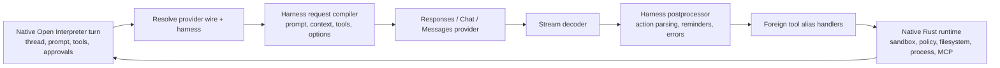

# Open Interpreter harness-emulation teardown

- **Date:** 2026-07-18
- **Source:** [`openinterpreter/openinterpreter`](https://github.com/openinterpreter/openinterpreter)
- **Pinned default-branch commit:**
  [`a4da0fc3cecef98f95264a9c66896ddb064dc377`](https://github.com/openinterpreter/openinterpreter/tree/a4da0fc3cecef98f95264a9c66896ddb064dc377)
- **Pinned tree:** `5c91897ad9336d5c375a1b834ae22ae67c7ae37c`
- **Commit date:** `2026-07-18T00:35:11-07:00`
- **Commit subject:** `Merge pull request #1820 from openinterpreter/remove-fixture-specific-harness-behavior`
- **Default branch:** `main`
- **Product version:** `0.0.34` (`rust-v0.0.34`)
- **Study checkout:** `projects/repos/openinterpreter`
- **Study mode:** read-only external-reference teardown
- **Primary question:** How does the new Rust Open Interpreter emulate several
  coding-agent harnesses inside one Codex-derived runtime, where does that
  abstraction hold or leak, and what should OpenAgents adopt for its native,
  ACP, app-server, provider-lane, and harness-conformance planes?

## Executive verdict

Open Interpreter is the clearest public implementation of **in-process harness
emulation** in the current catalog. It is not a generic launcher that runs the
real Claude Code, Kimi Code, Qwen Code, SWE-agent, OpenCode, Pi, or ZCode
runtimes. It keeps one large Codex-derived Rust engine and changes the
model-facing contract: system prompt, context assembly, tool names and schemas,
wire protocol, provider request body, response decoding, tool-result shape,
compaction behavior, title requests, reminders, and a few harness-specific
state machines. The native Open Interpreter runtime still owns sessions,
sandboxing, approvals, filesystem and process tools, MCP, skills, hooks,
subagents, persistence, ACP, and the Codex app-server/exec protocol. [source]

That makes it a useful complement to the AI SDK v7 Harnesses teardown. AI SDK
adapters preserve and run independent native agent runtimes behind one API.
Open Interpreter instead asks a lower-cost model to behave as if it were inside
a selected harness while retaining one engine. These are different products
and must remain different types in OpenAgents:

```text
native runtime adapter                       emulated harness policy
----------------------                       -----------------------
launches/attaches real runtime                keeps one OpenAgents runtime
runtime owns native session                   OpenAgents owns session
runtime owns native tools/compaction          policy reshapes tools/compaction
ACP/app-server/native protocol                provider-wire request translator
losses occur at runtime projection            losses occur before and after model
example: real Codex or Claude Code             example: Kimi-shaped OpenAgents turn
```

Open Interpreter's strongest reusable ideas are:

1. **Harness is a first-class axis beside provider and model.** A model family
   can perform materially differently under a matching prompt/tool dialect.
   provider transport does not fully determine agent behavior. [source]
2. **One explicit request-routing seam.** Chat harnesses converge in
   `harness/request.rs`, which builds the request, declares the tool-output
   dialect, optionally emits a title request, and selects response
   postprocessing. [source]
3. **Wire compatibility is modeled.** Responses, Chat Completions, and
   Anthropic Messages are explicit transports, with Claude shaping crossing
   all three and ZCode using Messages. [source]
4. **Foreign tool surfaces terminate in one runtime.** Claude `Bash`, Kimi
   `ReadFile`, Qwen tools, DeepSeek's much wider tool list, and other aliases
   are translated into native Rust handlers rather than being granted separate
   host authority. [source]
5. **Harness changes start a new chat in the TUI.** The implementation avoids
   pretending an existing conversation can safely change prompt/tool dialect
   in place. [source]
6. **Compatibility surfaces are broad.** Open Interpreter can be the terminal
   TUI, `exec` process, Codex SDK binary replacement, Codex-compatible
   app-server, MCP server, or ACP agent without cloning the agent loop in each
   host. [source]
7. **Product identity is isolated.** `INTERPRETER_HOME` and
   `~/.openinterpreter` deliberately ignore `CODEX_HOME`, preventing accidental
   credential, config, session, and cache sharing with Codex. [source]

The source also exposes the exact failure modes OpenAgents should design out:

- the core enum, TUI picker, app-server catalog, README, and harness guide are
  separate catalogs and already disagree about which harnesses exist and which
  wire protocols they support. [Source]
- the standalone TUI picker can persist harnesses incompatible with the active
  wire route, while Responses and generic Chat routing can silently fall back
  to native/generic behavior rather than fail. [Source] [inferred]
- `interpreter/harness/set` accepts any string and does not validate existence,
  compatibility, version, or semantic degradation. [Schema]
- provider/model recommendation is hard-coded substring matching over IDs,
  names, model strings, and base URLs. [Source]
- the public harness DTO contains only ID, label, description, and
  `isRecommended`. It does not expose implementation version, source,
  transport matrix, capabilities, tool dialect, recovery class, fidelity,
  known losses, or test evidence. [Schema]
- high-fidelity emulation embeds and maintains large foreign prompt/tool
  surfaces inside a close Codex fork, creating substantial synchronization,
  attribution, evaluation, and drift burden. [Source] [history] [inferred]
- the bundled QA skill installs `agent-browser` from a moving `latest` release
  and executes `cua-driver` installers fetched from an unpinned `main` URL.
  normal command approval helps, but this is not reproducible component
  admission or computer-use containment. [Source]
- release archives are SHA-256 checked, but the audited release workflow and
  installers expose no independent artifact signature, provenance statement,
  or platform-signing/notarization gate. And the documented first install is a
  remote script pipe. [source] [limitation]

The central OpenAgents decision is therefore:

> **Add a distinct, versioned `emulated_harness_policy` plane beside real
> runtime adapters. Compile each policy from one content-addressed manifest,
> validate provider × model × wire × tool × sandbox compatibility before a
> thread starts, bind the exact effective policy and translator generations to
> the run receipt, retain native and portable event planes with explicit loss
> accounting, and fail closed rather than silently becoming “native.” Consume
> Open Interpreter itself only as an optional pinned external runtime adapter.
> do not import its fork or copy its foreign prompts wholesale.**

## Evidence status and audit boundary

The workspace sync lane cloned the repository directly from its default branch
before inspection. At the audit boundary, local `main`, `origin/main`, and
`origin/HEAD` all resolved to the pinned commit above, and the checkout was
clean. [source]

| Measure | Pinned observation |
| --- | ---: |
| Tracked files | 5,618 |
| Rust workspace members | 97 |
| Rust harness modules | 19 `.rs` files, about 19,547 lines |
| Harness-area tracked files | 38, including embedded prompts and tool JSON |
| Inline harness/alias tests | 191 lexical `#[test]` / `#[tokio::test]` sites |
| State databases | `state_5.sqlite`, `logs_2.sqlite`, `goals_1.sqlite`, `memories_1.sqlite` |
| Release targets | macOS, Linux, and Windows on x64 and arm64 |
| License | Apache-2.0 |

The audit covered repository history, product identity, the harness enum,
transport routing, request construction, response postprocessing, foreign tool
aliases, provider recommendation, TUI and app-server catalogs, config and home
isolation, session switching, app-server and ACP surfaces, Codex SDK
compatibility, sandbox/permission documentation, QA computer use, persistence,
tests, installers, and release workflow. It did not build the 97-crate
workspace, run a provider request, compare output quality, inspect a real
`~/.openinterpreter`, execute the external browser/computer-control tools, or
run the release artifacts. [limitation]

Evidence labels used below:

- **`[source]`** — tracked implementation, documentation, manifest, prompt, or
  workflow at the pinned commit.
- **`[schema]`** — a typed Rust, JSON-RPC, config, tool, provider, or transport
  contract.
- **`[test]`** — a tracked executable test or snapshot assertion.
- **`[history]`** — Git history at or before the pinned commit.
- **`[target]`** — current OpenAgents source in the audited target checkout.
- **`[inferred]`** — reasoned from multiple source observations. And
- **`[limitation]`** — something the source-only audit cannot prove.

There are intentionally no `[runtime]` claims.

## 1. This is a Codex product fork, not a small harness library

The new Rust Open Interpreter is built directly on the current Codex source
tree. The repository retains the Codex CLI, TUI, app-server, app-server daemon,
exec protocol, generated app-server schemas, sandbox implementations, MCP,
plugins, skills, hooks, memory, subagents, remote control, SQLite state, JSONL
rollouts, code mode, model manager, telemetry, and release machinery. Product
identity is selected in `product-info`. The binary name and home directory
change, while the underlying architecture remains recognizably Codex. [source]

The repository history makes the maintenance strategy unusually visible. It
merged the Codex `0.144.5` stable release on July 16, then shipped Open
Interpreter `0.0.27` through `0.0.34` by July 17 while adding current Kimi Code
support, Kimi skills, image and video reading, cron tools, provider-catalog
fixes, release fixes, and harness cleanup. Earlier July history contains
repeated “merge latest upstream Codex” and reconciliation commits. [history]

This is a rational way to ship quickly because Open Interpreter inherits an
already mature cross-platform agent engine and spends its differentiating work
on provider and harness behavior. It is also an expensive long-term topology:
every Codex change can conflict with product identity, models, config,
sandboxing, TUI snapshots, generated protocols, prompts, tools, and release
artifacts. The fork has almost one hundred Rust workspace members. Harness
emulation is a relatively small conceptual layer embedded in a very large
moving engine. [source] [inferred]

OpenAgents should not fork this fork. Its current source already has owned
provider lanes, generated Codex app-server protocol bindings, ACP peer
profiles, runtime-adapter types, and enum-driven harness conformance. The
reusable artifact is the **policy and translator architecture**, not the
repository topology. [target]

## 2. Harness, provider, model, and wire are four different dimensions

Open Interpreter correctly recognizes that these values answer different
questions:

| Dimension | Question | Representative value |
| --- | --- | --- |
| Runtime | Who owns the session, tools, approvals, and workspace? | Open Interpreter's Codex-derived Rust engine |
| Provider | Where and how is inference authenticated and addressed? | `anthropic`, `moonshotai`, `deepseek`, custom endpoint |
| Model | Which model/version is called? | Claude, Kimi K3, DeepSeek, Qwen, OpenAI model |
| Wire API | What transport schema reaches the provider? | Responses, Chat Completions, Messages |
| Harness policy | What agent dialect does the model see? | Claude Code, Kimi Code, Qwen Code, minimal |

`ModelProviderInfo` owns URL, environment credential, headers, query params,
wire API, retry budgets, idle timeout, OpenAI-auth requirements, AWS signing,
and WebSocket support. `Harness` is a separate enum stored in session client
state. `ModelInfo` remains a third input. The route resolver combines wire and
harness only when building a request. [schema]

That separation is the repository's most important idea. A “Claude model” is
not the same thing as “Claude Code runtime,” and neither is the same thing as
“Claude Code-shaped tool protocol.” Open Interpreter can use Claude shaping
over Responses or Chat, and it can recommend `claude-code-bare` for DeepSeek.
The architecture therefore treats a harness as an optimization policy rather
than an intrinsic property of a provider. [source]

But the implementation partly collapses recommendation back into string
identity. `default_harness_for_provider_model` lowercases and scans provider
ID, display name, base URL, and model string:

- Messages/Anthropic/Claude → `claude-code`.
- Kimi/Moonshot → `kimi-code`.
- Qwen/QwQ/DashScope → `qwen-code`.
- DeepSeek → `claude-code-bare`, explicitly because product evaluation says it
  performs better than the available DeepSeek TUI emulation. [source]

This is acceptable as a UI recommendation heuristic, but unsafe as admission
or effective selection. Strings do not prove protocol support, tool-call
fidelity, model version, context size, or evaluated quality. A custom endpoint
can contain a family name without implementing its behavior. A newly renamed
model can miss the heuristic. OpenAgents' semantic-routing invariant also
forbids ad hoc keyword selection for user-facing routing. Recommendations must
come from a typed compatibility/evaluation registry or semantic selector, and
the effective choice must remain explicit. [target]

## 3. The actual harness architecture

The model request path is best understood as a compiler pipeline:



### 3.1 The core enum

`codex-rs/tools/src/harness.rs` recognizes native plus fourteen named
emulations:

| Family | Named IDs in the core |
| --- | --- |
| Claude | `claude-code`, `claude-code-bare` |
| Kimi | `kimi-code`, `kimi-cli` |
| Anthropic Messages peer | `zcode` |
| General chat harnesses | `deepseek-tui`, `little-coder`, `mini-swe-agent`, `opencode`, `pi`, `qwen-code`, `swe-agent`, `terminus-2`, `minimal` |
| Escape hatch | any other string becomes `Harness::Other(String)` |

The escape hatch is intentionally forward-compatible, but its semantics are
weak: on Chat it becomes generic compatibility, on Responses it becomes native
Responses, and on Messages it is rejected. A configured name can therefore be
retained even when no implementation ran. [source]

### 3.2 Transport routing

`harness/routing.rs` separates transport from shaping:

- native Responses uses the normal Responses client.
- native Chat uses the generic Chat compatibility layer.
- Claude full/bare can shape Responses, Chat, or Messages.
- ZCode has a Messages-native builder.
- eleven named chat harnesses use the chat request compiler.
- Messages rejects every unsupported named harness explicitly.
- WebSocket Responses is permitted only for the native Responses route.
  [source]

That is a clean decomposition, but compatibility is not uniformly strict.
Responses plus any non-Claude named harness resolves to native Responses.
Chat plus `zcode` or an unknown name resolves to generic Chat. Only Messages
enumerates and rejects incompatible cases. This asymmetry matters because the
selected name remains visible in config and the UI. The source therefore
permits a state where the product says “Kimi Code harness” but the effective
route is native Responses. That conclusion is source-derived and was not
validated in a live provider run. [source] [inferred] [limitation]

### 3.3 One chat integration point

`harness/request.rs` is explicitly documented as the single seam between the
model client and chat harness emulation. `ChatHarnessTurn` carries the native
prompt, harness choice, optional Open Interpreter guidance, model info,
reasoning effort, thread ID, and session source. The builder returns:

- a complete JSON request body.
- `ToolKinds`, which tells the compatibility decoder how each foreign tool
  result is represented.
- an optional separate title-generation request. And
- a response postprocessor. [schema]

Postprocessors are not cosmetic. mini-SWE-agent injects a format error when a
model fails to emit the expected tool call. SWE-agent parses action-shaped
assistant output into calls. Terminus 2 does similar action injection with a
pending-completion state. OpenCode may issue a separate title request. Other
harnesses use provider-native function calls after request shaping. [source]

This return type is a good starting point for an OpenAgents emulation compiler,
but it needs more output metadata: effective policy identity, compatibility
decision, translator versions, changed or dropped native capabilities,
expected response grammar, retry/side-effect semantics, and evidence refs.
[inferred]

### 3.4 Prompt and context assembly

The emulations do much more than rename tools:

- Claude includes a large Claude Code-style system prompt, full and bare tool
  profiles, session skills, startup context, todo reminders, subagent surfaces,
  title generation, thinking/context options, and transport headers.
- ZCode includes its own prompt, tools JSON, skills, todo and plan behavior,
  session-context reader, subagents, compaction request, and reminders.
- current Kimi Code includes an embedded system prompt and tools JSON, runtime
  date/OS/cwd context, Open Interpreter skill injection, auto-permission
  reminders, prompt-cache keys, thinking options, image/video representation,
  and new cron tools.
- legacy Kimi CLI reconstructs AGENTS.md and skill context, background-task
  tools, media, web, planning, and reasoning configuration.
- DeepSeek TUI constructs repository context, active paths, generated project
  instructions, mode/personality prompts, checklists, diagnostics, Git and
  broad tool-search surfaces.
- Qwen adds a synthetic setup exchange with date, OS, working directory, and a
  small folder listing.
- SWE-agent and Terminus 2 replace ordinary function-tool flow with parsed
  action protocols. And
- `minimal` intentionally reduces the surface to a compact software-agent
  prompt and chat tools. [source]

The implementation includes a `harness_guidance` flag, enabled by default, but
the audited code adds extra Open Interpreter guidance only to legacy
`kimi-cli`. Current Kimi Code and every other harness ignore it. A boolean
whose effect varies by implementation is another reason the compiled manifest
must state the **effective** policy rather than only requested config. [source]

### 3.5 Foreign tools, native authority

The central alias handler implements dozens of foreign names: upper- and
lowercase Bash/read/write/edit/glob/grep, media reading, AskUserQuestion,
Claude task controls, Kimi/Qwen agents, OpenCode tasks and todos, ZCode plan,
todo, skill, and session-context tools, and a wide DeepSeek set spanning file,
Git, diagnostics, patch, shell, checklist, and tool search. The handlers turn
these calls into native executor, file, patch, subagent, and interaction
operations. [source]

This is the right authority topology. The model may speak a foreign dialect,
but the dialect does not own the host. Native sandbox, permission, path, child,
and tool-runtime rules still mediate effects. OpenAgents should preserve this
one-way boundary:

```text
foreign tool schema
  -> bounded typed decoder
  -> canonical OpenAgents intent
  -> ordinary authority + containment compiler
  -> canonical outcome
  -> foreign result encoder
```

Open Interpreter's current handler file is more than five thousand lines and
stores some harness state in process-global mutexes, including Claude tasks,
read-file sets, DeepSeek checklists, and ZCode todo/current-file state. That is
pragmatic inside one CLI process, but it makes session ownership and concurrent
isolation harder to audit. OpenAgents should scope translator state to the
exact thread/turn/generation and persist only what recovery requires. [source]
[inferred]

## 4. The catalogs already drift

The repository has no single generated harness manifest. Instead, identity and
compatibility are repeated:

| Surface | Audited behavior |
| --- | --- |
| Core `Harness` enum | native plus fourteen named emulations |
| Route resolver | knows all implemented transport routes |
| TUI picker | lists eleven named emulations. Omits `zcode`, `little-coder`, and `pi` |
| App-server catalog | lists thirteen named emulations. Omits `zcode`. Marks Claude full/bare as Messages-only |
| README | lists nine named examples and includes `zcode` |
| Harness guide | documents a subset and says Claude supports all three wires |
| `interpreter/harness/set` | accepts any optional string with no catalog or compatibility check |

The app-server and guide disagree materially: the route resolver and guide
support Claude shaping across Responses, Chat, and Messages, while the
app-server catalog filters Claude to Messages. The TUI's provider-scoped wizard
restricts Responses to native and Messages to Claude, but the standalone
`/harness` picker deliberately asks for all entries regardless of the active
wire. The setter then persists the choice and starts a new chat. [source]

This is not an incidental documentation bug. It is an architectural warning.
Any feature with identity, compatibility, UI choice, API choice, routing, and
test behavior must generate all projections from one manifest. OpenAgents'
existing exhaustive enum classifications and ACP peer-profile parser are the
stronger target pattern. [target]

A suitable emulation manifest needs at least:

```text
policy id + semantic version + content digest
source/reference + attribution + license review
execution class: native runtime | in-process emulation
supported provider/wire/model ranges
required model capabilities and context limits
prompt/context compiler generation
foreign tool schema + canonical intent mapping
result encoder + stream postprocessor generation
compaction/title/reminder/state behavior
native capabilities preserved, changed, or removed
approval, sandbox, network, secret, and child constraints
known semantic losses and unsupported transitions
conformance corpus + evaluated model/provider matrix
status: discovered | experimental | admitted | denied | retired
```

The picker, JSON-RPC DTOs, route resolver, docs table, tests, receipts, and
diagnostics should be generated from that object. An arbitrary unknown string
can remain a discovery marker, but it must never become an executable effective
policy without admission. [inferred]

## 5. Session switching and lifecycle

Harness choice is copied into the model client when a session is created. In
the TUI, persisting a harness or combined provider/model/harness selection
updates config and deliberately starts a fresh chat, with an informational
message that the harness changed. This is one of the most important safety
choices in the implementation. Conversation history created under one system
prompt, tool grammar, and compaction policy cannot simply be replayed under a
different one without translation or loss. [source]

The app-server catalog setter is narrower: it writes `harness` into the base or
selected profile's TOML path and returns an empty success response. It does not
itself validate compatibility, change a live thread, return the effective
selection, or expose a migration plan. That is reasonable for a default-setting
method, but the method name and empty result leave clients to infer when the
change takes effect. [schema] [inferred]

OpenAgents should distinguish these commands:

- **set future default** — changes profile policy only.
- **start thread with policy** — validates and binds one effective immutable
  policy generation.
- **fork thread under a different policy** — retains source lineage and emits
  a loss/migration report.
- **change current thread policy** — normally refused. If supported, requires a
  safe boundary, explicit context recompilation, and a new turn generation.
- **recommend policy** — advisory only, with evidence and no side effect.

Every run/turn receipt should contain both requested and effective harness
policy. A hidden recommendation or fallback is not acceptable. [inferred]

## 6. Compatibility surfaces: TUI, Codex SDK, app-server, ACP, and MCP

Open Interpreter inherits a mature “one engine, many hosts” surface:

- interactive TUI with `/model`, `/harness`, `/permissions`, and config tools.
- `interpreter exec` for one-shot/headless work.
- Codex SDK compatibility by setting `codexPathOverride: "interpreter"`.
- Python clients launching `interpreter app-server` instead of Codex.
- an app-server with the normal Codex contract plus typed
  `interpreter/provider/*`, `interpreter/model/*`, and
  `interpreter/harness/*` methods.
- `interpreter acp` over stdio for Zed, JetBrains, and community VS Code ACP
  clients. And
- an MCP server when another agent should invoke Open Interpreter as a tool.
  [source] [schema]

The ACP server owns session create/list/load/close, model and mode controls,
assistant/reasoning/tool updates, permissions, filesystem and terminal
operations, and cancellation. The docs explicitly say the ACP client owns the
UI while Open Interpreter owns provider transport, instructions, tools,
approvals, sandboxing, and state. That is the correct host/runtime split.
[source]

The repository also ships a provider-free Codex SDK smoke script. It builds the
upstream TypeScript SDK, points `CODEX_EXEC_PATH` at the installed Interpreter
binary, and runs a resume-by-thread-ID test. The ACP CLI has a basic protocol
test. These prove intent and some compatibility shape, not broad binary,
version, platform, permission, reverse-request, recovery, or harness semantics.
[test] [limitation]

For OpenAgents, this creates two plausible integration paths:

1. **ACP peer:** add a pinned Open Interpreter peer profile and consume the
   standard protocol, retaining Open Interpreter-specific extensions and
   harness metadata in the private native plane.
2. **Codex-compatible app-server peer:** reuse the generated Codex protocol
   client, add a versioned extension namespace for `interpreter/*`, and prove
   compatibility against the real pinned binary.

The ACP path is smaller and more portable. The app-server path exposes richer
Codex-native thread and item events. Neither path licenses Open Interpreter to
become canonical OpenAgents thread, authority, receipt, or Sync state. It is a
provider lane with exact adapter and policy identity. [target] [inferred]

## 7. Provider catalog generation is good. Recommendation ownership is not

Open Interpreter does not manually maintain every hosted model list. A Python
generator consumes `models.dev/api.json`, restricts inclusion to supported AI
SDK provider packages or explicit IDs, excludes local-only and unsupported
entries, requires a usable base URL, and retains models advertising tool calls
and text output. Overrides add authentication, URLs, sorting, wire choice, live
model endpoints, and model-specific corrections. [source]

This is a strong separation between discovery data and runtime code, and it is
substantially better than scattering model IDs through UI files. However, the
output is still compiled into the product and then combined with hand-written
harness recommendations. Discovery, support, recommendation, admission, and
evaluation are different states:

```text
discovered model
  != callable with current credentials
  != supports required tools faithfully
  != compatible with a harness policy
  != evaluated on that harness
  != admitted for autonomous work
```

OpenAgents already has provider-lane capabilities that intersect observed
reports with a native declaration or trusted ACP peer profile. Harness policy
should enter the same intersection rather than bypass it with a model-name
test. [target]

## 8. Sandbox and permissions remain native runtime concerns

The harness layer does not create a separate sandbox. All foreign tools execute
through the inherited Codex sandbox and permission machinery. The docs expose
read-only, workspace-write, and danger-full-access modes. On-request,
untrusted, and never approval policies. Seatbelt on macOS. Bubblewrap/seccomp
and related enforcement on Linux/WSL. And native Windows enforcement where
configured. They state that unrepresentable policy should fail closed.
[source]

This is exactly why emulation and runtime must be separate types. A Claude
Code-shaped `Bash` call is not evidence that Claude Code's permission behavior
or sandbox ran. A Kimi-shaped auto-permission reminder is model context, not
runtime authority. The execution receipt must name the actual Open Interpreter
sandbox profile and observed enforcement, not the emulated brand. [inferred]

Open Interpreter also supports lifecycle hooks from user config, trusted
project config, project/user JSON, and plugins. Hooks can inject context or
deny some tool calls, but the docs correctly call them guardrails rather than a
sandbox substitute. The exact hook definition is trust-bound so changes
require review. [source]

OpenAgents should retain that distinction and go further: a harness policy may
request a tool, approval mode, or reminder, but its effective tool set is the
intersection of native runtime support, parent authority, work context,
sandbox profile, connection grants, and policy manifest. Emulation can never
widen authority. [target]

## 9. Computer use is an on-demand skill, not a built-in receipted subsystem

The README says Open Interpreter ships computer use through a QA skill. The
skill itself instructs the model to:

- test web apps with `agent-browser`.
- test native apps with `cua-driver`.
- install missing tools only after a network check and through the normal
  command-approval flow.
- snapshot before and after actions. And
- confirm consequential purchases, messages, submissions, and deletions.
  [source]

The behavior guidance is good. “A command reported success” is explicitly not
accepted as proof. Visible post-state must change. That is a useful acceptance
oracle for OpenAgents' UI automation. [source]

The component path is not acceptable as a production supply-chain design:

- macOS/Linux `agent-browser` downloads from GitHub `releases/latest`.
- Windows installs the latest global npm package.
- `cua-driver` executes an install script fetched from the Cua repository's
  mutable `main` branch. And
- no content digest, publisher signature, compatibility generation, retained
  rollback slot, or install receipt is bound before execution. [source]

The ordinary sandbox and approval boundary still applies, but a user approving
one shell command is not equivalent to an admitted computer-control component.
OpenAgents should adapt the QA behavior contract and reject the moving install
mechanism. Computer-use drivers belong in the signed component graph with
explicit screen/input/accessibility authority, visible active state,
consequential-action policy, and action/evidence receipts. [target]

## 10. Local state and product isolation

Open Interpreter deliberately isolates its state under
`~/.openinterpreter` or an existing directory named by `INTERPRETER_HOME`.
When running as Open Interpreter, `CODEX_HOME` is ignored so Codex config,
updates, and credentials do not leak into the Interpreter identity. Migration
is intended to happen through an explicit import flow. [source]

Because this is a Codex-derived engine, the local state surface is broad:

| State | Default location/shape |
| --- | --- |
| User config and profiles | `config.toml`, `<profile>.config.toml` |
| Provider/OpenAI auth | `auth.json`, environment keys, command-backed auth, keyring-backed stores where supported |
| MCP OAuth fallback | `.credentials.json` when keyring storage is unavailable |
| Session transcripts | dated `sessions/.../rollout-*.jsonl`. Archived-session tree |
| Thread/search metadata | `state_5.sqlite` |
| Local logs | `logs_2.sqlite` and configured log directory |
| Goals | `goals_1.sqlite` |
| Experimental memory state | `memories_1.sqlite` plus memory files |
| Skills/plugins/hooks | home-scoped directories and config. Trusted project `.openinterpreter` layers |
| Standalone binaries | `packages/standalone/releases` plus a `current` link |
| Ephemeral shell context | home-scoped shell snapshots removed on shutdown when cleanup succeeds |

Transcript persistence can be disabled, and memories are a separate
experimental feature disabled in the documented example. SQLite mirrors
rollout metadata rather than replacing the JSONL evidence stream. [source]

The product-home isolation is excellent. The broader lesson is that an
emulated harness does **not** get its own independent native session store. All
emulations share the Open Interpreter runtime state model. Any claim that a
Claude-shaped run is resumable exactly like real Claude Code, or that a Kimi
run owns Kimi's native history, would therefore be false. OpenAgents' UI should
say “Claude Code policy emulation in Open Interpreter,” not “Claude Code,” and
bind the real runtime identity beside it. [inferred]

## 11. Compaction, title, reminders, and state are part of the harness

The source demonstrates why harness compatibility cannot be reduced to prompt
text and tool names:

- ZCode defines a dedicated compaction prompt and parses compacted summaries.
- legacy Kimi CLI has its own compaction prompt.
- Claude and OpenCode may issue distinct title-generation requests.
- Claude and ZCode track todo snapshots and inject subsequent reminders.
- Kimi Code caches its system prompt by conversation, cwd, and skill digest and
  uses a conversation-derived provider prompt-cache key.
- SWE-agent and Terminus maintain response grammar state. And
- several harnesses translate media and tool content differently. [source]

These are session semantics. A correct manifest needs state ownership and
recovery rules for each of them. A title request consumes tokens and may hit a
different response schema. A compaction prompt can discard different facts. A
todo reminder can change later behavior. A prompt-cache key can cross a
provider privacy or retention boundary. All belong in diagnostics and usage
lineage rather than being invisible adapter details. [inferred]

## 12. Tests are extensive but mostly implementation-local

The harness modules and alias handler contain roughly 191 inline test sites.
They assert request bodies, headers, tool names and order, message conversion,
skill replacement, compaction shapes, title requests, auto-permission
reminders, media mapping, response action injection, route selection, date
stability, todo reminders, tool aliases, and expected foreign tool surfaces.
The latest commit specifically removed fixture-specific production behavior
and renamed “captured” assertions to expected-behavior language. [test]
[history]

That latest cleanup is revealing. Some DeepSeek production code had recognized
particular fixture filenames and emitted fixture-specific paths. The audited
tip removed those branches and renamed `HARNESS_LAB_FAKE_TIME` to a
product-owned test variable. This is positive hardening, but it shows a common
emulation trap: optimizing against captured reference traces can accidentally
teach production code the benchmark. [history]

OpenAgents needs a layered conformance program:

1. **Manifest coverage:** every admitted policy generates picker, route, docs,
   diagnostics, schema, and receipt projections from one source.
2. **Pure translator tests:** canonical turn → exact foreign request and
   foreign stream → canonical events.
3. **Authority tests:** every foreign tool maps to the same canonical policy
   checks as its native equivalent. Unsupported tools fail closed.
4. **Cross-product matrix:** policy × model version × provider × wire × OS ×
   sandbox × permission mode.
5. **Behavioral evaluations:** representative coding tasks compared with
   native policy and, where legally and technically possible, the real foreign
   runtime.
6. **Metamorphic tests:** fixture names, paths, dates, IDs, ordering, and
   irrelevant repo contents cannot change decisions except where declared.
7. **Recovery tests:** compaction, interruption, resume, approval, retry, and
   translator upgrade preserve or explicitly report losses.
8. **Receipts:** requested/effective policy and every hidden auxiliary call are
   visible and metered honestly.

OpenAgents' existing `harness-conformance` package is a strong base, but its
current contract proves real coding-worker runtimes: chat lifecycle, worktree
claim/closeout, readiness, honest metering, and typed failures. Emulated
policies need a separate conformance class. Making them look like another
worker adapter would erase the exact distinction this teardown establishes.
[target]

## 13. Release and update posture

The release workflow builds six targets on GitHub-hosted runners, pins checkout
and major setup actions by commit, builds locked Rust dependencies, verifies
the special `rusty_v8` inputs, embeds and verifies the bundled Linux `bwrap`
digest, packages standalone archives, and publishes a SHA-256 manifest. The
installer downloads release metadata, verifies the checksum asset against the
GitHub-reported asset digest, verifies the package against the manifest,
installs into versioned release directories, and advances a `current` link.
[source]

Those are useful mechanics: immutable version directories, install locking,
checksum verification, a current pointer, and a six-platform matrix. But the
audited paths do not show an independent signing key, Sigstore/minisign
verification, SLSA provenance, SBOM admission, macOS Developer ID/notarization,
or Windows Authenticode gate. Both the README and product update command begin
with remote script execution. Hashes from the same release authority prove
transfer integrity, not independent release identity. [source] [limitation]

OpenAgents should take no release dependency on an unpinned “latest” Open
Interpreter binary. If it becomes a provider lane, pin exact version and
digest per platform, retain the prior compatible slot, bind protocol/harness
manifest compatibility, run real-binary conformance, and emit install,
activation, rollback, and run receipts under the existing signed component
graph. [target]

## 14. What Open Interpreter gets right

### 14.1 It treats low-cost model performance as a systems problem

The thesis is not “all models are interchangeable.” Prompts, tools, context,
reasoning options, cache behavior, and response grammar jointly determine
agent performance. This is an important corrective to provider abstractions
that stop at `generateText`. [source] [inferred]

### 14.2 It keeps execution in one hardened engine

Foreign schemas do not become separate shell paths. One native runtime owns
policy and effects. This is simpler to secure and observe than launching every
external CLI just to obtain its prompt dialect. [source]

### 14.3 It preserves broad client compatibility

Terminal, exec, app-server, Codex SDK, ACP, and MCP consume the same engine.
The product does not require every editor or application to understand every
harness. [source]

### 14.4 It refuses in-place TUI harness mutation

Starting a new chat on selection change is more honest than pretending native
history is portable across harness semantics. [source]

### 14.5 It isolates product identity from Codex

Ignoring `CODEX_HOME` for the Interpreter product is a small but unusually
important identity decision. It prevents a fork from inheriting ambient
credentials and configuration merely because the codebase is shared. [source]

## 15. What Open Interpreter should make stricter

The teardown's criticisms can be reduced to eight exact boundaries:

1. **Generate one catalog.** Core, API, TUI, docs, routing, and tests must not
   enumerate harnesses independently.
2. **Validate before persistence.** A policy selection must resolve against
   provider, model, wire, runtime tools, platform, and permission profile, then
   return requested and effective identity.
3. **Never silently fall back.** Incompatible named emulation is an explicit
   typed failure or a separately confirmed native fallback.
4. **Version the policy contents.** The name `kimi-code` does not identify
   which prompt, tool JSON, compaction, or result translator ran.
5. **Expose fidelity and losses.** “Style” is not native-runtime compatibility.
6. **Scope translator state.** Global process maps and mutexes should not carry
   cross-session semantic state.
7. **Pin privileged components.** Browser and computer-use installers need
   digest/signature admission and rollback.
8. **Separate recommendation from execution.** Heuristics and evaluations can
   rank policies. Only typed admission selects one.

## 16. Exact OpenAgents adaptation

### 16.1 Extend the taxonomy, not the Codex fork

The current `agent-runtime-schema` already separates `AgentRuntimeAdapterKind`,
`AgentDefinitionHarnessKind`, and `AgentRuntimeLoopKind`. That is better than
Open Interpreter's single public harness name, but it still needs an explicit
execution-class distinction so the product cannot confuse a real runtime with
a model-facing emulation. [target]

Conceptually:

```text
HarnessExecutionClass =
  | native_runtime_adapter
  | in_process_emulation

NativeRuntimeBinding =
  adapter kind + executable identity + protocol profile + native version

EmulatedHarnessBinding =
  owning runtime + policy id/version/digest + request/result translators
```

An Open Interpreter process selected through ACP or app-server is a
`native_runtime_adapter` whose **inner configured policy** may be
`in_process_emulation`. Both identities belong in the run record. [inferred]

### 16.2 Add an emulated-policy manifest and compiler

Build one Effect Schema manifest that generates:

- discovery and settings projections.
- compatibility/admission predicates.
- provider request compiler registration.
- tool alias schemas and canonical-intent mappings.
- stream/result postprocessor registration.
- compaction/title/reminder/state declarations.
- diagnostics and public-safe receipt projection.
- conformance/evaluation matrices. And
- documentation tables.

Unknown fields fail closed. A manifest is immutable and content-addressed.
Prompt and tool assets are part of the digest. A policy cannot call arbitrary
host code by naming a handler. [target] [inferred]

### 16.3 Keep provider-lane admission authoritative

`provider-lane-capabilities` already quarantines an observed report that
overclaims its native declaration or trusted ACP profile. Extend that
intersection with emulation requirements and losses. A policy is selectable
only when:

```text
provider/model capability
  ∩ wire compatibility
  ∩ native runtime tools
  ∩ admitted emulation manifest
  ∩ authority/containment profile
  ∩ current conformance evidence
```

The result is a typed admission object, not a boolean and not a model-name
heuristic. [target]

### 16.4 Split conformance into runtime and policy classes

Keep the existing five-capability worker harness suite for real Codex, Claude
Code, Grok, and future runtime adapters. Add a sibling enum-exhaustive policy
suite for emulations:

- request and stream translation.
- canonical tool authority equivalence.
- compatibility and no-fallback law.
- context/compaction/state ownership.
- model/provider evaluation evidence.
- exact usage for auxiliary calls.
- requested/effective policy receipts. And
- fork/upgrade/recovery loss reports.

Adding a policy kind should red the sweep until every projection and matrix row
is either proven or explicitly pending, matching the existing
`harness-conformance` design. [target]

### 16.5 Consume Open Interpreter as an optional peer first

The fastest honest experiment is not reimplementing its foreign prompts. Add a
research-stage, exact-version Open Interpreter adapter behind the existing ACP
or Codex app-server lane, then compare:

- native OpenAgents/Codex behavior.
- Open Interpreter native behavior. And
- named Open Interpreter emulations on admitted provider/model pairs.

Retain Open Interpreter's native event envelope privately, project portable
events with loss accounting, and bind both outer runtime and inner policy to
every evaluation. This isolates product value before OpenAgents accepts the
maintenance and attribution burden of an owned emulation. [inferred]

### 16.6 Preserve naming honesty in the UI

The Desktop selector should display three separate facts:

```text
Runtime: Open Interpreter 0.0.34
Model: Kimi K3 via Moonshot
Agent policy: Kimi Code emulation <digest>
Containment: workspace-write / observed Seatbelt <receipt>
```

Do not label that row simply “Kimi Code.” The real Kimi runtime did not own the
session. Likewise, a Claude-shaped request through Open Interpreter is not a
Claude Code runtime. This naming is essential for permission, support,
recovery, and benchmark truth. [inferred]

### 16.7 Keep emulation below canonical authority

Foreign calls decode into canonical OpenAgents intents. Canonical outcomes are
then encoded back. The translator cannot:

- create new filesystem/network/secret authority.
- treat a model reminder as approval.
- mark work accepted or delivered.
- invent usage or native events.
- write Sync state directly.
- change placement. Or
- bypass the ordinary request processor.

The outer run retains authority manifest, effective-containment receipt,
provider/model/policy usage, delivery receipt, and exact translator identities.
[target]

## 17. Candidate implementation sequence

This teardown is research evidence, not implementation admission. If promoted
through the normal roadmap/issue process, the dependency order should be:

1. **Schema:** add execution class and emulated-policy manifest without adding
   a production policy.
2. **Generation:** derive API/TUI/docs/diagnostic projections from one fixture
   manifest and prove unknown/incompatible selection fails.
3. **Translator kernel:** canonical intent decoder/encoder with no provider or
   foreign prompt yet.
4. **Conformance:** enum-exhaustive policy suite, matrix, receipts, and fault
   cases.
5. **External evaluation lane:** pin Open Interpreter as an experimental peer
   and collect source-safe, cost-aware behavioral evidence.
6. **One owned policy:** only after evaluation, implement a legally reviewed,
   OpenAgents-native minimal or model-family policy rather than cloning a
   branded foreign prompt.
7. **Desktop projection:** show runtime, model, policy, compatibility, losses,
   and containment separately.
8. **Promotion:** admit additional policies independently. No “supports Open
   Interpreter harnesses” umbrella claim.

## 18. Detailed source map

| Concern | Pinned source |
| --- | --- |
| Product framing and compatibility | `README.md`, `docs/harness.md`, `docs/sdk.md`, `docs/acp.md` |
| Product/home identity | `codex-rs/product-info`, `codex-rs/utils/home-dir/src/lib.rs` |
| Harness enum | `codex-rs/tools/src/harness.rs` |
| Transport routes | `codex-rs/core/src/harness/routing.rs` |
| Chat integration seam | `codex-rs/core/src/harness/request.rs` |
| Claude shaping | `codex-rs/core/src/harness/claude_code.rs`, `claude_code_prompt.rs` |
| Kimi shaping | `kimi_code.rs`, `kimi_cli.rs`, embedded prompt/tool assets, `kimi_cron.rs` |
| Other emulations | `deepseek_tui.rs`, `zcode.rs`, `qwen_code.rs`, `swe_agent.rs`, `terminus_2.rs`, `opencode.rs`, `pi.rs`, `minimal.rs`, `little_coder.rs`, `mini_swe_agent.rs` |
| Foreign tool execution | `codex-rs/core/src/tools/handlers/harness_aliases.rs` |
| Provider and recommendation | `codex-rs/model-provider-info/src/lib.rs`, provider catalog JSON/generator |
| TUI picker/switch | `codex-rs/tui/src/chatwidget/model_popups.rs`, `app/event_dispatch.rs` |
| App-server catalog | `codex-rs/app-server/src/interpreter_catalog.rs`, catalog processor |
| Typed extension methods | `codex-rs/app-server-protocol/src/protocol/v2/interpreter.rs` |
| ACP | `codex-rs/acp-server`, `docs/acp.md`, CLI ACP test |
| Codex SDK compatibility | `docs/sdk.md`, `scripts/test-codex-sdk-compat.sh` |
| Sandbox and hooks | `docs/sandbox.md`, `docs/hooks.md`, inherited sandbox crates |
| Computer-use QA | `codex-rs/skills/src/assets/samples/qa-testing/SKILL.md` |
| State | rollout/core/state/config/login/RMCP crates. `docs/config.md` |
| Release/install | `.github/workflows/rust-release.yml`, `scripts/install/*` |

## Final recommendation

Open Interpreter proves that a model's agent harness can be treated as a
compile target: one canonical runtime can emit different prompts, tools,
messages, transports, compaction rules, and response grammars while retaining
one execution authority. That is a real product lever for lower-cost and
provider-specific models, and OpenAgents should learn it. [source]

It also proves why the abstraction needs more rigor than a string named
`harness`. Once prompt assets, tool schemas, auxiliary calls, session state,
provider compatibility, and recovery behavior vary, the policy is a versioned
runtime component. Duplicated catalogs and silent fallback immediately make
the displayed choice diverge from what executed. [source] [inferred]

OpenAgents should therefore keep two explicit planes:

- **runtime adapters** for real external agent engines, preserving native
  sessions, events, capabilities, and losses. And
- **emulated harness policies** compiled inside an owned runtime, preserving
  canonical authority while adapting the model-facing dialect.

Both planes need exact identity, admission, conformance, containment, usage,
recovery, and receipts. Start by consuming a pinned Open Interpreter process as
an experimental peer and evaluating its policy matrix. Only then consider an
owned OpenAgents-native emulation compiler. Do not fork the repository, copy
foreign branded prompts wholesale, silently auto-route by model-name strings,
or let “harness compatibility” become a claim broader than the exact tested
runtime × policy × model × provider × wire × platform matrix.
