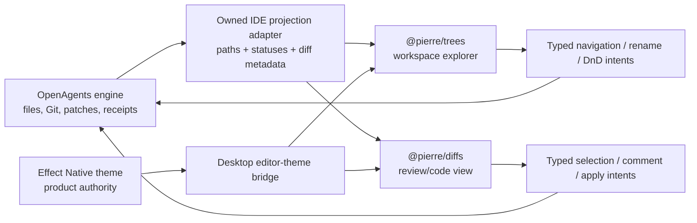
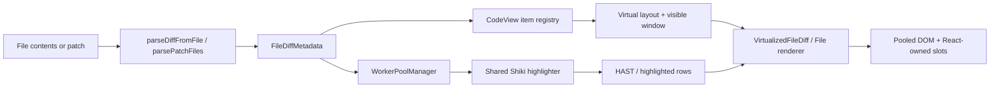

# Pierre trees, diffs, and theming teardown

- **Date:** 2026-07-18
- **Source:** [`pierrecomputer/pierre`](https://github.com/pierrecomputer/pierre)
- **Pinned default-branch commit:**
  [`4f94a5e765195b27e1e4188b943aab2ae44613cb`](https://github.com/pierrecomputer/pierre/tree/4f94a5e765195b27e1e4188b943aab2ae44613cb)
- **Commit date:** 2026-07-08
- **Default branch:** `main`
- **Study checkout:** `projects/repos/pierre`
- **Study mode:** read-only external-reference teardown
  **Primary question:** Should OpenAgents Desktop use Pierre's public tree and
  diff libraries as-is for its IDE file explorer and code-review surfaces, and
  what should it learn from Pierre's theme system and repository engineering?

## Executive verdict

Pierre is the best focused open-source component reference in the current
catalog for the two expensive IDE projection problems that OpenAgents should
not casually rebuild: very large path-first file trees and virtualized,
syntax-highlighted multi-file diffs. [source]

The recommendation is deliberately specific:

1. **Evaluate `@pierre/diffs` as a direct, exactly pinned dependency** for the
   Desktop review pane and rich file-change cards. The package is stable enough
   to justify an integration spike at `1.2.12`, supports React 19, and already
   solves patch parsing, split/unified rendering, Shiki highlighting, workers,
   partial rendering, scroll anchoring, line selection, annotations,
   accept/reject slots, merge-conflict projection, and multi-file
   virtualization. [source]
2. **Evaluate `@pierre/trees` as a direct, exactly pinned dependency** for the
   Desktop workspace explorer, but keep it behind a stronger beta gate. The
   public package is `1.0.0-beta.5`. Its architecture is unusually good, but its
   prerelease status means OpenAgents must prove Electron behavior, keyboard
   and screen-reader behavior, streaming mutation correctness, and large-repo
   performance before making it the release surface. [source] [limitation]
3. **Do not import or fork `@pierre/path-store`.** It is private by design and
   is inlined into the public tree build. The path-first public API is the
   product boundary Pierre intends consumers to use. [source]
4. **Use `@pierre/theming` only as a Desktop code-surface resolver or adapt its
   pattern behind an OpenAgents bridge.** Effect Native's `Theme` and Khala
   token catalog remain whole-product authority. Pierre's Shiki/VS Code theme
   object should supply syntax, editor, diff, and tree colors inside the IDE
   subtree. It must not become a competing application theme. [target]
5. **Depend. Do not vendor.** Preserve Apache-2.0 licenses and the tree
   package's NOTICE, pin versions and lockfile integrity, isolate the packages
   behind an owned adapter, track upstream, and prefer upstream fixes. A fork
   is an emergency option after a demonstrated blocker, not the starting
   architecture. [inferred]
6. **Keep Pierre projection-only.** OpenAgents remains canonical for workspace
   files, Git state, session identity, patch provenance, approvals, accepted
   outcomes, and receipts. Tree gestures and diff controls emit typed intents
   back to the engine. They never gain direct filesystem, Git, shell, or
   acceptance authority. [target]

This is a strong “use as-is behind an adapter” recommendation, not an
implementation authorization. Fast Follow research may record the evidence and
candidate shape. Dependency admission and product mutation still require the
owning work packet and target-local acceptance. [limitation]

## Evidence status and audit boundary

The workspace sync script fast-forwarded the clean Pierre clone before study.
At the time of audit, `origin/HEAD` resolved to `main`, and `main` resolved to
the pinned commit above. [source]

The exact Git identities used for this teardown are:

| Scope                 | Git object ID                              |
| --------------------- | ------------------------------------------ |
| repository tree       | `07920b0558a4c3ecd68a39198cca1046ac309c4b` |
| `packages/diffs`      | `03451ea2076df7e9c5df44914907133a63d6bf11` |
| `packages/trees`      | `ae1d2da2bcbfdb022cdbd4ba670a5dbcda347390` |
| `packages/path-store` | `f31f0c2ea569793b1849ad8e0e63fd8c28a27094` |
| `packages/theming`    | `b5bc6df4663f87ba46f9674b98f07132d3532697` |
| `packages/theme`      | `e6fb73360acb3ea78daf5e460a455e8831e44b9b` |
| `apps/diffshub`       | `53a042dbd90157a39c5801ced5c704ad43a2b996` |

The audit covered the package manifests, public APIs, core model and renderer
implementations, React/SSR/worker entry points, tests, benchmarks, publishing
guards, DiffsHub composition app, theme generator, accessibility checks, and
the current OpenAgents Desktop file-change and theme boundaries. It did not
run Pierre's full Bun, Playwright, benchmark, or production-browser suites.
Test counts below are lexical source inventory, not claims that this checkout
passed them on this machine. [limitation]

Pierre has active non-default branches and beta tags beyond the public package
versions recorded on pinned `main`. They are useful development signals but are
not treated as shipped default-branch behavior here. In particular, emerging
editor work must not be confused with the audited `@pierre/diffs@1.2.12`
renderer. [history]

## What the repository actually contains

The relevant monorepo slice is compact and well separated:

| Package/app          |          Pinned version | License                       | Role                                                                                         |
| -------------------- | ----------------------: | ----------------------------- | -------------------------------------------------------------------------------------------- |
| `@pierre/diffs`      |                `1.2.12` | Apache-2.0                    | File, patch, diff, merge-conflict, multi-file, virtualized, React, SSR, and worker rendering |
| `@pierre/trees`      |          `1.0.0-beta.5` | Apache-2.0 + NOTICE           | Path-first virtualized file-tree product API                                                 |
| `@pierre/path-store` | `1.0.0-beta.1`, private | Apache-2.0 + NOTICE in source | Runtime-agnostic tree storage and projection engine, inlined into trees                      |
| `@pierre/theming`    |                 `0.0.2` | Apache-2.0                    | Lazy theme catalogs, resolution, normalization, color math, controllers, and React hooks     |
| `@pierre/theme`      |                 `1.1.0` | MIT                           | Generated Pierre themes for Shiki, VS Code/Cursor, and Zed                                   |
| `@pierre/diffshub`   |             private app | Apache-2.0                    | Dogfood composition of streamed patches, tree, code view, comments, and theming              |

The packages are not a miniature IDE engine. They do not own the filesystem,
Git repository, repository watcher, terminal, language server, persistence,
session graph, authorization, or release receipts. This narrowness is a feature
for OpenAgents: Pierre can be a replaceable renderer below the owned engine
rather than a rival source of truth. [source] [inferred]



## `@pierre/diffs`: architecture

### One renderer, several consumption surfaces

The package is not React-first internally. Its core exports concrete vanilla
classes such as `File`, `FileDiff`, `UnresolvedFile`, `CodeView`,
`VirtualizedFile`, `VirtualizedFileDiff`, and `Virtualizer`. React components
own lifecycle and slots around those instances. Separate SSR helpers preload
HTML, and separate worker entry points move Shiki processing off the main
thread. [source]

That layering is important for Desktop:

- React rerenders do not have to own thousands of highlighted line nodes.
- The renderer can pool and mutate its own DOM while the React wrapper owns
  application composition.
- Worker and SSR concerns remain optional entry points instead of contaminating
  the base API.
- OpenAgents can put a thin typed React adapter in `packages/ui` while keeping
  its canonical data model outside the library.

The package exports these public entry points: root, `/react`, `/ssr`, `/worker`,
and two worker scripts. Its React peers explicitly accept React 18.3 or 19,
matching OpenAgents Desktop's React 19 runtime. [source]

### Input and data model

Pierre accepts three useful classes of input:

1. two complete `FileContents` objects, converted with `parseDiffFromFile` via
   `jsdiff`.
2. raw Git/unified patch text, converted with `parsePatchFiles`.
3. arbitrary complete files rendered without a diff.

`FileDiffMetadata` is a JSON-compatible projection containing the current and
previous path, object IDs, file modes, change type, hunks, precomputed split and
unified line counts, partial/full-content status, deletion/addition lines, and
an optional worker cache key. [source]

That is a good integration seam but not sufficient as OpenAgents' durable patch
contract. It lacks the session, turn, item, workspace, repository, base/head,
producer, permission, effect, acceptance, and receipt identities OpenAgents
needs. The adapter should therefore derive Pierre metadata from an owned patch
record and retain a reverse mapping to the canonical subject. [target]

The `cacheKey` contract deserves special attention. Pierre documents it as a
consumer-managed identity for worker highlight caching: if contents or name
change, the key must change. OpenAgents should derive it from immutable content
and theme/language identity, not a mutable path or list index. A stale key can
render stale highlighted content even when the canonical patch is correct.
[source] [inferred]

### Render pipeline

The core path is:



The package uses Shiki for tokenization and highlighted HAST, `hast-util-to-html`
for serialization paths, and its own row/node construction for live rendering.
It can render complete files, partial ranges, complete diffs, partial diff
ranges, and preloaded SSR HTML. [source]

Pierre defaults to one shared Shiki highlighter per thread. In worker mode,
`WorkerPoolManager` tracks worker availability, request IDs, pending and active
tasks, registered languages and themes, lifecycle generations, result caches,
and subscriber-visible statistics. It supports priming and explicit cache
eviction. [source]

This is the right basic response to Shiki's cost. It also creates integration
obligations for Electron: worker URL resolution, ASAR packaging, CSP, worker
startup and teardown, crash recovery, theme seeding, language registration,
and renderer-process memory must all be exercised in packaged builds rather
than assumed from Vite development. [inferred]

### Multi-file virtualization is the differentiator

`CodeView` is much more than a list of `<FileDiff>` components. It owns:

- an item array plus stable `id -> item` and renderer-instance mappings.
- estimated and measured per-file metrics.
- a virtual window and sticky-header state.
- incremental layout invalidation from the first dirty item.
- item-, line-, range-, and absolute-position scroll targets.
- dynamic smooth scrolling whose destination is re-derived while measurements
  change.
- scroll anchors that preserve the first fully visible content when wrapping,
  annotations, expansion, or asynchronous measurement changes height.
- a capped DOM element pool, including a pending pool that waits for
  externally owned React slot children to unmount safely.
- selection, focus correction, pointer-event suppression during sensitive
  interactions, and reduced-motion behavior.

It uses `ResizeObserver`, `IntersectionObserver`, animation-frame scheduling,
and a shared `UniversalRenderingManager`. Sparse layout checkpoints avoid
recomputing every predecessor when a far-down item needs a position. [source]

This is precisely the work an apparently simple in-house diff component tends
to rediscover badly. OpenAgents' current `DesktopFileChangeCard` splits a
bounded unified diff into lines and renders a `<pre><code>` block. That is a
sound fallback and preserves the typed workbench contract, but it does not
provide syntax highlighting, split layout, large-patch virtualization, stable
scrolling under annotations, or a file navigator. [target]

The replacement path should keep the fallback for degraded mode and route rich
eligible patches through Pierre. Large patches should stop being discarded
solely because they are expensive to paint. Canonical payload bounds and
pagination remain an engine concern, while Pierre makes the admitted visible
slice tractable. [inferred]

### Review, comments, and merge conflicts

The library exposes:

- line and range selection callbacks.
- line annotations and injected row hooks.
- custom file headers, gutters, hunk separators, and annotation content.
- accept/reject hunk utilities and consumer-rendered controls.
- context expansion for collapsed hunks.
- deep-linkable scroll targets.
- parse and render support for unresolved merge-conflict regions and
  sequential resolution.

These are projection hooks, not a review database. DiffsHub proves the intended
composition: it stores application comment metadata outside the renderer,
projects draft/saved annotations into `CodeView` items, increments an item
version, and calls `updateItem`. OpenAgents should follow the same separation
but bind each comment or apply action to its own review subject and authority
record. [source] [target]

Accept/reject UI is particularly easy to overread. Pierre gives the consumer a
place and utility for the control. It does not decide whether a hunk may be
applied, whether the working tree still matches, whether another agent owns the
path, or whether the result was observed. OpenAgents must resolve those checks
before acknowledging completion. [limitation]

### Options and customization

The public options cover split or unified layout, classic/bar/no indicators,
backgrounds, hunk separator variants, context expansion, word/character/no
inline diffs, wrapping or horizontal scrolling, line numbers, sticky headers,
font features, maximum tokenization lengths, custom languages/themes,
selection and interaction hooks, virtualization buffers, and raw `unsafeCSS`.
[source]

That breadth means an OpenAgents adapter should expose a small governed subset,
not pass the entire Pierre options object through session or plugin data.
`unsafeCSS`, arbitrary Shiki transformers, arbitrary language registration,
and arbitrary annotation rendering are trusted-shell extension points. They
must not be populated from untrusted repository content or remote session
events. [inferred]

### Test and performance posture

The pinned diff package contains 307 lexical `test(`/`it(` cases across parser,
snapshot, renderer, partial render, virtualization, sparse checkpoint, element
pool, scroll anchor, range scroll, sticky header, selection, annotation,
hydration, theme, worker pool, merge-conflict, and accept/reject suites. Again,
this is source inventory, not a local pass claim. [test]

The CSS performance runbook is unusually mature. It requires production-mode
DiffsHub builds from exact Git SHAs, a fixed browser/mode/viewport, one warmup,
at least three retained traces per SHA, matching scroll checksums, explicit
discard rules, and average/median/min/max reporting. It warns that sub-one-
percent production deltas are generally inconclusive. [test]

OpenAgents should copy that experimental discipline, not Pierre's exact tool
stack. A Desktop acceptance corpus should use packaged Electron, fixed large
patches, fixed repository trees, recorded frame/long-task/memory measurements,
alternating base/candidate runs, and pixel plus accessibility evidence. [target]

## `@pierre/trees`: architecture

### The public boundary is paths, not node objects

The tree package's central design decision is the right one: callers speak in
canonical slash-delimited path strings. Internal numeric IDs never cross the
public boundary. The same implementation ships through vanilla, React, SSR,
and web-component entry points and renders inside a shadow root. [source]

Its public model supports:

- add, move, remove, reset, and batch mutation.
- open, update, and close search.
- Git status updates.
- configurable icons.
- path lookup, focus, multi-selection, and scroll-to-path.
- rename and drag/drop.
- context-menu and row-decoration composition.
- explicit cleanup.
- prepared raw or presorted input for large/repeated trees.

React adds `FileTree`, `useFileTree`, selection/search hooks, and selector-based
subscriptions. SSR uses declarative shadow DOM plus a hydration payload. [source]

The path boundary maps cleanly onto OpenAgents' current file-change entries,
which already carry bounded paths. The adapter still needs a workspace-root and
repository identity, because the same path string can exist in many worktrees
or sessions. Pierre should receive paths only after the owned projection has
selected one canonical workspace generation. [target]

### The private path store

`@pierre/path-store` is a runtime-agnostic engine with no runtime dependencies.
Its README explicitly says it is private, powers `@pierre/trees`, and should not
be documented as an installable product surface. The tree build includes a
guard that fails if a runtime import of the private package leaks into the
published artifact. [source]

Internally, it uses several techniques worth learning from:

- segment interning avoids repeating path fragments.
- numeric IDs and structure-of-arrays typed storage improve dense scans.
- dedicated child indexes avoid reparsing strings for topology operations.
- subtree and visible-subtree counts let the engine answer slice requests.
- a reverse-ID sweep computes open-tree counts without a separate traversal
  stack for presorted input.
- typed arrays hold projection parent, position-in-set, and set-size metadata.
- the visible `path -> index` map is built lazily only when requested.
- semantic mutation events distinguish canonical topology change from visible
  projection change and report honest visible-count deltas.
- stable cleanup preserves IDs, while aggressive cleanup may compact them.
- `StaticPathStore` omits mutation APIs for read-heavy cases.
- asynchronous child loading is an explicit attempt lifecycle rather than an
  implicit Promise hidden behind expansion.

Flattening empty directories changes only the visible projection. It never
rewrites canonical topology or mutation paths. That small invariant prevents a
common class of rename, drag/drop, selection, and persistence bugs. [source]

OpenAgents should learn from these internals but consume them through
`@pierre/trees`. Reaching into the private store would couple the product to a
non-published API, defeat Pierre's package guard, and create a fork-shaped
maintenance obligation immediately. [inferred]

### Visible-slice-first controller

`FileTreeController` caps its initial projection at 512 rows and defers the full
projection for a documented 494,000-row case until navigation requires it.
Focus resolution first asks for the candidate path and then its visible
ancestors, avoiding eager construction of a full path-index map after every
expand/collapse. Context reads are similarly bounded at 512 rows. [source]

The renderer combines fixed row metrics, overscan, sticky ancestor rows, roving
tab focus, and ARIA tree metadata. The projection precomputes sibling position
and set size so each render does not repeat topology work. [source]

Search has explicit modes rather than one overloaded filter. It can hide
nonmatches or drive expansion/collapse behavior while retaining selection and
focus state. Drag/drop resolves a session, target, self/descendant rejection,
collision policy, and a batch of path moves before mutation. Rename similarly
has an explicit view handoff and callbacks. [source]

This is more complete than a sidebar list. It is also why OpenAgents should not
layer direct filesystem mutation into Pierre callbacks. Rename and drop should
emit an intent containing workspace generation, source paths, destination,
collision policy, and observed projection version. The engine performs the
mutation under claims and returns the next authoritative projection. [target]

### Git state is a visual input

Pierre accepts path-keyed Git status entries and renders status in a fixed row
lane beside custom decorations and context-menu affordances. It deliberately
does not calculate repository status. [source]

That is exactly the correct division for OpenAgents. A Git service can project
tracked/untracked/added/deleted/renamed/conflicted states, while the tree simply
renders them. The projection should include freshness and workspace generation
outside Pierre so a stale badge never becomes proof of repository state.
[target]

### Shadow DOM tradeoffs

The tree uses a shadow root to isolate its CSS and publishes CSS variables plus
`themeToTreeStyles()` for ordinary customization. `unsafeCSS` injects raw CSS
inside the shadow root as an escape hatch. [source]

The isolation is useful for an IDE surface embedded in a large product shell,
but it creates real integration work:

- global CSS and Tailwind utilities do not style internal rows.
- design tokens must cross through variables or the theme helper.
- focus rings, context menus, drag previews, tooltips, and command routing must
  be tested across the boundary.
- automated selectors and accessibility inspection need shadow-aware tooling.
- raw CSS injection is too powerful for repository or plugin-provided data.

The adapter should own all `unsafeCSS`, preferably use none, and expose stable
host-level test identifiers plus typed navigation events. [inferred]

### Tree verification posture

The pinned tree and path-store sources contain 527 lexical `test(`/`it(` cases.
The suites cover path ingestion and canonicalization, visible projection,
structure-of-arrays storage, cleanup, mutations/events, asynchronous loading,
scheduling, profiling/benchmark runners, SSR hydration, virtualization,
sticky rows, keyboard selection, row ARIA attributes, focus, search, rename,
drag/drop, Git status, density, icons, React bindings, and theme conversion.
Playwright and large fixture/profile lanes supplement unit tests. [test]

The NOTICE files credit `@headless-tree/core` influence under MIT terms. A
consumer of the public Apache-2.0 tree package must retain the distributed
license and NOTICE obligations in Desktop's third-party notices. [source]

## Theming: four layers, not one bag of colors

Pierre's theme work is valuable because it separates concerns that IDEs often
collapse:

1. **`@pierre/theme`** generates first-party Shiki/VS Code theme JSON from
   semantic roles and palettes. It publishes themes to npm, VS Code/Cursor, and
   Zed formats.
2. **`@pierre/theming` core** models stable names, lazy descriptors, immutable
   collections, app catalogs, resolution, caching, and a framework-independent
   controller.
3. **`@pierre/theming/color`** normalizes workbench color fallbacks and provides
   contrast/compositing/derivation utilities.
4. **Consumers** map the resolved editor theme into their own chrome, tree CSS
   variables, diff options, annotation surfaces, and worker caches.

This lets a picker list hundreds of names without loading theme JSON. A stable
theme name is the persisted key. A descriptor supplies metadata and a lazy
loader. The resolved object is used only when colors or Shiki are needed.
[source]

### Resolver and controller

`ThemeResolver` is a registry plus cache. It deduplicates concurrent cold
loads, supports synchronous warm reads, can seed resolved themes into a worker,
registers only if absent when composing catalogs, and can clear resolved and
in-flight state without discarding loader registration. [source]

`ThemeController` owns `light`, `dark`, or `system` mode. Separate selected
theme names for light and dark. Resolved color scheme. OS media-query changes.
optional persistence. And SSR-safe operation. Its React layer is thin. [source]

`normalizeThemeColors` is pure, frozen, WeakMap-memoized, and idempotent. It
fills mechanical fallbacks for editor/sidebar/input surfaces, Git decorations,
and focus outlines. Repairs a hover background that would erase text. And
deliberately leaves selection-background opinion to the consumer. [source]

DiffsHub demonstrates the complete composition. A `ThemeSource` resolves and
retains theme state. App chrome derives its own tokens. The file tree maps the
resolved theme to CSS. The diff viewer receives the Shiki theme. And the worker
pool is seeded with the same resolved theme. Tree data and diff item data remain
separate so comment updates do not rebuild the tree. [source]

### What OpenAgents should adopt

OpenAgents already has a stronger whole-product invariant: Desktop imports the
shared `khalaTheme` from `@effect-native/tokens`, and `packages/ui` bridges the
Effect Native `Theme` into `--en-*` CSS variables. The current code explicitly
rejects mounting a competing theme. [target]

Therefore:

- Keep Effect Native theme identity, spacing, radius, type, control, motion,
  and app-surface color roles canonical.
- Add an owned **editor theme bridge** that produces a Shiki/VS Code-compatible
  theme for Pierre from the canonical OpenAgents theme and optional user-picked
  syntax palette.
- Let `@pierre/theming` cache and resolve code-surface themes if using it saves
  meaningful work, but persist selection through OpenAgents settings and data
  inventory, not a second opaque store.
- Feed one resolved editor theme to diffs, its worker pool, and trees so syntax,
  Git status, focus, selection, and surrounding code chrome cannot drift.
- Do not adopt Pierre's visual brand as OpenAgents' product theme.
- Do not expose arbitrary theme loaders or CSS from a repository without the
  same provenance and capability review required for an extension.

This is an adaptation of Pierre's theme _plane_, not a replacement of the
Effect Native product theme. [target]

### Accessibility and color science

`@pierre/theme` ships light and dark base, soft, protanopia/deuteranopia,
tritanopia, and Display-P3 vibrant variants. The accessibility work is more
interesting than the particular palette. [source]

For red/green deficiency, positive/added signals move to blue and negative/
deleted signals to orange. For tritanopia, positive/added uses teal/cyan and
negative/deleted uses red/vermillion. Luminance is a backup channel when hues
must share a pole. [source]

Tests simulate Machado-style color-vision deficiency under linear and gamma
conventions, measure CIEDE2000 separation, and check WCAG contrast. Tier-one
signals such as diff add/delete, merge conflict, and terminal red/green require
Delta E of at least 11. Diagnostics and core syntax require at least 8. Git
status can be advisory because it also carries letter badges. Body text targets
4.5:1 contrast and meaningful signal colors 3:1. [test]

OpenAgents should take this as a release criterion:

- added/deleted, success/failure, and conflict states need non-color cues.
- CVD simulation belongs in the checked theme corpus.
- diff colors must be tested after alpha compositing on the actual surface.
- focus, selection, syntax, annotation, and Git status must be tested together.
- high contrast and reduced motion remain separate requirements.

The useful lesson is not “ship Pierre Dark.” It is “turn editor color
distinguishability into executable evidence.” [inferred]

## DiffsHub: the integration reference

The private DiffsHub app is more useful than a gallery because it shows trees
and diffs operating together on streamed Git patches. [source]

Its pipeline is:

1. fetch a patch as a `ReadableStream`.
2. split complete files at `diff --git` boundaries without waiting for the
   whole patch.
3. parse each complete file into `FileDiffMetadata`.
4. append a `CodeViewItem` with a path-derived ID.
5. update line statistics, a path-to-item map, comment index, and Git status in
   one accumulator pass.
6. publish diff items at a short cadence while publishing the larger tree less
   often and in larger batches.
7. link successive tree snapshots so an append-only consumer can apply a delta
   instead of rebuilding `PathStore`.
8. navigate from a tree path to the matching `CodeView` item.
9. keep annotation updates out of tree state.
10. deep-link selected lines through a URL hash.

The loader uses explicit browser work budgets and publish intervals, including
an eight-millisecond streaming work budget, one-thousand-file tree batches, and
separate initial/steady publish timing. Repeated patch entries for the same path
rename the prior item and keep the canonical tree path pointed at the newest
entry without an O(n) scan. [source]

That suggests an OpenAgents projection shape:

```ts
interface DesktopIdeProjection {
  readonly workspaceGeneration: string;
  readonly tree: {
    readonly paths: readonly string[];
    readonly gitStatus: readonly ProjectedGitStatus[];
    readonly revision: number;
  };
  readonly review: {
    readonly items: readonly ProjectedDiffItem[];
    readonly subjectByItemId: ReadonlyMap<string, ReviewSubjectRef>;
    readonly revision: number;
  };
}
```

The exact type is only a candidate, but the separation is important: a comment
change should not rebuild a 500,000-path tree, and a tree expansion should not
retokenize a large patch. [inferred]

## Fit with current OpenAgents Desktop

OpenAgents is already positioned to integrate these packages without replacing
its domain model:

- `WorkbenchFileChangeItem` is harness-neutral and schema-bounds path, kind,
  additions, deletions, unified diff, scope, and truncation status.
- `DesktopFileChangeCard` is a presentation component over that contract.
- `packages/ui/src/workbench/theme-bridge.ts` already turns the Effect Native
  theme into scoped CSS variables.
- Desktop is React 19 on Electron and Vite, satisfying the Pierre React peers.
- Cursor parity already requires a classic workbench, editor/review flows,
  Git/diffs, keyboard/accessibility completeness, and checked performance.

The most economical first integration is not a wholesale IDE rewrite. It is:

1. retain `WorkbenchFileChangeItem` and the plain `<pre>` fallback.
2. add an owned adapter that parses eligible complete unified diffs into Pierre
   metadata with content-derived cache keys.
3. render a single-file `FileDiff` inside the current card.
4. add a multi-file `CodeView` for the aggregate turn/worktree review surface.
5. add `FileTree` when the canonical workspace-file projection is available.
6. connect selection, navigation, comment, apply, rename, and drop gestures to
   existing or newly admitted typed commands.
7. gate the rich surface on worker readiness and fall back honestly when the
   package or payload cannot render.

This preserves current harness compatibility and makes the renderer an
incremental capability. [target]

## Proposed package boundary

If admitted, put the Pierre-specific translation in one owned package or one
cohesive `packages/ui` module rather than importing Pierre throughout Desktop.
The boundary should expose OpenAgents types and hide Pierre types from callers.

Candidate responsibilities:

- turn canonical patch subjects into `FileDiffMetadata`/`CodeViewItem`.
- derive immutable cache keys from content, path, language, and renderer
  revision.
- translate canonical workspace projections into prepared tree input.
- map canonical Git status into Pierre's visual vocabulary.
- map Effect Native/editor themes into Pierre diff and tree props.
- own worker creation and packaged-Electron URLs.
- translate Pierre callbacks into typed OpenAgents intents.
- attach review subject IDs and projection revisions to every action.
- own fallback behavior, diagnostics, and metrics.
- export no direct filesystem, Git, shell, or acceptance capability.

The adapter should not:

- persist a second canonical tree or patch database.
- let Pierre item IDs become durable session IDs.
- let UI completion imply mutation success.
- accept arbitrary `unsafeCSS` or theme loaders from workspaces.
- import `@pierre/path-store`.
- make the libraries available on mobile or canvas hosts that cannot satisfy
  their DOM/shadow-root contracts.
- flatten provider-native patch facts that remain necessary for receipts.

## Adoption gates

### Gate 1: legal and supply chain

- Pin exact package versions. Do not use caret ranges for the initial gate.
- Capture resolved integrity and transitive dependency inventory.
- Include Apache-2.0 license texts and `@pierre/trees` NOTICE in Desktop's
  third-party notice artifact.
- Verify published artifacts contain no private path-store runtime import.
- Record package provenance and upstream commit corresponding to each version.
- Require an owner-reviewed update rather than automatic major/minor movement.

### Gate 2: packaged Electron

- Worker scripts resolve in unpackaged and packaged ASAR builds.
- CSP allows only the intended worker and no remote code.
- Worker crash/restart and window teardown release resources.
- Theme and language registration work after reload and offline.
- Memory remains bounded after opening, switching, and closing repeated large
  repositories and patches.
- Plain fallback remains usable if workers fail.

### Gate 3: functional corpus

- added, deleted, modified, pure rename, changed rename, mode change, binary or
  unsupported file, no-final-newline, partial patch, large hunk, long line,
  Unicode, CRLF, submodule, and merge-conflict cases.
- split/unified, wrap/scroll, expanded/collapsed, full/partial context.
- streaming append, duplicate path entries, item rename, status patch, and
  stale update rejection.
- one file, thousands of files, and hundreds of thousands of tree paths.
- selection, deep link, comment annotation, accept/reject intent, rename,
  drag/drop, and cancellation.
- workspace generation change while an interaction is pending.

### Gate 4: accessibility

- full keyboard navigation and command parity.
- focus visibility across shadow DOM and React slots.
- correct tree, treeitem, level, position, set-size, selection, and expansion
  announcements.
- screen-reader reading order for split/unified diffs and annotations.
- high contrast, reduced motion, 200% zoom, and reflow.
- CVD separation plus non-color cues for Git/diff/terminal status.
- context menus and drag/drop have keyboard alternatives.

### Gate 5: performance and evidence

- alternate baseline/current packaged builds against fixed corpora.
- record startup, time-to-first-tree, time-to-first-highlighted-diff, scroll
  frame time, long tasks, memory high-water, worker warm/cold cost, and update
  latency.
- preserve a scroll-position checksum and pixel baselines.
- require multiple retained runs and report median plus spread.
- test annotation and wrap-induced reflow, not only a static highlighted file.
- keep raw evidence linked to the exact release commit.

### Gate 6: authority

- every gesture carries workspace generation and canonical subject identity.
- stale projections fail visibly.
- rename/drop/apply are admitted engine commands, not renderer mutations.
- completion waits for observed engine outcome.
- conflicts remain unresolved until canonical state says otherwise.
- review acceptance stays outside the producing agent and outside Pierre.

## Other repository lessons worth taking

### Public core with thin framework adapters

Both trees and diffs put the hard state/rendering work below React and offer
small React adapters. This is a better long-term shape than encoding an IDE
kernel in component effects. OpenAgents should keep Effect ownership and typed
host lifecycles, but the projection renderer itself can remain framework-light.
[inferred]

### Dogfood the packages in a real app

DiffsHub uses the same public packages a consumer would install. Its streaming,
comments, theme switching, tree navigation, and worker status expose integration
problems that isolated Storybook examples would miss. OpenAgents should keep a
small real IDE corpus route in addition to component fixtures. [source]

### Large-real-repository fixtures

Pierre's tree tests and profile scripts include large repository-shaped data,
including Linux/AOSP-scale cases and a 494,000-row design target. Performance
work is tied to real projection operations rather than generic list demos.
[test]

### Publish guards

The packages run prepublish checks, validate type/export surfaces, constrain
side-effect declarations, and explicitly guard the private package boundary.
The tree package ships LICENSE and NOTICE in its published file list. [source]

OpenAgents should add analogous dependency-adapter checks: no private import,
no transitive renderer type in domain APIs, no unpinned Pierre dependency, and
packaged worker presence. [inferred]

### Dependency cooling-off period

Pierre's pnpm workspace uses a seven-day `minimumReleaseAge` and a catalog of
pinned toolchain/dependency versions with named exceptions. That does not
replace provenance or vulnerability review, but it is a useful supply-chain
speed bump against a brand-new compromised release. [source]

### Documentation for humans and agents

The repo keeps package-level READMEs, explicit testing/benchmark runbooks, and
generated documentation surfaces. The best files state invariants—not merely
usage—including path-first identity, projection-only flattening, slice-first
reads, and theme-name persistence. [source]

### What not to copy

OpenAgents should not copy Pierre's Moon/Bun/Next/Vercel toolchain, GitHub
Actions, application topology, raw CSS escape hatches, or theme branding. It
should not interpret a rich UI component as evidence of containment,
persistence, review authority, or Git correctness. The repository is a source
of projection libraries and engineering techniques, not an architecture for
the whole agent IDE. [limitation]

## Inferences about why Pierre is structured this way

The following are reasoned estimates, not maintainer statements.

1. **The private path store exists to let Pierre optimize aggressively without
   freezing engine internals as a public contract.** Inlining it into trees
   preserves a one-package consumer experience while numeric IDs, typed arrays,
   and cleanup strategies evolve. [inferred]
2. **Canonical paths at the boundary are an interoperability choice.** Paths
   survive framework adapters, SSR payloads, Git status, DiffsHub navigation,
   serialized app state, and consumer-owned persistence better than opaque
   internal IDs. [inferred]
3. **The vanilla renderer plus React slots splits high-frequency and
   low-frequency ownership.** Pierre can mutate/pool thousands of rows without
   paying React reconciliation cost, while consumers still compose comments,
   headers, and controls in React. [inferred]
4. **The worker manager and consumer cache keys make highlighting an explicit
   resource plane.** Shiki startup and tokenization are expensive enough that
   theme/language readiness, caching, and observability cannot remain hidden
   inside a component render. [inferred]
5. **DiffsHub publishes tree snapshots less often than diff items because the
   two projections have different cost and attention needs.** The user can
   begin reviewing early files while a very large path projection catches up.
   [inferred]
6. **Theme names are database keys because theme objects are too large and too
   unstable to persist.** Lazy descriptors also prevent a broad theme picker
   from becoming an initial-bundle penalty. [inferred]
7. **VS Code/Shiki color vocabulary is the shared interchange format because it
   joins syntax and workbench chrome.** Pierre then normalizes missing keys and
   lets each consumer retain selection/chrome opinion. [inferred]
8. **The CVD suites focus hardest on diffs, conflicts, and terminals because
   those are places where a mistaken color reading can change an engineering
   decision, not merely reduce aesthetics.** [inferred]
9. **The exact package boundaries support Pierre's commercial product without
   requiring the open libraries to know its backend.** That narrowness makes
   the packages more reusable and reduces the risk of importing hidden service
   authority. [inferred]

## Decision matrix

| Surface                              | Decision                      | Why                                                                              | Primary risk                                                       |
| ------------------------------------ | ----------------------------- | -------------------------------------------------------------------------------- | ------------------------------------------------------------------ |
| `@pierre/diffs` single-file review   | direct pinned evaluation      | Large capability gain over current `<pre>` renderer. React 19 supported          | Worker/package behavior in Electron                                |
| `@pierre/diffs` aggregate `CodeView` | direct pinned evaluation      | Hard virtualization, pooling, anchoring, comments, and navigation already solved | Memory and stale cache identity                                    |
| `@pierre/trees` explorer             | direct pinned beta evaluation | Strong path-first engine and large-tree posture                                  | Beta API and shadow-DOM accessibility                              |
| `@pierre/path-store`                 | reject direct use             | Private and intentionally inlined                                                | Unsupported coupling/fork pressure                                 |
| `@pierre/theming`                    | adapt or narrowly depend      | Excellent editor-theme catalog/resolver/cache                                    | Second product theme/state store                                   |
| `@pierre/theme` visual palettes      | optional syntax palette only  | Good CVD evidence and Shiki/VS Code coverage                                     | Pierre branding displacing Khala                                   |
| DiffsHub app architecture            | study/adapt                   | Proves streaming tree+diff composition                                           | It is a demo/review app, not authority                             |
| Pierre toolchain/release topology    | selective lessons only        | Some good guards and benchmark discipline                                        | Violates OpenAgents runtime/release invariants if copied wholesale |

## Concrete recommendation

Create a target-owned candidate for a two-stage dependency evaluation:

**Stage A — diff projection:** Pin `@pierre/diffs@1.2.12` and the compatible
Shiki/theming graph in one adapter. Replace only the rendering body of the
existing Desktop file-change card for eligible patches, then add an aggregate
turn/worktree `CodeView`. Preserve the plain renderer as fallback. Prove
packaged workers, cache correctness, keyboard/screen-reader behavior, CVD
states, large-patch performance, and authority handoff.

**Stage B — tree projection:** Pin `@pierre/trees@1.0.0-beta.5` without a direct
path-store import. Feed it canonical workspace snapshots and status patches,
wire navigation first, then separately admit rename/drop. Prove the 500k-path
case, incremental updates, shadow-root accessibility, and generation-safe
intent handling.

Adopt `@pierre/theming` only if the spike shows its resolver/controller removes
more integration code than it adds. In either case, implement one owned bridge
from Effect Native/Khala application tokens to a resolved Shiki/VS Code editor
theme and feed the same object to diffs, workers, trees, and adjacent review
chrome.

The expected end state is simple: Pierre owns fast DOM projection. OpenAgents
owns truth.

## Source inventory

Primary pinned sources:

- [`packages/diffs/package.json`](https://github.com/pierrecomputer/pierre/blob/4f94a5e765195b27e1e4188b943aab2ae44613cb/packages/diffs/package.json)
- [`packages/diffs/README.md`](https://github.com/pierrecomputer/pierre/blob/4f94a5e765195b27e1e4188b943aab2ae44613cb/packages/diffs/README.md)
- [`packages/diffs/src/types.ts`](https://github.com/pierrecomputer/pierre/blob/4f94a5e765195b27e1e4188b943aab2ae44613cb/packages/diffs/src/types.ts)
- [`packages/diffs/src/components/CodeView.ts`](https://github.com/pierrecomputer/pierre/blob/4f94a5e765195b27e1e4188b943aab2ae44613cb/packages/diffs/src/components/CodeView.ts)
- [`packages/diffs/src/worker/WorkerPoolManager.ts`](https://github.com/pierrecomputer/pierre/blob/4f94a5e765195b27e1e4188b943aab2ae44613cb/packages/diffs/src/worker/WorkerPoolManager.ts)
- [`packages/diffs/src/utils/parsePatchFiles.ts`](https://github.com/pierrecomputer/pierre/blob/4f94a5e765195b27e1e4188b943aab2ae44613cb/packages/diffs/src/utils/parsePatchFiles.ts)
- [`packages/diffs/src/utils/parseMergeConflictDiffFromFile.ts`](https://github.com/pierrecomputer/pierre/blob/4f94a5e765195b27e1e4188b943aab2ae44613cb/packages/diffs/src/utils/parseMergeConflictDiffFromFile.ts)
- [`packages/diffs/benchmarks/CSS_PERFORMANCE_BENCHMARK.md`](https://github.com/pierrecomputer/pierre/blob/4f94a5e765195b27e1e4188b943aab2ae44613cb/packages/diffs/benchmarks/CSS_PERFORMANCE_BENCHMARK.md)
- [`packages/trees/package.json`](https://github.com/pierrecomputer/pierre/blob/4f94a5e765195b27e1e4188b943aab2ae44613cb/packages/trees/package.json)
- [`packages/trees/README.md`](https://github.com/pierrecomputer/pierre/blob/4f94a5e765195b27e1e4188b943aab2ae44613cb/packages/trees/README.md)
- [`packages/trees/src/model/FileTreeController.ts`](https://github.com/pierrecomputer/pierre/blob/4f94a5e765195b27e1e4188b943aab2ae44613cb/packages/trees/src/model/FileTreeController.ts)
- [`packages/trees/src/render/FileTreeView.tsx`](https://github.com/pierrecomputer/pierre/blob/4f94a5e765195b27e1e4188b943aab2ae44613cb/packages/trees/src/render/FileTreeView.tsx)
- [`packages/trees/src/utils/themeToTreeStyles.ts`](https://github.com/pierrecomputer/pierre/blob/4f94a5e765195b27e1e4188b943aab2ae44613cb/packages/trees/src/utils/themeToTreeStyles.ts)
- [`packages/trees/NOTICE.md`](https://github.com/pierrecomputer/pierre/blob/4f94a5e765195b27e1e4188b943aab2ae44613cb/packages/trees/NOTICE.md)
- [`packages/path-store/README.md`](https://github.com/pierrecomputer/pierre/blob/4f94a5e765195b27e1e4188b943aab2ae44613cb/packages/path-store/README.md)
- [`packages/path-store/src/soa-node-store.ts`](https://github.com/pierrecomputer/pierre/blob/4f94a5e765195b27e1e4188b943aab2ae44613cb/packages/path-store/src/soa-node-store.ts)
- [`packages/path-store/src/visible-tree-projection.ts`](https://github.com/pierrecomputer/pierre/blob/4f94a5e765195b27e1e4188b943aab2ae44613cb/packages/path-store/src/visible-tree-projection.ts)
- [`packages/theming/package.json`](https://github.com/pierrecomputer/pierre/blob/4f94a5e765195b27e1e4188b943aab2ae44613cb/packages/theming/package.json)
- [`packages/theming/README.md`](https://github.com/pierrecomputer/pierre/blob/4f94a5e765195b27e1e4188b943aab2ae44613cb/packages/theming/README.md)
- [`packages/theming/src/modules/createThemeResolver.ts`](https://github.com/pierrecomputer/pierre/blob/4f94a5e765195b27e1e4188b943aab2ae44613cb/packages/theming/src/modules/createThemeResolver.ts)
- [`packages/theming/src/modules/createThemeController.ts`](https://github.com/pierrecomputer/pierre/blob/4f94a5e765195b27e1e4188b943aab2ae44613cb/packages/theming/src/modules/createThemeController.ts)
- [`packages/theming/src/modules/normalizeThemeColors.ts`](https://github.com/pierrecomputer/pierre/blob/4f94a5e765195b27e1e4188b943aab2ae44613cb/packages/theming/src/modules/normalizeThemeColors.ts)
- [`packages/theme/src/createTheme.ts`](https://github.com/pierrecomputer/pierre/blob/4f94a5e765195b27e1e4188b943aab2ae44613cb/packages/theme/src/createTheme.ts)
- [`packages/theme/ACCESSIBILITY.md`](https://github.com/pierrecomputer/pierre/blob/4f94a5e765195b27e1e4188b943aab2ae44613cb/packages/theme/ACCESSIBILITY.md)
- [`apps/diffshub/lib/diffsHubDataAccumulator.ts`](https://github.com/pierrecomputer/pierre/blob/4f94a5e765195b27e1e4188b943aab2ae44613cb/apps/diffshub/lib/diffsHubDataAccumulator.ts)
- [`apps/diffshub/lib/streamGitPatchFiles.ts`](https://github.com/pierrecomputer/pierre/blob/4f94a5e765195b27e1e4188b943aab2ae44613cb/apps/diffshub/lib/streamGitPatchFiles.ts)
- [`apps/diffshub/components/usePatchLoader.ts`](https://github.com/pierrecomputer/pierre/blob/4f94a5e765195b27e1e4188b943aab2ae44613cb/apps/diffshub/components/usePatchLoader.ts)
- [`apps/diffshub/components/DiffsHubViewer.tsx`](https://github.com/pierrecomputer/pierre/blob/4f94a5e765195b27e1e4188b943aab2ae44613cb/apps/diffshub/components/DiffsHubViewer.tsx)
- [`apps/diffshub/lib/theme/ThemeSource.ts`](https://github.com/pierrecomputer/pierre/blob/4f94a5e765195b27e1e4188b943aab2ae44613cb/apps/diffshub/lib/theme/ThemeSource.ts)

Target comparison sources:

- `apps/openagents-desktop/src/workbench-item-contract.ts`
- `packages/ui/src/workbench/file-change-card.tsx`
- `packages/ui/src/workbench/theme-bridge.ts`
- `apps/openagents-desktop/src/renderer/theme.ts`
- `specs/openagents/cursor-capability-parity.product-spec.md`
- `specs/desktop/desktop-trust-complete-workbench.product-spec.md`
