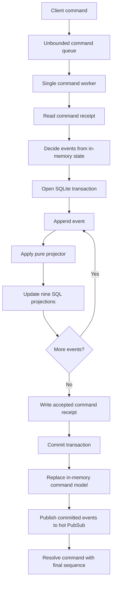
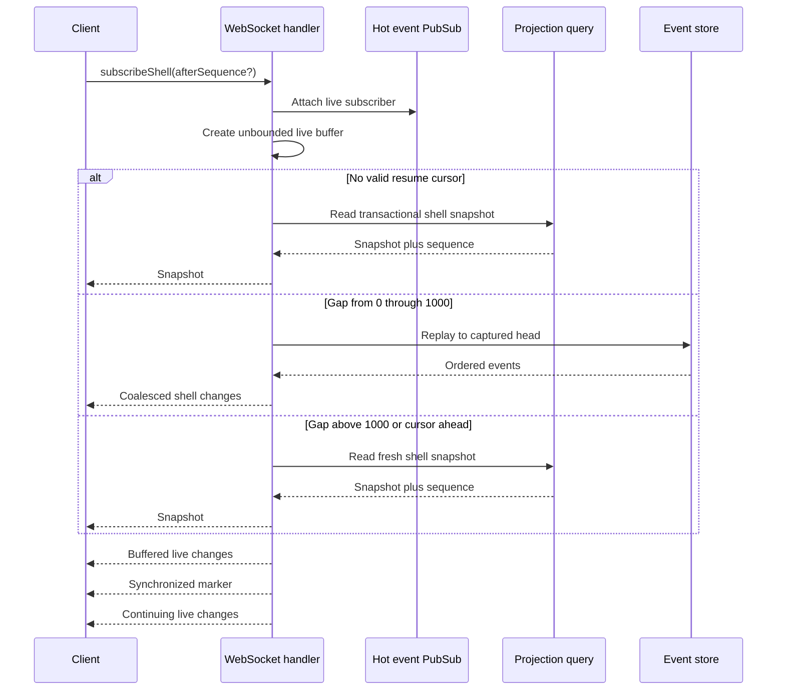
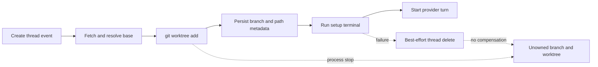
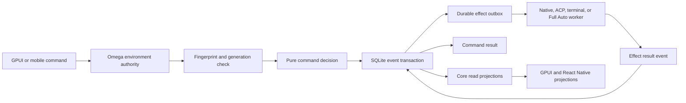

# T3 Code server projection and consistency architecture — 2026-07-27

Status: Read-only source audit and Omega architecture reference

T3 Code source commit: `476d69cd1d5d89b4aad77df8fc01c71e34af930c`

Omega source commit: `b8f960c4f4a2efcabb8e9a773b2105f935072eb6`

OpenAgents source commit at study start:
`4cd72c5b870fb56d7c0706a5e69161797b02fa38`

## Purpose

This report examines the T3 Code consistency system.
It follows data from a client command to each client read model.
It also follows provider work and server side effects.

This report is a detailed companion to:

- [T3 Code desktop, mobile, and cloud architecture audit](./2026-07-27-t3-code-desktop-mobile-component-cloud-architecture-audit.md)
- [Omega and T3 Code desktop and mobile gap analysis](./2026-07-27-omega-t3-code-desktop-mobile-gap-analysis.md)
- [T3 Code mobile app teardown](./2026-07-17-t3-code-mobile-app-teardown.md)

The report answers these questions:

1. Which record is authoritative?
2. Which changes commit in one transaction?
3. How do projectors recover after a restart?
4. How does a client move from a snapshot to live data?
5. Which duplicate and gap controls exist?
6. Which side effects can be lost?
7. How safe are worktree creation, Git actions, checkpoint restore, and cleanup?
8. What survives offline use, connection loss, foreground wakeup, and restart?
9. Which parts should Omega use?
10. Which parts must OpenAgents Cloud make stronger?

## Evidence rules

This report uses these labels:

- **Observed** means that the pinned source contains direct evidence.
- **Tested** means that a pinned source test checks the behavior.
- **Inference** means that multiple observed facts support the conclusion.
- **Limitation** means that the source does not give the stronger guarantee.
- **Recommendation** means an Omega or OpenAgents Cloud design proposal.

The review used public source, tests, migrations, and architecture documents.
It did not use private traffic or production credentials.
It did not test a production T3 Connect environment.

## Executive conclusion

T3 Code has a strong local database commit boundary.
One command worker serializes all orchestration commands.
One SQLite transaction appends events and updates every main projection.
That transaction also writes the accepted command receipt.

This design gives a useful local guarantee:

> After an accepted command returns, its events and read models committed
> together.

The snapshot and live-stream handoff is also careful.
The server attaches the live stream before it reads a snapshot.
It buffers events during the snapshot or replay.
The client drops overlap with a monotonic sequence cursor.

The server does not extend this guarantee to provider work.
Provider reactors read a hot in-memory event stream.
They do not store a durable consumer cursor.
They do not replay missed intent events after restart.
Most reactor failures log the error and drop the work item.

This creates two different consistency classes.

| Class                     | Current T3 result                                      |
| ------------------------- | ------------------------------------------------------ |
| Database state            | Strong single-server atomic commit                     |
| Client snapshot handoff   | Gap-resistant and duplicate-tolerant                   |
| Connection recovery       | Generation-switched and indefinitely retried           |
| Mobile message admission  | Durable client outbox with stable command IDs          |
| Desktop message admission | Direct unary RPC with draft restoration, not an outbox |
| Provider execution        | Best-effort hot delivery                               |
| Git and file side effects | Outside the database transaction                       |
| Worktree lifecycle        | Multi-step saga without a durable lifecycle record     |
| Checkpoint restore        | Destructive cross-store saga without atomic completion |
| Multi-node writes         | Not supported by the current design                    |

Omega should use the projection protocol and direct environment authority.
Omega should not copy the best-effort reactor model.
OpenAgents Cloud needs a durable outbox and durable reactor cursors.

## System boundary

### Environment authority

**Observed**

The T3 environment server owns these objects:

- projects
- threads
- turns
- messages
- activities
- proposed plans
- approvals
- sessions
- checkpoints
- worktrees
- terminals
- provider processes

Desktop and mobile send commands to this server.
They do not own the durable thread record.

T3 Connect does not own the full orchestration log.
It helps clients find and reach an environment.
Normal orchestration traffic goes to that environment endpoint.

### Main runtime components

The consistency path uses these components:

| Component                      | Main responsibility                       |
| ------------------------------ | ----------------------------------------- |
| `OrchestrationEngine`          | Serial command admission and event commit |
| `decider`                      | Pure command and state decision           |
| `projector`                    | Pure in-memory read model update          |
| `OrchestrationEventStore`      | Durable ordered event log                 |
| `OrchestrationCommandReceipts` | Command duplicate control                 |
| `ProjectionPipeline`           | Durable read model updates                |
| `ProjectionSnapshotQuery`      | Transactional snapshot reads              |
| WebSocket RPC layer            | Snapshot, replay, and live delivery       |
| Shared client runtime          | Cache, connection, replay, and reducers   |
| Provider reactors              | Provider effects and runtime ingestion    |
| Mobile outbox                  | Offline command delivery                  |

## Command and event model

### Typed command set

**Observed**

The orchestration contract has 27 command types.
The command families include:

- project create, update, and delete
- thread create, delete, archive, and unarchive
- settle, unsettle, snooze, and unsnooze
- metadata, runtime mode, and interaction mode changes
- turn start and interrupt
- approval and user-input responses
- checkpoint revert
- session stop and session state
- assistant message delta and completion
- proposed-plan update
- turn-diff completion
- activity append

Each command has a `commandId`.
Most user command metadata also includes a creation time.
Commands use typed project, thread, turn, and message identifiers.

### Typed event set

**Observed**

The durable union has 27 event types.
Each event envelope contains:

- global `sequence`
- unique `eventId`
- aggregate kind
- aggregate ID
- event type
- occurrence time
- command ID
- causation event ID
- correlation ID
- actor metadata
- typed event payload

The event store also records a per-stream version.
The public event contract does not expose that version.

### Pure decision

**Observed**

The decider receives one command and the current read model.
It checks command invariants before event creation.
It returns one event or an ordered event list.

A turn start normally creates two events:

1. `thread.message-sent`
2. `thread.turn-start-requested`

The second event points to the first event through `causationEventId`.
Both events use the client command ID as the correlation ID.

A command can create more lifecycle events.
For example, new activity can clear settlement or snooze state.
A forced project deletion can create thread deletion events first.

### In-memory command model

**Observed**

The engine keeps one in-memory orchestration read model.
The pure projector updates this model after each decided event.
The model supplies the next command decision.

The model includes deleted tombstones.
This lets the decider reject duplicate aggregate creation.
It also lets invariants inspect current project and thread state.

The pure projector applies explicit collection limits:

- 2,000 messages for one thread
- 500 checkpoints for one thread
- 200 proposed plans for one thread
- 500 activities for one thread

These limits protect the command model.
They do not compact the durable event log.

## Durable commit path

### One command queue

**Observed**

`OrchestrationEngine` creates an unbounded command queue.
Each dispatch creates a deferred result and adds one envelope.
A single worker processes envelopes in order.

This queue gives one process a total command order.
Two commands cannot decide against the same in-process state concurrently.

The queue is not a durable queue.
A process failure can remove commands that have not entered the transaction.
The queue also has no configured memory bound.

### Accepted command transaction

The normal accepted path is:



**Observed**

The outer SQL transaction contains all events from one command.
For each event, it performs these operations:

1. Append the event.
2. Update the next in-memory command model.
3. Update all durable projections.
4. Update every projector cursor.

The transaction then writes the accepted command receipt.
It commits only after all event and projection work succeeds.

**Tested**

One test injects a projection failure in a multi-event turn start.
The test confirms that neither event remains.
A retry then commits both events.

This is the strongest T3 consistency property.
It prevents a committed event from getting ahead of its main SQL projections.

### Event log structure

**Observed**

SQLite uses write-ahead logging.
The server also enables foreign-key checks.

The `orchestration_events` table has:

- an auto-increment global sequence
- a unique event ID
- aggregate kind and stream ID
- per-stream version
- event type
- occurrence time
- command, causation, and correlation references
- actor kind
- JSON payload
- JSON metadata

A unique index covers:

```text
(aggregate_kind, stream_id, stream_version)
```

The append query reads the latest stream version.
It adds one to that version in the insert statement.
The first event in a stream uses version zero.

The log has indexes for:

- aggregate sequence
- command ID
- correlation ID

### Global and stream order

**Observed**

The global sequence supplies replay order.
The per-stream version supplies aggregate order in storage.
The client consumes only the global sequence.

The command API does not include an expected stream version.
The engine depends on the single command worker instead.

**Limitation**

This design assumes one orchestration writer process.
It has no database leader lease.
It has no compare-and-swap aggregate revision in the command.
It has no multi-node command arbitration.

Two server processes on one database can hit unique-index conflicts.
They can also decide from different in-memory command models.

### Read paging

**Observed**

The event store reads events after an exclusive sequence.
It sorts them in ascending order.
It reads database pages of 500 rows.

The normal default read limit is 1,000 events.
The recursive reader continues until the requested limit or an empty page.
`readAll` uses the maximum safe JavaScript integer as its limit.

The public `replayEvents` RPC does not accept a page limit.
It therefore returns at most the default 1,000 events.
The shell and thread subscriptions use separate internal replay logic.

## Command receipts and duplicate control

### Receipt table

**Observed**

The command receipt table uses `command_id` as its primary key.
Each row contains:

- aggregate kind
- aggregate ID
- accepted time
- result sequence
- status
- error text

The status is `accepted` or `rejected`.

### Accepted duplicate

**Observed**

The engine reads the receipt before it runs the decider.
An accepted receipt returns the stored result sequence.
It does not append a second event.

The accepted receipt commits with the events and projections.
This gives stable retry behavior after an uncertain client response.

### Rejected duplicate

**Observed**

A stored rejected receipt returns a previous-rejection error.
The engine does not run the invariant again.

The rejected receipt does not use the accepted transaction.
The engine writes it after the failed command path.
It suppresses an error from this receipt write.

**Limitation**

A server failure can lose a rejected receipt.
The next retry can run the invariant again.
This does not corrupt accepted state.
It makes negative duplicate behavior less stable.

### Missing command fingerprint

**Observed**

The command receipt does not store a payload hash.
The duplicate lookup compares only `commandId`.

**Limitation**

A client can reuse one command ID with a different payload.
The server returns the first accepted result sequence.
It does not report a command ID conflict.

This behavior is weaker than Omega's current remote command control.
Omega stores a SHA-256 fingerprint with the durable command result.
Omega rejects a reused idempotency reference with different arguments.

### Receipt meaning

The command receipt proves database admission.
It does not prove provider execution.
It does not prove turn completion.
It does not prove checkpoint completion.

The API returns only the final committed event sequence.
A client can still see a later provider failure.

OpenAgents must use distinct names for these milestones:

- command admitted
- command committed
- effect claimed
- effect completed
- turn quiesced
- work verified

## Durable projection pipeline

### Nine projectors

**Observed**

The pipeline has these named projectors:

| Projector                          | Main material                                  |
| ---------------------------------- | ---------------------------------------------- |
| `projection.projects`              | Project rows and tombstones                    |
| `projection.threads`               | Thread shell and lifecycle rows                |
| `projection.thread-messages`       | Message content and attachments                |
| `projection.thread-proposed-plans` | Proposed plan state                            |
| `projection.thread-activities`     | Work and interaction activity                  |
| `projection.thread-sessions`       | Provider session state                         |
| `projection.thread-turns`          | Turn and checkpoint state                      |
| `projection.checkpoints`           | Cursor participation with no direct apply work |
| `projection.pending-approvals`     | Pending and resolved approvals                 |

Each projector processes every event.
An irrelevant event still advances that projector cursor.

### Projection tables

The main read tables are:

- `projection_projects`
- `projection_threads`
- `projection_thread_messages`
- `projection_thread_activities`
- `projection_thread_sessions`
- `projection_turns`
- `projection_pending_approvals`
- `projection_thread_proposed_plans`
- `projection_state`

The thread row contains denormalized shell fields.
These fields include:

- latest user-message time
- pending approval count
- pending user-input count
- actionable proposed-plan flag
- latest turn reference
- archive state
- settlement state
- snooze state

This design makes sidebar reads small.
The shell does not load every message or activity.

### Deterministic order

**Observed**

Messages use creation time and message ID order.
Activities use sequence, creation time, and activity ID order.
Turns use request time and stable row order.

The database has matching compound indexes.
These indexes reduce both query cost and order ambiguity.

### Projector cursor

**Observed**

`projection_state` stores one row per projector.
The row contains the last applied global sequence.
It also contains an update time.

Each projector updates its data and cursor in one SQL transaction.
The command engine wraps all projector work in the outer command transaction.

### Restart bootstrap

On startup, the pipeline performs these steps:

1. Read one projector cursor.
2. Replay events after that cursor.
3. Apply each event for that projector.
4. Update the projector cursor.
5. Continue with the next projector.

Projectors run sequentially.
Each replayed event has its own projector transaction.

After all projectors finish, the engine loads the command model.
The server then accepts commands.

**Tested**

Tests confirm that bootstrap:

- writes each projection state
- writes projection rows
- resumes after the stored cursor
- does not replay older events
- restores pending turn-start metadata

### Crash during bootstrap

**Inference**

A crash can leave one projector ahead of another.
The next startup resumes each projector from its own cursor.
The server does not accept commands before bootstrap completes.

This makes partial bootstrap state temporary.
It does not make projection rows externally useful during startup.

### Snapshot sequence

**Observed**

The snapshot query reads projector cursor rows.
It computes the minimum required cursor.

The required set contains:

- projects
- threads
- messages
- proposed plans
- activities
- sessions
- checkpoints

If one required cursor is absent, the snapshot sequence is zero.

The required set omits:

- thread turns
- pending approvals

The shell still reads latest turns and approval summary fields.

**Limitation**

The current synchronous command path keeps all projectors together.
The omission does not normally create a visible lag.
It is still an incomplete future async-projection boundary.

If T3 makes projectors asynchronous, the required set needs revision.

### Event evolution

**Observed**

The event reader decodes every row through the current strict event union.
The event envelope has no explicit schema version.
There is no event upcaster registry.

Some migrations update historical event JSON in place.
Examples include runtime mode and model-selection changes.

**Limitation**

An incompatible old event can stop bootstrap.
Historical mutation also weakens immutable-log audit semantics.

OpenAgents should version every event payload.
It should use deterministic upcasters during replay.
It should not rewrite accepted historical meaning without a migration receipt.

## Snapshot query consistency

### Shell snapshot

**Observed**

The shell snapshot reads these rows in one SQL transaction:

- active project rows
- active thread rows
- active session rows
- latest turn rows
- projector state rows

The query then resolves repository identity information.
It returns project shells and thread shells.

The shell response includes:

- `snapshotSequence`
- projects
- threads
- update time

Archived threads use a separate snapshot query.

### Thread detail snapshot

**Observed**

The thread detail includes:

- thread metadata
- latest turn
- messages
- proposed plans
- activities
- checkpoints
- session

The query reads the detail and snapshot sequence in one transaction.
A source comment explains the reason.
Two separate reads could return a cursor ahead of the detail.
The client would then skip needed events.

This is an important implementation detail.
Omega should preserve this rule.

### Query versus event authority

The event log is durable history.
The projection tables are the normal query authority.
The in-memory command model is the command decision authority.

All three stay aligned during the accepted command transaction.
The pipeline can rebuild projections from events after restart.

## Snapshot and live-stream handoff

### Why the handoff is difficult

A snapshot query takes time.
An event can commit during that query.
A stream that attaches after the query can miss that event.

T3 attaches live delivery before snapshot or replay work.
It then drains overlap after the snapshot.

### Shell subscription sequence



### Live buffer

**Observed**

The server creates an unbounded queue for one shell subscriber.
It starts a scoped PubSub reader before the snapshot.
Committed events enter this queue during snapshot and replay work.

The completion marker enters the same queue.
It cannot pass an earlier buffered event.

The thread subscription uses the same attach-first pattern.
It filters live events to one thread.

### Shell resume

**Observed**

A shell client can send `afterSequence`.
The server captures the current event head.
It computes the replay gap.

The server uses a fresh snapshot when:

- the cursor is ahead of the server
- the replay gap is greater than 1,000

For a smaller gap, it replays only through the captured head.
New events remain in the live buffer.
This prevents replay from chasing a moving head.

### Thread resume

**Observed**

A thread client can also send `afterSequence`.
The server attaches live delivery first.
It then reads every later global event.
It filters that replay to the selected thread.

The thread path does not capture an upper head.
It does not apply the 1,000-event shell limit.

**Limitation**

A busy global event stream can make thread replay expensive.
Continuous writes can make the recursive replay chase a moving tail.
The unbounded live buffer can grow while this occurs.

OpenAgents should capture one upper replay sequence for every stream type.

### Shell coalescing

**Observed**

The shell stream groups events for:

- up to 50 milliseconds
- up to 512 source events

It keeps the latest event for each aggregate.
It sorts survivors by sequence.
It then reads the current shell row for each aggregate.

The server reads up to eight aggregate rows concurrently.
It emits a complete project or thread shell.
The client does not rebuild shell summaries from raw detail events.

This prevents assistant token traffic from blocking a new thread row.

### Projection read failure

**Observed**

A shell row read retries once.
After the second failure, the server logs a warning.
It drops that shell item without failing the subscription.

**Limitation**

This can create a permanent shell gap.
An unrelated later item can advance the client cursor.
The client can then skip the dropped aggregate during a resume.

The next full snapshot repairs the state.
The current stream does not force that repair.

OpenAgents should fail the domain stream on an unreadable projection.
The client can then reconnect from its last complete cursor.

### At-least-once overlap

Replay and live delivery can contain the same event.
This is intentional.
The client uses the event sequence for duplicate removal.

The server chooses possible duplication instead of possible loss.
This is the correct handoff preference.

## Shared client runtime

### Separate connection and data health

**Observed**

The client runtime separates:

- connection supervision
- active RPC session
- shell synchronization
- thread synchronization
- command execution
- cache persistence

A connected WebSocket does not imply live thread data.
A shell can be cached while the transport reconnects.
A thread subscription can fail while the environment remains connected.

This separation gives accurate user state.

### HTTP snapshot first

**Observed**

The client normally loads shell and thread snapshots over HTTP.
HTTP compression can reduce large snapshot cost.

Each loader uses a six-second timeout.
On failure, the WebSocket subscription returns the initial snapshot.

After an HTTP snapshot, the client sends its sequence to the socket.
The socket then supplies replay and live changes.

### Shell client state

The shell state values are:

- `empty`
- `cached`
- `synchronizing`
- `live`

The client loads a persisted snapshot first.
It can render this snapshot before network synchronization.

The shell reducer ignores an item when:

```text
item.sequence <= snapshot.snapshotSequence
```

Each accepted shell event advances the snapshot sequence.

The client persists shell state after a 500-millisecond debounce.
The persistence queue keeps only the newest pending snapshot.

### Thread client state

The thread state values include:

- `empty`
- `cached`
- `synchronizing`
- `live`
- `deleted`

The thread state has an independent last sequence.
It starts from the cached snapshot sequence.
It ignores replay at or below that sequence.

A thread deletion clears the cached thread.
Foreground activation resubscribes from the latest applied sequence.
A replacement RPC session also resumes from that sequence.

The client does not persist a running thread on each token.
It waits until the provider session settles.
This keeps large tool payload encoding off the streaming path.

### Completion marker

**Observed**

New servers advertise shell and thread completion-marker support.
The client remains `synchronizing` through replay.
It becomes `live` only after the marker.

Older servers do not have this marker.
The client treats a resumable thread as live after subscription setup.

The completion marker closes an important UI ambiguity.
Data can exist without being fully caught up.

### Domain reducer properties

The shell reducer uses full aggregate replacement.
The thread reducer applies typed events.

The thread reducer:

- appends streaming assistant deltas
- replaces final assistant text when necessary
- keeps stable message IDs
- maintains latest-turn state
- rebinds checkpoint messages
- updates provider session state
- sorts plans, activities, and checkpoints
- returns a deletion signal
- ignores unrelated project events

Forward-unknown behavior returns unchanged state.
The strict wire schema still rejects unknown event union members first.

## Offline and reconnect architecture

### Environment connection supervisor

**Observed**

Each environment has a connection supervisor that owns desired connectivity,
network state, the current prepared connection, the current RPC session, and a
monotonic session generation.

Its normal transient retry delays are:

```text
1 s → 2 s → 4 s → 8 s → 16 s → 16 s …
```

Transient failures retry indefinitely.
Connection establishment and foreground liveness probes each have a 15-second
timeout.
The failure count resets only after a connection remains stable for 30
seconds.
This prevents a flapping connection from repeatedly returning to a one-second
retry loop.

The supervisor treats network-offline state differently from a server failure.
Going offline releases the active session and waits for an online signal.
Going online creates a new session generation.
Authentication, configuration, permission, and unsupported-client failures
remain blocked until an explicit retry or relevant credential change.

### Foreground recovery

**Observed and tested**

The web client watches document visibility.
The React Native client watches `AppState`.
When the application becomes active, it probes the current connection.
A failed or timed-out probe replaces the session.

Foreground activation also asks shell and thread subscriptions to resubscribe
from their latest applied sequence even when the socket probe succeeds.
This repairs a stale domain subscription that still sits on a healthy transport.

Connection generation and domain sequence solve different problems:

| Control                | Prevents or repairs                                      |
| ---------------------- | -------------------------------------------------------- |
| Session generation     | A stale socket continuing as the active transport        |
| Shell sequence         | Duplicate or missing shell projection events             |
| Thread sequence        | Duplicate or missing detail projection events            |
| Completion marker      | Claiming live state before replay has caught up          |
| Foreground resubscribe | A silently stale subscription on a reachable RPC session |

### RPC retry boundary

**Observed**

The connection supervisor retries sessions.
Individual unary RPC commands do not automatically retry.
The RPC session sets transient command retry to false and gives a command no
additional schedule recurrence.

This is an important safety choice.
The runtime does not blindly replay Git, terminal, approval, or thread
mutations after an ambiguous transport failure.
It also means each product surface needs an explicit command-delivery policy.

### Subscription replacement

**Observed**

Environment subscriptions switch to the newest RPC session generation.
A transport failure waits for the next session.
An expected domain-stream failure can retry the same healthy session after a
short delay.

Terminal attachment follows the same replacement model.
Every attachment begins with a server snapshot containing persisted terminal
history and an event sequence.
The server subscribes first, buffers concurrent events, reads the snapshot,
drops events already covered by that snapshot, and then releases live output.
The client bounds its displayed terminal buffer to 512 KiB.
Terminal input, resize, clear, restart, and close remain live-only commands.

### Offline cache matrix

**Observed**

T3 keeps enough state to orient the user offline, but it does not claim that
every work surface is usable.

| Data or action                   | Offline behavior                                                     |
| -------------------------------- | -------------------------------------------------------------------- |
| Shell projects and thread rows   | Persisted snapshot renders as `cached`                               |
| Settled thread detail            | Persisted snapshot renders as `cached`                               |
| Running partial transcript       | Kept in memory during a disconnect, not persisted across app restart |
| Provider and model configuration | Cached so a mobile queued task can retain its requested settings     |
| Git branch list                  | Only the complete unfiltered first 100 rows can be cached            |
| Git status, diffs, and files     | Live authority is required                                           |
| Terminal history                 | Recovered from the environment on attach, not owned by the phone     |
| Terminal input and lifecycle     | Live authority is required                                           |
| Preview and browser control      | Live authority is required                                           |
| Existing-thread mobile message   | Written to the durable mobile outbox                                 |
| Desktop message                  | Sent directly and restored to the draft on a known failure           |
| Approval, interrupt, and Git     | Live-only mutation                                                   |

The branch cache deliberately excludes filtered or paginated results.
Presenting a partial filtered list as a complete offline branch set would be
unsafe.
When a connection exists, the live query suppresses the cached answer and
revalidates every five seconds.

## Mobile offline outbox

### Durable queue

**Observed**

T3 mobile stores one JSON file per queued message.
The file name uses the stable message ID.
The current stored schema version is three.

Each queued item contains:

- environment ID
- thread ID
- message ID
- command ID
- text
- attachments
- model selection
- runtime mode
- interaction mode
- optional new-thread data
- creation time

The manager serializes all storage mutations.
It writes the file before it changes atom state.
An update cannot restore an item that delivery removed.

Existing-thread messages always use the outbox, including while online.
The composer clears only after the queue write succeeds.
This gives the common send path one admission rule instead of a separate
online fast path.

New-task creation is different.
An offline new task queues.
An online new task sends directly and retains the draft when the request fails.
That split creates a different ambiguous-response behavior for online task
creation.

### Delivery gate

The outbox waits for these conditions:

- the environment is connected
- the shell has live state when existence matters
- the target thread is not busy
- a new-thread payload is complete

A queued creation waits for a live shell.
This prevents a delivered creation from looking absent.

### Stable retry identifiers

**Observed**

The outbox reuses the original turn command ID.
It derives stable setting command IDs:

```text
<commandId>:model-selection
<commandId>:runtime-mode
<commandId>:interaction-mode
```

This combines client at-least-once delivery with server command receipts.
An uncertain response does not create a second accepted command.

The guarantee covers only payload parts that are actually persisted.
A queued worktree task does not persist its generated temporary worktree
branch.
The drain can generate a new `t3code/<random>` branch for each delivery
attempt while reusing the same final command ID.
The server receipt has no payload fingerprint, so it cannot reject that
semantic mismatch.

### Retry policy

Transport failures retry with exponential delay.
The delay starts at one second.
It stops increasing at 16 seconds.

Deterministic turn failures remove the queued message.
Setting synchronization failures remain queued.

The drain sends one global queued item at a time.
Each thread queue preserves creation order.

### Mobile outbox limitation

The retry counters are memory state.
An application restart resets the delay.
The queued command itself remains durable.

The outbox provides durable command delivery.
It does not make provider execution durable after command admission.

The storage file is written directly.
The inspected implementation does not use a temporary file, atomic rename, or
an explicit filesystem sync.
A corrupt queue file is logged and ignored rather than quarantined or removed.
That item is therefore unavailable for delivery and can produce the same
warning on later loads.

Only message and task creation use this durable queue.
Approval decisions, interrupts, Git actions, terminal input, and most settings
mutations remain live-only.

### Desktop send and uncertain outcomes

**Observed**

Desktop persists composer drafts in local storage and flushes them on a short
debounce and before unload.
It sends turn commands directly.
If a request fails, it restores the submitted text and attachments only when
the user has not already typed replacement content.

Draft restoration protects user text.
It is not command idempotency.
A manual retry creates new message and command IDs.
A lost response after server commit can therefore create a second user message
or a second new task.

Thread setting updates, title updates, worktree bootstrap, and turn start are
also separate calls.
An earlier call can succeed before a later call fails.

## Provider and side-effect architecture

### Intent event pattern

T3 does not call a provider inside the command transaction.
A client turn start commits an intent event first.
The provider command reactor later handles that event.

This separation keeps slow provider work outside SQLite.
It also gives clients immediate durable intent visibility.

### Provider command reactor

**Observed**

The reactor handles these intent events:

- runtime mode changed
- turn start requested
- turn interrupt requested
- approval response requested
- user-input response requested
- session stop requested

It reads the hot `streamDomainEvents` PubSub.
It adds matching events to an internal worker.

The worker performs provider calls.
It also dispatches new orchestration commands for session and failure state.

### Provider runtime ingestion

**Observed**

The ingestion service reads provider runtime events.
It maps them to canonical orchestration commands.
Examples include:

- assistant message delta
- assistant message completion
- session state
- activity
- proposed plan
- turn diff
- runtime error

It keeps bounded in-memory caches for streaming assembly.
These caches hold:

- assistant message IDs
- buffered assistant text
- active assistant segment state
- proposed-plan text
- task descriptions

Cache entries have capacity and time limits.
They do not survive process restart.

### Hot-only reactor delivery

**Observed**

The domain event PubSub has no durable cursor.
Each access creates a fresh live subscription.
The reactors do not call `readEvents` during startup.

The worker catches non-interrupt failures.
It logs a warning.
It then continues with the next item.

**Limitation**

A process can fail after intent commit and before provider execution.
The committed intent remains in SQLite.
The restarted reactor does not replay it.

A provider call can also fail inside the worker.
The worker can record a failure activity on some paths.
It does not have a general durable retry schedule.

This is not an at-least-once effect system.
It is a best-effort live reactor system.

### Duplicate turn-start guard

**Observed**

The provider command reactor has a recent turn-start cache.
It uses the source command ID or event ID as its key.

The cache has:

- 10,000-entry capacity
- 30-minute time limit

This guard is useful for live duplicate events.
It is not a durable idempotency record.
It does not cover every reactor action.

### Provider runtime duplicate risk

**Observed**

Runtime ingestion creates provider command IDs with:

- provider event ID
- command tag
- a new random UUID

The same runtime event can therefore create a new command ID.
The server command receipt cannot remove that duplicate.

Message IDs and projected-state checks remove some duplicates.
Streaming text deltas can still be sensitive to duplicate delivery.

OpenAgents should derive a deterministic effect result key.
It should bind that key to provider event identity and normalized payload.

### Checkpoint reactor

**Observed**

The checkpoint reactor listens to:

- domain intent events
- provider turn-start events
- provider turn-complete events

It writes hidden Git checkpoint refs.
It dispatches checkpoint result events back to orchestration.

The production `RuntimeReceiptBus` discards its receipts.
Only the test layer broadcasts them.
The bus therefore does not add production durability.

The checkpoint reactor also uses hot subscriptions.
It does not have a durable consumer cursor.

### Deletion and archive cleanup

**Observed**

Thread deletion has a best-effort reactor.
It stops the provider session.
It closes thread terminals.
Non-interrupt failures log and continue.

Thread archive handling also performs follow-up work:

- dispatch a stable session-stop command
- close thread terminals

The archive command result does not wait for all cleanup success.

### Agent-awareness publication

The T3 Connect awareness reactor is partly self-repairing.
It reads one active-thread snapshot after startup.
It then follows the hot event stream.

This repairs current active state after restart.
It does not replay each missed historical transition.
Publication failures do not use a durable outbox.

## File and Git consistency

### Attachment cleanup

**Observed**

The projection pipeline records attachment cleanup work while it projects.
It runs file deletion after a projector transaction.
File deletion failure logs a warning.
It does not fail the projection.

The command engine has an outer transaction around the full pipeline.
File cleanup can therefore occur before the outer command commit completes.

**Limitation**

The filesystem cannot roll back with SQLite.
A later command-transaction failure can leave deleted files.
The corresponding database event can roll back.

This affects cleanup, not attachment byte admission.
The current attachment materializer only preserves attachment references.

### Hidden Git refs

Checkpoint refs use this namespace:

```text
refs/t3/checkpoints/<base64url-thread-id>/turn/<turn-number>
```

The refs live in the repository common Git directory.
They do not appear in normal branch history.
Checkpoint metadata lives in SQLite projections.
The two stores cannot commit atomically.

The code detects missing checkpoints.
It can project a `missing` or `error` status.
This is honest state.
It is not transactional consistency.

### Checkpoint capture

**Observed**

Capture uses a temporary Git index in the common Git directory.
It reads `HEAD` when one exists, stages tracked and untracked nonignored files
into the temporary index, writes a tree, creates a parentless checkpoint
commit, and updates the hidden ref.
The temporary index is deleted afterward.

This is safer than staging into the user's index.
Ignored files are not captured.
The operation has no workspace write lock, so concurrent agent or user writes
can produce a snapshot assembled across more than one filesystem instant.

The hidden-ref update and the SQLite checkpoint result are separate.
A process stop can leave a ref without projected metadata or metadata whose ref
never committed.

### Checkpoint restore

**Observed**

Restore performs this destructive sequence:

1. Restore checkpoint content into the worktree and index.
2. Run `git clean -fd -- .`.
3. Reset the index to `HEAD` when a head exists.
4. Refresh workspace state.
5. Roll the provider conversation back.
6. Delete newer checkpoint refs.
7. Dispatch the orchestration completion command.

The clean removes untracked nonignored files.
Ignored files remain.
The final reset means the restored content is present but the prior staged
selection is not restored.

The desktop confirmation warns that newer messages and turn diffs will be
discarded.
It does not explicitly say that untracked worktree files can be deleted.
The UI blocks revert while a turn is active, connecting, or offline.
That guard is not a server invariant.
Another client can still submit the typed command.

The restore reactor is hot-only.
A process stop after the intent event can lose the action.
A process stop after filesystem restore but before provider rollback or the
completion event leaves split truth.
Deleting later refs before durable completion also reduces recovery options.

### Worktree naming and placement

**Observed**

The default linked-worktree path is derived from:

```text
<configured-worktrees-directory>/<repository-basename>/<branch-with-slashes-replaced>
```

New feature names are sanitized and limited.
Temporary task branches use `t3code/<eight-random-hex>`.
Git itself rejects a branch already checked out in another worktree and rejects
an occupied conflicting path.

The server RPC also accepts a caller-supplied worktree path.
The inspected validation requires only a nonempty string.
It does not prove that the path is below the configured worktree directory.
The removal RPC similarly accepts a path and an optional force flag.
Git verifies that the target is a registered worktree, but an authorized
client can ask to force-remove any registered linked worktree in that
repository.

Default placement can collide when different repositories share the same
basename and sanitized branch.
Git normally fails the second creation instead of overwriting the first.
The user still receives a placement failure from a naming scheme that lacks a
repository identity component.

### Bootstrap worktree saga

**Observed**

A bootstrapped turn start can perform this sequence:

1. Create a thread command.
2. Optionally fetch `origin`.
3. Optionally resolve the chosen remote-tracking ref to the exact fetched
   commit.
4. Create a branch and worktree.
5. Update thread metadata with branch and path.
6. Refresh Git status.
7. Run the project setup script in a terminal.
8. Dispatch the final turn-start command.

The `startFromOrigin` path is a useful stale-base protection.
It fetches first and creates the branch from the resolved remote commit rather
than assuming the local tracking ref is current.

The broader workflow remains outside one orchestration transaction.
The worktree exists before thread metadata records it.
A process stop at that point leaves an orphan worktree and branch.
The server has no durable provisioning record to discover and resume.

On a non-interrupt failure, bootstrap best-effort deletes a newly created
thread.
It does not remove a worktree that was already created.
It does not durably track a setup process for later compensation.
An interrupted bootstrap skips even that thread cleanup.



### Pull-request worktrees

**Observed and tested**

Pull-request preparation is more defensive than ordinary task bootstrap.
In worktree mode it:

- canonicalizes the repository root and candidate path
- reuses an existing dedicated worktree for the pull-request branch
- refuses when the pull-request branch is checked out in the main repository
- distinguishes fork and main-repository branch collisions
- configures upstream tracking
- runs setup only for a newly created worktree

Tests cover main-repository protection, existing-worktree reuse, fork
upstreams, and setup failure.
A setup failure is logged and does not fail preparation.

Local checkout mode invokes the provider checkout path with force enabled.
The exact consequences depend on the provider implementation.
The source-level contract is destructive and does not offer the same dedicated
worktree isolation.

### Thread deletion and worktree cleanup

**Observed**

Desktop checks whether another visible thread uses the exact same worktree path.
When it finds only one, it can ask whether to remove the worktree too.
It then:

1. stops the provider session
2. closes the thread terminal
3. deletes the thread
4. clears local UI and draft state
5. optionally force-removes the worktree
6. refreshes Git state

The thread deletion commits before the worktree removal.
If removal fails, the thread remains deleted and the user gets a cleanup
failure notice.
There is no durable cleanup job or retry record.

The shared-path check uses exact path strings rather than canonical repository
identity and canonical filesystem paths.
Archived or non-main-store deletion paths can bypass this prompt.
The server-side thread deletion reactor stops sessions and terminals but does
not own worktree cleanup.
Mobile does not expose the same worktree cleanup decision.

### Git commit and branch action safety

**Observed**

Pull and push defaults are conservative:

- pull requires a branch and upstream
- pull uses `--ff-only`
- push does not force
- push names an explicit refspec
- a missing upstream is set explicitly
- detached-head and missing-remote states are rejected

The selected-file commit path is less safe.
It runs a plain `git reset` before staging the selected path set.
That clears the user's existing staged selection.
The reset failure is swallowed.
The action then stages selected literal paths with `git add -A`.

There is no index snapshot and restore around commit-message generation,
hooks, interruption, or commit failure.
A failed action can therefore leave a changed index.
Creating a feature branch switches branches before the commit.
A later failure does not switch back.

The combined branch, commit, push, and pull-request action is sequential rather
than atomic:

```text
create or switch branch → stage and commit → push → open pull request
```

Each successful step remains after a later failure.
A push followed by pull-request API failure leaves the remote branch.
Many manual retries converge naturally, but the action has no durable receipt,
payload fingerprint, or resumable step record.

### Git safety matrix

| Operation                     | Present protection                              | Residual failure or loss mode                                  |
| ----------------------------- | ----------------------------------------------- | -------------------------------------------------------------- |
| Create task worktree          | Git path and branch collision checks            | Caller path is not confined, crash can orphan branch/worktree  |
| Start from remote             | Fetch plus exact remote commit resolution       | Later saga steps are not durable                               |
| Prepare pull-request worktree | Canonicalization, reuse, branch-location checks | Setup failure is nonfatal, local force checkout is destructive |
| Delete linked worktree        | Git registration check and user prompt          | Force is allowed, cleanup follows thread deletion              |
| Pull                          | Upstream required and fast-forward only         | Working-tree race remains                                      |
| Push                          | Explicit nonforce refspec                       | Remote branch remains if later pull-request creation fails     |
| Selected-file commit          | Literal pathspec and explicit selected set      | Existing staged selection is reset and not restored            |
| Checkpoint capture            | Temporary index and hidden ref                  | No write lock, ref and database are not atomic                 |
| Checkpoint restore            | UI confirmation and active-turn UI guard        | Deletes untracked files, cross-store partial completion        |
| Terminal setup script         | Scoped to the new worktree terminal             | No durable setup lease or compensation record                  |

## Exact guarantee matrix

| Boundary                   | Delivery or consistency class | Main control                   | Important limit                     |
| -------------------------- | ----------------------------- | ------------------------------ | ----------------------------------- |
| One command in one process | Serial                        | Single worker queue            | Queue is unbounded and volatile     |
| Events in one command      | Atomic                        | Outer SQLite transaction       | Single writer only                  |
| Events and SQL projections | Atomic                        | Same transaction               | File effects stay outside           |
| Accepted command retry     | Duplicate-safe                | Receipt primary key            | No payload fingerprint              |
| Rejected command retry     | Best effort                   | Rejected receipt               | Receipt write can fail silently     |
| Projection restart         | Replayable                    | Per-projector cursor           | Strict old-event decode can block   |
| Shell snapshot read        | Transactional                 | One SQL read transaction       | Required cursor set is incomplete   |
| Snapshot-to-live handoff   | Gap-resistant                 | Attach first, then snapshot    | Buffers are unbounded               |
| Replay overlap             | Duplicate-tolerant            | Client sequence check          | Assumes ordered sequence            |
| Shell resume               | Bounded                       | 1,000-event threshold          | Dropped refetch can strand state    |
| Thread resume              | Unbounded replay              | Global event scan              | No captured upper head              |
| Connection recovery        | Indefinite transient retry    | Supervisor generation          | Blocked failures need wakeup        |
| Foreground recovery        | Probe plus resubscribe        | App visibility lifecycle       | No offline mutation expansion       |
| Terminal reconnect         | Snapshot plus buffered live   | Attach-first stream            | Input and lifecycle stay live-only  |
| Mobile command delivery    | At least once                 | Durable outbox and stable IDs  | Provider effect still best effort   |
| Mobile worktree task retry | Payload-unstable              | Stable final command ID        | Temporary branch can change         |
| Desktop command delivery   | At most one automatic attempt | Direct unary RPC               | Manual retry mints new IDs          |
| Provider intent handling   | Best effort                   | Hot reactor                    | No durable cursor or outbox         |
| Provider runtime ingestion | Best effort                   | Hot provider stream            | Randomized derived command IDs      |
| Worktree bootstrap         | Best-effort saga              | Ordered imperative steps       | No durable record or compensation   |
| Worktree cleanup           | Best-effort after delete      | UI prompt and Git force        | No retry record, path not confined  |
| Git selected-file commit   | Sequential                    | Reset, stage, commit           | Existing index selection is lost    |
| Checkpoint capture         | Eventual                      | Temporary index and hidden ref | No database atomicity or write lock |
| Checkpoint restore         | Destructive best-effort saga  | Hot checkpoint reactor         | Cross-store partial completion      |
| Terminal cleanup           | Best effort                   | Reactor                        | No restart replay                   |
| T3 Connect awareness       | Snapshot plus hot updates     | Startup snapshot               | No durable publish outbox           |

## Failure sequences

### Failure A: response lost after commit

1. The server commits events, projections, and receipt.
2. The socket closes before the result reaches the client.
3. The client retries the same command ID.
4. The server returns the stored sequence.

Result: no duplicate database effect.

### Failure B: process stops before commit

1. The client adds a command to the in-memory queue.
2. The process stops before transaction commit.
3. The queue item disappears.
4. The client can retry with the same command ID.

Result: safe only if the client retries.

### Failure C: projection fails in the transaction

1. The engine appends the first event.
2. One projector fails.
3. SQLite rolls back the command transaction.
4. The command returns an error.
5. A retry can decide again.

Result: events and SQL projections remain aligned.

### Failure D: process stops after intent commit

1. `thread.turn-start-requested` commits.
2. The server publishes it to hot PubSub.
3. The process stops before the provider reactor handles it.
4. The server restarts.
5. The reactor attaches only to new events.

Result: the durable thread shows a requested turn.
The provider effect can remain absent.

### Failure E: provider call succeeds before process stop

1. The reactor sends the provider request.
2. The provider accepts it.
3. The server stops before it records session or runtime state.
4. The server restarts.

Result: provider work can exist without matching local state.
Recovery depends on provider session discovery.

### Failure F: shell row refetch fails twice

1. A domain event commits.
2. The shell stream cannot read that aggregate row.
3. It logs and drops the item.
4. A later aggregate item advances the client sequence.
5. The client reconnects from the later sequence.

Result: that shell aggregate can remain stale until a full snapshot.

### Failure G: client reconnect during snapshot

1. The server attaches live PubSub.
2. It starts the snapshot query.
3. A new event commits.
4. The event enters the live buffer.
5. The server sends the snapshot.
6. It sends the buffered event.
7. The client drops any overlap.

Result: no expected gap.

### Failure H: process stops after worktree creation

1. Bootstrap commits the new thread.
2. Git creates the branch and linked worktree.
3. The process stops before thread metadata records the path.
4. Restart replays orchestration state.
5. No durable provisioning record names the worktree.

Result: the branch and worktree can remain orphaned.
The orchestration replay cannot discover intent from its own log.

### Failure I: thread delete commits before worktree cleanup

1. Desktop stops the session and terminal.
2. The thread deletion commits.
3. The UI clears its thread state.
4. Forced worktree removal fails.

Result: durable thread truth says deleted while the worktree remains.
The notice is transient and no durable cleanup job retries.

### Failure J: checkpoint restore stops halfway

1. The revert intent commits.
2. Git restores checkpoint content and cleans untracked files.
3. The process stops before provider rollback.
4. The hot reactor subscription disappears.

Result: worktree content changed, later conversation remains authoritative, and
the revert intent has no durable worker cursor to resume it.

### Failure K: selected-file commit fails after reset

1. The user has a deliberate staged selection.
2. The action runs `git reset`.
3. It stages the requested file set.
4. Commit-message generation, a hook, or commit fails.

Result: the original staged selection is lost and the replacement staging can
remain.
The action has no index snapshot to restore.

### Failure L: desktop response is lost

1. The server commits the message command.
2. The response is lost before desktop observes success.
3. Desktop restores the draft.
4. The user retries.
5. The retry uses a new command ID and message ID.

Result: both messages can commit.
Server command receipts cannot relate the second command to the first.

### Failure M: queued task retries with a new branch

1. Mobile persists a task with stable thread and command IDs.
2. Delivery generates temporary branch A and creates a worktree.
3. The response is lost before the final thread state becomes visible.
4. A later attempt generates temporary branch B with the same command ID.

Result: the receipt does not bind the command ID to one normalized bootstrap
payload.
The shell-live and thread-exists gates reduce exposure but do not compensate a
worktree created before final command commit.

### Failure N: queue file is corrupt

1. A queue file is truncated or otherwise fails schema decode.
2. Load logs the corrupt item and excludes it from memory.
3. The file remains on disk.

Result: the user intent is not delivered and the same file can fail again on a
later load.
There is no quarantine, repair, or explicit terminal queue state.

## Test evidence

The pinned source has focused tests for:

- event replay from sequence
- ordered live event streaming
- multi-event transaction rollback
- command-state reconciliation after abnormal storage behavior
- projector resume from the last sequence
- deterministic repeated snapshots
- archived, settled, and snoozed shell state
- deterministic detail order
- snapshot buffering during shell load
- snapshot buffering during thread load
- large-gap shell snapshot fallback
- cursor-ahead reset
- shell coalescing across busy threads
- replay duplicate removal
- warm cache resume
- replacement-session resume
- foreground resubscription
- completion-marker synchronization
- transient connection backoff and stable-period reset
- offline connection release and online replacement
- failed and timed-out foreground liveness probes
- terminal snapshot plus concurrent-output buffering
- mobile outbox persistence
- mobile outbox storage serialization
- mobile retry delay
- missing-thread live-state gate
- queued creation duplicate cleanup
- pull-request worktree reuse and main-checkout protection
- pull-request fork upstream configuration
- pull-request setup-script failure handling

The audit did not find focused tests for:

- same command ID with a different payload
- durable reactor replay after restart
- provider side-effect idempotency after a crash
- shell refetch loss followed by another aggregate sequence
- unbounded thread replay during continuous writes
- multiple orchestration writer processes
- event upcasting across incompatible schema versions
- outer transaction failure after filesystem cleanup
- bootstrap crash after Git worktree creation
- durable retry of failed worktree cleanup
- caller-supplied worktree path confinement
- selected-file commit index restoration after failure
- checkpoint restore crash between filesystem and provider rollback
- mobile outbox corrupt-file quarantine or repair
- one queued worktree payload remaining identical across attempts
- desktop ambiguous-response retry with stable identifiers

These absent tests match the main architecture limits.

## Current Omega comparison

### Omega strengths

**Observed**

Current Omega has stronger remote authority controls than T3.

The `omega-effectd` path uses:

- expected process generation
- stable idempotency reference
- SHA-256 command fingerprint
- durable command result
- conflict rejection for reused references
- bounded durable private outbox
- durable pending agent-thread commands
- explicit grant and scope checks

The durable state commits command results and outbox entries before publish.
A repeated command can also retry pending outbox delivery.

This is a better model for remote mutation.

### Omega device projection

**Observed**

Omega has a bounded `ProjectionJournal`.
It maintains:

- one generation
- one monotonic sequence
- one current snapshot
- up to 1,024 recent deltas

A stale generation causes a snapshot.
A cursor ahead of the host causes a snapshot.
A delta gap also causes a snapshot.

Current limits include:

- 64 projected threads
- 64 projected runs
- 64 transcript messages per thread
- 8 KiB per transcript message
- 64 KiB per transport frame

Current `origin/main` flushes deltas every 100 milliseconds.
It polls loaded Agent Panel threads every 150 milliseconds.

This protocol has useful generation and bounded-resnapshot laws.
It is not a durable canonical event store.
The journal lives in memory.
It resets to sequence zero with a replacement snapshot.

### Omega native thread persistence

**Observed**

The native agent stores serialized thread snapshots in SQLite.
The snapshot contains messages and thread metadata.

`ThreadEvent` supplies a live execution stream.
It includes text, thought, tool, approval, retry, and stop changes.
This stream is not one durable cross-lane domain log.

ACP threads, native threads, terminal lanes, Full Auto, and device state
do not share one event sequence.

### Omega Git and worktree safety

**Observed**

Omega inherits a deeper native Git substrate than T3.
Its configured worktree directory must be relative and must resolve inside the
repository or its parent.
The default path includes the repository name.
Creation passes paths after `--`, and multi-worktree creation rolls back
successful siblings if another creation fails.

The thread-worktree archive path adds protections that T3 does not have:

- only linked worktrees are eligible
- the worktree must be inside Omega's managed base directory
- a durable registry must say Omega created it
- recorded Git metadata creation time must still match
- every open project releases the worktree before removal
- failed removal reattaches the worktree to affected projects
- archive commits and hidden refs preserve staged, unstaged, and untracked
  content before forced removal

Generic force removal is still destructive.
The archive flow narrows that authority with provenance, path, identity, and
recreation checks.
These checks are a better baseline for automatic agent cleanup than T3's exact
thread-path comparison.

Omega's ordinary Agent checkpoint capture also uses a temporary index.
Its current restore applies checkpoint content to the worktree but deliberately
does not run `git clean`, because large and binary files are no longer fully
tracked by that checkpoint.
That avoids T3's untracked-file deletion risk, but it also means extra files can
survive restore.

Omega archive checkpoints separately preserve the staged tree and full
unstaged tree, then restore the worktree and index in two explicit steps.
That staged-state model is the stronger foundation for an agent rewind.

### Omega mobile reconnect boundary

**Observed**

The current OpenAgents React Native bridge persists the paired endpoint, grant,
and `{generation, sequence}` cursor in secure storage.
It resumes from that cursor.
A wrong generation or noncontiguous delta clears the cursor and requests a
snapshot.
Frames are capped at 64 KiB.

The current screen keeps a stale mirror visible when direct connectivity drops.
It distinguishes direct, relay-observed, and offline states.
The bridge does not yet run T3's indefinite connection supervisor.
The visible mobile command lane is explicitly disabled.
There is no current phone-side durable command outbox to compare with T3's
message queue.

### Omega consistency gap

Omega has several good consistency components:

- native thread snapshots
- GPUI entity state
- ACP session state
- Full Auto durable run truth
- generation-fenced host commands
- durable Nostr outbox
- bounded device snapshot and deltas
- managed-worktree provenance and archive restore records

The components do not form one command and projection system.
The mobile mirror polls and derives a bounded view.
It does not subscribe to one canonical agent event stream.

This is the main Omega gap.
It is also the highest-value lesson from T3.

## Recommended Omega target

### Keep Omega authority

Omega should not replace its native agent with a TypeScript server.
It should not move GPUI state into a web client.
It should not weaken its grant, scope, generation, or receipt laws.

Omega should add one native environment authority.
That authority can run in the desktop process first.
It can move to an owned daemon when remote use requires it.

### Canonical domain

The first shared domain should include:

- environment
- project
- worktree
- thread
- turn
- message
- work entry
- interaction
- session
- artifact
- checkpoint
- run
- receipt

Each native or external agent adapter should emit this domain.
Provider-specific events can remain in an adapter diagnostic stream.

### Recommended local command path



### Use the T3 parts that work

Omega should adapt these T3 laws:

- environment owns durable state
- clients send typed commands
- one transaction commits events and core projections
- snapshot and sequence share one transaction
- live delivery attaches before snapshot work
- replay can overlap live delivery
- the client drops overlap by sequence
- shell and detail projections are separate
- synchronization state differs from connection state
- cached data remains visible during reconnect
- a completion marker identifies caught-up state

### Use the Omega parts that are stronger

Omega should keep these current laws:

- command payload fingerprint
- expected generation
- scoped device grant
- bounded projection field sets
- 64 KiB frame cap
- durable publish outbox
- explicit receipt references
- fail-closed remote command conflict
- authoritative Full Auto run records

### Add the missing durable effect plane

Every effect-producing event needs a durable outbox item.
The event and outbox item must commit together.

An outbox row should contain:

- effect ID
- environment ID
- source event sequence
- effect type
- aggregate ID
- payload digest
- attempt count
- next attempt time
- lease owner
- lease expiry
- status
- last error class
- result event ID

A worker must claim the row with a lease.
It must use a deterministic provider idempotency key where possible.
It must commit the result event before it marks the effect complete.

### Separate acknowledgements

Omega should expose these separate responses:

| Response             | Meaning                                      |
| -------------------- | -------------------------------------------- |
| Command result       | Domain intent committed                      |
| Effect state         | Runtime worker claimed or retried the effect |
| Turn state           | Provider work is active or terminal          |
| Quiescence receipt   | Follow-up work and checkpoint work settled   |
| Verification receipt | An admitted verifier checked the result      |

One sequence number must not claim all five meanings.

### Promote the device journal

The current `ProjectionJournal` is a useful protocol seed.
Omega should move these parts into a shared client contract:

- generation
- sequence
- bounded delta window
- snapshot fallback
- frame limits
- explicit resnapshot reason

The canonical sequence must come from durable environment events.
An in-memory projection sequence can remain a derived local cursor.

### Add a durable worktree registry

Omega should make worktree lifecycle part of environment authority rather than
an incidental thread metadata field.

A worktree record should contain:

- worktree ID
- environment and repository identity
- canonical main-repository common directory
- canonical managed path
- branch and base commit
- owning thread or explicit shared references
- creation command ID and payload digest
- recorded Git metadata creation identity
- lifecycle state
- setup state
- dirty and staged-state summary
- cleanup lease and last error

Recommended lifecycle states are:

```text
requested → creating → created → setting_up → ready
                                      ↓
                         cleanup_requested → removing → removed
                                      ↓
                                  cleanup_failed
```

The state transition and a durable effect item must commit together.
After restart, a reconciler should compare the registry with `git worktree
list --porcelain`.
It should adopt only records with matching repository, path, and creation
identity.
Everything else should become an explicit orphan requiring user review.

Automatic removal should require all of:

- canonical path under the managed root
- linked-worktree proof from Git
- matching repository identity
- Omega-created provenance
- unchanged creation identity
- zero other worktree references
- explicit policy for dirty and untracked content

Force removal should never be the first automatic attempt.
Omega's existing thread archive protections already implement much of this
law and should be reused rather than weakened.

### Make Git actions recoverable

Before a Git action mutates the index or branch, Omega should record a
short-lived operation receipt containing:

- repository identity
- original branch and head
- staged-tree checkpoint
- full worktree checkpoint when required
- requested file set
- normalized action payload digest
- current step and completed remote effects

Selected-file commit must not begin by clearing the user's index without a
restorable checkpoint.
Branch, commit, push, and pull-request creation should report partial outcome
instead of one generic failure.
A retry with the same operation ID should resume or return the previous step
result.

### Make rewind an explicit destructive transaction

Rewind cannot be one SQLite transaction because it crosses Git, provider, and
conversation stores.
It can still be a durable saga.

The server should:

1. reject rewind while a turn or Git mutation lease is active
2. capture a pre-rewind safety checkpoint
3. calculate and present tracked, staged, untracked, and ignored impact
4. commit a durable rewind operation and effect item
5. restore Git content and index with a workspace lock
6. roll back provider conversation state
7. commit the new conversation projection
8. retain superseded refs until the operation reaches terminal success
9. expose resume, retry, and manual-recovery state after restart

The confirmation must name untracked-file deletion when deletion is part of
the selected policy.

### Define offline operation classes

Omega should classify every mobile and desktop command.

| Class             | Examples                                | Offline rule                                         |
| ----------------- | --------------------------------------- | ---------------------------------------------------- |
| Durable intent    | send message, create task, enqueue work | Persist full signed payload and retry with stable ID |
| Expiring decision | approval, answer, attention response    | Persist only with request revision and expiry        |
| Live control      | terminal input, resize, browser pointer | Refuse offline and never replay automatically        |
| Destructive Git   | rewind, force cleanup, branch rewrite   | Require live preflight and a new confirmation        |
| Observation       | shell, thread, terminal snapshot        | Show cache with age and synchronization state        |

Every durable intent must persist the complete normalized payload.
That includes branch, base commit, worktree mode, model and runtime settings,
attachments, target generation, grant, expiry, and payload digest.
Retry must never generate a new branch or other semantic input behind the same
idempotency key.

Queue storage should use write-to-temporary, filesystem sync where supported,
and atomic rename.
Corrupt items should move to a quarantine state visible to the user.
Terminal failures should remain as inspectable queue receipts rather than
silently disappearing.

Desktop and mobile should share the same durable command envelope.
An online fast path can drain immediately, but it should not mint a second
identity model.

## Recommended OpenAgents Cloud target

### Two authority modes

OpenAgents Cloud should support two explicit modes.

#### Owner-hosted environment

The owner host remains the command and content authority.
Cloud stores only:

- environment link
- endpoint metadata
- grant metadata
- device registration
- bounded awareness state
- delivery diagnostics

The normal thread stream goes directly to the owner host.

#### Managed cloud environment

OpenAgents Cloud becomes the environment authority only for an admitted
managed workspace.

That environment owns:

- canonical event log
- command receipts
- projection rows
- effect outbox
- provider session state
- worktree and sandbox binding
- checkpoint metadata
- audit and receipt references

The product must show this authority change before creation.

### Google Cloud design

OpenAgents infrastructure policy requires Google Cloud.
A suitable first design is:

| Service                        | Responsibility                                   |
| ------------------------------ | ------------------------------------------------ |
| Cloud Run                      | Command, query, and WebSocket gateway            |
| Cloud SQL for PostgreSQL       | Events, receipts, projections, outbox, cursors   |
| Pub/Sub                        | Wake workers after durable commit                |
| Cloud Tasks                    | Time-based retry and delayed cleanup             |
| GCE or admitted runner service | Workspace and agent execution                    |
| Cloud Storage                  | Large immutable artifacts and checkpoint bundles |
| Secret Manager                 | Provider and environment secrets                 |
| Cloud Logging and Trace        | Correlated command and effect diagnostics        |

Pub/Sub must not become the source of truth.
It is only a wakeup path.
A worker must always read durable outbox rows.

### Single writer per environment

Cloud SQL can support many environments.
Each environment needs one logical writer order.

OpenAgents can use either:

- one database transaction with a locked environment head row
- one leased writer actor per environment

The command must include:

- environment ID
- command ID
- command fingerprint
- expected generation
- optional expected aggregate revision

The receipt key should include environment ID and command ID.
The row must also store the fingerprint.

### Managed workspace and worktree leases

Cloud-managed worktrees need a durable control-plane object separate from the
runtime container.
The object should bind environment, repository identity, workspace volume,
branch, base commit, runtime generation, and owner references.

Provisioning should use these ordered durable states:

```text
requested → volume_ready → repository_ready → worktree_ready → setup_ready
```

Each state transition should be driven by an idempotent effect with a fencing
token.
A restarted runtime can then continue from the last observed state.
An orphan scanner can compare durable registry rows with volumes, Git
worktrees, runtime leases, and active threads.

Cleanup should first revoke the runtime lease, capture a recovery artifact when
policy requires it, and mark the workspace unavailable to new commands.
Only then should it remove Git metadata and volume data.
Cloud cleanup must not infer ownership from a path string supplied by a client.

For owner-hosted environments, the cloud control plane can store only the
signed worktree record, operation receipts, and encrypted recovery metadata.
The owner host still performs the filesystem operation.
For managed environments, the workspace volume and Git common directory stay
in the same regional authority boundary as the environment writer.

### Cloud event envelope

The recommended event envelope is:

```text
environment_id
global_sequence
aggregate_kind
aggregate_id
aggregate_version
event_id
event_type
event_schema_version
occurred_at
command_id
command_fingerprint
causation_event_id
correlation_id
actor_ref
authority_ref
payload
metadata
```

The event schema version must select one deterministic upcaster path.
An unknown version must fail the owning projection.
It must not silently drop the event.

### Core and optional projections

Core command projections should commit with the event.
These include data needed for command invariants.

Optional projections can run asynchronously.
Examples include search, analytics, and bounded cloud awareness.

Each snapshot must name:

- projection name
- projection revision
- applied event sequence
- source environment generation

The snapshot cursor must use the minimum required applied sequence.
The required projector set must include every returned field.

### Durable reactor cursor

Each reactor needs its own durable state.
A state row should include:

- reactor name
- partition or environment
- last claimed sequence
- last completed sequence
- active lease
- retry count
- last error

For effect work, a durable outbox is stronger than one cursor.
The cursor can find work.
The outbox can prove each work item state.

### Snapshot and stream protocol

The cloud stream should use this sequence:

1. Attach the durable change feed or buffer.
2. Read a transactional snapshot and cursor.
3. Capture one upper replay head.
4. Replay through that head.
5. Drain buffered overlap.
6. Send a synchronized marker.
7. Continue live delivery.

Each buffer needs an exact byte and item limit.
Limit exhaustion must close with `resnapshot-required`.
It must not drop an aggregate update and continue.

### Cursor form

A portable cursor should contain:

- environment ID
- environment generation
- projection name
- projection revision
- event sequence

The server must reject:

- wrong environment
- old generation
- unknown projection revision
- sequence ahead of head
- sequence below retained history without snapshot fallback

### Read-your-command behavior

The command response should contain:

- committed sequence
- affected aggregate revisions
- command status

A later snapshot at or above that sequence must contain the command effect.
This is the read-your-command contract.

Provider completion is a different contract.
It arrives as later events and receipts.

### Data partition and privacy

The full thread projection belongs to the environment authority.
The cloud awareness projection must remain separate and bounded.

An owner-hosted environment should publish only approved fields.
Full prompts, tool arguments, source, and terminal output must stay local.

A managed cloud environment can store full thread data.
The product must disclose that mode.
Retention and export rules must be explicit.

## Adoption decisions

| T3 mechanism                             | Omega decision               | Reason                                       |
| ---------------------------------------- | ---------------------------- | -------------------------------------------- |
| One environment authority                | Adapt                        | It gives all clients one truth               |
| Typed commands and events                | Adapt                        | It separates intent from presentation        |
| Same-transaction core projections        | Adapt                        | It gives read-your-command state             |
| Per-projector cursor                     | Adapt with revision          | Required projector sets need full coverage   |
| Attach-live-before-snapshot              | Adapt                        | It prevents snapshot race loss               |
| Replay plus overlap removal              | Adapt                        | It prefers duplicates over gaps              |
| Shell coalescing                         | Adapt with fail-closed error | It controls token update cost                |
| HTTP snapshot plus WebSocket tail        | Adapt                        | It uses compression and live transport well  |
| Completion marker                        | Adapt                        | It makes synchronization explicit            |
| Mobile durable outbox                    | Adapt with full payload      | It gives useful offline control              |
| Connection supervisor                    | Adapt                        | It separates transport and data recovery     |
| Terminal snapshot plus live buffer       | Adapt                        | It restores bounded terminal context         |
| `startFromOrigin` exact base             | Adapt                        | It avoids stale local branch assumptions     |
| Hidden-ref temporary-index checkpoints   | Adapt                        | Capture does not mutate the user index       |
| Caller-supplied arbitrary worktree paths | Reject                       | Cleanup authority must be path-confined      |
| Thread-delete then force-cleanup         | Reject                       | Cleanup needs provenance and durable retry   |
| Checkpoint `git clean -fd` default       | Reject                       | Rewind must disclose or avoid untracked loss |
| Selected commit starts with `git reset`  | Reject                       | User staging must survive failed actions     |
| Command ID without fingerprint           | Reject                       | It hides conflicting retries                 |
| Hot-only provider reactors               | Reject                       | They can lose committed work                 |
| Random derived provider command IDs      | Reject                       | They weaken duplicate control                |
| Unbounded queues                         | Reject                       | They turn overload into memory failure       |
| In-place event JSON mutation             | Reject                       | It weakens replay audit                      |
| Local SQLite as cloud writer             | Reject for cloud             | It has no multi-node authority               |
| Best-effort file cleanup in command path | Replace                      | Use durable cleanup work                     |

## Implementation sequence for Omega

### Phase 0: Define laws

Write executable laws for:

- command conflict
- event order
- projection order
- read-your-command
- snapshot handoff
- reactor delivery
- effect idempotency
- resnapshot
- generation change
- bounded overload
- worktree provenance and path confinement
- Git index preservation
- rewind partial-failure recovery
- offline operation classification

Do this before a broad UI migration.

### Phase 1: Local canonical event seam

Add a native event envelope and local event store.
Start with native Omega threads only.
Project one thread shell and one thread detail view.

Keep existing `ThreadsDatabase` snapshots during migration.
Compare both projections in tests.

### Phase 2: Durable command and effect records

Move the current command fingerprint law into the shared authority.
Add the durable effect outbox.
Route native agent start and interrupt through it.
Add worktree lifecycle and rewind operation records before routing destructive
Git work through the same authority.

### Phase 3: GPUI client projection

Make the desktop sidebar and active thread read the shared projection.
Keep GPUI entities as presentation state.
Do not make them durable authority.

### Phase 4: Mobile projection

Replace polling-only mirror updates with canonical projection events.
Keep the current bounded frame and privacy filters.
Add a durable mobile outbox with stable command IDs, complete payload
fingerprints, atomic queue storage, expiry, and visible terminal receipts.

### Phase 5: External lanes

Add ACP, terminal, Full Auto, and Agent Computer adapters.
Each adapter must emit the same domain objects.
Each adapter must keep provider-specific diagnostics separate.

### Phase 6: OpenAgents Cloud

Implement owner-hosted discovery first.
Keep the environment as data authority.

Add managed cloud environments only after:

- durable effect workers exist
- workspace isolation exists
- receipt semantics exist
- retention policy exists
- authority disclosure exists
- multi-client reconnect tests pass

## Required verification

### Transaction tests

Tests must inject failure:

- before event append
- after one event append
- during one core projector
- before command receipt
- after outbox insert
- before transaction commit

No test can accept partial durable state.

### Duplicate tests

Tests must send:

- same command ID and same payload
- same command ID and different payload
- same effect ID after worker restart
- same provider event twice
- same mobile outbox item after uncertain response

Only an exact command match can return a cached result.

### Stream tests

Tests must create events:

- before snapshot
- during snapshot
- during replay
- after captured replay head
- after buffer limit
- after projection read failure
- after generation change

The client must finish with the same state as a fresh snapshot.

### Restart tests

Restart tests must stop the service:

- after intent commit
- after effect claim
- after provider acceptance
- before result event
- after result event
- before effect completion mark
- after worktree creation but before metadata commit
- after rewind filesystem restore but before conversation rollback
- after thread deletion but before worktree cleanup

Each test must reach one declared terminal state.
No committed effect can disappear.

### Git and worktree tests

Tests must prove:

- caller paths cannot escape the managed root
- repository identity prevents same-basename collisions
- only an Omega-created linked worktree can be automatically removed
- recreated worktrees fail the provenance check
- shared references prevent cleanup
- dirty cleanup requires declared policy
- failed cleanup leaves a durable retry record
- selected-file commit restores the original staged tree on every failure edge
- branch, push, and pull-request partial outcomes are inspectable and resumable
- checkpoint restore reports tracked, staged, untracked, and ignored impact
- a restart resumes or safely refuses every rewind step

### Offline and reconnect tests

Tests must cover:

- offline to online generation replacement
- foreground liveness timeout
- a healthy socket with a stale shell or detail subscription
- connection flap backoff that does not reset early
- persisted cached state with an explicit age
- running partial transcript loss across process restart
- queued task replay with byte-identical normalized payload
- same command ID with a changed branch or attachment digest
- corrupt queue-file quarantine
- expired approval and stale-revision refusal
- terminal reconnect snapshot overlap
- refusal to replay terminal input and destructive Git commands

### Model checks

A property test should compare:

1. Fresh projection from all events.
2. Snapshot plus every possible replay split.
3. Snapshot plus duplicate live events.
4. Snapshot after projector restart.

All paths must produce the same read model.

### Cloud tests

Cloud verification must include:

- two gateway instances
- one environment writer lease
- lease loss during command work
- Cloud SQL failover
- Pub/Sub duplicate wakeups
- disconnected worker restart
- slow WebSocket client
- cursor below retention
- cross-region reconnect

## Priority recommendation

This work is higher priority than more sidebar polish.
The new sidebar needs stable lifecycle and attention state.
Mobile control needs safe replay and offline commands.
Cloud environments need durable provider effects.

One shared projection architecture supports all three outcomes.

The first implementation target should be small:

> One native Omega thread, one durable command log, one shell projection, one
> detail projection, and one durable turn-start effect.

This target can prove the architecture without a broad rewrite.

## Source map

### T3 Code

- `apps/server/src/orchestration/Layers/OrchestrationEngine.ts`
- `apps/server/src/orchestration/decider.ts`
- `apps/server/src/orchestration/projector.ts`
- `apps/server/src/orchestration/Layers/ProjectionPipeline.ts`
- `apps/server/src/orchestration/Layers/ProjectionSnapshotQuery.ts`
- `apps/server/src/orchestration/Layers/ProviderCommandReactor.ts`
- `apps/server/src/orchestration/Layers/ProviderRuntimeIngestion.ts`
- `apps/server/src/orchestration/Layers/CheckpointReactor.ts`
- `apps/server/src/orchestration/Layers/ThreadDeletionReactor.ts`
- `apps/server/src/orchestration/Layers/RuntimeReceiptBus.ts`
- `apps/server/src/checkpointing/CheckpointStore.ts`
- `apps/server/src/checkpointing/Utils.ts`
- `apps/server/src/git/GitManager.ts`
- `apps/server/src/git/GitWorkflowService.ts`
- `apps/server/src/vcs/GitVcsDriver.ts`
- `apps/server/src/vcs/GitVcsDriverCore.ts`
- `apps/server/src/project/ProjectSetupScriptRunner.ts`
- `apps/server/src/terminal/Manager.ts`
- `apps/server/src/persistence/Layers/OrchestrationEventStore.ts`
- `apps/server/src/persistence/Layers/OrchestrationCommandReceipts.ts`
- `apps/server/src/persistence/Layers/Sqlite.ts`
- `apps/server/src/persistence/Migrations`
- `apps/server/src/ws.ts`
- `apps/server/src/orchestration/http.ts`
- `apps/server/src/serverRuntimeStartup.ts`
- `apps/server/src/relay/AgentAwarenessRelay.ts`
- `packages/contracts/src/orchestration.ts`
- `packages/client-runtime/src/connection`
- `packages/client-runtime/src/connection/supervisor.ts`
- `packages/client-runtime/src/rpc/session.ts`
- `packages/client-runtime/src/state/shell.ts`
- `packages/client-runtime/src/state/threads.ts`
- `packages/client-runtime/src/state/terminal.ts`
- `packages/client-runtime/src/state/terminalSession.ts`
- `packages/client-runtime/src/state/shellReducer.ts`
- `packages/client-runtime/src/state/threadReducer.ts`
- `packages/client-runtime/src/state/shellSnapshotHttp.ts`
- `packages/client-runtime/src/state/threadSnapshotHttp.ts`
- `apps/mobile/src/state/thread-outbox-model.ts`
- `apps/mobile/src/state/thread-outbox-manager.ts`
- `apps/mobile/src/state/thread-outbox-storage.ts`
- `apps/mobile/src/state/use-thread-outbox-drain.ts`
- `apps/mobile/src/lib/projectThreadStartTurn.ts`
- `apps/mobile/src/features/threads/use-project-actions.ts`
- `apps/mobile/src/state/use-selected-thread-git-actions.ts`
- `apps/web/src/hooks/useHandleNewThread.ts`
- `apps/web/src/hooks/useThreadActions.ts`
- `apps/web/src/worktreeCleanup.ts`
- `docs/architecture/connection-runtime.md`
- `docs/reference/encyclopedia.md`

### Omega

- `crates/agent/src/db.rs`
- `crates/agent/src/thread.rs`
- `crates/agent_ui/src/omega_host_bridge.rs`
- `crates/agent_ui/src/thread_worktree_archive.rs`
- `crates/acp_thread/src/acp_thread.rs`
- `crates/git/src/repository.rs`
- `crates/project/src/git_store.rs`
- `crates/omega_device_bridge/src/omega_device_bridge.rs`
- `crates/omega_effectd/src/sarah_conversation.rs`
- `crates/omega_effectd/src/supervisor.rs`
- `apps/openagents-mobile/src/screens/omega-home-screen.tsx`
- `apps/openagents-mobile/src/workroom/omega-device-bridge-client.ts`

## Final finding

T3 Code has a good server projection kernel.
Its strongest idea is not event sourcing alone.
Its strongest idea is one environment-owned model for every client.

The SQL commit path is careful.
The snapshot handoff is also careful.
The provider effect path is not equally durable.

Omega should combine both products' strongest controls.
Use T3's environment projection and client synchronization model.
Use Omega's generation, fingerprint, durable outbox, grant, and receipt laws.

OpenAgents Cloud must add durable effect delivery and multi-node writer control.
That combination can support desktop, mobile, and managed cloud without a
second truth.
