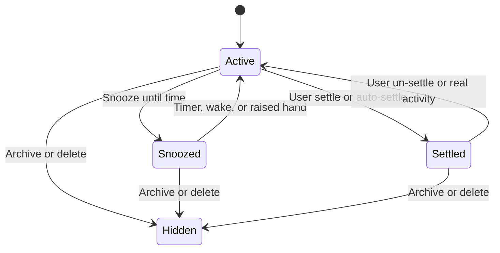
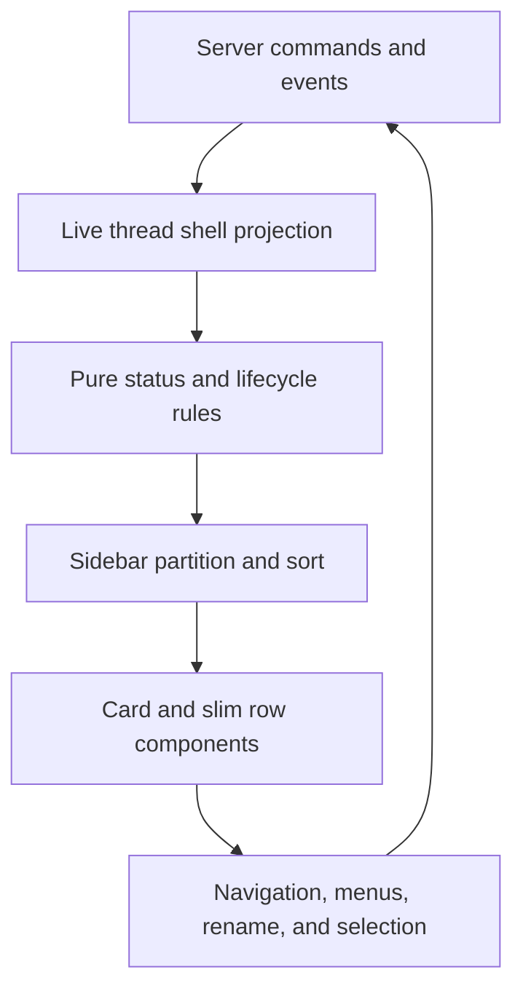

# T3 Code Sidebar V2 replication analysis — 2026-07-27

## Executive answer

T3 Code Sidebar V2 is not a styled thread list. It is an inbox for agent work.

The visible design has three thread forms:

- Active work uses a rich card.
- Snoozed work uses a compact row in a collapsed shelf.
- Settled work uses a compact row in a paged history shelf.

The important design is below those forms. A live thread shell supplies status,
attention, lifecycle, project, environment, provider, branch, and visit data.
Pure rules partition that shell into the three forms. Server commands persist
settle and snooze actions. The list keeps active rows in creation order, so
background activity does not move the target under the pointer.

Omega can replicate this model in its current zero-base sidebar. Omega must not
add a second sidebar or replace the native GPUI shell. The current Omega shell
already has these useful properties:

- A persistent 280 px sidebar.
- A 30 px collapsed rail.
- A 600 px minimum content width.
- Stored open and section states.
- Native title-bar alignment.
- In-place section failure text.
- Existing thread, worktree, archive, rename, pairing, and settings systems.

The primary gap is the row projection. The current Omega row stores a title,
age, executor, paths, and a reopen refusal. It does not store the state that
Sidebar V2 needs. A visual-only implementation would produce cards that cannot
tell the user what needs attention.

The recommended Omega result keeps the current shell and adds:

1. Search and new-thread controls.
2. One logical project scope control.
3. A flat active thread list.
4. Snoozed and settled shelves.
5. A shared thread-shell projection.
6. Native selection, rename, context menu, and lifecycle actions.
7. Central Git and timer observers.
8. Stronger keyboard and accessibility behavior than T3 Code.

## Scope and evidence

This analysis uses the following source revisions.

| Source                            | Revision                                   | Date basis                               |
| --------------------------------- | ------------------------------------------ | ---------------------------------------- |
| T3 Code                           | `a148e08197fc38b24e59c10c7cd5ba06dd182dab` | Current upstream during this review      |
| Earlier T3 Code teardown snapshot | `8b5469863ae1dd696e696de30240ec3da607962d` | 2026-07-17 teardown basis                |
| Omega desktop                     | `5230c50d003b6c26ccab1da40e8f167a6311a841` | Current `origin/main` during this review |
| Prior Omega gap report            | `51b36e68594e4ec6b7284768ca7bb2cb07655338` | Current OpenAgents report basis          |

The T3 Code revision is newer than all prior T3 Code teardown snapshots in this
repository. Sidebar V2 first landed after those snapshots.

The review used:

- Current T3 Code source.
- T3 Code commit history after the earlier snapshot.
- T3 Code pull request descriptions and supplied screenshots.
- T3 Code unit, projection, command, and lifecycle tests.
- Current Omega source and tests.
- The supplied Omega desktop screenshot.
- The prior Omega and T3 Code gap analysis.

The supplied screenshot shows Omega in front of Codex. It does not show T3 Code
Sidebar V2. This report uses it only as evidence for the present Omega layout.
The T3 Code findings use T3 Code source and its official pull request images.

This review did not run a live T3 Code environment. The report marks source
inferences where live pointer behavior can differ.

## What is new

Sidebar V2 did not exist at the 2026-07-17 teardown snapshot.

The main changes are:

| Date       | Commit     | Change                                                        |
| ---------- | ---------- | ------------------------------------------------------------- |
| 2026-07-22 | `32c6012d` | Added the flat list and server-backed settled lifecycle       |
| 2026-07-22 | `18b46887` | Stabilized settle animations                                  |
| 2026-07-22 | `9fe4832a` | Moved project choice to the command palette                   |
| 2026-07-23 | `3afb4a9e` | Restored logical project filtering                            |
| 2026-07-23 | `57100fba` | Restored project actions                                      |
| 2026-07-23 | `9d9208ce` | Grouped projects in new-thread pickers                        |
| 2026-07-23 | `ddd5a46f` | Added jump hints, work duration, fade rules, and settled sort |
| 2026-07-23 | `202e5609` | Added thread snoozing                                         |
| 2026-07-27 | `80ead5f3` | Added glass thread tooltips                                   |
| 2026-07-27 | `6a3df517` | Corrected draft-thread route highlighting                     |

Sidebar V2 remains a beta. `sidebarV2Enabled` defaults to `false`.

The beta description states its product model:

- One flat list in creation order.
- Active work uses rich cards.
- Settled work uses compact rows.
- An old server keeps threads active.
- A user can return to Sidebar V1.

The first Sidebar V2 pull request image is now historical. That image shows
project chips and stronger card surfaces. Current source uses one project menu.
Current source also reserves row surfaces for hover, route, and selection.
Implement the current source model, not the first pull request image.

## Product model

Sidebar V2 treats the sidebar as an inbox.

- Active means that the thread remains in the working set.
- Snoozed means that the user wants the thread later.
- Settled means that the work is done enough to move into history.
- Archived remains a separate state that removes the thread from live lists.

Snooze does not stop an agent. It only changes list visibility.

Settle does not delete history. A settled thread stays in the live shell stream.
The user can open it without an un-settle action.

The list does not use recent activity as its active sort. A thread keeps its
position until a lifecycle action moves it to another section. This rule gives
the sidebar spatial stability during concurrent work.



## Architecture

The sidebar has four operating layers.



### Layer 1: shell and frame

`AppSidebarLayout.tsx` owns the desktop shell.

It:

- Selects Sidebar V1 or V2.
- Keeps Sidebar V1 on settings routes.
- Owns the preferred width.
- Restores the stored width before normal interaction.
- Calculates the current maximum width.
- Adds the macOS traffic-light inset.
- Handles the global sidebar shortcut.
- Mounts the resize rail.

`ui/sidebar.tsx` owns the reusable sidebar primitives.

It:

- Owns desktop open state.
- Owns mobile sheet state.
- Writes open state to a cookie.
- Renders desktop off-canvas behavior.
- Renders the mobile sheet.
- Implements pointer resize.
- Supplies header, content, group, footer, menu, trigger, and rail primitives.

### Layer 2: shared chrome

`sidebar/SidebarChrome.tsx` is shared by Sidebar V1 and V2.

The header contains:

- A mobile close or toggle control.
- The T3 wordmark.
- The `Code` label.
- Optional release-channel art.
- A native drag region in Electron.

The footer contains:

- Provider update state.
- Application update state.
- Settings.

This extraction prevents a beta list from changing the application frame.

### Layer 3: Sidebar V2

`SidebarV2.tsx` owns the complete V2 product surface.

At the reviewed revision, the file has 2,738 lines. It includes:

- Project grouping.
- Project management.
- Thread partition.
- Selection.
- Rename.
- Context menus.
- Lifecycle commands.
- Navigation planning.
- Keyboard traversal.
- Card and compact row rendering.
- Tooltips.
- Snooze menus.
- Timers.
- Animation attachment.

The component is functionally complete, but it is too large to use as an Omega
component boundary.

### Layer 4: pure rules and server lifecycle

Important rules are outside the component:

- `Sidebar.logic.ts` owns status, time, and sort rules.
- `Sidebar.snooze.ts` owns snooze presets and labels.
- `threadSettled.ts` owns settle and snooze classification.
- `threadSelectionStore.ts` owns multi-selection.
- Server deciders own command invariants.
- Server projectors own persisted lifecycle fields.

This split is the most important part to copy.

## Exact desktop frame

### Geometry

| Property                   | T3 Code value         | Omega recommendation                 |
| -------------------------- | --------------------- | ------------------------------------ |
| Default sidebar width      | 256 px                | Keep Omega at 280 px                 |
| Minimum sidebar width      | 208 px                | Use 220 px                           |
| Minimum main content width | 640 px                | Keep Omega's tested 600 px floor     |
| Desktop collapse           | Zero-width off-canvas | Keep Omega's 30 px rail              |
| Header height              | 52 px                 | Keep `Tab::container_height(cx)`     |
| Search control height      | 32 px                 | Use the native sparse control height |
| Project control height     | 32 px                 | Use the native sparse control height |
| Active card interior       | 78 px                 | Target 76 to 82 px                   |
| Active card total          | Approximately 82 px   | Target 80 to 84 px                   |
| Compact row                | 36 px                 | Target 34 to 36 px                   |
| Thread-list gap            | 1 px                  | Use one theme spacing unit or less   |
| Settled initial page       | 10 rows               | Use 10 rows                          |
| Settled page increment     | 25 rows               | Use 25 rows                          |
| List movement              | 150 ms ease-out       | Use 120 to 160 ms                    |
| Shell movement             | 200 ms linear         | Keep native panel motion             |

T3 Code stores width under `chat_thread_sidebar_width`.

The maximum width is:

```text
max(208, floor(viewport width) - 640)
```

The resize operation accepts:

- Any smaller width.
- A larger width only when 640 px remains for main content.

Omega already protects its composer with a 600 px floor. Preserve that tested
invariant. Do not replace it with the T3 Code number without a new composer
layout test.

### Resize mechanics

The T3 Code resize rail:

- Uses a 16 px pointer target around the visible edge.
- Shows a 2 px line on hover.
- Uses pointer capture.
- Accepts only the primary pointer button.
- Uses one animation-frame write for each visual update.
- Writes `--sidebar-width`.
- Disables width transitions during the drag.
- Sets the body cursor to `col-resize`.
- Disables text selection during the drag.
- Stores the final width.
- Suppresses a click after more than 2 px of movement.

The rail has `tabIndex={-1}`. It has no keyboard resize path. Omega should add
keyboard width actions or a reset-width menu item.

### Collapse behavior

T3 Code uses an off-canvas collapse.

- The layout gap animates to zero.
- The fixed sidebar moves left by its width.
- A fixed title-bar control remains available.
- The global shortcut runs in capture phase.
- The control has a label and pressed state.

Omega has a different product contract. Its 30 px rail stays visible. The rail
keeps expand and Settings controls available. Preserve this behavior.

The Omega implementation can still add resize. Resize must apply only to the
expanded width. Automatic narrow-window rail mode must not overwrite the user's
preferred expanded width.

### macOS behavior

T3 Code:

- Uses a 90 px left inset for traffic lights.
- Removes that inset in full screen.
- Updates the inset from the Electron bridge.
- Makes the header draggable.
- Excludes controls and links from the drag region.

Omega already uses `TRAFFIC_LIGHT_PADDING` and full-screen state in native
window layout. Keep the native implementation.

## Exact component tree

Current Sidebar V2 renders this tree:

```text
AppSidebarLayout
└── SidebarProvider
    ├── Sidebar
    │   ├── SidebarChromeHeader
    │   ├── SidebarContent
    │   │   ├── SearchAndCreateGroup
    │   │   │   ├── CommandPaletteTrigger
    │   │   │   └── NewThreadButton
    │   │   ├── ProjectScopeGroup
    │   │   │   ├── ProjectScopeMenu
    │   │   │   └── AddProjectButton
    │   │   └── ThreadListGroup
    │   │       ├── ActiveCardRows
    │   │       ├── SnoozedShelfHeader
    │   │       ├── SnoozedSlimRows
    │   │       ├── SettledShelfHeader
    │   │       ├── SettledSlimRows
    │   │       ├── ShowMoreSettledButton
    │   │       └── EmptyState
    │   ├── ProjectSettingsDialog
    │   ├── SidebarChromeFooter
    │   └── SidebarRail
    ├── MainContent
    └── SidebarControl
```

### Search and create group

The first body group has a search control and a new-thread control.

Search:

- Opens the global command palette.
- Searches threads and commands.
- Shows the configured shortcut.
- Uses a text label, search icon, and shortcut keycap.
- Uses the full remaining row width.

New thread:

- Uses a square compose icon.
- Is disabled when no project exists.
- Creates immediately when there is one logical project.
- Opens the `new-thread-in` command palette when there is a choice.
- Closes the mobile sheet before it starts navigation.
- Adds an invisible 48 px coarse-pointer target.

The control does not inherit the viewed thread's branch or worktree. A separate
context-menu command provides that explicit behavior.

### Project scope group

The second group exists when at least one logical project exists.

The main control:

- Shows `All projects` or the current logical project.
- Shows a folder icon for all projects.
- Shows the project favicon for one project.
- Opens a radio menu.
- Filters threads across all physical members of the logical project.

The menu:

- Includes `All projects`.
- Includes one row for each logical project.
- Includes a project favicon and name.
- Includes a nested project actions button.

The add-project control opens the command palette.

A scope change clears multi-selection. This rule prevents a hidden selected row
from receiving a later batch action.

If a selected project disappears, the scope returns to all projects.

### Thread list group

The thread list is the only scrolling work area.

It:

- Uses a stable scrollbar gutter.
- Uses an unordered semantic list.
- Attaches 150 ms automatic movement.
- Renders active rows first.
- Renders the snoozed shelf next.
- Renders the settled shelf last.
- Shows an empty state when all three partitions are empty.

There is also an outer sidebar scroll primitive. The current inner group owns
the effective thread-list scroll. Omega should use one scroll owner.

## Active card anatomy

An active card has three lines.

```text
┌ project icon · project name                 status or time ┐
│ thread title                                               │
└ branch                      PR · diff · remote · provider ┘
```

### First line

The left side has:

- A 16 px project favicon.
- The project display name.

The right side has:

- Approval.
- Input.
- Working and elapsed duration.
- Failed.
- Woke.
- Done.
- Or a relative time.

Hover or keyboard focus replaces this slot with:

- Snooze.
- Settle.

### Second line

The middle line has the thread title.

Title rules:

- The title uses 14 px text.
- Active attention uses medium weight.
- A receded row uses normal weight.
- A rename input replaces the title in place.
- The line truncates at the available width.

Rename behavior:

- Double-click starts rename.
- The input receives focus.
- The full title is selected.
- Enter commits.
- Escape cancels.
- Blur commits.
- Empty text produces a warning.
- Unchanged text does not send a command.
- A command failure produces an error toast.

### Third line

The bottom line has:

- Branch.
- Pull request number.
- Diff statistics.
- Remote environment marker.
- Provider marker.

The current diff slot is not functional. `latestTurnDiff()` always returns
`null` because the shell does not have the needed statistics. Do not copy this
as a claimed Omega feature.

The pull request badge:

- Is a separate button.
- Opens the pull request.
- Remains visible during row hover.
- Uses status color in active rows.

The remote marker appears when the thread environment differs from the primary
environment.

The provider marker uses the provider instance and selected model.

### Card tooltip

A 150 ms hover tooltip can show:

- Full thread title.
- Project.
- Environment.
- Branch.
- Branch mismatch.
- Provider and model.
- Latest session error.

The current tooltip uses a glass style. Omega should use its native tooltip
surface. The information is useful. The glass treatment is not required.

## Compact row anatomy

A compact row is 36 px high.

```text
project icon · title · PR                         time or action
```

The row:

- Uses a dim and gray project icon at rest.
- Restores the icon on hover.
- Keeps the active route at normal contrast.
- Truncates the title.
- Keeps the pull request as a separate button.

The right slot shows:

- A wake countdown for snoozed work.
- `Woke` for a returned thread.
- Settlement time for settled work.

Hover or focus replaces that value with:

- Wake now.
- Un-settle.

The active routed row stays visible even when its shelf is collapsed. A deep
linked settled row also stays visible when it is beyond the current page.

## Status and attention model

Runtime status has this priority:

1. Pending approval.
2. Pending user input.
3. Starting or running.
4. Session error.
5. Ready.

Visual labels use:

| State               | Label         | Color family | Motion          |
| ------------------- | ------------- | ------------ | --------------- |
| Approval            | `Approval`    | Amber        | None            |
| User input          | `Input`       | Indigo       | None            |
| Starting or running | `Working`     | Sky          | Stepped opacity |
| Error               | `Failed`      | Red          | None            |
| Returned snooze     | `Woke`        | Amber        | None            |
| Unseen completion   | `Done`        | Emerald      | None            |
| Ready and seen      | Relative time | Muted        | None            |

Working duration:

- Starts at the current turn start.
- Falls back to request time.
- Falls back to the session transition.
- Shows seconds below one minute.
- Shows minutes below one hour.
- Shows hours and minutes above one hour.
- Updates each second.
- Is outside the live status region.

Unread completion is separate from runtime status.

- A never-visited historical thread counts as read.
- This rule prevents a beta toggle from marking all old threads unread.
- A completion after the last visit counts as unread.
- A returned snooze remains `Woke` until a visit after the wake.
- An invalid visit time cannot remove the wake signal.

### A T3 Code rule that Omega must change

T3 Code treats Working, Approval, and Input as one `isInFlight` group. A read,
inactive, unselected row in that group receives 70 percent opacity.

The source comment says that the user has nothing to do yet. That statement is
incorrect for Approval and Input. Those states explicitly need a human.

Omega must use this priority:

1. Approval and input remain fully prominent.
2. Fresh failure remains fully prominent.
3. Unseen completion and woke remain prominent.
4. Working can recede when it needs no user action.
5. Ready and seen can recede.

Do not fade the two human-blocking states.

## Partition and sort rules

### Visible source set

Sidebar V2 starts from live thread shells.

It excludes:

- Archived threads.
- Threads outside the selected project scope.

It does not merge an archive snapshot into the list. Settled threads remain in
the live shell.

### Partition order

For each visible thread:

1. Use the snoozed partition when snooze is supported and effectively active.
2. Otherwise, use settled when settlement is supported and effectively active.
3. Otherwise, use active.

Snooze has priority over settle. The wake time is a stronger statement about
when the thread matters.

An environment without a lifecycle capability keeps its threads active. This
rule prevents a row from entering a shelf that has no working reverse action.

### Active sort

Active threads use:

1. `createdAt` descending.
2. Thread ID ascending as a stable tie break.

Activity never changes this order.

### Snoozed sort

Snoozed threads use:

1. Nearest wake time first.

The shelf answers which thread will return next.

### Settled sort

Settled threads use:

1. Explicit `settledAt`.
2. Otherwise, latest user message or turn activity.
3. Otherwise, `updatedAt`.
4. Thread ID as a stable tie break.

The shelf answers when work ended, not when the thread started.

### Shelf behavior

Snoozed:

- Hidden when empty.
- Collapsed by default.
- Header shows the total when collapsed.
- Active routed row stays visible.

Settled:

- Hidden when empty.
- Expanded by default.
- Shows 10 rows initially.
- Adds 25 rows for each `Show more` action.
- Active routed row stays visible.
- The page resets after a project scope change.

Keyboard thread order includes only rendered rows:

1. Active rows.
2. Visible snoozed rows.
3. Rendered settled rows.

Collapsed and unpaged rows do not receive numeric jump positions.

## Settled lifecycle

Settlement is a server-backed lifecycle.

The server projects:

- `settledOverride`.
- `settledAt`.

`settledOverride` has three meanings:

| Value     | Meaning                                    |
| --------- | ------------------------------------------ |
| `null`    | Use automatic rules                        |
| `settled` | The user explicitly settled the thread     |
| `active`  | The user explicitly kept the thread active |

An un-settle action on an automatically settled thread writes the active pin.
Real activity later clears that pin.

### Settle blockers

A thread cannot settle when:

- An approval is pending.
- User input is pending.
- A session is starting.
- A session is running.
- A turn start is queued.

A queued turn start has a two-minute grace window. This rule prevents a recent
message from disappearing before a session adopts it. The bounded window also
prevents stale data from blocking settlement forever.

The client checks these rules before a command. The server checks them again.

### Automatic settlement

A thread can settle automatically after:

- A pull request is merged or closed.
- A configured number of inactive days.

A merged or closed pull request uses a one-hour idle guard. Without the guard,
a warm follow-up conversation would return to settled state after each turn.

The inactivity setting:

- Defaults to three days.
- Can use another day count.
- Can be disabled.

### Real activity

Real activity clears a stale settled override.

Examples include:

- A new user message.
- A live session start.
- A new approval request.
- A new user-input request.

### Forward navigation

When the user settles the open thread, Sidebar V2 plans navigation before it
sends the command.

The destination is:

1. The next active card that is not in the same batch.
2. A new draft in the same project.
3. The home route.

Navigation occurs only after success. It also occurs only when the user is
still on the original thread after the request completes.

Repeated settle requests for the same thread are ignored while one is active.

## Snooze lifecycle

Snooze is also a server-backed lifecycle.

The server projects:

- `snoozedUntil`.
- `snoozedAt`.

The wake time must be in the future.

The user cannot snooze:

- A pending approval.
- A pending user-input request.
- A queued turn start.

The user can snooze a running thread. The agent continues to run.

### Presets

The menu calculates presets when it opens.

| Preset       | Rule                                                |
| ------------ | --------------------------------------------------- |
| In 1 hour    | Current time plus one hour                          |
| This evening | 18:00 local time when it is more than one hour away |
| Tomorrow     | 09:00 on the next local calendar day                |
| Next week    | 09:00 on the next Monday                            |

Calendar-day math protects the result across daylight-saving changes.

### Wake rules

A thread stops classifying as snoozed when:

- The wake time arrives.
- An approval appears.
- A user-input request appears.
- A new failure occurs after snooze.
- A turn completes after snooze.
- The user selects Wake.

A failure that existed before snooze does not wake the thread. The snooze means
that the user already saw that failure.

The timer wake is derived on the client. No server event is required at the
wake second.

The component arms one timer for the nearest wake. It clamps long delays to the
maximum signed 32-bit timer value.

### Confirmation

A successful snooze:

- Removes the active card.
- Shows a toast with the wake time.
- Includes Undo.
- Uses the same safe forward navigation as settle.

## Project grouping

Sidebar V2 shows logical projects, not all physical environment entries.

A physical project key combines:

- Environment ID.
- Normalized workspace root.

A logical key can use:

- Canonical repository identity.
- Canonical repository plus relative subpath.
- The physical project key for separate mode.

The grouping modes are:

- Inherit.
- Repository.
- Repository and path.
- Separate.

When duplicate physical entries exist, the representative choice prefers:

1. The primary environment.
2. The newest updated or created entry.
3. A stable ID tie break.

The display name prefers:

1. Shared repository display name.
2. Shared repository name.
3. Representative project title.

The group also records whether it is:

- Local only.
- Remote only.
- Mixed.

The project settings dialog can:

- Rename one physical entry.
- Change the grouping rule.
- Copy a path.
- Remove one entry.
- Remove all entries in a logical group.

Removal states:

- Conversation history is deleted.
- Files remain on disk.
- The operation cannot be undone.

Omega does not need T3 Code's environment grouping algorithm for the first
sidebar release. Omega can group by main worktree identity first. It must keep a
stable extension point for remote identities.

## Interaction contract

### Pointer and keyboard

| Input                               | Result                                    |
| ----------------------------------- | ----------------------------------------- |
| Plain click                         | Open the thread and clear multi-selection |
| Command or Control click            | Toggle one selected row                   |
| Shift click                         | Add the range from the anchor             |
| Double-click                        | Rename the thread                         |
| Right-click                         | Open the row or batch menu                |
| Enter on a row                      | Open the thread                           |
| Space on a row                      | Open the thread                           |
| Escape                              | Clear multi-selection                     |
| Command or Control plus 1 through 9 | Open a rendered thread                    |
| Previous or next thread command     | Cycle through rendered threads            |
| Sidebar shortcut                    | Toggle the sidebar                        |

A plain click also sets the range-selection anchor.

The click handler ignores the trailing click of a double-click. This prevents
navigation from racing rename.

### Single-row menu

The menu can include:

- New thread on the current branch.
- Settle.
- Un-settle.
- Snooze.
- Wake.
- Rename.
- Mark unread.
- Delete.

`New thread on branch` is explicit. It carries the branch and current worktree.
Normal new thread does not carry them.

### Batch menu

Batch actions use only selected rows that are currently rendered.

The menu can include:

- Settle N threads.
- Snooze N threads.
- Mark N threads unread.
- Delete N threads.

Snooze appears only when every selected thread can snooze.

Delete runs each command in order. Worktree cleanup counts only deletions that
have completed. This rule prevents the first deletion from removing a worktree
that another selected thread still uses.

### Mobile sheet

Below 768 px, the reusable sidebar renders as a sheet.

The sheet:

- Uses almost the full viewport width.
- Keeps 12 px of exposed viewport.
- Applies safe-area padding.
- Has no standard close button.
- Includes a screen-reader title and description.
- Closes after thread, new-thread, or Settings navigation.
- Does not support resize.

Omega desktop currently switches to its persistent rail before this condition
is useful. A future mobile or compact-window sheet should use a separate input
contract. Do not depend on hover.

## Visual system

### Surface rules

Current Sidebar V2 uses one surface model for all rows.

- Transparent is the resting row.
- Hover uses the sidebar hover token.
- Active route uses the active token.
- Multi-selection uses the selected token.
- Runtime status stays in content, not elevation.

This is calmer than the original V2 pull request image.

### Current tokens

Light mode:

- Sidebar: zinc 50.
- Text: zinc 800.
- Muted text: zinc 500.
- Hover: zinc 25.
- Active and selected: white.
- Border: zinc 200.

Dark mode:

- Sidebar and card: black.
- Text: `#f1f3f7`.
- Muted text: `#a3a3a3`.
- Hover: 8 percent foreground.
- Active: 11 percent foreground.
- Selected: 7 percent foreground.
- Border: 8 percent white.

The base radius is 10 px. Rows use the medium radius.

The typeface is DM Sans. Code and time fragments use a system monospace stack.

Omega must use Zed and Omega theme tokens. Do not import these colors or fonts.

### Motion

The thread list uses 150 ms ease-out movement.

When a card becomes a compact row, the React key includes the row form. The old
card fades out and the new compact row fades in. This avoids moving one
translucent element through other text.

Working status uses a 3.4 second stepped opacity cycle. Reduced-motion mode
disables it.

Omega should use:

- A short crossfade for lifecycle form changes.
- A short position transition for other rows.
- No motion for reduced-motion mode.
- No decorative grain.

### Treatments not to copy

T3 Code adds:

- SVG turbulence grain.
- Glass tooltips.
- Release-channel gradient art.

These treatments do not carry the sidebar information model. They add
compositing cost and can reduce contrast. Omega should keep its native surface.

## Performance model

Sidebar V2 includes several good performance decisions.

- Thread data comes from lightweight shell projections.
- Rows use memoization.
- Parent callbacks avoid unstable map and array identities.
- Range selection reads the current rendered order through a reference.
- The working timer is isolated from the full row.
- Snooze uses one next-wake timer.
- Auto-settle time uses minute precision.
- Settled history uses paging.
- Off-screen rows use content visibility and intrinsic-size estimates.
- Card and compact forms have different keys for stable transitions.

There are also important risks.

### Per-row Git query

Each row can subscribe to environment Git status. The row uses that status to
find:

- Current branch.
- Branch mismatch.
- Pull request.
- Pull request state.

The pull request state then flows back to the parent partition.

Content visibility does not stop React hooks. A long settled list can retain
many Git subscriptions.

Omega should use one project or repository observer. It should project branch
and pull request summaries into visible row data. It must not create one
repository task for each row.

### Per-row working timer

Each working row has its own one-second interval. The interval updates only a
small child, which is better than a full row update.

Omega should use one shared one-second ticker. Only visible working labels need
to observe it.

### Component size

`SidebarV2.tsx` has 2,738 lines. It has too many responsibilities.

Omega should separate:

- Pure projection and lifecycle rules.
- Sidebar state.
- Thread list view.
- Thread row view.
- Project scope menu.
- Project settings.
- Context-menu commands.

## Accessibility audit

### Strong parts

T3 Code includes:

- Labels on icon-only controls.
- Visible focus rings.
- Enter and Space row activation.
- Live status labels.
- The changing work duration outside the live region.
- Expanded state on shelf headers.
- A hidden title and description for the mobile sheet.
- Reduced-motion handling for working animation.
- Focus-visible paths for hover actions.

### Gaps

#### Resize has no keyboard path

The resize rail is not in the tab order. A keyboard user cannot resize the
sidebar.

Omega must add width actions or an accessible reset control.

#### Multi-selection is not announced

Rows use `role="button"` and `tabIndex={0}`.

The list does not expose:

- `aria-selected`.
- A multi-select list role.
- A selected-count announcement.
- Roving focus.
- Arrow-key row movement.

Omega should use native GPUI list semantics. Selection state must be available
to assistive technology.

#### Hover-hidden actions can remain hit-testable

Card and compact actions use opacity to hide. They do not consistently disable
pointer events while hidden.

On a coarse pointer, an invisible action can still occupy the right slot. This
is a source-based risk. A live device test is required.

Omega must:

- Show an explicit overflow control for touch or coarse input.
- Remove hidden actions from hit testing.
- Keep desktop hover actions available on keyboard focus.

#### Human-blocking rows recede

Approval and Input can receive 70 percent row opacity. This weakens the most
important states.

Omega must keep them at full prominence.

#### Low-opacity small text

Some 12 px metadata uses 35 to 55 percent muted color. Light-mode contrast can
fall below a useful reading level.

Omega must test all metadata at normal, active, selected, and receded states.
The design should meet WCAG AA for text that carries information.

#### Component test gap

T3 Code has strong pure-rule and server tests. The review found no complete
Sidebar V2 interaction or visual test.

The first Sidebar V2 pull request also listed accessibility work as a beta
follow-up.

Omega should add GPUI interaction and visual tests with the first release.

## Other T3 Code implementation gaps

### Open-state cookie is not restored in this path

The sidebar provider writes `sidebar_state` to a cookie. The reviewed source
only references that key in the write path. `AppSidebarLayout` passes
`defaultOpen` directly.

This means that the current client path does not restore the written collapse
state. Another host layer could supply state in a different build, but no such
read exists in the reviewed repository.

Omega already restores open state from `KeyValueStore`. Preserve Omega's
working behavior.

### Diff statistics are a placeholder

The active card includes a diff statistics slot. The current function returns
no value for all threads.

Do not include the slot in the first Omega card unless the row projection
provides a tested value.

### Pull request state owns too much classification

The row discovers pull request state and reports it to the parent. This makes
list partition depend on mounted row side effects.

Omega should put pull request state in the shared shell before partition.

## Current Omega sidebar

### Shell

Omega's `omega_sidebar.rs` defines:

- `SIDEBAR_WIDTH = 280 px`.
- `RAIL_WIDTH = 30 px`.
- `MIN_CONTENT_WIDTH = 600 px`.
- `RECENT_THREADS = 10`.
- `STATE_KEY = "omega-zero-base-sidebar"`.

The layout has two forms:

- Expanded.
- Rail.

If a 280 px sidebar would leave less than 600 px, the layout uses the rail. A
window at 880 px can show the full sidebar. A window at 879 px uses the rail.

Automatic rail mode does not overwrite the stored user preference.

### Persistent state

`SidebarState` stores:

- `open`.
- Stable collapsed section keys.

The default state:

- Opens the sidebar.
- Opens Recent threads.
- Collapses Public chat.

Unreadable JSON returns the default state. Unknown section keys remain
readable.

This model is strong. Extend it instead of replacing it.

### Current component tree

```text
AgentPanel
└── OmegaSidebarColumn
    ├── Header
    │   ├── Omega label
    │   └── Collapse button
    ├── ScrollingSections
    │   ├── RecentThreadsSection
    │   └── PublicChatSection
    ├── OptionalPairingSurface
    └── Footer
        ├── PairPhone
        └── Settings
```

Rail mode has:

- Expand.
- Settings.

### Current thread row

The current row contains:

- Title.
- Age.
- Non-default executor name.
- Reopen refusal state.
- Folder paths used during reopen.

The row:

- Excludes drafts.
- Excludes archived threads.
- Sorts by `updated_at` descending.
- Uses thread ID as a stable tie break.
- Limits the pure row projection to 200.
- Shows the first 10 in the persistent sidebar.
- Reopens with the recorded executor.
- Keeps the sidebar open after navigation.

The visible row has no:

- Active route highlight.
- Project name.
- Worktree or branch.
- Runtime state.
- Approval or input state.
- Failure state.
- Unread completion.
- Visit state.
- Settle state.
- Snooze state.
- Pull request.
- Provider icon.
- Context menu.
- Inline rename.
- Multi-selection.
- Search.
- Project scope.

### Existing Omega data

`ThreadMetadata` already stores:

- Stable thread ID.
- Optional ACP session ID.
- Agent ID.
- Generated title.
- User title override.
- Updated time.
- Created time.
- Last user interaction time.
- Worktree paths.
- Remote connection.
- Archived state.

Omega also has existing systems for:

- Rename.
- Archive and unarchive.
- Delete.
- Worktree removal and restore.
- Branch recovery for archived worktrees.
- Pending tool approvals in loaded conversations.
- Native thread generation status.
- Queued messages.
- Agent notifications.
- Thread archive filtering.

The gap is not the absence of all data. The gap is one lightweight projection
that joins it for every sidebar row.

## Exact gap analysis

| Layer                | Current Omega                     | Sidebar V2 target                     | Required Omega change                          |
| -------------------- | --------------------------------- | ------------------------------------- | ---------------------------------------------- |
| Shell                | Fixed 280 px or 30 px rail        | Resizable 208 px minimum              | Add preferred width and native drag resize     |
| Content floor        | 600 px                            | 640 px                                | Keep Omega's tested 600 px floor               |
| Collapse persistence | Working key-value restore         | Cookie write without visible read     | Keep Omega implementation                      |
| Search               | Missing                           | Global thread and command search      | Add command-palette entry                      |
| New thread           | Header action elsewhere           | Sidebar action with project choice    | Add direct action and project picker fallback  |
| Project scope        | Missing                           | One logical project menu              | Add main-worktree scope first                  |
| Active sort          | Updated activity                  | Creation order                        | Add a separate active sort                     |
| Thread density       | Two-line simple rows              | Rich active cards                     | Add card projection and renderer               |
| History density      | First 10 only                     | Compact settled tail                  | Add settle lifecycle and paging                |
| Snooze               | Missing                           | Server-backed timed shelf             | Add persisted snooze fields and timer          |
| Status               | Only in loaded view               | Shell status for all rows             | Add sidebar thread shell                       |
| Attention            | Only loaded approval UI           | Approval and input on every row       | Project pending state into shell               |
| Unread               | Missing                           | Last visit against completion         | Store visit and completion times               |
| Active route         | Missing in current row            | Explicit active surface               | Compare row ID with active thread              |
| Rename               | Exists in thread view             | Inline double-click rename            | Reuse title override command                   |
| Archive              | Separate archive view             | Settled remains live                  | Keep archive distinct                          |
| Selection            | Missing                           | Command, Control, and Shift selection | Add native selected set and anchor             |
| Context menu         | Missing                           | Single and batch actions              | Add GPUI menus                                 |
| Branch               | Available through project systems | Visible card metadata                 | Add central repository summary                 |
| Pull request         | Not in row                        | Badge and auto-settle signal          | Add later through shared Git summary           |
| Provider             | Executor text only                | Provider and model marker             | Add provider summary when reliable             |
| Remote               | Reopen metadata exists            | Environment marker                    | Project remote identity into shell             |
| Public chat          | Sidebar section                   | Not part of T3 thread inbox           | Keep as tertiary collapsed section             |
| Pairing              | Footer and QR surface             | Not part of T3 sidebar                | Keep Omega behavior                            |
| Mobile               | Separate bounded mirror           | Same lifecycle model                  | Project new shell to the bridge later          |
| Tests                | Layout and row rule tests         | Strong lifecycle rule tests           | Add projection, GPUI, visual, and action tests |

## Omega replication specification

### Keep these Omega decisions

Keep:

- One zero-base sidebar.
- The 280 px default.
- The 30 px persistent rail.
- The 600 px main-content floor.
- Default-open behavior.
- Stable stored section keys.
- In-place failure text.
- Native title-bar dimensions.
- Pair phone and Settings in the footer.
- Archive as a separate lifecycle.
- Existing thread executor honesty.
- Existing worktree cleanup safety.

### New Omega component tree

```text
AgentPanel
└── OmegaSidebar
    ├── OmegaSidebarHeader
    ├── OmegaSidebarControls
    │   ├── SidebarSearchButton
    │   └── SidebarNewThreadButton
    ├── SidebarProjectScope
    │   ├── LogicalProjectMenu
    │   └── AddFolderButton
    ├── SidebarThreadList
    │   ├── ActiveThreadCards
    │   ├── SnoozedShelf
    │   └── SettledShelf
    ├── PublicChatSection
    ├── PairingSurface
    └── OmegaSidebarFooter
```

Use one scroll owner around `SidebarThreadList` and Public chat. Keep controls
and footer fixed.

### Proposed state

Extend the stored sidebar state with:

```rust
pub struct SidebarState {
    pub open: bool,
    pub preferred_width: f32,
    pub collapsed: Vec<String>,
    pub project_scope: Option<String>,
    pub snoozed_expanded: bool,
    pub settled_expanded: bool,
}
```

Keep transient state outside the stored record:

```rust
pub struct SidebarInteractionState {
    pub selected_thread_ids: HashSet<ThreadId>,
    pub selection_anchor: Option<ThreadId>,
    pub focused_thread_id: Option<ThreadId>,
    pub renaming_thread_id: Option<ThreadId>,
    pub rename_text: SharedString,
    pub settled_visible_count: usize,
}
```

Do not store:

- Current hover.
- In-flight command guards.
- Current timer tick.
- Temporary menu state.

### Proposed thread shell

Add a lightweight projection with these fields:

```rust
pub struct SidebarThreadShell {
    pub thread_id: ThreadId,
    pub session_id: Option<SessionId>,
    pub agent_id: AgentId,
    pub title: SharedString,
    pub created_at: DateTime<Utc>,
    pub updated_at: DateTime<Utc>,
    pub interacted_at: Option<DateTime<Utc>>,
    pub project_key: Option<SharedString>,
    pub project_title: Option<SharedString>,
    pub worktree_paths: WorktreePaths,
    pub branch: Option<SharedString>,
    pub remote_connection: Option<RemoteConnectionOptions>,
    pub runtime_status: SidebarRuntimeStatus,
    pub has_pending_approval: bool,
    pub has_pending_input: bool,
    pub has_queued_turn: bool,
    pub latest_turn_completed_at: Option<DateTime<Utc>>,
    pub last_visited_at: Option<DateTime<Utc>>,
    pub settled_override: Option<SettledOverride>,
    pub settled_at: Option<DateTime<Utc>>,
    pub snoozed_until: Option<DateTime<Utc>>,
    pub snoozed_at: Option<DateTime<Utc>>,
    pub pull_request: Option<SidebarPullRequestSummary>,
    pub executor_label: Option<SharedString>,
    pub provider_label: Option<SharedString>,
    pub archived: bool,
    pub reopen_refusal: Option<SharedString>,
}
```

This is a proposed contract. Field types can follow existing Omega types.

The shell must not own:

- A full transcript.
- Tool output.
- Full Git status.
- A live terminal.
- A full ACP session object.

### Projection ownership

Use these owners:

| Data                                   | Owner                                 |
| -------------------------------------- | ------------------------------------- |
| Identity, title, times, paths, archive | `ThreadMetadataStore`                 |
| Native runtime state                   | Native thread observer                |
| ACP runtime state                      | Agent connection or session observer  |
| Approval                               | Conversation approval registry        |
| User input                             | ACP elicitation or conversation state |
| Queue                                  | Thread queue projection               |
| Visit time                             | Sidebar or thread navigation store    |
| Settle and snooze                      | Thread metadata persistence           |
| Branch and pull request                | Central project Git observer          |
| Active route                           | `AgentPanel`                          |

Do not require all old conversations to stay loaded. Observers must update a
small shell record.

### Runtime status

Use this order:

```text
Approval
Input
Failed
Working
Done unseen
Woke
Ready
```

Approval and Input stay active even when an old settle or snooze value exists.

### Effective snooze

Use snooze when:

- `snoozed_until` is in the future.
- No approval is pending.
- No input is pending.
- No new failure occurred after snooze.
- No turn completed after snooze.

Running does not block snooze.

### Effective settle

Use settle when:

- No approval is pending.
- No input is pending.
- The thread is not running.
- No recent queued turn exists.
- The explicit or automatic settle rule is true.

For the first Omega release, implement only explicit settle. Add automatic
inactivity and pull request rules after the shell has reliable activity data.

### Row forms

#### Active card

Use:

- Project or worktree on line one.
- Status on line one.
- Title on line two.
- Branch, executor, and remote state on line three.

Do not add:

- Diff values before a tested projection exists.
- A provider icon when executor text is more reliable.
- A pull request badge before the central Git observer exists.

#### Snoozed row

Use:

- Project icon or fallback.
- Title.
- Wake countdown.
- Wake action on hover and focus.

#### Settled row

Use:

- Project icon or fallback.
- Title.
- Settlement age.
- Un-settle action on hover and focus.

### Selection

Add:

- Command or Control click toggle.
- Shift range selection.
- Escape clear.
- A visible selection surface.
- A selected count in the batch menu.
- An accessibility selected state.

Also add:

- Up and Down to move row focus.
- Enter to open.
- Space to toggle selection when selection mode is active.
- Home and End to move to the first or last rendered row.

These additions close a T3 Code accessibility gap.

### Context menus

First release:

- Rename.
- Settle or Un-settle.
- Snooze or Wake.
- Archive.
- Delete.
- Copy thread identifier for development builds.

Later:

- New thread on branch.
- Mark unread.
- Pull request action.
- Batch worktree actions.

Reuse existing archive, delete, title override, and worktree cleanup commands.
Do not create second implementations.

### Search

Search should use Omega's command palette.

Search data:

- Title.
- Project or worktree name.
- Branch when available.
- Executor.

Result behavior:

- Open the thread with its recorded executor.
- Restore needed worktree context.
- Keep the sidebar open.
- Surface a reopen refusal in place.

### Project scope

First release grouping:

- Use the main worktree path as the logical project key.
- Group linked worktrees under that key.
- Use `All projects` as the default.
- Show one project or repository name.
- Clear selection when scope changes.
- Return to all projects when the selected key disappears.

Later grouping can add:

- Remote connection identity.
- Repository canonical identity.
- Repository subpath.
- User grouping overrides.

### Resizing

Add a native GPUI resize edge.

It must:

- Keep a 12 to 16 px pointer target.
- Show a narrow visual edge on hover.
- Preserve the 600 px content floor.
- Clamp to a 220 px minimum sidebar width.
- Store the expanded width after drag.
- Keep the stored width during automatic rail mode.
- Restore width before the first stable frame.
- Use a resize cursor.
- Disable text selection during drag.
- Support Reset Sidebar Width.
- Support keyboard increase and decrease actions.

### Timers

Use:

- One minute ticker for relative times and automatic inactivity.
- One second ticker for visible working durations.
- One scheduled timer for the nearest snooze wake.

Use GPUI executor timers. Do not create one timer for each row.

### Git observations

Use one observer for each visible repository.

It can project:

- Current branch.
- Branch mismatch.
- Pull request number and state.
- Optional diff summary.

Rows read the projection. Rows do not start Git commands.

### Public chat

Public chat is not part of the thread lifecycle.

Keep it:

- Below the thread inbox.
- Collapsed by default.
- Quiet when unavailable.
- Independent from thread search and selection.

Do not place public chat rows between Active and Settled.

## Recommended implementation sequence

### Phase 1: shell projection

1. Define `SidebarThreadShell`.
2. Project current metadata into the shell.
3. Add active route state.
4. Add loaded runtime status.
5. Add pending approval and input.
6. Add last visit and unseen completion.
7. Add pure status and sort tests.

Exit result:

- The simple current row can show accurate status.
- No lifecycle action exists yet.

### Phase 2: new list structure

1. Add Search and New thread.
2. Add project scope.
3. Add the active card renderer.
4. Sort active cards by creation time.
5. Keep Public chat below the list.
6. Add empty states.
7. Add active route highlighting.

Exit result:

- Omega has the core V2 inbox without settle or snooze.

### Phase 3: settle

1. Add settle fields to persistence.
2. Add explicit settle and un-settle commands.
3. Add blockers.
4. Add the compact settled shelf.
5. Add initial 10 and page 25 behavior.
6. Add safe forward navigation.
7. Add archive distinction tests.

Exit result:

- A user can move completed work into compact history.

### Phase 4: snooze

1. Add snooze fields.
2. Add local-time presets.
3. Add the nearest-wake timer.
4. Add raised-hand rules.
5. Add the snoozed shelf.
6. Add Wake and Undo.
7. Add safe forward navigation.

Exit result:

- A user can defer work without hiding new attention.

### Phase 5: interaction and management

1. Add inline rename.
2. Add native context menus.
3. Add multi-selection.
4. Add batch settle and snooze.
5. Add batch archive and delete.
6. Add row focus movement.
7. Add numeric jump actions if the existing keymap has room.

Exit result:

- The sidebar supports normal desktop management.

### Phase 6: Git and polish

1. Add the central Git summary.
2. Add branch.
3. Add pull request state.
4. Add automatic pull request settlement.
5. Add inactivity auto-settle.
6. Add short lifecycle transitions.
7. Add resize.
8. Complete contrast and accessibility checks.

Exit result:

- The sidebar reaches the complete target without per-row background work.

## Acceptance criteria

### Layout

- The default expanded width remains 280 px.
- The rail remains 30 px.
- The main content never falls below 600 px.
- Automatic rail mode does not change the preferred width.
- Drag resize persists across relaunch.
- Keyboard resize and reset are available.
- The title-bar rule aligns with the thread toolbar.
- Only the list body scrolls.

### Thread list

- Active rows use creation order.
- Runtime updates do not reorder active rows.
- Snoozed rows use nearest wake order.
- Settled rows use settlement or end time.
- The snoozed shelf is collapsed by default.
- The settled shelf is expanded by default.
- Settled history starts at 10 rows.
- Show more adds 25 rows.
- The routed row stays visible in a collapsed or paged shelf.
- A project scope change clears hidden selection.

### Attention

- Approval outranks all other display states.
- Input outranks running.
- Approval and Input never recede.
- A fresh failure is prominent.
- An unseen completion shows Done.
- A returned snooze shows Woke until visit.
- Old threads do not all become unread after migration.
- Reduced-motion mode removes working animation.

### Lifecycle

- Running work cannot settle.
- Approval and Input cannot settle.
- A queued turn cannot settle.
- Approval and Input cannot snooze.
- Running work can snooze.
- Snooze does not stop execution.
- A new human-blocking request wakes a snoozed thread.
- A new failure wakes a snoozed thread.
- A pre-existing failure does not wake a new snooze.
- Settle and snooze command failures do not navigate.
- Successful parking navigates only when the user stayed on the source thread.
- Archive remains distinct from settle.

### Interaction

- Plain click opens and clears selection.
- Command or Control click toggles selection.
- Shift click selects a rendered range.
- Escape clears selection.
- Double-click renames without unwanted navigation.
- Enter opens the focused row.
- Focus actions are visible without hover.
- Hidden actions do not receive pointer input.
- Batch labels count only actionable rendered rows.
- Destructive actions use existing confirmation and cleanup rules.

### Performance

- Rows do not start Git commands.
- One repository observer serves related rows.
- One second ticker serves all visible working rows.
- One wake timer serves all snoozed rows.
- Settled history does not render all rows at first.
- A lifecycle transition does not rebuild full transcripts.
- Shell updates carry only sidebar data.

### Accessibility

- Every icon-only control has a name.
- Selection is announced.
- Shelf expanded state is announced.
- Status text does not announce each duration tick.
- Row focus has a visible indicator.
- Metadata contrast meets WCAG AA when it carries information.
- Resize has a keyboard path.
- Reduced-motion behavior has a test.

## Test plan

### Pure tests

Add tests for:

- Status priority.
- Unread completion.
- Woke behavior.
- Active creation sort.
- Settled end-time sort.
- Snooze nearest-wake sort.
- Invalid timestamps.
- Settle blockers.
- Snooze blockers.
- Raised-hand wake.
- Daylight-saving preset boundaries.
- Width clamp.
- Project scope reset.
- Selection range against rendered order.

### GPUI tests

Add tests for:

- Default-open restore.
- Corrupt state fallback.
- 880 px expanded layout.
- 879 px rail layout.
- Resize content floor.
- Active route highlight.
- Search action dispatch.
- New-thread action dispatch.
- Rename Enter, Escape, and blur.
- Context-menu action routing.
- Shelf expand and collapse.
- Show-more paging.
- Deep settled route visibility.
- Selection and batch menu count.
- Focus and keyboard row movement.
- Reduced-motion status.

Use GPUI executor timers for timer tests.

### Visual tests

Capture:

- Wide dark mode.
- Wide light mode.
- Minimum expanded width.
- Automatic rail mode.
- Approval.
- Input.
- Working.
- Failed.
- Woke.
- Done.
- Multi-selection.
- Snoozed expanded.
- Settled collapsed.
- Deep settled active row.
- Long title and branch truncation.
- Remote and unavailable executor.
- High contrast.
- Reduced motion.

## Copy and do-not-copy summary

### Copy

- Flat active list.
- Stable creation order.
- Active card and compact history forms.
- Separate runtime and unread state.
- Server-backed settle and snooze.
- Blockers before lifecycle classification.
- Snooze as a visibility overlay.
- Raised-hand wake.
- Paged settled history.
- Active routed row visibility.
- Safe post-action navigation.
- Capability or availability gates.
- Search through the command palette.
- Logical project scope.
- One shared chrome.
- Pure rules with strong tests.

### Do not copy

- The 2,738-line component.
- Per-row Git subscriptions.
- One interval for each working row.
- Approval and Input fade.
- Hover-hidden hit-testable actions.
- Keyboard-inaccessible resize.
- Weak multi-select semantics.
- Low-opacity small metadata.
- Glass tooltip styling.
- SVG grain.
- Placeholder diff statistics.
- Pull request classification from row mount effects.
- The collapse cookie write without a restore path.

## Source map

### T3 Code

- [`SidebarV2.tsx`](https://github.com/pingdotgg/t3code/blob/a148e08197fc38b24e59c10c7cd5ba06dd182dab/apps/web/src/components/SidebarV2.tsx)
  contains the current list, rows, controls, menus, partition, and actions.
- [`AppSidebarLayout.tsx`](https://github.com/pingdotgg/t3code/blob/a148e08197fc38b24e59c10c7cd5ba06dd182dab/apps/web/src/components/AppSidebarLayout.tsx)
  contains version selection, width, native inset, and global toggle behavior.
- [`ui/sidebar.tsx`](https://github.com/pingdotgg/t3code/blob/a148e08197fc38b24e59c10c7cd5ba06dd182dab/apps/web/src/components/ui/sidebar.tsx)
  contains desktop, mobile, collapse, and resize primitives.
- [`SidebarChrome.tsx`](https://github.com/pingdotgg/t3code/blob/a148e08197fc38b24e59c10c7cd5ba06dd182dab/apps/web/src/components/sidebar/SidebarChrome.tsx)
  contains the shared header and footer.
- [`threadSidebarWidth.ts`](https://github.com/pingdotgg/t3code/blob/a148e08197fc38b24e59c10c7cd5ba06dd182dab/apps/web/src/components/threadSidebarWidth.ts)
  contains width constants and clamps.
- [`Sidebar.logic.ts`](https://github.com/pingdotgg/t3code/blob/a148e08197fc38b24e59c10c7cd5ba06dd182dab/apps/web/src/components/Sidebar.logic.ts)
  contains status, time, and sort rules.
- [`Sidebar.snooze.ts`](https://github.com/pingdotgg/t3code/blob/a148e08197fc38b24e59c10c7cd5ba06dd182dab/apps/web/src/components/Sidebar.snooze.ts)
  contains snooze presets and labels.
- [`threadSettled.ts`](https://github.com/pingdotgg/t3code/blob/a148e08197fc38b24e59c10c7cd5ba06dd182dab/packages/client-runtime/src/state/threadSettled.ts)
  contains settle and snooze classification.
- [`threadSelectionStore.ts`](https://github.com/pingdotgg/t3code/blob/a148e08197fc38b24e59c10c7cd5ba06dd182dab/apps/web/src/threadSelectionStore.ts)
  contains selection and range rules.
- [Sidebar V2 pull request](https://github.com/pingdotgg/t3code/pull/4026)
  contains the first design, lifecycle rationale, and official screenshots.
- [Snooze pull request](https://github.com/pingdotgg/t3code/pull/4311)
  contains the snooze product model and official screenshots.

### Omega

- `crates/agent_ui/src/omega_sidebar.rs` contains layout, state, and sections.
- `crates/agent_ui/src/omega_threads_sidebar.rs` contains current row projection.
- `crates/agent_ui/src/agent_panel.rs` contains rendering and actions.
- `crates/agent_ui/src/thread_metadata_store.rs` contains durable thread metadata.
- `crates/agent_ui/src/threads_archive_view.rs` contains archive management.
- `crates/agent_ui/src/thread_worktree_archive.rs` contains worktree cleanup and restore.

## Final recommendation

Build the new Omega sidebar as a new projection and list inside the current
Omega shell.

The first useful milestone is not settle or snooze. It is an accurate active
card that can show project, executor, runtime, approval, input, failure, and
unseen completion for every thread.

After that projection is reliable, add explicit settle. Then add snooze. Add Git
and automatic settlement last.

This order preserves Omega's strongest native decisions. It also captures the
part of T3 Code Sidebar V2 that makes it coherent: one stable inbox with honest
thread state and deliberate exits from the active working set.
