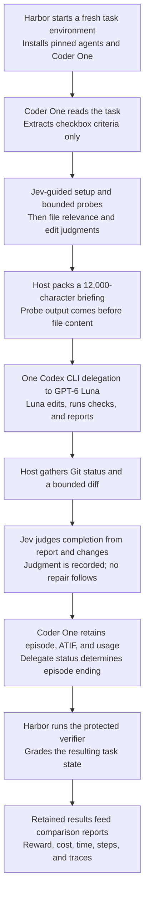
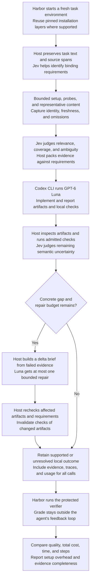

# Coder One upgrade: give Luna evidence for every requirement

Status: assessment and implementation proposal, September 22, 2026.
Reviewed through OpenAgents commit `72ed33efda`. No new inference or
benchmark trial was run for this assessment.

**Build Jev-probe v4 around requirement coverage, compact evidence, and one
bounded repair by Luna.** Keep the zero-Gemini front end and Codex's Luna
executor. Give Jev narrow questions about the evidence an operation needs
and the requirements a result actually demonstrates. Let Rust check concrete
artifacts, preserve missing evidence, and decide whether to finish or repair.

Today's experiments made Luna inexpensive. They did not make it reliably
complete the task. More general instructions to work quickly or check more
carefully have reached a limit: probe v3 passes **19 of 24** trials across
eight tasks, including **zero of three** log-summary trials. The proposed
upgrade addresses the missing information and completion checks behind those
failures before trying to remove more model turns.

This is a Coder One proposal. It does not replace the separate
[Coder Terminal v0.5 design](../coder/design/coder-terminal-v05-algorithm-and-goldens.md).
It implements a small part of that design's requirements-and-evidence model
inside the agent that now has measured Terminal-Bench runs.

## Scope and evidence

The review covers September 22 in `America/Chicago`, through the commit
above: **53 relevant commits**, the harness and Gym readers, Coder One's
implementation and delegate profiles, the runbooks, and the retained results.
The [commit inventory](#commit-inventory) includes the morning harness work
and the later probe experiments, not only the last pull.

The retained tree contains 321 trajectory JSON files and 300 Harbor result
sidecars. I indexed those sidecars and recalculated the six comparison arms
below, joining the episode usage and manifest where present. The
[machine-readable assessment](2026-09-22-luna-jevprobe-assessment.json)
contains the per-task aggregates, source paths and result-file hashes,
24 v3 closing checks and briefing omissions, and commit inventory.

Use these sources together:

- [Results and trial links](README.md), including its data-problems section.
- [Earlier winning-runs analysis](winning-runs-analysis.md), which records
  the hypotheses that became v2 and v3.
- [Operating runbook](runbook.md), [delegate runbook](coder-one-delegate-runbook.md),
  and [episode contract](../coder/terminal-bench-contract.md).
- [Observed harness resilience](resilience.md) and
  [Gym's evidence reader](../gym/terminal-bench-tui.md).
- [Judge and probe implementation](../../crates/coder-one/src/judge.rs),
  [briefing and delegate implementation](../../crates/coder-one/src/delegate.rs),
  and [episode orchestration/accounting](../../crates/coder-one/src/episode.rs).

The repeated trials ran on the documented x86_64 Linux host. They are not
measurements of this Mac's arm64 Docker VM. Agent time, setup time, and total
trial time have different meanings. Costs below reproduce the historical
rates in the retained records: Luna's operator-supplied token-price estimate,
Jev's input-token estimate, and Claude Code's reported reference price.
They are not subscription bills or a new assertion about current pricing.

## What changed today

The day's work has four distinct results.

**A working measurement path replaced the readiness gaps.** The repository
now pins Harbor 0.22.0, tasks, agent profiles, authentication modes, and Linux
artifacts. The episode adapter checks identity and collects results. The
ATIF observation-field incompatibility found in the earlier audit was fixed
in `f6bf479106`. Oracle/contract samples, cancellation and resume handling,
refusal records, image-state capture, comparison intervals, and Gym's
read-only views are present. They should be reused, not rebuilt for v4.
The resilience samples test contract probes, so they do not establish every
invariant of a future two-delegation Coder One episode.

**The original generate-one-command loop was an expensive explorer.** Coder
One's Gemini/Jev loop, deep survey, cache-stable prompts, and rate-limit
handling established the baseline. The no-Jev ablation also showed that
adding semantic hints at every step does not automatically improve delivery.
Gemini exploration dominated the cheap Luna delegate's cost and delayed the
handoff. Survey-only briefings removed that overhead; the fixed probe battery
then supplied useful environment observations without generation.

**Executor configuration mattered independently of Jev.** The Codex executor
made Luna available. Lean Claude tools, low reasoning effort, and the
five-minute Claude cache reduced the Opus arm's overhead. These are separate
interventions, not evidence that Jev alone caused the entire improvement.
The later v2-plus-five-minute-cache experiment helps separate cache policy
from v3's checking directions. No analogous cache-TTL knob is established
for Luna here.

**Faster Luna attempts sometimes omitted required work.** Probe v2 combined
setup, smaller surveys, larger edit excerpts, and batch directions. It cut
turns but failed all three Cython trials. V3 changed the directions to cover
changed code paths and recovered Cython, while still missing other
requirements. The four added tasks exposed failures hidden by the original
four-task panel. They are now development data, not an unexposed holdout.

The existing `panel` profile contains seven tasks, while the results called
“panel” in today's comparison tables cover four selected tasks. The
four-task `extended` set adds four distinct tasks to those results;
`cancel-async-tasks` is also in the broader configured seven-task panel.
Every new report must list the task IDs, not infer them from the word panel.

## Recomputed results

These figures **sum the per-task means across eight tasks**. For an arm with
three repetitions on every task, total spend across its 24 trials is three
times the displayed cost. Failed graded attempts remain in the cost and time
means. Installation failures that never reached these retained graded
results are discussed separately below.

| Arm | Graded trials passed | Eight-task mean-cost sum | Eight-task mean agent-time sum |
| --- | --- | ---: | ---: |
| Jev-probe v1 → Luna | 18/24 | $0.031807 | 438.2 s |
| Jev-probe v2 → Luna | 17/24 | $0.030656 | 410.2 s |
| **Jev-probe v3 → Luna** | **19/24** | **$0.028550** | **420.2 s** |
| Jev-probe v2 → lean Opus, low effort, five-minute cache | 24/24 | $0.428206 | 191.6 s |
| Claude Code → Opus direct | 24/24 | $1.086252 | 306.4 s |
| Codex → Luna direct | 13/16 | $0.043155 | 577.9 s |

Direct Luna has one trial per original task and three per extended task.
Its task means are descriptively useful, but its 13/16 must not be compared
as though it came from the same repetition plan as 19/24. Three trials per
task also do not establish population reliability for any arm, including
24/24 Opus.

| Task | V1 Luna | V2 Luna | V3 Luna | V3 mean cost | V3 mean agent time |
| --- | --- | --- | --- | ---: | ---: |
| `fix-git` | 3/3 | 3/3 | 3/3 | $0.002855 | 34.2 s |
| `build-cython-ext` | 3/3 | 0/3 | 3/3 | $0.011978 | 163.8 s |
| `headless-terminal` | 3/3 | 3/3 | 2/3 | $0.001930 | 47.7 s |
| `fix-code-vulnerability` | 3/3 | 3/3 | 3/3 | $0.003065 | 29.4 s |
| `cancel-async-tasks` | 0/3 | 1/3 | 2/3 | $0.001529 | 35.9 s |
| `git-leak-recovery` | 3/3 | 3/3 | 3/3 | $0.001454 | 26.6 s |
| `log-summary-date-ranges` | 0/3 | 1/3 | 0/3 | $0.001864 | 25.4 s |
| `sqlite-db-truncate` | 3/3 | 3/3 | 3/3 | $0.003874 | 57.2 s |

The useful target is more verified work at low cost. V3's recorded spend is
$0.085651 for 19 successes, or **$0.004508 per observed success including
failed-attempt spend**. A candidate delivering 24 successes could spend up
to about $0.10819 across those 24 attempts and match that accounting ratio.
This is a descriptive development budget comparison, not an estimate of
independent retries or a claim that tasks have equal difficulty. It gives
room for useful checks and selective repair instead of optimizing a failed
run down to the fewest tokens.

## Findings that determine the upgrade

### 1. Jev currently has no structured requirements for these tasks

`judge::criteria` recognizes Markdown checkbox lines only, clips each to
300 characters, and takes at most ten. Terminal-Bench instructions mostly
use paragraphs, ordinary lists, examples, and exact output paths.

**All 24 v3 Luna manifests have `close.criteria: []`.** The closing call
therefore judges one broad “done” question. It sees the delegate's final
report and a bounded change summary. In a non-Git task directory,
`delegate::changes` supplies a sentence saying changes are not listed;
it does not inspect the generated CSV, database, Python module, or required
output files.

The broad judgment is consequently a poor acceptance signal. A hypothetical
`done >= 0.5` rule on the retained v3 trials would produce:

| Hypothetical decision | Upstream pass | Upstream failure |
| --- | ---: | ---: |
| Accept | 15 | **5** |
| Reject | **4** | 0 |

That rule would accept every observed failure and reject four successes.
Passing vulnerability repairs receive probabilities as low as 0.31; failed
log-summary trials reach 0.67. The current code only records the closing
judgment, so this table describes a proposed gate that **must not be added**.
Changing its threshold does not fix the absent artifact evidence.

### 2. The briefing can pay for content it never sends

Probes append to `state.survey` before surveyed files. `BriefingInputs`
preserves that order, and `Briefing::build` adds whole sections until the
12,000-character cap is reached. There is no joint selection by requirement
coverage or redundancy across probes and files.

In **all three v3 log-summary failures**, the 10,812-character briefing
contains the task and directory/listing probes, but omits every selected log
excerpt. Jev already spent two survey requests judging the 40-file pool.
Its mean cost is about $0.000609, roughly **33%** of that task's total v3
cost. The model needs representative log records to distinguish the severity
field from severity words inside a message; long filename listings have
consumed the space first.

[One retained failure](../../bench/terminal-bench/traces/extended--coder-one-jevprobe3-luna--log-summary-date-ranges/log-summary-date-ranges__XWSKgz5.json)
contains both the exact briefing and the closing state. The
[results analysis](README.md#jev-probe-arms-2026-09-22) reports the observed
parser mistake: counting `ERROR` anywhere instead of the severity field.
The omitted samples are an actionable mechanism to test, not proof that
briefing composition alone caused the failure. Direct Luna passed all three
log-summary trials; v2 passed one, so neither the model nor the task is
categorically incapable.

There is a second capacity mismatch: v2/v3 can select a 16,000-character edit
target for a 12,000-character briefing. All three v3 vulnerability manifests
omit `bottle.py` as a 16,038-character section. Those trials still pass,
but paying to select an impossible-to-fit section provides no demonstrated
benefit. A larger cap alone would increase cost and leave duplicate evidence
and completeness problems unresolved.

### 3. Completeness and freshness are asserted more strongly than observed

Both v2 and v3 directions say that gathered files and outputs are complete
and current and must not be read again. The implementation clips probes,
excerpts, and the task supplied to Jev; it may omit entire briefing sections.
Some clip markers survive, but a single instruction cannot establish that
all retained material is complete or still valid after an edit.

The existing builder can also clip the task's tail when the fixed briefing
budget cannot hold it. Logging that omission does not preserve the omitted
requirement for the executor. V4 must make mandatory task text and its
coverage explicit, and permit a targeted expansion whenever evidence is
partial, missing, or stale.

### 4. “Check more” needs a concrete artifact and a counterexample

Today's failures identify useful **development regressions**:

| Failure | Evidence available today | What a general mechanism should do |
| --- | --- | --- |
| V2 Cython aliases | The analysis reports an unchanged `np.int` or a doubled replacement such as `np.int6464`; v3 recovers 3/3 | Bind checks to the changed symbols and affected behavior; check a bulk transformation for omissions and double application. |
| V3 headless terminal | One failed trial; the analysis reports missing `/app/vim.txt` | Preserve exact deliverables from the task and inspect their current existence/content before declaring local completion. |
| Log summary | All v3 trials fail; selected log content is omitted; the analysis reports substring severity matching | Supply bounded actual records, distinguish a field from message text, and test a synthetic line with a misleading severity word in its message. |
| Async cancellation | V3 still fails one of three | Capture task requirements and candidate behavior around pending/running work, exceptions, and cleanup; use targeted behavioral checks instead of a generic completion probability. |

Do not add task-ID branches that encode these solutions or read the protected
verifier during an episode. Generate or select checks from the public task,
workspace, and observed candidate. The exact cause of the remaining async
failure is not established by the checked-in final report; its command stream
and verifier diagnostics should be retained before assigning one.

### 5. Setup dominates the measured end-to-end latency

Across v3 Luna's 24 retained trials, mean agent execution is **52.5 s**, mean
agent installation/setup is **273.1 s**, and mean whole-trial elapsed time is
**353.3 s**. Agent setup accounts for **77.3%** of that elapsed time. These
are arithmetic means over the trials, not the wall duration of the parallel
campaign.

The runbook records concurrent-install setup timeouts and reruns. Reducing
Luna's turns is still useful, particularly on Cython, but it will not by
itself make this benchmark workflow fast. Prepare and reuse pinned agent
installation layers where Harbor supports it, retain a fresh task workspace
per attempt, and report cold and warm setup separately. Never reuse mutated
task state or a previous answer as a fresh repetition.

The setup failures moved to `failed/` are not represented in the 24 graded
attempts above. New comparisons need both the graded-task denominator and
all scheduled-attempt/setup overhead. Do not advertise the graded-only
aggregate as the campaign's complete wall time or spend.

### 6. Some causal evidence still lives outside the committed bundle

The checked-in traces preserve Jev requests, answers, exact briefings, final
reports, and summary metrics. The episode manifests also name native
`delegate-1.stream.jsonl` files and artifacts, but the retained trace tree
contains **no native delegate stream files**. The retention instructions
copy a trajectory and three sidecars, not the complete episode closure.

That is sufficient to reproduce the aggregate numbers and briefing omissions.
It is insufficient to independently replay every claim about the delegate's
commands or exact failed artifact from this checkout. V4's diagnostic subset
should retain sanitized native events, selected artifact bytes/diffs, and
verifier diagnostics, with digests and explicit missing-file status. Reuse
Gym's evidence-health reporting. Do not silently present copied manifests
as proof that all referenced files were retained.

## Current system: Jev-probe v3 with Luna

This is the measured `coder-one-jevprobe3-luna` path. Other Coder One
configurations can explore before delegation or use another delegate; this
path goes directly from Jev-guided preparation to one Luna delegation.

All 24 retained v3 Luna trials had empty checkbox criteria. The completion
judgment does not trigger independent artifact checks or another Luna turn.
The diagram distinguishes the episode ending from Harbor's task grade:
neither a successful delegate exit nor Jev's confidence establishes a pass.
The retained results also have the evidence gaps described above, including
native streams referenced locally but absent from the committed bundle.

## Proposed v4 behavior

Keep the same Harbor and Codex/Luna integration. Add requirements tied to
the original task, evidence selected for those requirements, and host checks
that can justify one bounded repair:

Both paths reach protected grading, including an unresolved local outcome.
Local checks guide the repair; hidden verifier results never enter its
briefing. The repair has no loop back to another repair and remains within
the episode's remaining budget. The proposed evidence retention includes
the sanitized native events and artifact references needed to inspect what
actually happened.

An optional, separately measured configuration may escalate unresolved work
to lean Opus v2 with the five-minute cache. The first v4 comparison should
remain **Luna plus Jev**, so an Opus handoff cannot hide whether the proposed
changes improved the requested combination.

### A. Build requirements from source spans, not just checkboxes

Code splits the public task into identified paragraphs, list items, code
blocks, and table/example blocks. Preserve original bytes, order, and a
content digest. Extract exact paths, named commands, formats, and explicit
constants mechanically where unambiguous.

Ask Jev a batch of independent judgments about candidate spans: does this
span state a binding deliverable, behavior, constraint, or validation
instruction? Is a nearby example illustrative or explicitly exhaustive?
Include the surrounding text needed to resolve the relationship. Keep
uncertain spans available; absence of a positive judgment is not permission
to discard task text. Bound candidate construction and report incomplete
coverage instead of pretending a truncated candidate list is complete.

The host records a requirement map with:

- Stable requirement ID and verbatim source-span references.
- Requirement kind and any exact artifact path or named command.
- Evidence needed and admitted check method, if known.
- State: `unobserved`, `observed`, `contradicted`, or `unverifiable`.
- Artifact/evidence identity to which each observation applies.

The map is an index into the instruction, not a model-written replacement
for it. Reserve space for mandatory text before optional evidence. If the
full instruction does not fit, use a verified accessible instruction artifact
with explicit reading/coverage requirements or refuse dispatch; do not
silently drop its tail.

### B. Replace the survey dump with evidence selected for a purpose

Continue using cheap deterministic probes. Give each capture a typed record:
source, command/exit, path, byte/line range, content digest, truncation, capture
time, and requirements it may inform. A path listing and a source excerpt
must not be treated as interchangeable “files.”

Deduplicate overlapping `find`, `ls`, and named-path listings. Present a compact
inventory and expand selected entries when needed. For data-processing tasks,
include representative records and structural variation rather than full
files or a long filename list. Preserve raw observations for expansion.
A sample informs the parser; it never replaces processing the complete input.

Use Jev to judge whether each shortlisted piece of evidence helps resolve a
specific uncertainty, and whether a proposed compact view preserves the
relevant distinction. Code already knows whether a read succeeded, bytes were
omitted, a file is stale, or an output exists; do not pay Jev for those facts.

Packing order should be:

1. Task authority and requirement map.
2. Exact named interfaces, schemas, or representative records needed to act.
3. Current error/diagnostic and relevant source spans.
4. Compact environment facts and optional navigation hints.

Rank across probe and file candidates together. Reserve coverage for distinct
requirements, remove redundant candidates, and select spans that fit the actual
remaining budget. Avoid selecting 16,000 characters for a 12,000-character
packet. Name every omission and keep an expansion route. Replace the blanket
“complete/current; do not read again” direction with item-specific freshness
and coverage metadata.

The first implementation can retain the existing total briefing cap. Measure
what it packs before changing the cap. Avoid a mandatory 40-file content
survey when deterministic targeting and a small set of diverse captures
already supply the required evidence.

### C. Keep Luna's implementation turn broad, but make its result inspectable

Preserve the zero-step Gemini explorer, pinned Codex CLI, and Luna model.
Luna can still batch independent edits and related build commands. Avoid a
universal minimum-turn target: a missing artifact or unchecked transformation
is not an efficiency improvement.

Alongside the candidate, ask Luna to write a bounded structured local report
that links each requirement to artifact paths and checks it attempted.
Validate that report in Rust. Treat its claimed results as claims until the
host observes the referenced files and command outcomes. Integrate report
production into the existing delegate episode rather than inserting a
separate planning-model call before every task.

### D. Turn completion into artifact checks and a bounded repair

After delegation, inspect named outputs even when the working directory is
not Git. Start with small reusable check types: existence, file type, parseable
format/schema, explicit required rows/keys, named public tests, and exit/status
observations. Mechanical checks establish exactly what they test; a CSV with
16 rows can still contain incorrect counts.

For semantic gaps, give Jev the requirement, candidate evidence, and actual
check output. It can identify unsupported claims or select an applicable
check from a bounded catalog. It must not infer a passing test from a final
summary, choose from hidden verifier answers, or turn a probability into
execution authority. New commands still pass the host's scope, effect, and
budget policy.

When a concrete contradiction or missing artifact is found, issue **at most
one Luna repair in the initial experiment**. The repair brief contains only
the unresolved requirement, current artifact identity, diagnostic or
counterexample, relevant source spans, and remaining budget. Recheck affected
requirements after changes; evidence for an earlier artifact cannot certify
the repaired one.

Use native Codex session continuation only after verifying the pinned CLI's
behavior, trace identity, and usage accounting. Otherwise use an explicitly
recorded fresh repair session with the delta brief. Do not restart the
original task invisibly. A repair consumes the original episode's remaining
wall/call/spend budget; it is not another full 600-second allowance.

The host reports separate states for delegate exit, local checks, unresolved
requirements, and the later Harbor reward. Harbor's protected verifier runs
when the episode is over. It is never a feedback oracle for that episode's
repair policy.

### Worked example: log processing without a task-specific solution

For a task that asks for severity totals by date, code retains the instruction's
reference date, required CSV structure, and input/output paths as source-bound
requirements. A bounded probe reads representative actual records and reports
which files and ranges it sampled. Jev judges which captures distinguish the
record's severity field from its message; it does not count the full dataset.
The briefing gives Luna those captures and explicitly says the input sample is
partial. Luna still implements the parser and processes all required files.

A local behavioral check can exercise a synthetic record whose severity is
`INFO` but whose message contains `ERROR`, using the task's observed record
format. The expected semantic result is one INFO event and no ERROR event.
That expectation comes from the public requirement to count the severity field,
not the protected verifier's aggregate totals. Code checks the produced counts.
If they disagree, Luna's repair brief names that counterexample and the current
parser artifact; it does not rerun the whole discovery process.

Checks generated by the same model can repeat the implementation's mistake.
Prefer independently specified mechanical or metamorphic checks where possible,
retain how each expectation was derived, and label remaining semantic coverage
unknown. A local pass still does not replace Harbor's protected grade. This
example is a proposed development check, not a rerun of the failed trial.

### E. Keep Jev fast by giving each judgment a consumer

The live TypeSafe [state contract](https://docs.typesafe.ai/concepts/state),
[building guidance](https://docs.typesafe.ai/concepts/how-to-build-with-system-one),
and [cascade cookbook](https://docs.typesafe.ai/cookbooks/sde_cascade), retrieved
September 22, support this decomposition: explicit evidence, independent
questions batched together, and code that controls the next operation.
The cookbook's thresholds and results do not calibrate coding-task completion.

| Judgment | Input | Typed output | Consumer |
| --- | --- | --- | --- |
| Binding requirement | Source span and surrounding task text | Noul for each independently relevant kind | Preserve/index requirements; uncertainty keeps the source visible. |
| Useful evidence | Requirement, known observations, candidate capture | Noul for relevance or a Score with concrete coverage levels | Host chooses nonredundant spans under its budget. |
| Next evidence operation | Unresolved distinction and eligible probe/check descriptors | Choice including `none` and `insufficient_evidence` | Host may run only a permitted operation. |
| Claimed result supported | Requirement, exact artifact excerpt, observed checks | Separate Nouls for support and contradiction | Host retains unsupported work and decides whether bounded repair is eligible. |

These are question designs, not production-calibrated policies. Put all
meaning in the instructions/state; question IDs are not visible to Jev.
Do not make one answer depend on another answer in the same batch. A second
call is justified when new evidence or a changed candidate creates a new
state. Cache a judgment only for the same state digest, question-set digest,
model identity, and policy context.

Do not promote the existing 0.5 relevance floor or 0.8 edit floor into a
completion threshold. Label replay cases by missing evidence, wrong semantic
judgment, packing error, checker error, and service failure. Fit or choose
policies against those costs on development cases, then freeze them for
confirmation. Unavailable Jev falls back to explicit unknowns and deterministic
checks; it must not authorize setup or imply success.

## Implementation plan

Implement in reviewable increments, each with an artifact and a stop condition.
Suggested new module names below are proposals, not existing APIs.

| Increment | Files and responsibility | Completion evidence |
| --- | --- | --- |
| 0. Freeze measurements | `bench/terminal-bench/`, retained evidence, results reader | Repeatable extraction of the tables above; failed/setup attempts separately counted; small diagnostic bundles with resolvable streams and artifacts. |
| 1. Requirement and capture records | New `crates/coder-one/src/requirements.rs` and `evidence.rs`; replace the checkbox-only dependency in `judge.rs` | Prose, ordinary lists, paths, examples, and overflow have explicit coverage; captures retain completeness and source identity. |
| 2. Evidence packing | `judge.rs`, `state.rs`, and `delegate.rs` | Joint probe/file selection; no required item silently clipped; actual records displace duplicate listings; stable explicit missing/stale states. |
| 3. Artifact checks | New `checks.rs`; `episode.rs` and `judge.rs` | Host-observed checks work in non-Git directories; Jev receives evidence, not just a final report; local outcome remains separate from Harbor reward. |
| 4. One repair | `delegate.rs`, `episode.rs`, `record.rs` | A second recorded Luna dispatch receives a delta brief; changes invalidate old check evidence; cancellation and remaining budgets hold across both dispatches. |
| 5. Accounting and comparison | `episode::usage`, `delegate_usage`, `tbench/coder_one.py`, profiles, Gym views | Aggregate every delegate/repair and its Jev calls; unknown charges remain unknown; manifests and trace counts identify all attempts. |
| 6. Setup performance | Harbor adapter/install layer and runbook | Exact agent versions reused without task-state reuse; cold/warm and failed-setup time retained. Measure separately from algorithm changes. |

The current `delegate_usage` reader already sums all recorded delegation
calls; reuse that aggregation. Its displayed model, credential, and provenance
come from the first call, so retain per-dispatch identities before supporting
heterogeneous escalation. Test two-dispatch accounting, including cumulative
versus incremental Codex token totals. Keep `turns` labeled correctly: today's Codex
counter counts completed items, not API calls. Do not compare it directly
with Claude's turns as a common model-invocation count.

Also replace v2's raw setup-command execution boundary while touching this
path: it currently selects inline command strings with Jev and executes them
through `bash -c`. Extract supported setup operations into validated typed
arguments, enforce target scope and budget in code, and preserve ordered
dependencies. Jev can judge usefulness; it cannot grant permission. Do not
parallelize dependent clone/install/build work or replay an already observed
effect after a crash without reconciliation.

Use a distinct v4 profile/configuration identity instead of assigning another
meaning to `CODER_ONE_PROBE_V2`. Keep the historical v1/v2/v3 arms pinned and
runnable. No TypeScript, new agent service, training system, or full protocol
implementation is required for these increments.

## Evaluation and adoption plan

### Offline checks first

Use retained **public** task instructions and briefing captures to test
requirement coverage and packing, with synthetic variants for counterexamples.
Do not treat offline replay as an observed improvement in task reward.

Required cases include:

- Ordinary prose with an exact output path, including a requirement near the
  end of a long instruction; no checksum-only retained content.
- Several duplicate listings competing with a small essential data sample.
- An oversized selected edit file that needs a span or explicit expansion.
- A log record whose message contains a different severity than its field.
- A missing named output despite a confident final report.
- A bulk replacement applied twice, and a check that covers only one example.
- A changed artifact after a passing check, a non-Git directory, and unreadable
  or truncated evidence.
- Jev refusal, absent usage, a cancelled repair, and a second delegate whose
  usage must be added without counting cumulative totals twice.

Use the pinned Rust toolchain and the repository's manual verification gate
for implementation changes. Run targeted Python adapter/schema checks as
well. This assessment changes documentation only and does not require that
Rust gate.

### Live experiments that can isolate the gain

Hold task/image pins, Codex/Luna versions, reasoning effort, auth mode,
time/resource allowances, and setup/cache policy constant. Use fresh task
state and interleave arms on the same host. Save resolved configuration and
binary digests; profile names alone do not establish equivalence.

| Arm | Question it answers |
| --- | --- |
| V3 Luna, unchanged | Repeated control for the current behavior. |
| V3 with honest completeness directions only | Does removing the prohibition on necessary rereads help by itself? |
| Deterministic requirement-aware packing, same directions | How much do deduplication, source coverage, and mandatory evidence help without new semantic selection? |
| Same packing plus Jev selection | Does Jev add value over the deterministic candidate builder? |
| Same plus host checks, repair disabled | Which failures can checks detect before Harbor runs, and what do they cost? |
| Same plus one Luna repair | Does detected missing work become verified task success at acceptable added cost/time? |
| Optional v4 with Opus escalation | Separate quality/latency tradeoff; not evidence for a pure Luna improvement. |

Do not change all these surfaces in one unablated v4 profile. Screen the
smaller changes with replay and a bounded live budget before expanding.
Fill direct Luna's missing repetitions if it is used as a controlled baseline.
Keep the current lean Opus five-minute-cache arm as a quality/latency reference.

Run the eight exposed tasks as development regressions, with a frozen initial
schedule of five fresh repetitions per finalist/control task. This is an
initial measurement budget, not a statistical power claim. Report the trial
matrix and uncertainty; choose any expansion rule before seeing its results.
Then reserve an unexposed task set spanning data parsing, async behavior,
artifact delivery, repository recovery, and build repair. Freeze the algorithm
and policy before confirmation. Reusing today's extended set cannot establish
held-out improvement.

### What to measure and when to adopt

The primary outcome is upstream verified completion with all scheduled
attempts accounted for. Report graded outcomes and infrastructure failures
separately, plus per-task results. Locally predicted completion and the
protected verifier's reward must remain separate fields.

Measure:

- All-attempt spend and spend per observed verified success, including Jev,
  both delegates, failed calls, and separately labeled setup/infrastructure
  accounting. Preserve unknown coverage and price provenance.
- Agent wall time, full trial time, setup time, p50/p95 when the sample permits,
  and tail time from repair/escalation.
- Requirement extraction coverage against human-labeled public instructions;
  useful captures actually delivered; omissions, expansions, duplicate bytes,
  and discarded Jev-selected evidence.
- Check false accepts/false rejects, unsupported completion claims, repair
  trigger precision, recovered failures, and repairs that break a passing
  candidate.
- Calls by kind and actual Codex completed-item counts, with their semantics.

A successful development candidate should resolve the demonstrated log,
missing-artifact, and cancellation regressions without regressing the five
currently stable task families. A 24/24 rerun of the old sample would be a
useful regression check, not sufficient adoption evidence. Promotion requires
the frozen confirmation comparison to support the chosen reliability and
cost/time tradeoff; record inconclusive or negative results without moving
the goalposts.

Do not require the same configuration to beat both Luna's minimum cost and
Opus's minimum time before accepting a useful upgrade. Offer an economical
Luna policy and, only when justified, a separately priced faster policy.
Any escalation must fit the operator's budget and deadline; a timeout alone
is not evidence that a different model will fix the problem.

## Recommended next change

Start with **requirements plus honest, compact evidence packing**. It is a
bounded change with direct retained evidence: empty criteria, discarded log
samples, oversized edit sections, and completeness instructions contradicted
by the capture limits. Re-run the current Luna executor unchanged.

Then add host-observed artifact checks and one repair. Reuse the current
closing Jev call for narrow evidence questions where they are useful, instead
of adding an ungrounded approval probability. This lets Luna keep doing the
expensive reasoning while Jev helps code supply the right information and
identify precisely what remains unresolved.

## Commit inventory

The following commits are the day's Terminal-Bench/Coder One changes through
the reviewed head, plus the directly preceding task-selection/design work.
Titles are retained so the scope can be checked against Git. Changes to the
broader repository unrelated to this work are outside this inventory.

| Time (CDT) | Commit | Change |
| --- | --- | --- |
| 00:28 | [36fc742e5b](https://github.com/OpenAgentsInc/openagents/commit/36fc742e5b63538907f7919caf4aaa055fea3845) | docs(coder): match Terminal-Bench tasks to recent chat work |
| 00:44 | [624480405c](https://github.com/OpenAgentsInc/openagents/commit/624480405c60eb74abf7a5635ed02d58bc67de60) | docs: propose Coder v0.5 algorithm and golden traces |
| 09:40 | [e4542628f7](https://github.com/OpenAgentsInc/openagents/commit/e4542628f7bf4a8c8231c7fd537803fa5fce5256) | bench: pin the Terminal-Bench harness for issue 9530 |
| 09:42 | [f6bf479106](https://github.com/OpenAgentsInc/openagents/commit/f6bf479106565b81324a330f950ed4f4b30a13ce) | atif: put observation metadata under extra for Harbor |
| 09:43 | [9e8dcae67d](https://github.com/OpenAgentsInc/openagents/commit/9e8dcae67dcc6f5ba2f88ed29cea42b6ffbcbf9b) | docs: add the Terminal-Bench runbook and v0.5 episode contract |
| 09:48 | [343fe6f5b0](https://github.com/OpenAgentsInc/openagents/commit/343fe6f5b067f8b61e1c9e70774208dfb2faa05d) | bench: retain pins in attempt records and add a real oracle sample |
| 09:57 | [8dd69eaff4](https://github.com/OpenAgentsInc/openagents/commit/8dd69eaff48a3fed23699c23f7bb9d6901587746) | bench: prove the v0.5 episode contract end-to-end on real trials |
| 10:17 | [9fe42cb1d0](https://github.com/OpenAgentsInc/openagents/commit/9fe42cb1d0f18b81d38883333e06f216e4edf766) | bench: keep auth selectors host-side and pin per-mode models |
| 10:50 | [90e8133eaa](https://github.com/OpenAgentsInc/openagents/commit/90e8133eaa73b9c40f50c16036893f86b0aedeb8) | bench: add a devin agent profile |
| 11:01 | [4872529f92](https://github.com/OpenAgentsInc/openagents/commit/4872529f925a5ebec0c4f20d29347f20c01c8435) | docs: document Claude OAuth and Devin auth in the bench runbook |
| 11:12 | [05c85f88e2](https://github.com/OpenAgentsInc/openagents/commit/05c85f88e2ec707ccf25bcc28dc434d25a439570) | bench: pin claude-code to fable-5.1 |
| 11:47 | [0de24c0c65](https://github.com/OpenAgentsInc/openagents/commit/0de24c0c6593483f7361759043caa9b5117ce82c) | Preserve Terminal-Bench ATIF traces and analyze agent behavior step by step |
| 12:33 | [65a1bb46ba](https://github.com/OpenAgentsInc/openagents/commit/65a1bb46ba5b066292431dcf7c6631c169ca7165) | coder-one: add the crate for a minimal Jev-steered agent |
| 12:52 | [3344e6b277](https://github.com/OpenAgentsInc/openagents/commit/3344e6b277048b996fbf4c9835aabbae727f1ebc) | coder-one: run the loop live from an issue to a draft pull request |
| 13:32 | [cb6968b9fa](https://github.com/OpenAgentsInc/openagents/commit/cb6968b9faa6eb50a352bc921a822d64978d4182) | coder-one: run as a Terminal-Bench arm through the episode contract |
| 13:42 | [f02a27ec88](https://github.com/OpenAgentsInc/openagents/commit/f02a27ec88632123dc00e3ac8449121f7cb15004) | docs: add the single Terminal-Bench results page |
| 13:47 | [e6bc060487](https://github.com/OpenAgentsInc/openagents/commit/e6bc0604871e7b9391c20abd987d11537918d698) | docs: record Coder One passing build-cython-ext |
| 13:49 | [5d4f474854](https://github.com/OpenAgentsInc/openagents/commit/5d4f474854f2da65c0628fe8e607ccb7e9f3480b) | bench: add a Claude Code on Opus 5.5 arm |
| 13:53 | [1afdd31a5d](https://github.com/OpenAgentsInc/openagents/commit/1afdd31a5da87ea94f65e1c556a29eb91bd92c0e) | docs: add Claude Code on Opus 5.5 to the Terminal-Bench results |
| 13:57 | [e516646aad](https://github.com/OpenAgentsInc/openagents/commit/e516646aad58ac5d785af0074602e3c813dbaac1) | bench: add Codex arms for GPT-6 Astra, Sol, and Luna |
| 14:09 | [9d7f081dc0](https://github.com/OpenAgentsInc/openagents/commit/9d7f081dc05115c8d71a15902ebca8587db0317f) | coder-one: add delegate mode with Jev-prepared briefings for Claude Code |
| 14:10 | [c357f1dc9c](https://github.com/OpenAgentsInc/openagents/commit/c357f1dc9c19c418286b149bb3790b207ce3be83) | coder-one: cache-stable prompts and a deep Jev mode |
| 14:13 | [9f31630ac6](https://github.com/OpenAgentsInc/openagents/commit/9f31630ac600b15e0217c89012438c68f16c5807) | coder-one: wait out the free lane's rate limit instead of giving up |
| 14:17 | [d9599a9dba](https://github.com/OpenAgentsInc/openagents/commit/d9599a9dba7f7c2caf17ff65b1a6af66060c2a43) | docs: record the delegate arms and GPT-6 on Terminal-Bench |
| 14:18 | [91ad664d09](https://github.com/OpenAgentsInc/openagents/commit/91ad664d094d0bf993667e33295070c14af34817) | docs: price the GPT-6 trials with cached-input rates |
| 14:21 | [1b77501587](https://github.com/OpenAgentsInc/openagents/commit/1b77501587169ff4d5cf93cae8f0f1a08a9e96f3) | docs: rank each Terminal-Bench task's trials from cheapest up |
| 14:27 | [e464b4e0f5](https://github.com/OpenAgentsInc/openagents/commit/e464b4e0f591ff4ff3c491a83e6436f3e0c3c791) | docs: add Terminal-Bench operating notes and a trial metrics tool |
| 14:34 | [1a9c712f15](https://github.com/OpenAgentsInc/openagents/commit/1a9c712f158b88628e07c73f443ae5ec8c41e652) | coder-one: add a Codex delegate executor for GPT-6 Luna |
| 15:10 | [d6626285b5](https://github.com/OpenAgentsInc/openagents/commit/d6626285b583ac6665b387874398d97b6c0276e3) | coder-one: brief a delegate from the Jev survey alone |
| 15:11 | [e8bb753094](https://github.com/OpenAgentsInc/openagents/commit/e8bb75309411a19eb2d4bd68fdfa9d8b8b90de9b) | tbench: survive cancellation and resume, record image state, add intervals |
| 15:11 | [a63716e418](https://github.com/OpenAgentsInc/openagents/commit/a63716e418d9f1f8236493630b483f1329a08775) | docs: record the Terminal-Bench failure demonstrations |
| 15:17 | [1f883564aa](https://github.com/OpenAgentsInc/openagents/commit/1f883564aab4ea9f62371f739d5147f135858c9d) | coder-one: count no generation as a known zero cost |
| 15:20 | [60bfb94370](https://github.com/OpenAgentsInc/openagents/commit/60bfb94370ae04838a56f130fcbed868e81abf9f) | docs: four-task Terminal-Bench results and Jev-brief delegation |
| 15:21 | [dfe91a8e4d](https://github.com/OpenAgentsInc/openagents/commit/dfe91a8e4d0264aff82ff137d9124ec363fe203b) | coder-one: let a delegate run a lean Claude Code |
| 15:31 | [93fa6710ed](https://github.com/OpenAgentsInc/openagents/commit/93fa6710ed184491291cddd20164b2b34ffbb5a3) | Connect Gym terminal to Terminal-Bench evidence |
| 15:39 | [1b490383d8](https://github.com/OpenAgentsInc/openagents/commit/1b490383d87e4190e36c2eb466a05c27d263649e) | docs: repeat the Opus comparison three times and add lean Jev-brief |
| 15:43 | [ae845863d4](https://github.com/OpenAgentsInc/openagents/commit/ae845863d4e29a241d1c58ea97196c4f08359801) | Expose Terminal-Bench evidence and runs from Gym CLI |
| 15:55 | [5cb5df22e0](https://github.com/OpenAgentsInc/openagents/commit/5cb5df22e00d5c16a7556cfa24f82110e321708e) | Distinguish absent collection marker from missing evidence |
| 16:01 | [b2d101d72d](https://github.com/OpenAgentsInc/openagents/commit/b2d101d72ddcf08901a8099f95c3b4e6731ec91b) | coder-one: let Jev choose from a probe battery before delegating |
| 16:02 | [774c2a9340](https://github.com/OpenAgentsInc/openagents/commit/774c2a9340a27e8688b738f3039629cdd9f9e35a) | coder-one: let a delegate run at a chosen reasoning effort |
| 16:08 | [153c974bc8](https://github.com/OpenAgentsInc/openagents/commit/153c974bc87bd087b61bade9362b77e298116d6a) | bench: add low-effort Jev-probe arms |
| 16:22 | [76a652613e](https://github.com/OpenAgentsInc/openagents/commit/76a652613ec7dbbe69dcdc5227c80460b7d8d9f6) | bench: add Jev-probe arms delegating to Sonnet 5 and Haiku 4.5 |
| 16:30 | [55f5b4fb90](https://github.com/OpenAgentsInc/openagents/commit/55f5b4fb9000a54824bdfeabf3ea27b1a88f8255) | docs: explain how Claude costs are computed on the results page |
| 16:35 | [f030f31697](https://github.com/OpenAgentsInc/openagents/commit/f030f31697b814a21657eb5b95369a71cf6d811e) | bench: add an extended profile of four unseen tasks |
| 16:37 | [46fd94bf74](https://github.com/OpenAgentsInc/openagents/commit/46fd94bf7480d8977a1da4b8ff0511747db921ea) | docs: analyze the cheapest and fastest Coder One runs |
| 16:37 | [7a74053040](https://github.com/OpenAgentsInc/openagents/commit/7a7405304023960c8ef101c20cff12bf45fe85a9) | docs: correct Opus direct's exploration count in the analysis |
| 16:40 | [03401dad74](https://github.com/OpenAgentsInc/openagents/commit/03401dad748371423c81f7a434c4543492df27f3) | coder-one: add Jev-probe v2 behind CODER_ONE_PROBE_V2 |
| 16:45 | [49b06a936d](https://github.com/OpenAgentsInc/openagents/commit/49b06a936db245432e24b6e2ab5fd827f19ef102) | docs: capture the system prompt Claude Code sends as the Opus delegate |
| 17:38 | [05adbaed76](https://github.com/OpenAgentsInc/openagents/commit/05adbaed76d74e33803ede327f42b4e7067806c7) | docs: record the Jev-probe and probe v2 results on eight tasks |
| 17:39 | [88f47d67b4](https://github.com/OpenAgentsInc/openagents/commit/88f47d67b4059c615aca2bd68deb5172014ffe50) | coder-one: add probe v3 directions and a five-minute cache arm |
| 18:20 | [c5c791ede3](https://github.com/OpenAgentsInc/openagents/commit/c5c791ede3c355e25bb0fd584959760de7f5e3ed) | docs: record probe v3 results on eight tasks |
| 18:21 | [b58a841c4e](https://github.com/OpenAgentsInc/openagents/commit/b58a841c4eed6d60d23a2abc44fd16b359e9a38b) | bench: add a probe v2 Opus arm on the five-minute cache |
| 18:54 | [72ed33efda](https://github.com/OpenAgentsInc/openagents/commit/72ed33efda93434acd082a1ebcb33046edbf90b2) | docs: record probe v2 on the five-minute cache |
