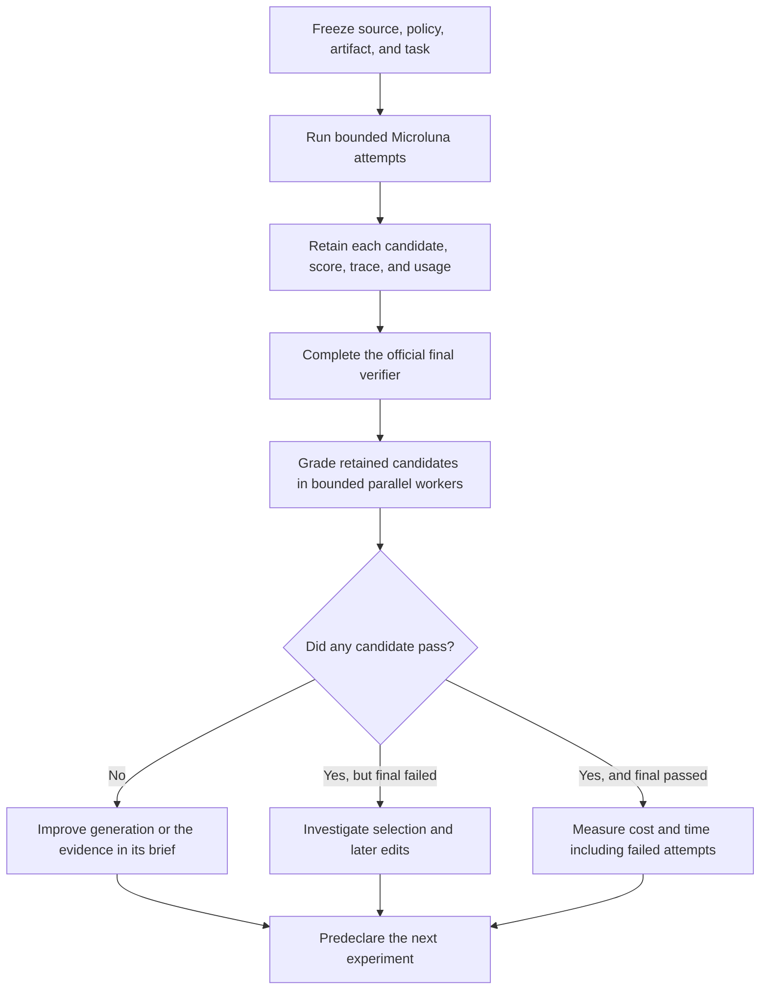

# Faster, observable Microluna iterations

This work addresses [#9592](https://github.com/OpenAgentsInc/openagents/issues/9592),
[#9618](https://github.com/OpenAgentsInc/openagents/issues/9618), and
[#9619](https://github.com/OpenAgentsInc/openagents/issues/9619). It separates
recording an experiment from changing how an agent chooses its answer, and
moves candidate diagnosis out of paid model sessions.

The [protocol and records](../../bench/terminal-bench/experiments/2026-09-24-iteration-speed/README.md)
retain the planned runs, identities, actual costs, and measurement corrections.
This is selected development work. Neither these runs nor repeated work on
`embedding-drift-monitor` establish performance on unseen tasks.

## Retain candidates without changing the policy

The previous [12-attempt experiment](2026-09-24-microluna-candidate-evidence.md)
showed why recording and selection must be separate. Its v12 control passed
embedding twice; the protected treatment passed none. One control pass needed
an editing review to fix a defect while the self-written score stayed tied.
An earlier-tie rule would have discarded that improvement.

`executor.microluna.lean.retain_candidates` now records the generated evaluator,
each sequential candidate, its file-content identity, the score, selection
reason, copy time, and final submitted identity. It does not change tied-score
replacement, edit permissions, stopping rules, or evaluator calls. A snapshot
failure is recorded and does not block the underlying baseline selection.
The existing `protect_candidates` experiment retains its separate behavior.
Both recording modes refuse parallel first-attempt lanes until lane provenance
is implemented.

The final `lean.submitted` record explicitly says
`observed_without_revalidation` and `evaluation_rerun: false`. It identifies
the latest retained workspace matching the submission, when one exists. That
is a content observation, not a new evaluator result or external acceptance.
Identity excludes Git metadata, named cache directories, and Python bytecode;
copy time can still consume a small amount of a wall-clock budget.

The `microluna-v13-retained` profile changes only this recording switch from
published v13. It leaves the separate v15/v16 development line untouched.
Its two regression cases prove that an editing review's tied improvement
remains submitted, even when the second snapshot cannot be written, and that
recording does not introduce a third evaluator invocation.

## Grade candidates after the run

`tbench candidates` discovers completed trials' retained sequential candidates,
checks their recorded identities and the task checksum, copies inputs into an
isolated temporary directory, and invokes Harbor's official verifier. It never
calls a model or sends the grade back to an agent.

```sh
uv run tbench candidates /path/to/trial-a /path/to/trial-b \
  --output /path/to/new-grade-directory --jobs 2
```

Each candidate gets a source record, complete input inventory and digest,
verifier output, elapsed time, and any failure. `batch.json` reports per-trial
oracle headroom: whether any retained candidate passes, separately from the
original trial reward. Missing or invalid evidence produces an unknown oracle
unless a validated candidate already proves a pass. An infrastructure error
is not a failed solution. The CLI returns a nonzero status for invalid evidence
or infrastructure failures, but not for an ordinary reward of zero.

`--jobs` permits one to eight workers; choose a value that fits the tasks'
declared resource requirements and concurrent workloads. `--deduplicate` opts
into reuse within this invocation only. Its key includes all task and candidate
files, directory and file modes, and mount location. Reuse assumes a deterministic
verifier and an unchanged Docker environment. Every reuse names its source;
it is not another independent execution. An incomplete or failed verifier
execution is never reused. There is no persistent grade cache.

The inventory is bounded to 256 MiB and 20,000 entries per task or candidate.
This initial command refuses symlinks and special files, refuses output inside
a task or trial, and refuses any task whose current checksum differs from the
completed trial. These refusals make incomplete evidence visible rather than
silently grading a different input.

The iteration loop separates live execution from diagnosis:



Grades from this diagnostic phase do not enter the completed agent sessions.
A later experiment is development work informed by previous results, not an
independent held-out evaluation of those same tasks.

## Measured grading throughput

The same 12 candidates from the six completed `evidence-v1` trials were graded
serially, then with two workers and explicit deduplication enabled:

| Mode | Verifier executions | Reused grades | Wall time | Invalid grades |
| --- | ---: | ---: | ---: | ---: |
| One worker, no reuse | 12 | 0 | 354.68 s | 0 |
| Two workers, exact-input reuse enabled | 12 | 0 | 285.83 s | 0 |

The two-worker batch used **19.4% less wall time**, a **1.24× throughput ratio**.
All 24 executions used warm verifier images and produced matching reward-zero
results. This confirms the earlier conclusion that those protected runs had no
passing retained candidate. No new model calls were made.

There was no live deduplication saving in this sample. The source files in each
before/after pair matched, but six to eight Python bytecode files differed.
Bytecode can affect imports, so the complete-input key correctly treats these
as different candidates. Unit tests separately prove that genuinely identical
inputs reuse a validated grade and retain both source records, and that failed
executions never become reusable grades.

This is one fixed-order comparison on a shared host. Other benchmark work and
Rust verification ran concurrently; no CPU isolation was imposed. It measures
the observed workflow, not an uncontended maximum or a universal speedup. See
the [comparison](../../bench/terminal-bench/experiments/2026-09-24-iteration-speed/records/grading-comparison.json),
[serial records](../../bench/terminal-bench/experiments/2026-09-24-iteration-speed/records/grading-serial/batch.json),
and [parallel records](../../bench/terminal-bench/experiments/2026-09-24-iteration-speed/records/grading-parallel/batch.json).
The repeated synthetic source copies are omitted from publication; original
candidate bytes remain in the previous experiment's full retained traces, and
each grade includes the input manifest and source path.

## Readable reasoning summaries

The live endpoint accepted `auto`, `concise`, and `detailed`. `auto` resolved to
`detailed` in the returned response at both high and provider-default effort.
OpenAI documents `auto` as requesting the most detailed summary available for
the model. [Reasoning summaries](https://developers.openai.com/api/docs/guides/reasoning#reasoning-summaries)

Nine valid high-effort requests used the same small cache-review task in three
balanced setting orders. These are complete-response latencies and complete
request costs, not isolated summary overhead:

| Setting | Attempts | Mean seconds | Mean usage-valued cost | Summary characters per attempt |
| --- | ---: | ---: | ---: | --- |
| `auto` | 3 | 30.34 | $0.0006261 | 142, 183, 177 |
| `concise` | 3 | 31.26 | $0.0006271 | 492, 72, 172 |
| `detailed` | 3 | 54.50 | $0.0006403 | 255, 110, 157 |

There is no demonstrated gain from replacing `auto` with `detailed`. Three
stochastic attempts cannot establish a latency penalty; response content,
reasoning work, and service variability differ. A summary called `detailed`
can still be short: the retained responses contain lists of bold headings,
including “Checking LRU cache defects,” rather than a full reasoning transcript.
This confirms that those headings come from the provider; the measurement
contains no longer readable reasoning text. The setting does not expose encrypted internal reasoning.

A further three requests omitted effort. The provider chose `medium`, accepted
all settings, and returned readable summaries. The `auto` request took 19.78
seconds, returned 63 summary characters, and cost $0.0002756 by usage valuation.
Microluna previously requested summaries only when its policy set an explicit
effort. It now always sends `summary: auto`, adding `effort` only when specified.
This fixes missing summary requests for default-effort policies without choosing
a different effort for them.

The native transport already preserves `response.output_item.done` events when
the final `response.completed.output` array is empty. Microluna writes their
readable summaries into ATIF. The new Gym regression exposed a separate reader
bug: exported ATIF uses `reasoning_content`, while the native log uses
`reasoning`. Gym previously recognized only the exported field. In a native
step with an ordinary message, it could omit the summary; otherwise it could
fall back to raw JSON. The reader now handles both fields and renders the full
readable summary as Markdown. Regression tests cover empty final output,
multiple summary paragraphs, default-effort requests, and a long summary's last
paragraph in Gym.

The first nine-request probe incorrectly inspected only final response output,
so its zero-character counts are invalid. It also used $0.40/M output tokens
instead of the repository's $0.50/M valuation. Raw records and the original
script remain retained. The corrected ledger recomputes their cost from exact
usage as $0.0054044; the nine valid high-effort probes cost $0.0056804, and the
three default-effort probes cost $0.0008883. Total investigation cost is
$0.0119731, including the invalid measurement. These are token valuations,
not subscription invoices. See the [corrected ledger](../../bench/terminal-bench/experiments/2026-09-24-iteration-speed/records/summary-comparison.json).

## Coordination and verification

Work runs in its own source checkout, Cargo targets, frozen binary, and suite.
Read-only Tailscale checks of coderos's active Claude conversation confirmed
that the other agent owns v15/v16 and the #9597 issue-to-PR retries. No running
agent checkout or process was changed. The remaining live acceptance for
[#9608](https://github.com/OpenAgentsInc/openagents/issues/9608) must be audited
from a completed run; an active retry is not evidence of completion.

The initial scoped pinned-toolchain gate passed formatting, strict Clippy,
and default/feature tests for Coder One and Microluna. The Python candidate
regressions passed. The first broader Python check exposed a missing profile
name in the expected-arm set, which was fixed, plus the existing macOS address
space limit test; Linux verification distinguishes that platform issue from
the new grader's behavior. The first full Rust gate caught the native reasoning-field mismatch through
that new regression. The reader was fixed before publication; both the failed
run and the subsequent verification are retained. Final verification records
accompany publication.
