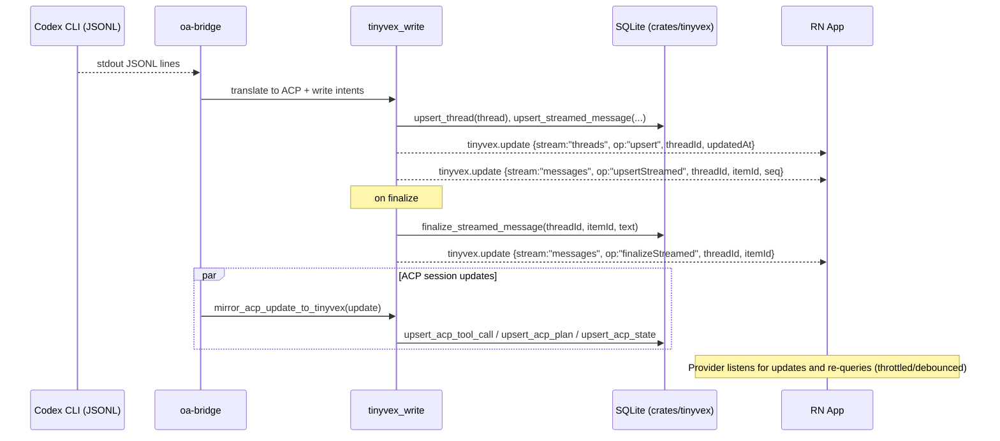

## Tinyvex — Write Paths from Codex/ACP

```mermaid
sequenceDiagram
  participant Codex as Codex CLI (JSONL)
  participant Bridge as oa-bridge
  participant TVX as tinyvex_write
  participant DB as SQLite (crates/tinyvex)
  participant App as RN App

  Codex-->>Bridge: stdout JSONL lines
  Bridge->>TVX: translate to ACP + write intents
  TVX->>DB: upsert_thread(thread), upsert_streamed_message(...)
  TVX-->>App: tinyvex.update {stream:"threads", op:"upsert", threadId, updatedAt}
  TVX-->>App: tinyvex.update {stream:"messages", op:"upsertStreamed", threadId, itemId, seq}

  Note over TVX: on finalize
  TVX->>DB: finalize_streamed_message(threadId, itemId, text)
  TVX-->>App: tinyvex.update {stream:"messages", op:"finalizeStreamed", threadId, itemId}

  par ACP session updates
    Bridge->>TVX: mirror_acp_update_to_tinyvex(update)
    TVX->>DB: upsert_acp_tool_call / upsert_acp_plan / upsert_acp_state
  end

  Note over App: Provider listens for updates and re-queries (throttled/debounced)
```

References
- Implementation: `crates/oa-bridge/src/tinyvex_write.rs`
- Schema and queries: `crates/tinyvex/src/lib.rs`

