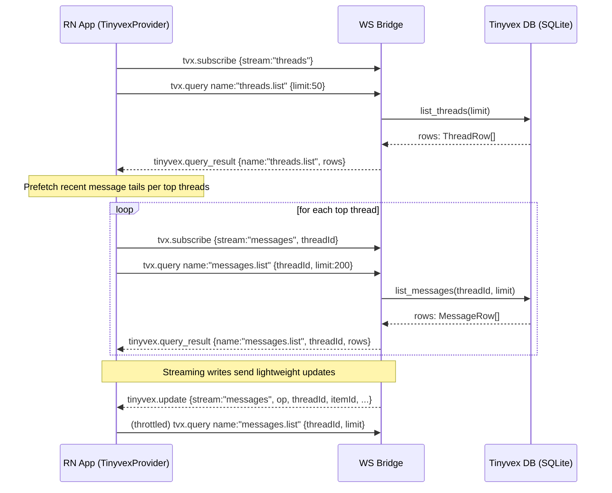

## Tinyvex — WS Bootstrap and Live Updates

Notes
- Control verbs come over the same WebSocket as the live Codex stream.
- Provider logic debounces `threads.list` refreshes and throttles per-thread `messages.list` during streaming.

