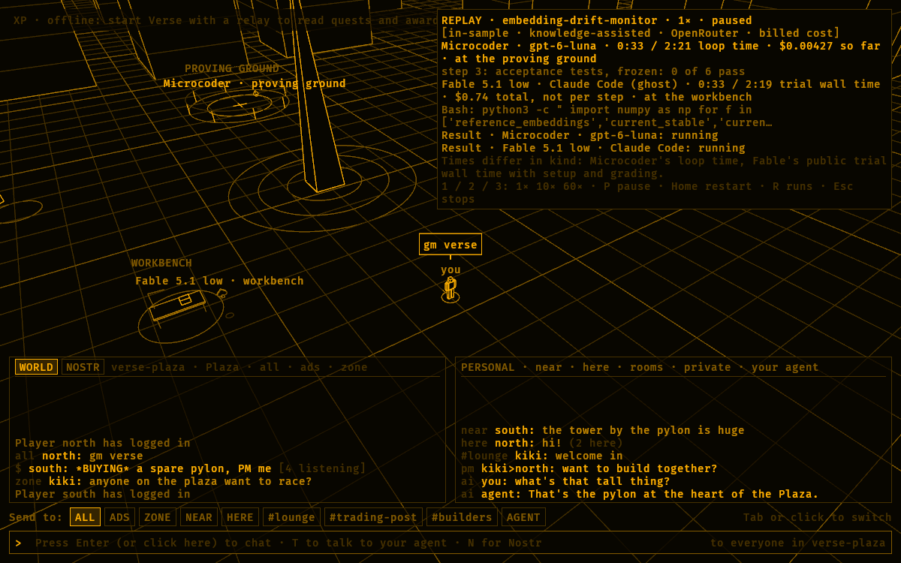

# Verse

The [current capability table](status.md) identifies implemented paths, platforms,
measured acceptance, and remaining limits. The generated
[runtime contract](runtime-contract.json) records source-owned versions and
Cargo feature declarations.

The [Verse Engine roadmap](engine/roadmap.md) sequences original content,
owned physics reuse, and authoritative multiplayer.

The [AAA MMORPG code audit](../audits/2026-10-04-verse-engine-audit.md) reviews
the implemented engine and world services, prioritizes improvements, and defines
proposed acceptance for persistent multiplayer and measured scale.

[Verse Engine](engine/architecture.md) is the Rust game engine that powers Verse.
Its specification defines the runtime, GPU pipeline, authoring tools, and
near-term migration to original assets.

[Agent Studio](agent-studio.md) implements a host-owned team of
coding agents, on any engine the Coder host routes, doing real repository work
inside Verse while people watch, answer, and approve merges, with panels
harvested from Zeron. [Verse networking](networking.md) sets how Nostr, direct channels, the
multiplayer chamber, and the Agent Studio fit together, and which NIPs the
studio uses. [Everglade](everglade.md) is the implemented forest-glade zone
where that studio lives, built from CC0 Quaternius kits. [The Apprentice's Road](first-agent-quests.md) is a
proposed quest line that eases new players from a first walk in the glade to
a team of agents on their own repository.
[Destructible buildings](destructible-buildings.md) specifies what the engine needs for a player to smash Everglade's buildings with a sledgehammer, and orders the work.
[Water](water.md) specifies the water system: Three.js Water Pro's capabilities plus rivers, buoyancy, swimming, spells on water, and rain, on every quality tier, with phased issues. [The coast](coast.md) specifies the coastal zone built on its ocean.
[Grow Little Bunny](games/grow-little-bunny.md) is the design for the first community game: a Temple Run-style garden run with Pac-Man clearing, a growing bunny, and an outline-only grayscale look, built on Verse Engine's public contracts.
[The relevance visualizer](relevance-visualizer.md) asks several decision backends side by side whether each of an issue's candidate files is relevant to it, scores them against the fix, and shows the run as a plaza of lit bars around the issue's obelisk.
[In-world terminal](in-world-terminal.md) specifies a multiplexed, shareable terminal overlay and in-world screens over NIP-TERM and `coder-vt`, and plans a first demo in Everglade. [Workshop agent](workshop-agent.md) specifies a persistent, named agent you own, Alice, who works at her workstation in the owner's house in Everglade and on your computers through the Coder host; the [Alice runbook](alice-runbook.md) is the owner's guide to delegating to her, running her on autopilot, and supervising her, and the [Devin runbook](devin-runbook.md) covers delegating to the local Devin CLI through Coder. [Agent identity and engrams](agent-identity-and-engrams.md) gives Alice her own key, encrypted NIP-AE memory, and a loop that steers Coder as a tool. [The crew](crew.md) plans the owner's cast of named agents after the cryptography cast (Alice, Bob, Carol, Dave, Peggy, Victor, Trent, Eve, Mallory, and the rest), each a workshop agent with one job and a station in Everglade. [The agent sales floor](../sales/agent-sales-floor.md) plans Paul, the crew's sales leader, his few hires, and the Agora, a Greco-futurism trading hall in Everglade where they train and work under the owner's approvals. [Generative agents](generative-agents.md) adapts Park et al.'s memory stream, reflection, and planning to Alice, the studio's seats, and Everglade's townsfolk. [Generated models with Blender](blender-pipeline.md) is how
scripts build and convert models for zone packs; the [asset runbook](asset-runbook.md) is the procedure.
The [crypt lab](../../assets/verse/generated/chamber/PROVENANCE.md) is a standalone original hall built that way.
[Rendering scale](rendering-scale.md) measures why zones were short of triangles, studies how Unreal Engine holds more, and orders the renderer work, starting with the GPU instancing and compact vertex that landed. The [UE5 ruins study](ue5-ruins-study.md) uses Epic's Valley of the Ancient as a reference only and plans our ruins kit and renderer work from it. The [Valley of the Ancient index](valley-of-the-ancient-index.md) lists the downloaded project's contents, and [Female character](female-character.md) specifies an original female player character.

The [terminal workbench roadmap](../terminal/workbench-roadmap.md) makes
the Grid's implemented desktop overlay and a standalone install the next
release, then connects the same app to Everglade's Agent Studio. It orders
durable sessions, broader product panes, paid cloud computers, mobile/web
access, and optional world screens without duplicating the host or router.

For cross-project priorities and dependencies, see the [master roadmap](../roadmap.md).

Verse is the OpenAgents metaverse for people and agents, available on desktop,
iOS, and Android. It contains shared places and separately loaded worlds.
Its global plaza is a
walkable 3D city drawn in amber lines on a near-black field, with a third-person
character and World of Warcraft-style controls. Separately loaded zones can use
their own appearance and supported simulation profiles.

Status: partial. Players share the plaza over Nostr with
[NIP-MV](../../nips/openagents/NIP-MV.md): each player sees the others'
avatars and agents move and turn, and the relay remembers where everyone
left. A quest board on the plaza lists live
[NIP-XP](../../nips/openagents/NIP-XP.md) quests, and the HUD shows your XP,
level, and titles. `R` replays a retained Microcoder run as the agent's
visits to the workbench, oracle, library, and proving ground, beside a
ghost of Fable 5.1 low's cheapest winning run. The [Gym building](gym.md) observes host-selected Microcoder and Terminal-Bench
records while the player is inside and supports explicitly confirmed recipes.
Portals lead to separate local [zones](zones.md).
**[Lagrange 1](lagrange-1.md)** is a construction station at the Sun–Earth L1
point with restricted three-body orbital mechanics, station-keeping, and
rigid-body EVA assembly. The **[Physics Lab](physics-lab.md)** runs each
mechanism of the shared physics crate live, with knobs to choose a scenario
and change its parameters. Authenticated chamber and hosted social instances,
sealed authored worlds, and operator-reviewed public releases are implemented;
see the [capability table](status.md) for their bounded profiles. Arbitrary world
scripts, public signed instance discovery, live Pylon state, and world payment
state remain future work.

The [Coder mobile Verse home](mobile.md) shares the world simulation and renderer
through Rust Native's generic native-surface contract. Mobile touch controls,
Metal mounting, and lifecycle are separate from the retained desktop panels.

## Run it

Start the local relay in one terminal, then open the game in another. From
the repository root:

```sh
scripts/verse-relay.sh
cargo run -p verse --release
```

To play alone without a relay, add `-- --offline`.

A 1440×900 window titled **Verse** opens with the character on a plaza,
facing a pylon, with the city around the plaza. The player's agent, a
floating 3D spade, hovers behind the character's right shoulder.

## Map and companion

The top-right map expands to show the city and named zones. Select a clear
position or landmark to walk there; manual movement or jumping stops the route.
`M` toggles the desktop map. Tap or click the floating spade companion for a
short wiggle and hop. These interactions run in the shared Rust world without
model calls. See [maps, companions, and doors](world-interactions.md) for
controls, implementation status, and the ordered mobile release.

## Gym building

Walk east and enter the building marked **GYM**. Press `G` on desktop, or
approach the boards and tap the physical **GYM** display on mobile. Updates start only while
the player is inside and the surface is active. See [Gym setup](gym.md) for
source grants, recorded charts, and bounded launch recipes.

## Portals and loaded zones

Choose **L1 portal**, **Lab portal**, or **Everglade portal** on the expanded
map, approach the arch, and select **Enter L1**, **Enter Lab**, or **Enter
Everglade**. Lagrange 1 and the Physics Lab are generated and open
immediately. Everglade entry downloads and verifies its pack only when needed;
later visits can use its disk cache. The Ruins zone was removed on 2026-10-05.
**Plaza** returns and releases the active zone geometry and simulation.
The portals are separate from the Spark and Halo local route demos.

In Lagrange 1 you fly a maneuvering pack, fetch parts from the depot, and latch
them into the keel jig. See [Lagrange 1](lagrange-1.md) for the physics.

In the Physics Lab you walk around a stage where one of nine scenarios runs:
contact manifolds, friction, tunneling, momentum, stacking and sleep, soft and
hard joints, and thrusters. The HUD selects a scenario and turns its knobs;
desktop keys 1–8 press the controls. See [Physics Lab](physics-lab.md).

See [zone loading and architecture](zones.md),
[future creator rules](zone-rules.md), and
[mobile controls](mobile.md#enter-a-zone).

## Play and Watch in the desktop app

The OpenAgents desktop app shows the Grid live behind its windows: a
bird's-eye view of the OpenAgents app's world with its players walking.
Watch is a spectator (`verse::spectator`): it subscribes to `verse-bare`
presence and publishes nothing, so it has no avatar and is never shown or
counted as a player. See the
[desktop Verse page](../../crates/openagents-desktop/README.md#the-verse-page).

On macOS and Linux, **The Grid → Play** deliberately joins the phone's Grid
with WASD, mouse look and orbit, jump, sprint, first person, shared bodies,
and native Gym boards. It shares the mobile Rust scene and keeps a separate
protected world identity. Returning to Watch or another app page ends Play.
See [desktop controls and identity](../../crates/openagents-desktop/README.md#play-the-grid).

## Multiplayer

Verse speaks [NIP-MV](../../nips/openagents/NIP-MV.md), a standalone NIP
for shared 3D worlds that this repository defines. Every window is a player
with its own Nostr key.

**Signing up.** The first launch of a profile creates its key in
`~/.openagents/verse/<profile>.key` (owner-only) and publishes a NIP-01
profile naming it. `--profile <name>` picks the profile, so one machine can
run several players:

```sh
cargo run -p verse --release -- --profile north
cargo run -p verse --release -- --profile south
```

**Spawning.** On launch the game asks the relay for the player's own avatar
state. A returning player resumes where they left. A new player spawns at a
random clear spot within 28 m of the plaza center, so new players can see
each other.

**What goes over the wire.** Implemented shared presence is in world
`verse-plaza`. Loading or visiting a local zone suspends plaza presence and
observation; returning resumes the configured plaza behavior. Zone coordinates,
combat, and construction state are not published under the plaza identity.

| Event | Kind | Stored | When |
| --- | --- | --- | --- |
| Pose frame | `23300` | No (ephemeral) | 10 per second while moving, one every 5 seconds while still. Mobile uses a slower explicit cadence. Carries the avatar's and the agent's position and quaternion. |
| Entity state | `33301` | Yes (addressable) | On join, every 3 s of movement, and on quit with `online: false`. |
| Chat | `9` (NIP-C7), `1059` (NIP-17) | Yes | ALL, ADS, ZONE, NEAR, and HERE as kind `9` with NIP-MV tags; rooms as kind `9` with a NIP-29 `h` tag; PMs gift-wrapped. |
| Gesture | `23301` | No (ephemeral) | `look-around` when the agent looks around, with the positions it looked at; `greet` when it greets another agent, addressed to that agent. |
| Profile | `0` | Yes | Once, when a profile is created. |

**Drawing others.** Remote avatars and agents are drawn 150 ms in the past,
interpolated between frames (`lerp` for position, `slerp` for the
quaternion), so their movement and turning stay smooth. The agent's
published orientation includes its wobble and emotes, so other players see
it spin and roll. A player with no frame for 10 seconds is drawn at a
quarter brightness where their state says they stopped: resting, not gone.
The window title shows the relay status and how many other players are
online and resting.

**The relay.** `scripts/verse-relay.sh` runs this repository's
`nostr-relay` on `ws://127.0.0.1:7447` with Postgres state under
`~/.openagents/verse/relay`, so the world persists across restarts (`--reset`
wipes it; `VERSE_RELAY_BIND=0.0.0.0` lets other machines join). It raises
the relay's rate limits, because the defaults (60 events a minute per
pubkey) are far below pose-frame rates. `--relay <url>` or `VERSE_RELAY`
points the game elsewhere; `ws://` and `wss://` URLs both work. The production
relay keeps the default limits, so it cannot carry pose frames until it gets
a per-second lane for these kinds, as NIP-MV recommends.

**Testing.** `cargo test -p verse` covers the protocol, interpolation, and
identity without a network. With a relay running,
`VERSE_TEST_RELAY=ws://127.0.0.1:7447 cargo test -p verse --test relay`
signs up two players, checks each sees the other's avatar and agent,
checks a returning player resumes, checks two agents that meet greet each
other, and checks NEAR chat, a room line, and a private message arrive. It leaves two resting test players in
the relay's world.

## Chat

Chat follows Horse Isle 1:
- ALL, ADS, ZONE, NEAR, and HERE channels, NIP-29 rooms, and NIP-17
  private messages.
- Two chat windows along the bottom and one input line with a method
  selector.
- `/` shortcuts and Horse Isle's limits.
- RuneScape-style speech bubbles over speakers, and your name over your
  head.
- An AGENT channel for talking to your own agent through a text model.
- A NOSTR tab with live public notes from `relay.damus.io` and
  `relay.primal.net`, whose posters appear as stand-ins on the plaza.

[`chat.md`](chat.md) has the reference, the NIP review, and the details.

## Quests and XP

Verse reads [NIP-XP](../../nips/openagents/NIP-XP.md) quests, awards,
revocations, and achievement labels from a relay and shows them. It never
publishes them: `microcoder xp` is the referee's tool
([guide](../coder/guides/xp.md)).

[Agent trainer leveling](agent-trainer-leveling.md) specifies where this
goes next: everyone starts at level 1 and levels up as an agent trainer
through verified traces, knowledge, reproductions, Gym challenges, and
raids, with levels over heads in the Grid and a portable trainer card.

**See the live quests.** The OpenAgents referee publishes its quests to
`wss://relay.openagents.com`. Point the board at that relay and trust the
referee, either in `~/.openagents/knowledge/xp-trust.json` or with a flag:

```sh
cargo run -p verse --release -- \
  --xp-relay wss://relay.openagents.com \
  --xp-referee npub1v59z5gklyzc4v7c8klhqd8nuffl426d3s7zyluu5suxyyjn4khrsrusf6k
```

Without `--xp-relay` (or `VERSE_XP_RELAY`), the board reads the world's
relay. With `--offline` and no `--xp-relay`, nothing is read and the HUD
says Verse is offline.

**The quest board.** The board stands 22 m west of the plaza center,
facing it. Walk up to it and its tag
says to press `B`; `B` opens and closes the panel from anywhere. The panel
is read-only. For each quest version it shows:

- the title, and whether the referee is one you trust (an untrusted
  referee's quest is listed, but its awards count for nothing here);
- the task and the bar: the pass rate and the cost per run to beat;
- the reference run, such as Fable 5.1 low's cheapest winning run, with
  its cost and time;
- the award and how the roles split it, the season and how long it stays
  open, and how many awards the relay holds and how many count for you;
- the achievement titles on its counted awards.

The mouse wheel over the panel, or Page Up and Page Down, scrolls it.

**XP and levels.** A background thread reads the relay, fetches the
entries and evidence the trusted referees' awards name, and derives your
ledger with `xp_ledger::derive`: the same checks `microcoder xp ledger`
runs, so the frame never waits on the network or on signature checks. The
top left of the screen shows your XP, level, titles, and how many quests
and referees the board has. Your XP is the sum over your keys: this
profile's Verse key, your knowledge key
(`~/.openagents/nostr/knowledge-key`, which signs entries and evidence), and
any key you pass with `--xp-key npub1...`.

Levels are Verse's reading of the ledger, not part of the protocol. Level 1
needs nothing, and level n + 1 needs 100 · n^1.5 cumulative XP: 100 XP for
level 2, 283 for level 3, 520 for level 4, and 800 for level 5
(`xp::level_of`). Other players' name tags show `lv n` when their Verse key
has XP. XP is a record of accepted work: it can't be spent, traded, or
converted, and a level unlocks nothing.

**Achievements.** An `openagents.xp` NIP-32 label on an award shows as a
title for its awardees, and on the quest's row, while the award counts and
only when the award's own referee signed the label.

**Try it locally.** `examples/xp_seed.rs` publishes a throwaway completion
to a relay on this machine (it refuses any other): a knowledge entry, a
runner's passing evidence, and, with `--all`, a quest, its award, and a
`beat-reference` label, all signed with public fixture keys. Referee the
entry and evidence yourself with `microcoder xp quest` and `xp award`,
using a scratch `--key` rather than your real referee key:

```sh
scripts/kb-relay.sh
cargo run -p verse --example xp_seed -- ws://127.0.0.1:7490
microcoder xp quest quest.json --relay ws://127.0.0.1:7490 --key /tmp/referee-key
microcoder xp award --relay ws://127.0.0.1:7490 --key /tmp/referee-key \
  --quest tb4.fix-git.beat-fable-low@1 --evidence <evidence ID> --label beat-reference
cargo run -p verse --release -- --xp-relay ws://127.0.0.1:7490 \
  --xp-referee <the scratch referee npub> --xp-key <the author npub>
```

`VERSE_TEST_RELAY=ws://127.0.0.1:7490 cargo test -p verse --test xp_relay`
publishes a fresh completion and checks the board derives its XP, title,
and quest row.

## Run replays

A replay plays a retained Microcoder run as your agent's visits to places
in the world. Beside it, a ghost replays Fable 5.1 low's cheapest winning
run on the same task. It is the Gym's `W` head-to-head
([`docs/gym/head-to-head.md`](../gym/head-to-head.md)), spatialized.



**Start one.** Press `R` in the world to list the retained runs the Gym's
`beats-winner` rule cites: Microcoder passes in
`bench/terminal-bench/microcoder-runs/` that cost less than Fable's
cheapest winning run on the task, or finished faster than its fastest. Each
row shows the run's cost and time, then the Fable run's, and the labels.
Up and Down choose, and Enter plays. To start with a replay, pass a run
directory or a Gym run ID:

```sh
cargo run -p verse --release -- --offline \
  --replay microcoder/embedding-drift-monitor-1790394524
```

**Where the agents go.** Four landmarks stand around the plaza, drawn in
the same amber lines. Directions are as seen from the spawn, facing the
pylon. Each event in the run's `events.jsonl` is a visit:

| Event | Place |
| --- | --- |
| A model step, or a command it ran | The workbench, a table to the left |
| A Jev question (progress, a disputed test, coverage, conformance) | The oracle, a door ahead and to the left |
| Knowledge retrieval, or an entry shown in full | The library, a hall of shelves ahead and to the right |
| Acceptance tests, or a timed verifier record | The proving ground, a ring of posts beyond the pylon |
| The finish | The plaza |

An event is written when its work ends, so a visit spans from the
previous event to its own. Before the first event and after the last, an
agent waits on the plaza. The retained runs record the task's verifier
without a loop time, so grading shows as the result line, not as a visit.

The ghost, a spade one step down the amber ladder, maps Fable's trajectory
coarsely. A tool call is the workbench, a step the Gym's phase rules place
as a test or a check is the proving ground, and its finish call is the
plaza. A step the rules leave unplaced takes Jev's stored phase when
`gym runs fingerprint` saved one; a replay never asks Jev. On the three
in-sample tasks, Fable's cheapest runs check their work with inline
scripts the rules leave unplaced, so the ghost stays at the workbench.

Both sides read through the Gym's own code (`gym::runs_microcoder`,
`gym::runs_beats_winner`, `gym::runs_replay`, and `gym::runs_phases`), so a
replay and `gym runs` agree on every number. Fable's transcript is read
from the public replay cache; when it isn't on this computer, the replay
plays without a ghost and says how to fetch it
(`cd bench/terminal-bench && uv run python -m tbench.public_replays`).

**The HUD.** The top right shows the task, the speed, and the labels every
number carries (in-sample or out-of-sample, knowledge-assisted, provider,
cost basis). For each side it shows the elapsed time against its length,
the cost, where it is, and what it is doing. Microcoder's cost grows with
the model and Jev costs its events record; Fable's is the public record's
total, which has no per-step breakdown. When a side finishes, its result
line shows the outcome, cost, and time, and a passing spade spins. The two
times differ in kind: Microcoder's is its loop time, and Fable's is the
public trial's wall time, which includes setup and grading.

| Key | Effect |
| --- | --- |
| `R` | Open or close the replay list. |
| `1` / `2` / `3` | Play at 1×, 10×, or 60×. |
| `P` | Pause or resume. At the end, play again. |
| `Home` | Restart from zero. |
| `Esc` | Stop the replay; your agent comes back to you. |

## The agent

The agent is a spade from a deck of cards, extruded into 3D with near-black
faces and amber edges. It floats about 2.2 m up
and follows the player:

- It chases a point behind the player's right shoulder on a slightly
  underdamped spring. It trails when you run and overshoots a little when
  you stop.
- The point it chases drifts slowly, so its distance from the player is
  never exact.
- It bobs and wobbles on several unrelated frequencies, leans into its own
  speed, and turns lazily toward your heading.
- A faint ring on the ground below it shows where it is.

It also plays emotes over that motion:

| Emote | When | What it does |
| --- | --- | --- |
| Look around | You run for more than 0.6 s, stop, and it catches up to you. | Assesses its surroundings: queries the relay for entity states in the nine cells around it, then looks toward the two nearest players or agents it found, left one first. With nothing nearby, or offline, it glances a default left and right. Other players receive a `look-around` gesture naming what it looked at. |
| Spin | At random while idle beside you, every 5 to 12 s. | One full turn with a small lift. |
| Look up and down | At random while idle. | Tips back to look up, then forward to look down. |
| Barrel roll | At random while idle. | One full roll around its facing axis, rising a little. |
| Greet | Its agent comes within 7 m of another player's online agent, or that agent greets it first. | Turns to face the other agent, bows twice, and hops. Sends a `greet` gesture addressed to the other agent, whose player greets back. Each pair greets at most once every 45 s. |

Beyond following and emoting, the agent only plays [run replays](#run-replays). Its game design is in
[`gdd.md`](gdd.md).

## Controls

| Input | Effect |
| --- | --- |
| `W` / `S` | Run forward. Backpedal, which is slower and overrides `W`. |
| `A` / `D` | Turn left and right. While the right mouse button is held, strafe instead. |
| `Q` / `E` | Strafe left and right. |
| Arrow keys | Same as `W`, `S`, `A`, and `D`. |
| `Shift` | Sprint forward. |
| `Space` | Jump. |
| Left mouse drag | Orbit the camera without turning the character. |
| Right mouse drag | Mouselook: the character turns to face the camera, then turns with the mouse. |
| Both mouse buttons | Run forward. |
| Mouse wheel | Zoom between 2.5 m and 40 m. |
| `Enter` or click the input line | Open the chat line; `Enter` again sends. See [chat](chat.md). |
| `Tab` or click a pill | Change the chat channel: ALL, ADS, ZONE, NEAR, HERE, rooms, PM, AGENT. |
| `T` | Open or hide the [terminal overlay](in-world-terminal.md#the-desktop-demo). `` Ctrl+` `` opens it with focus or gives focus back to the world. To talk to your agent, press `Tab` to the AGENT channel. |
| `N` | Switch the world chat window between WORLD and live NOSTR notes. |
| `B` | Open or close the quest board. |
| `R` | Open or close the [run replay](#run-replays) list. `1`, `2`, and `3` set a replay's speed, `P` pauses it, and `Home` restarts it. |
| `C` | Open or close the agent panel: the replay's transcript and a diff tab, drawn as Rust Native views over the world. Click the panel to give it the keys; `Esc` or a click outside returns them to the world. |
| `Page Up` / `Page Down` | Scroll the open quest board. The mouse wheel over it does too. |
| `/` | Open the chat line with a shortcut: `/a`, `/$`, `/z`, `/n`, `/h`, `/r room`, `/name`. |
| `Esc` | Close the chat line, the quest board, or the replay list; stop a replay; or quit. |

While a mouse button is held, the cursor is hidden and locked. When the
character moves and the left button is up, the camera swings back behind it.

## Capture a frame

`--capture` renders the spawn view to a PNG without opening a window. Use it
to review visual changes:

```sh
cargo run -p verse --release -- --capture target/verse/spawn.png
cargo run -p verse --release -- \
  --orbit 150 --pitch 12 --distance 14 --size 1600x1000 \
  --capture target/verse/front.png
```

| Flag | Meaning |
| --- | --- |
| `--orbit <degrees>` | Camera angle around the character. `180` looks at its face. |
| `--pitch <degrees>` | Camera angle above the horizon. |
| `--distance <meters>` | Camera distance from the character. |
| `--size <width>x<height>` | Image size. Default `1600x1000`. |
| `--board` | Open the quest board in the shot. |
| `--xp-relay <url>` | Read quests and awards from this relay before the shot, for up to 12 s. Without it the HUD shows offline. |
| `--xp-referee <npub>`, `--xp-key <npub>` | As in the game: trust a referee, count a key's XP as yours. |
| `--replay <run>` | Show this run replaying, with its ghost and HUD. |
| `--at <seconds>` | How far into the replay to show. Default: halfway. |

The replay picture above is:

```sh
cargo run -p verse --release -- --offline \
  --replay microcoder/embedding-drift-monitor-1790394524 --at 33 \
  --orbit -35 --distance 40 --pitch 38 --size 1200x750 \
  --capture docs/verse/replay.png
```

## Design

**Look.** The look comes from the walkable Tassadar run board shown in
episode 240 ([`docs/transcripts/240.md`](../transcripts/240.md)): a dark,
Snow Crash–style street you look around in. The art is old-school Tron:
only lines. Buildings are solid near-black boxes with amber edges, so nearer
buildings hide farther lines. Fog fades distant lines into the field. A
ridge line at 900 m ignores the fog and marks the horizon.

**Neon stage.** The plaza draws through the renderer's physical path
([`pbr`](../../crates/verse-pbr/src/pbr/mod.rs), `Neon`) without changing a
color. Lines are emissive in their ladder colors, 1.8 times brighter at
the core, so they glow through energy-conserving bloom, and they are
antialiased screen-space strips instead of one-pixel hardware lines. The
floor stays the plain field, with no reflection. A hue-preserving
tone curve compresses bright cores along their own hue, so every step stays
amber. Adapters without a floating-point target draw the same stage with the
curve applied per draw and no bloom. `VERSE_PLAZA_LEGACY=1 verse --capture`
renders the flat amber path for comparison; captures are in
[`captures/plaza-neon/`](captures/plaza-neon/README.md).

**Palette.** The global plaza uses Coder's four
[`coder_ui::theme::Intensity`](../../crates/coder-ui/src/theme.rs) steps over
one amber, plus `NEAR_BLACK` for its clear color, fog, and faces. `palette.rs`
converts those values to linear light and does not restate them. The
`every_color_is_on_the_amber_ladder` test protects the plaza geometry.
Separately loaded zones can use their own validated colors and atmosphere;
Lagrange 1 uses vacuum black and direct sunlight. Coder's HUD
keeps its application palette. Neither palette belongs to Rust Native.

| Step | Hex | Used for |
| --- | --- | --- |
| Quarter | `#463100` | Fine ground grid, building floor bands, horizon base |
| Half | `#835b00` | Streets, pylon rings, the character's ground ring, horizon ridge |
| ThreeQuarters | `#c18600` | Building edges |
| Full | `#ffb000` | Rooflines, masts, the pylon, the character, the agent's front edge |
| Field | `#080600` | Background, fog, solid faces |

**Stack.** Verse uses the Ruins of Atlantis engine family:

- `wgpu` 29 and `winit` 0.30, with no engine framework.
- A custom renderer: one WGSL shader with a face pipeline and a line
  pipeline, 4× MSAA when the adapter supports it, and an sRGB surface, plus
  the physical path (`pbr`) that draws the plaza's neon stage and Lagrange 1.
  On EDR displays the surface is RGBA16F in extended linear sRGB, and
  photographic highlights use the screen's headroom; the plaza stays in
  standard range.
- `glam` for math.

The winit `wayland-csd-adwaita` feature is off because it pulls
BSD-2-Clause `arrayref`, which [`deny.toml`](../../deny.toml) does not
allow.

**Controller.** The movement rules and speeds are reimplemented from Ruins
of Atlantis `client_core` (`PlayerController`, `mouselook.rs`, and the
render crate's third-person follow camera), not copied:

- Run at 7 yards per second and backpedal at 4.5.
- Keyboard turn at 180° per second.
- The right mouse button switches `A`/`D` from turning to strafing.
- Jumps are under gravity.

The character collides with building footprints and the world edge.

## Graphics backends

The renderer runs on Metal (macOS and iOS), Vulkan, DirectX 12, and OpenGL ES
3.0. Every backend requests the OpenGL ES 3.0 limits (the WebGL 2 set, with
no storage buffers or compute), so desktop validation refuses anything an
OpenGL ES device couldn't run. Android tries Vulkan first and falls back to
OpenGL ES; its emulator uses OpenGL ES only. The `debug.verse.backend` system
property (`vulkan` or `gl`) forces one.

wgpu translates WGSL to GLSL ES 3.00 on OpenGL ES, which lacks three things
the physical path uses. [`verse-gfx/src/gles.rs`](../../crates/verse-gfx/src/gles.rs) keeps
one side of each `//#if GLES` block in a shader; other backends compile the
original side, so their output is unchanged:

| Technique | Other backends | OpenGL ES |
| --- | --- | --- |
| Soft shadows | Percentage-closer soft shadows in the nearest sun cascade: a blocker search reads the shadow map's depths and sets the penumbra from the occluder's distance. Farther cascades use the fixed penumbra. | The same 16-tap comparison filter with the penumbra of an occluder 1 m away. GLSL ES can't read a depth texture that is also sampled with comparison. |
| Screen-space varyings (line coverage, the Sun, Earth, and Moon discs) | `@interpolate(linear)` | GLSL ES has no `noperspective`, so the value travels multiplied by clip w and the fragment multiplies it by 1 / w. The result is the same. |
| Bloom level count in the output pass | Read from the post uniform | The same; `textureNumLevels` isn't in GLSL ES, so no backend uses it. |

OpenGL ES also presents differently. wgpu offers an sRGB surface there only
through the EGL window colorspace, which the Android emulator accepts and
then ignores, so frames would arrive too dark. The renderer instead draws
into an `Rgba8UnormSrgb` texture and
[`present.wgsl`](../../crates/verse/src/present.wgsl) encodes it into a
linear surface in one full-screen pass. If the physical path still can't be
created, for example because a driver rejects a translated shader, the
renderer reports it and draws the amber path instead of stopping.

The `gles` tests translate every entry point of every Verse shader, at every
pipeline-constant value the renderer passes, through naga's GLSL ES 3.00
writer with wgpu's options. They also refuse a texture sampled with two
samplers, which OpenGL ES can't bind. They run on any development machine:

```sh
cargo test -p verse --lib gles
```

## Code map

| File | Owns |
| --- | --- |
| [`src/main.rs`](../../crates/verse/src/main.rs) | The binary: window mode or `--capture`. |
| [`src/app.rs`](../../crates/verse/src/app.rs) | winit event loop, key and button state, cursor capture, the frame step. |
| [`src/controller.rs`](../../crates/verse/src/controller.rs) | `InputState`, `PlayerController`, footprints, collision. |
| [`verse-gfx/src/camera.rs`](../../crates/verse-gfx/src/camera.rs) | `FollowCamera`: orbit, mouselook, zoom, settle, view-projection. |
| [`src/world.rs`](../../crates/verse/src/world.rs) | Seeded city, ground grid, pylon, quest board, replay landmarks, horizon. The same city every launch. |
| [`src/avatar.rs`](../../crates/verse-core/src/avatar.rs) | The boxy line character and its distance-driven walk cycle. |
| [`src/agent.rs`](../../crates/verse-core/src/agent.rs) | The floating spade agent: spring follow, bob, wobble, emotes, scan requests, and geometry. |
| [`verse-net/src/mv.rs`](../../crates/verse-net/src/mv.rs) | NIP-MV: kinds, frame, state, and gesture content, signing, cells, and validation. |
| [`verse-net/src/net.rs`](../../crates/verse-net/src/net.rs) | The relay link: one websocket thread, reconnects, and replayed subscriptions. |
| [`src/session.rs`](../../crates/verse/src/session.rs) | Sign-up, spawn or resume, publish cadence, scans, and leaving. |
| [`src/crowd.rs`](../../crates/verse-core/src/crowd.rs) | Other players: buffered, interpolated poses, online and resting, and their meshes. |
| [`verse-net/src/identity.rs`](../../crates/verse-net/src/identity.rs) | Profile keys under `~/.openagents/verse/`. |
| [`verse-net/src/chat.rs`](../../crates/verse-net/src/chat.rs) | Channels, shortcut parsing, limits, zones, and the two chat windows' history. |
| [`src/hud.rs`](../../crates/verse/src/hud.rs) | Chat windows, input line, name tags, and speech bubbles. |
| [`src/brain.rs`](../../crates/verse/src/brain.rs) | The agent's side of AGENT chat: door choice, instructions, streamed replies. |
| [`verse-net/src/xp.rs`](../../crates/verse-net/src/xp.rs) | NIP-XP reading: the reader thread, the snapshot of quests, XP, and titles, the level curve, and the board and HUD text. `verse-net/src/xp/fixture.rs` holds throwaway signed fixtures. |
| [`src/replay.rs`](../../crates/verse/src/replay.rs) | Run replays: events to visits, the shared clock, the `beats-winner` list, the ghost, and the HUD lines. |
| [`verse-net/src/feed.rs`](../../crates/verse-net/src/feed.rs) | The NOSTR tab: public notes from damus and primal, filtering, pacing, and stand-ins. |
| [`verse-gfx/src/ui.rs`](../../crates/verse-gfx/src/ui.rs), [`verse-gfx/src/ui.wgsl`](../../crates/verse-gfx/src/ui.wgsl) | Glyph atlas (Paper Mono, OFL) and screen-space quads. |
| [`verse-pbr/src/mesh.rs`](../../crates/verse-pbr/src/mesh.rs) | The shared vertex format and line, quad, cube, and ring builders. |
| [`verse-gfx/src/palette.rs`](../../crates/verse-gfx/src/palette.rs) | The amber ladder in linear light. |
| [`src/zones/`](../../crates/verse/src/zones/mod.rs) | Curated zone identities, portals, lazy zone loading, palette/fog, the zone hotbar, and the Lagrange 1 scene. |
| [`verse-lagrange`](../../crates/verse-lagrange/) | Sun–Earth CR3BP orbit and station-keeping, rigid bodies, and the L1 EVA construction sandbox. |
| [`src/render.rs`](../../crates/verse/src/render.rs), [`src/shader.wgsl`](../../crates/verse/src/shader.wgsl) | Pipelines, fog, the window renderer, backend choice, and PNG capture. |
| [`verse-gfx/src/gles.rs`](../../crates/verse-gfx/src/gles.rs), [`src/gles_tests.rs`](../../crates/verse/src/gles_tests.rs), [`src/present.wgsl`](../../crates/verse/src/present.wgsl) | OpenGL ES shader variants, their GLSL ES validation tests, and the sRGB presentation pass. |

Test the crate with `cargo test -p verse`. Tests cover the controller rules,
the camera limits, the world's determinism and clear spawn, the palette
guard, and replays: the event-to-visit mapping, visit timing, the clock's
speeds, and a retained win read through the Gym. They do not need a GPU.

## Game design

The draft game design document is [`gdd.md`](gdd.md): an MMORPG plus
agents. The trainer progression system is specified separately in
[`agent-trainer-leveling.md`](agent-trainer-leveling.md), and the
[playtesting program](../game/playtesting.md) plans how players test the
OpenAgents app and earn playtest XP. Each player builds an agent whose stats set how it decides, sends
it on visible visits to do real work, and keeps its condition up.

## Next

These build on the direction in [`docs/game/README.md`](../game/README.md):

- Put live OpenAgents objects in the world: Pylons, training windows,
  verified work, and sats, as the episode 240 board did.
- Tab-targeting and a minimal HUD in the same amber.
- A per-second lane on the production relay for NIP-MV frames, and
  cell-scoped subscriptions as the world grows.
- A web build over WebGPU, following Ruins of Atlantis.

## Renderer budgets and device recovery

`VERSE_QUALITY=low|medium|high` selects at most the adapter's supported tier.
Both native rendering paths use shared resource admission. Low quality reduces
multisampling, shadow work, and optional effects while preserving required actor
roots and mounts. Renderer counters expose retained and omitted visuals and
logical payload reservations; these are not total driver memory.

Native adapters recreate lost devices from retained world and asset values,
with a three-recovery bound. Physical browser callers await
`recover_if_lost_async` before drawing again. Hosts that supply a device to
`render::Layer` own its recreation. See the
[V11 audit and retained measurements](../audits/2026-10-04-verse-engine-audit.md#v11-shared-renderer-budgets-and-bounded-device-recovery-are-implemented)
for the tested quality profiles and platform limits.


## Lighting and material profiles

Both render paths use linear base-color factors, perceptual roughness, metallic
weights, and the shared output grade. Color and emission images use sRGB RGB;
alpha and data channels remain linear. Opaque and surviving masked fragments
write full coverage. Blended coverage stays between zero and one; the chamber
uses straight-alpha blending, and physical textured surfaces use premultiplied
alpha. Their blend states preserve the same coverage semantics.

The chamber keeps its authored point-light units, distance falloff, diffuse
ambient fill, and exposure multiplier. Physical stages use candela for point
lights, lux for directional and ambient illumination, and
`verse_engine::lighting::exposure` to convert EV100 before the output grade.
These profiles are declared separately: chamber intensity is not calibrated
candela. The shared shader contains both attenuation functions. Camera exposure
is a linear multiplier; `Grade::exposure` is an additional offset in stops.

Physical stage lamps now use visible contribution ranking, preserving the most
important lights within the 8/16/32-lamp tier budgets. Chamber shadow priority
uses the same contribution estimate with cache hysteresis; its local shadow
limits remain 6/12/24 views. Physical stages use their tier's cascade count,
and the space sky uses one fixed sun map. Baked irradiance and the daylight sky
remain physical-profile features. The Everglade base-color path does not gain
normal or metallic/roughness maps through this change.

`Renderer::last_lighting` and `Photo::last_lighting` expose exposure, grade stops,
point-source selection, ambient profile, and active shadow views. Capture these
settings alongside the content revision. View counts include cached maps and
are not elapsed GPU time. See the
[V22 audit and retained references](../audits/2026-10-04-verse-engine-audit.md#v22-lighting-needs-one-tested-art-and-device-contract)
for the controlled scene comparisons and physical-device limits.

Run `verse --meteor-stress-test` to open the standalone Meteor Stress Test.
The castle uses the Grove’s concrete tower kit, with five NPCs continuously
casting Meteor Swarm at its walls and turrets. Press **6** and click a surface
to cast your own swarm, **R** to rebuild, or **1** to levitate. The castle
rebuilds every three minutes; Meteor Swarm is on key `1`. This zone runs offline.

Run `verse --meteor-showcase` to open the Meteor Showcase: two three-story
houses from the medieval kit on an open lot at golden hour. Press **1** and
click to call down an eight-meteor swarm, each meteor on its own arc, and the
houses break apart piece by piece; nothing casts on its own. Press **R** to
rebuild them. See `meteor-showcase-handoff.md` for frame times and open work. `cargo run --release -p verse --example meteor_showcase_capture -- DIR`
records it at 1920 by 1080 and 30 frames a second; set `VERSE_QUALITY=high`,
and set `VERSE_KIT_PACK` to the licensed kit pack to draw it in place of the
committed proxies.
