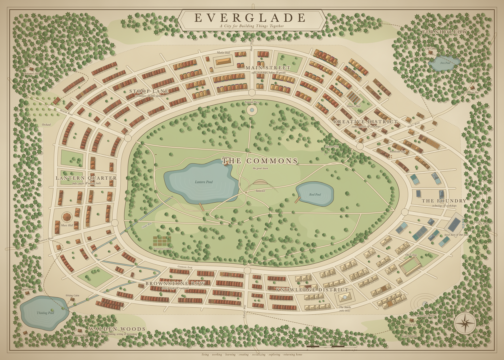

# Everglade

Status: implemented on desktop, updated October 5, 2026; paired phones
control the studio under the host's grants.
Delivery step 1 is implemented: the admitted sources under
`assets/verse/everglade/` and the pack compiler and loader in
`verse::zones::everglade_pack`. Delivery step 3 is implemented:
`ZoneId::Everglade` with generated ground and the plaza arch in
[`zones/everglade/`](../../crates/verse-zone-everglade/src/zones/everglade/mod.rs). Delivery
step 4 is implemented: the pack loads on entry, and the layout in
[`zones/everglade/layout.rs`](../../crates/verse-zone-everglade/src/zones/everglade/layout.rs)
places the glade, the workshop, and each station's furniture with their
blockers. Delivery step 5 is implemented on desktop in
[`zones/everglade/studio.rs`](../../crates/verse-zone-everglade/src/zones/everglade/studio.rs)
and [`panels/studio.rs`](../../crates/verse/src/panels/studio.rs): seats walk
between stations from a live host's studio snapshots, and the panels send the
studio's intents to that host (`verse --everglade`, or `--studio-socket PATH`
for another host's control socket). `verse --studio-sim` and the
`everglade_capture` example's `studio-` views play the simulated team, a
read-only replay with no host behind it (#10572). `openagents studio up
--sim` instead runs an interactive scratch host without model spend. On
phones the studio panels send host-checked actions under `operate` and
`review` (#10570, #10579). The [Agent Studio guide](agent-studio.md) records
current end-to-end evidence; the [audit](agent-studio-audit.md) retains its
earlier pinned observations. Everglade also runs in a browser through
[`crates/everglade-web`](../../crates/everglade-web/README.md), without the
studio.

Everglade is a loaded Verse zone: a forest glade with a small timber-and-plaster
workshop where a person works with a team of coding agents. It is where the
[Agent Studio](agent-studio.md) lives. AgentCraft showed the idea in a
Minecraft studio; Everglade is the same workspace built in Verse Engine from
stylized CC0 kits, and its panels are the Zeron-derived interface the studio
already specifies.

The [terminal workbench roadmap](../terminal/workbench-roadmap.md) delivers
the same application in the Grid and a standalone install first, then
opens it against this workshop's studio resources. A desk computer, `T`,
or another entry point selects context; terminal furniture and floating
windows remain a separate design choice. The studio stays authoritative
for team work, decisions, and reviewed merges.

The [illustrated map](everglade-map.svg) imagines Everglade grown into a
small city around its commons: neighborhoods for living, making,
learning, and gathering, with quiet woods at the edges.

## Inspiration

> my strong suspicion is that the optimal way to manage multiple
> intelligences is that which is closet to our primordial state: wandering
> around a small town, seeing people we know well, physically embodied
>
> the cybersynesque dashboards feel productive, but i doubt they really are

— [Will Manidis](https://x.com/WillManidis/status/2106401558565134823), replying about AgentCraft

Everglade takes that literally. The studio is a small town in a glade, the
agents are people the player knows by name and silhouette, and where an agent
stands says what it is doing. Panels open only when the player walks up to a
station and asks for detail; the default view is the place, not a dashboard.

## Placement

Everglade replaces the earlier plan to put the studio in a plaza building. The
studio's host coordinator, protocol, and panels are unchanged; only where they
are drawn moves.

## Asset sources

All three kits are by Quaternius, downloaded by the owner from
<https://quaternius.com> as the free Standard editions, and licensed
CC0 1.0. Each kit's `License_Standard.txt` states the license; keep a copy
beside the admitted files.

| Kit | Contents | Use in Everglade |
| --- | --- | --- |
| Stylized Nature MegaKit (Standard) | 68 static models, about 149,000 triangles in total: common, pine, twisted, and dead trees up to 19 m tall; bushes, ferns, plants, grass, clover, flowers, mushrooms; rocks, pebbles, and stepping-stone paths. 20 PNG textures, most 2048² (bark with normal maps, alpha-masked leaf and flower cards). | The glade: tree ring, undergrowth, paths, and rocks. |
| Medieval Village MegaKit (Standard) | 176 modular static models on a 2 m grid: walls (2 m × 3.12 m) in plaster, brick, and wood, doors, windows and shutters, floors, stairs, balconies, overhangs, roofs, chimneys, fences, vines, a wagon and crates. 22 PNG textures at 2048² with normal and ORM or roughness maps, plus an alpha-blended glass material. | The workshop and its yard. |
| Fantasy Props MegaKit (Standard) | Furniture and props. Fourteen are already admitted under [`assets/verse/props/quaternius/`](../../assets/verse/props/quaternius/README.md) for the summoning lair. | Station furniture. This kit is an addition to the two the owner named, proposed because neither of them has desks, shelves, or lecterns. |

The fourth set, [`generated/`](../../assets/verse/everglade/generated/README.md),
holds the models `scripts/blender` builds ([Generated models with
Blender](blender-pipeline.md)): the village buildings assembled from the
Medieval Village MegaKit's pieces, the landmarks (the observatory, the
fountain, the bandshell, and the market stalls), the street furniture, the
park, garden, farm, pond, and woodland pieces, the far forest's low-poly
trees, and a lighter copy of the kit's round-tile roof.
`scripts/blender/everglade_admit.py` converts each committed glb to the
glTF and `.bin` the compiler reads and points its textures at the village
set's admitted images, so the pack carries one copy of each kit image.

Measured facts that shape the design:

- Every model is meters, Y-up, with no skins, animations, or glTF extensions.
- Foliage depends on alpha-masked, double-sided textures. Baking it to vertex
  colors, as the Ruins pack does, turns leaf cards into solid quads, so
  Everglade needs textured, alpha-tested drawing in the zone renderer.
- The two named kits carry about 88 MB of PNG source at 2048². Admitted
  textures are downscaled to 512² (`compile::TEXTURE_EDGE`); the timber trim
  and the broadleaf canopy keep 1024², and small pieces, such as mushrooms,
  flowers, vines, and iron ornaments, get 256² (`compile::TEXTURE_EDGES`).
  Each admitted image is stored as the compiler writes it, so the repository
  holds one copy at the pack's size.
- The current material path samples base color only. Normal, ORM, and
  roughness images are not admitted until a shader reads them.

## Admission and the zone pack

Admission follows the Fantasy Props precedent:

- A curated subset of each kit is admitted with an
  `openagents.verse.source-manifest.v1` manifest that pins the creator,
  license, package, and SHA-256 of every admitted file. Only models that the
  layout places are admitted.
- A Rust compiler reads the admitted sources, downscales textures, and writes
  a pinned Everglade zone pack (`VTP3`): base-color textures as the narrowest
  PNG that holds them exactly (gray, RGB, or RGBA), then one deflated body of
  materials with their flags (alpha mask cutoff, double-sided, blend) and
  models. Each primitive's positions and texture coordinates are 16-bit
  steps across its own range, a fraction of a millimeter on the tallest
  building, stored in planes so that deflate compresses them about threefold;
  degenerate triangles and duplicate vertices are dropped. The pack's digest
  and length compile into `verse`, like `PACK_SHA256` and `PACK_BYTES` for
  Ruins.
- The pack loads on entry through the Ruins loader's rules: HTTPS only, no
  redirects, exact length and digest, bounded decoding, and the
  content-addressed disk cache. Committed files are the pack and the curated
  sources, not the full kits.
- Budgets: at most 42 MB committed for sources and pack together, a pack of
  at most 12 MiB, and at most 48 MiB of decoded textures (56 MB, 28 MiB,
  and 64 MiB before the third round shrank the pack from 28.0 MB to 8.5 MB
  and the committed total from 53.3 MB to 28.1 MB; 36 MB before the
  foliage round), and at most 540,000 triangles in the pack's models with
  at most 20,000 in any one (480,000 before the foliage round). The city
  may place at most 1,650,000 triangles where they draw, each cell at its
  level of detail from anywhere in the clearing
  (`everglade_pack::PLACED_TRIANGLE_BUDGET`; 1,250,000 before the far
  levels' switch moved from 60 m to 80 m), and a street-level frame may
  draw at most 600,000 (`everglade_pack::DRAWN_TRIANGLE_BUDGET`); every
  level together, which the renderer merges and uploads, stays under
  2,900,000 (`everglade_pack::MERGED_TRIANGLE_BUDGET`, 2,600,000 before the
  foliage round), about 209 MiB of the renderer's 224 MiB geometry bound.

## Rendering

The zone renderer gains textured static meshes:

- Base-color texture sampling with the material's factor, alpha-mask cutoff,
  double-sided faces, and one blended pass for glass.
- Static placements merge into cells per material and upload once, as
  `imported::merge` does for the lair; there is no GPU instancing to depend on.
- The same shaders run on desktop and on phones, within the GLES 3.0 limits
  every backend requests (no storage buffers or compute).
- Kit-built houses are painted: each takes a plaster and a roof color from
  short palettes (`layout::paint`), and its kit plaster and tiles then sample
  the neutral `T_Plaster_Luma` and `T_RoundTiles_Luma` images tinted by those
  colors (`scene::Paint`), so the streets vary without another model.
- A placed model's material colors, after its paint, fold into its vertex
  colors, so materials that differ only in color share one white material
  and merge into one batch per cell: the city draws in 2,845 batches rather
  than 5,040.
- The heaviest models have a far level of detail
  ([`detail`](../../crates/verse-zone-everglade/src/zones/everglade/detail.rs)): the
  generated buildings and landmarks, the kit pieces that kit-built houses
  repeat, and the nature kit's and the foliage set's trees and bushes.
  `scripts/blender/everglade_lod.py` makes each from the admitted model
  ([Generated models with Blender](blender-pipeline.md#levels-of-detail)),
  watertight since the foliage round: a roof's round tiles become closed
  slabs in their own texture, and nothing tears open; the pack carries it as
  `lod/<set>.<name>`. A cell draws a model while it is nearer than 80 m
  across the ground and its far level beyond (60 m before the foliage
  round), grass, flowers, mushrooms, stepping stones, and the station
  furniture only nearer than 52 m, and shrubs, deadwood, hedges, and ivy
  only nearer than 72 m. Each level merges into cells of its own, and the
  renderer keeps a cell at its level until the eye moves 2.5 m past the
  switch, so a cell at the switch doesn't flicker; shadows and the depth
  prepass draw the same levels. The light bake skips the far levels as
  occluders, since their near levels stand in the same place. A street
  view draws 190,000 to 360,000 triangles rather than 240,000 to 1,040,000
  (`tests::a_frame_draws_a_fraction_of_the_city`): from the Lantern Quarter,
  305,000 rather than 808,000. Captures at walking distances show no
  change. With the fourth round's trees and dressing, a street view draws
  210,000 to 410,000 (the Lantern Quarter 355,000), and the city merges
  2,268,146 triangles in 153 MiB. After the sixth round's lighter houses
  replaced most kit-built ones, a street view draws 323,000 to 532,000
  (574,000 before), and the city merges 2,804,051 triangles (2,894,488
  before) in 205 MiB; the pack is 11.2 MB.
- The sixth round's houses (`scripts/blender/town_houses.py`) are painted
  too: their plaster and tiles are named `HousePlaster` and `HouseTiles`
  (`scene::PAINTED`), and `layout::paint` gives each placed house colors of
  its own from where it stands, so one model reads as many houses.
- Everglade's atmosphere has its own colors: an afternoon daylight sky
  (`pbr::Daylight`) from warm horizon haze to a blue zenith, with a low,
  warm sun that draws long shadows across the streets, a Sun in the key
  light's direction, value-noise clouds, fog that takes the sky's color along
  each view ray so distant ground meets the horizon, and lamplight inside the
  workshop. Amber stays the plaza's palette.
- The player is the ritual chamber's outfitted character (the Universal male
  Ranger that `verse_play` binds as `adventurer`), not the Grid's boxy
  avatar, and no spade companion follows in Everglade. The pack carries it as
  one skinned character with idle, walk, run, jump, backpedal, and strafe
  clips and the demolition yard's two-handed chop (`TreeChopping_Loop`),
  composed from the retained character sources under their own manifest; the movement
  state picks the clip, and the character is skinned on the CPU into a
  textured figure each frame, so GLES and WebGL2 draw it too. Its triangles
  have their own budget (40,000) and are not counted as placed.
- The studio's seats are the same character, its outfit in each seat's
  color, drawn in the player's figure. Their postures (typing on a stool at
  the desk, reading, leaning at the ring, waiting, thinking, working, and
  gesturing while they speak) are clips authored from the idle clip on the
  skeleton when the zone loads (`zones/everglade/pose.rs`), so the pack
  carries no new clips. Heads turn toward the monitor, the seat being
  spoken to, or the player.
- Ambient light is baked when the zone loads (`pbr::textured_bake`, lighting
  audit item B1): each static vertex stores how much of the sky it sees and
  one bounce of sunlight in its light channel, with alpha-tested leaf cards
  as partial occluders, so the workshop interior and the ground under the
  tree ring darken. A coarse probe grid of the same light shades the
  characters. The bake runs on a worker thread; in a browser it advances a
  little each frame at lower quality.
- The sky lights the zone (`pbr::environment`, items A2 and B2): the daylight
  sky, with its clouds at their mean cover and the lit ground below the
  horizon, is projected on the CPU into order-two spherical harmonics for
  diffuse light and a GGX-prefiltered cube for reflections, at the key's
  `sky` level. Shaded sides take the sky's blue-to-haze gradient, glossy
  surfaces reflect the sky, and reflections scale by the baked light over
  the open sky's, so covered surfaces stop reflecting it. The quality tier
  sets only the cube's size; WebGL2 samples it with an explicit level.
- Fog is exponential height fog (item A3, `HeightFog` in
  `zones::atmosphere`): it starts at 40 m, thins with height so hilltops
  stay clearer than hollows, brightens toward the Sun, and still closes in
  completely by 180 m. The renderer skips every textured cell beyond that
  distance, and cells too small to see at their distance.

## The zone

Everglade registers as `ZoneId::Everglade` with world id `verse-everglade`,
following [Build and register a new zone](zones.md#build-and-register-a-new-zone):
its adapter, entry state, plaza arch, minimap landmark, intents, camera clamp,
mobile zone identifiers, tests, and capture example. The ground is generated in
Rust: a gentle heightfield, flat inside the clearing, rising toward the tree
ring, with grass and path textures. Its sign reads `EVERGLADE`.

The town's kit buildings break. Key 6 on the hotbar aims Meteor Swarm and
key 7 swings the sledgehammer, both free and without a cooldown; `R`
restores every building. The workshop hall is protected. See
[Destructible buildings](destructible-buildings.md#everglades-town).

## Layout

The zone is about 510 m across, with a flat clearing 272 m across: sixteen
times the first glade's area. The workshop stands at its center on a flat
pad, with a yard in front, and a city grows around it after the
[illustrated map](everglade-map.svg), inside a tree ring about 300 m across
and a forest belt of low-poly stands beyond it. Main Street, Market Way,
Library Way, Hearth Road, Brownstone Row, the commons walk, and the
Fountain Plaza are cobbled (`layout::PAVED`); the lanes are dirt. Glade Run
leaves Reed Pond and runs south through the long meadow, under Brownstone
Row's footbridge, into Walden Woods. The run is shallow: a walker wades
across it anywhere or crosses the footbridge's deck, which, with the
jetties and the rowboats, breaks like the other props.

The city's buildings are a table in `layout::city`. Most are the workshop's
own kit pieces, one to three stories under round-tile roofs, painted in
varied plaster and roof colors, and each wall run blocks walking as one
footprint. Seventy-four places hold a whole generated building instead
(`city::STAND_INS`), mixed among the kit-built ones: jettied and balconied
townhouses on Main Street, Stoop Lane, and in the Creative District, corner
shops at Main Street's corners, the bakehouse with its bread oven on Main
Street, the open market hall on the Fountain Plaza, the round Music Hall,
the meeting hall behind its porch, the tavern, and the guild hall with its
turret in the Lantern Quarter, terraces of row houses on Brownstone Row,
L-shaped houses, two Boardwalk Cafés facing each other across Studio Road,
the smithy and its open forge in the Foundry, the clock tower on its little
square on Library Way, the windmill and the thatched farmhouse on the farm
lane, log cabins in the long meadow and by the Fern Pond, the lookout tower
in Fernhollow, the cottage with its round tower and the woodcutter's
thatched cottage in Walden Woods, two hipped houses on Well Square, the
red gambrel barn east of the farm's paddock, and the observatory on its
hill; the
Stacks is the generated library. Three more stand on open ground
(`city::GROUNDS`): the boathouse on Lantern Pond's north bank, the
glasshouse by the community garden, and the gazebo on the commons' east
lawn. A generated building blocks by the boxes of its
`<name>.footprint.json`, its roofs are surfaces to land on
(`layout::generated`), and its door is closed: a walk leads to its front
step. The market hall's arcade, the gazebo, and the lookout's legs stay
open.

Street furniture (`layout::streets`) follows the map: warm lamps along the
paved streets and the main lanes, flower boxes under the shop fronts,
bunting over the plaza and the streets, a clipped hedge between Main Street
and the commons, signposts at the crossings, wells, lily pads on the ponds,
a dry-stone wall around the orchard, wildflower meadows, and park trees on
the commons. The second round (`layout::parks`) adds life on the ponds
(reeds, more lily pads, three jetties with rowboats, and a boat in the
boathouse), the community garden's picket fence, rose arch, and raised beds,
the farm's paddock with its haystack and bales, café tables on the cafés'
decks and the Fountain Plaza, planters, statues, a sculpture, and a sundial
on the Sculpture Walk, beehives at the beekeeper's hut, a fruit orchard, and
undergrowth that sets the woods apart: ferns, mossy rocks, fallen logs,
stumps, and toadstools in Walden Woods among dark spruces and pale birches,
and denser spruce and birch round the Fern Pond. The forest belt mixes
pines with spruces, oaks, birches, and poplars, and round bushes line the
clearing's edge. The third round (`layout::details`) adds Well Square, a
second, smaller plaza south of Hearth Road with a well, benches, two-armed
lamps, and flowers; paper lanterns strung across Lantern Road and more
two-armed lamps in the Lantern Quarter; painted signs before Main Street's
shops; a gold stall on Main Street; the barn's yard; benches round
Lantern Pond and along the commons walk; and drifts of spring flowers on
the commons, summer flowers on the town's lawns, and autumn flowers at the
woods' edges. Wood smoke rises from the bakehouse's stack, the smithy's
forge, and the chimneys of the cottages, cabins, taverns, and townhouses
(`chimney_smoke`, [Particle effects](particles.md)). The fourth round
(`layout::greens`), with the room the far levels of detail made, wooded
the commons with 16 more park trees and set trees in the verges of Main
Street, Library Way, and Brownstone Row; planted two orchards of
blossoming fruit trees west of the Lantern Quarter and one by the
beekeeper's hut; put café parasols on Lantern Pond's bank; laid a
stepping-stone path with lamps and benches up Observatory Hill; and
thickened Fernhollow's glen round the Fern Pond with ferns, broad-leaved
plants, mossy rocks, and toadstools. Each piece stands only on open
ground: off every road, walk, building, pond, and station.

The fifth round (`layout::foliage`) fills the town with foliage from the
`foliage` set (`scripts/blender/foliage.py`,
[Generated models with Blender](blender-pipeline.md#foliage)). Wild woods
ring the town, thickest in Walden Woods and Fernhollow: stands of forked,
tall, and broad broadleaf trees, gnarled oaks, firs, and snags, some with
roots spread at their feet, over shrubs and brambles, ferns, tall grass,
and wildflowers, with hollow and broken logs, stumps, root arches, boulders,
and, past the tree ring, cliff rocks; some stands are glades with a fairy
ring, and the forest belt's cheap trees fill in round them. A campfire
with log seats burns in a Walden clearing, with smoke; a circle of standing
stones stands in the north woods; Glade Run spills over a weir of stones
in a low cascade; and willows lean over the ponds. In the town, the
commons' and the streets' trees are the new broadleafs, at a fifth of the
kit trees' triangles; trees, shrubs, and flowers grow in the yards,
alleys, and courtyards between the buildings; tall grass, wildflowers, and
ferns overgrow the roads' verges; ivy climbs about one ground-floor wall in
six, roses climb a few trellises, and window boxes hang under a third of
the windows, each where its wall piece stands, so they break with it; ivy
covers the dry-stone walls and picket fences; hedges with gaps and arched
gateways line some lanes; and planters line the paved streets. Trunks,
rocks, logs, stumps, hedges, and planters block walking; shrubs, ferns,
grass, roots, and ivy don't. None of it breaks but the wall dressing.

The sixth round (`layout::furnish`, with `city::STAND_INS`) made the town
denser and more varied for less. `scripts/blender/town_houses.py` builds
six lighter houses in the village kit's style, at a quarter to a third of a
kit-built house's triangles, each with a far level of detail of its own: a
narrow shop whose two display windows show goods on shelves through clear
glass, under an awning and a jettied, half-timbered upper floor; a gambrel
house with a porch; a stone cottage under a hipped roof with a dormer and
an outside chimney stack; a brownstone of three storeys over a raised
basement, with a stoop and iron rails; a timber-framed house with a cross
gable and a balcony; and the Lantern Quarter's inn, with lamplit windows,
wall lanterns, and a hipped roof with dormers. They take the places of 26
kit-built houses: shops on Main Street and the Fountain Plaza, inns and
timber houses in the Lantern Quarter, brownstones and stone cottages on
both sides of Brownstone Row, and gambrel, stone, and timber houses on
Stoop Lane, in the Knowledge District, and in the Foundry. Market Row, a
new lane behind Main Street's far blocks on each side of the Fountain
Plaza, holds twelve more, as the map's dense blocks north of Main Street.
Each house is painted in its own colors and smokes from its chimneys. The
Fountain Plaza became a market, with produce stalls, crates, a flower cart,
and a hand pump; plank decks with café tables and a parasol stand on
Lantern Pond's banks; the brownstones and the row houses across from them
have back gardens with a picket fence, flower and vegetable beds, and a
bench; litter bins line Main Street, Library Way, and Brownstone Row; and
crates, flower carts, benches, barrels, bins, planters, hand pumps, and
small fountains stand before the new houses and along the lanes
(`scripts/blender/town_props.py`). The orchard's dry-stone wall, which no
earlier round could place, now stands.

The town has ambient wildlife
([`wildlife`](../../crates/verse-zone-everglade/src/zones/everglade/wildlife.rs)): pairs of
songbirds circling over the commons, Main Street, Walden Woods, and
Fernhollow, and one flitting from crown to crown of the commons' trees;
ducks paddling on every pond and a frog hopping round each bank; a cat
sitting on a garden fence; rats running along Main Street and Foundry
Road; a snake in Walden Woods; and wasps round the beekeeper's hives.
Butterflies flutter over every other spring and summer flower drift
(`butterflies`, [Particle effects](particles.md)). Each creature is one of
the pack's forms on a route that depends on the clock alone, drawn in the
frame's figure with the characters and lit by the baked probes; one
farther than 60 m from the player is neither posed nor drawn.

| District | Built from | Roads |
| --- | --- | --- |
| The Commons | Lantern Pond with reeds, stones, lily pads, a jetty, and a rowboat, the generated boathouse on its north bank, benches, park trees, wildflowers, the generated bandshell, the gazebo on the east lawn | The commons walk, west of the hall |
| Main Street | Twelve shops (bakery, café, bookshop, grocer, tailor, print shop, and more), the generated bakehouse with its bread oven, two generated corner shops, two shop houses, and three townhouses among them, red, blue, and gold market stalls, lamps, painted shop signs, flower boxes, bunting, street trees, litter bins; Market Row behind the far blocks, with twelve houses, shops, and an inn | Main Street, about 200 m long, cobbled; Market Row |
| Fountain Plaza | A cobbled market with the generated fountain, awninged and produce stalls, crates, barrels, a hand cart, a flower cart, a hand pump, a shop house and a timber house with tables out front, planters, the generated market hall with its stock under the arcade | Market Way |
| Creative District | The Makers' Hall, a studio, two generated Boardwalk Cafés with tables on their decks, the Atelier Hall, the Sculpture Walk's statues, sculpture, and sundial | Studio Road |
| The Foundry | The Server Barn and fab yard, a workshop, the Fab Hall, the generated smithy with its open forge, an annex | Foundry Road |
| Knowledge District | The Stacks (the generated library up its steps), the Old College, the generated clock tower on its square, the college hall, the archive, the map room, an L-shaped seminar house, the generated observatory on Observatory Hill, Reed Pond and its jetty, the long meadow's wildflowers and its log cabin | Library Way |
| Stoop Lane | Ten homes and townhouses, four of them generated, with lanterns, flower boxes, and little gardens, the cottage, a well | Stoop Lane, Hearth Road |
| Lantern Quarter | The generated Music Hall, meeting hall, tavern, and guild hall, the choir house, the pubs, an L-shaped house, bunting, paper lanterns across Lantern Road, two-armed lamps, a well; Well Square with its two hipped houses, well, and benches | Hearth Road, Lantern Road |
| Brownstone Row | Four brownstones with stoops and iron rails, two terraces of generated row houses, two more brownstones, stone cottages, and gambrel houses across the street, back gardens with fences, beds, and benches, the community garden behind its picket fence with the glasshouse, the footbridge over Glade Run | Brownstone Row |
| Walden Woods | The writing and code cabins, the generated cottage with its tower, the woodcutter's thatched cottage, the prototype shed, the Thinking Pond and its jetty, stands of firs, broadleafs, spruces, and birches over ferns, shrubs, brambles, mossy rocks, fallen logs, stumps, and toadstools | The woods paths, Lantern Road |
| Fernhollow | The lookout tower and the log cabin by the Fern Pond, firs, broadleafs, spruces, and birches over ferns, shrubs, mossy rocks, and toadstools | The Fernhollow path |
| Gardens and orchards | Fenced beds, an orchard of fruit trees behind a dry-stone wall with a gate, the beekeeper's hut and hives | The orchard lane |
| The farm | The generated windmill, thatched farmhouse, and gambrel barn with bales and a cart in its yard, a rail-fenced paddock with a haystack and bales, vegetable beds | The farm lane, south from Brownstone Row |

The studio's stations stay where they were:

| Place | Built from | Studio station |
| --- | --- | --- |
| Approach path | Stepping-stone paths, flowers, ferns | Spawn and return |
| Yard notice board | Wooden frame, fence pieces, banners | Task Wall |
| Workshop hall | Plaster and timber walls, round-tile roof, wide windows, double doors | Desks: one workbench per seat, each with a monitor board |
| Hall gallery | Bookcases, book stands, scrolls | Library |
| Hearth corner | Cauldron, candles | Oracle |
| Yard ring | Training dummy, anvil, rock border | Proving ground |
| Lectern by the door | Book stand, lantern, banner | Podium |
| Strongroom | Metal crate, metal fence, ornament | Merge station |
| Bench under the trees | Bench, stools, mushrooms | Lounge |
| Wagon by the gate | Wagon, crates | Workbench (running commands) |

Placements are Rust data in a layout module, validated by tests: every
placement names an admitted model, prop bounds become navigation blockers,
every station has a reachable standing point, and no blocker covers a path.
Text that the world draws, such as the Task Wall's cards and the monitors, is
drawn by Verse on in-world boards, as the Gym draws its boards.

## The workspace

Everglade is the Agent Studio's place in the world:

- Seats are Verse agents that walk between the stations above, from the
  studio snapshot and the shared activity classifier (`atif::activity`).
- Selecting a station, or walking up to it and pressing the interact key, opens
  the matching Rust Native panel over the world through `verse::panels`:
  the console at the notice board, a seat's panel at its desk, decisions at
  the podium, and the diff review at the merge station.
- Data loads only while the player is in Everglade, as the Gym loads only
  while the player is inside.
- On phones, stations open the same panels through the hosts' native mounting
  (#10476). Acting uses the paired computer's current `operate` or `review`
  grant (#10570, #10579).
- The OpenAgents app's Grid opens Everglade through a walk-in arch, with the
  shared pack loader's progress, Cancel, and Retry; see
  [the Grid's portal to Everglade](mobile.md#the-grids-portal-to-everglade).
- A shared instance runs on a chamber host (`"profile": "everglade"`) beside
  the Coder host. The host walks the seats from the studio snapshot, and every
  viewer draws them where the host places them. A viewer's NIP-HOST `world`
  right admits walking only; panels need `observe`, `operate`, and `review`.
  See [Verse networking](networking.md#plan), step 3.

## Delivery

1. Admit the curated assets and build the pinned zone pack.
2. Draw textured, alpha-tested static meshes in the zone renderer on desktop
   and phones.
3. Register the zone with generated ground, the plaza arch, and greybox
   station markers.
4. Build the glade and workshop layout with collision and station points.
5. Run the studio workspace in it (#10465).
6. Mount it on phones (#10476).

## Open questions

- Whether Fantasy Props may join the two named kits for furniture, or whether
  stations use only village and nature pieces.
