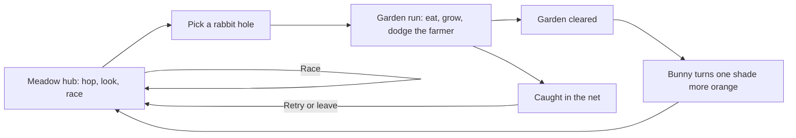
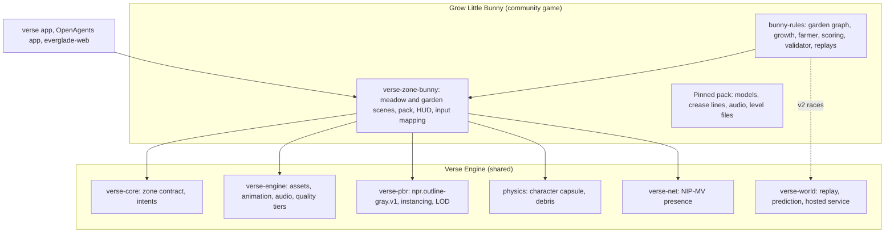

# Grow Little Bunny

Status: design 2026-10-08; being built, phase by phase, as a browser game
first (see [Implementation status](#implementation-status)). Numbers marked
*tunable* are starting values for playtests, not measured results.

Grow Little Bunny is a mini-game inside Verse. You play a small white
rabbit. In a meadow hub you hop around, race other bunnies, and choose a
rabbit hole. Each hole leads to a farmer's garden: you run forward through
its rows as in Temple Run, eat everything edible as in Pac-Man, and grow
with every bite, while the farmer tries to catch you with his net. Each
garden you clear turns your bunny one shade more orange, from pure white
to shiny neon orange.

It is the first **community game**: a game that plugs into Verse and uses
Verse Engine but is not part of a built-in zone system such as Everglade.
Later games like it will be built by people outside this repository. This
document specifies the game and the engine contract it needs, so that the
first one is built the way an outside author would have to build it.

## Contents

- [Overview and pillars](#overview-and-pillars)
- [Player fantasy](#player-fantasy)
- [Core loop](#core-loop)
- [The meadow hub](#the-meadow-hub)
- [The garden run](#the-garden-run)
- [Controls](#controls)
- [Growth](#growth)
- [Edibles](#edibles)
- [Obstacles](#obstacles)
- [The farmer](#the-farmer)
- [Winning and losing](#winning-and-losing)
- [Power-ups](#power-ups)
- [Races](#races)
- [Progression: the carrot ladder](#progression-the-carrot-ladder)
- [Scoring](#scoring)
- [Difficulty and level list](#difficulty-and-level-list)
- [Art direction](#art-direction)
- [Animation, effects, and audio](#animation-effects-and-audio)
- [UI and HUD](#ui-and-hud)
- [Assets](#assets)
- [Technical architecture](#technical-architecture)
- [Performance budgets per tier](#performance-budgets-per-tier)
- [Packaging, publishing, and sandboxing](#packaging-publishing-and-sandboxing)
- [Telemetry and testing](#telemetry-and-testing)
- [Milestones](#milestones)
- [Implementation status](#implementation-status)
- [Engine gaps](#engine-gaps)
- [Open questions](#open-questions)

## Overview and pillars

| | |
| --- | --- |
| Genre | Lane runner crossed with a maze-clearing chase |
| Session | 2 to 6 minutes a garden; races 45 to 90 seconds |
| Players | One player a garden; up to 8 in a hub race |
| Platforms | Desktop, browser (WebGPU and WebGL2), iOS, Android |
| Audience | All ages; no text needed to play |
| Engine | Verse Engine, `verse-pbr`, the `physics` crate, the Blender pipeline |

Pillars:

1. **Growing changes the garden.** Size is the main mechanic. What blocked
   you a minute ago is now something you knock over, and a gap you used
   to slip through is now too small.
2. **Clear it, don't outlast it.** A garden is won by eating everything in
   it, never by surviving a timer. The farmer is the only way to lose.
3. **Read at a glance.** Gray outlines on a pale page; only you and your
   food are in color. A child can see what to eat and what to avoid.
4. **Every win shows.** Your bunny's color is your record, visible to
   everyone in the hub.
5. **Built like an outside game.** The game uses only the engine's public
   contracts. Anything it needs that the engine lacks becomes an engine
   feature every community game can use.

## Player fantasy

You are a tiny rabbit who sneaks into a farmer's garden and eats until
you are enormous. At the start the garden is huge and dangerous: a
watering can is a wall, and the farmer could scoop you up in a second. By
the end you are a giant bunny flattening flower pots, and the farmer has
to work to keep up. You leave through the rabbit hole, and the meadow
sees you a little more orange than before.

## Core loop

Inside a run the loop is short: pick a lane, eat what is in it, grow,
pass or smash what you can, and turn at junctions toward food you haven't
eaten yet. Keep track of where the farmer is.

## The meadow hub

**Warren Meadow** is an ordinary 3D place you walk as a bunny, with the
same outline style as the gardens. It has its own world, `bunny-meadow-v1`,
and joins NIP-MV presence so you see other bunnies in their colors.

Layout (about 160 m × 160 m, *tunable*):

| Place | Where | What it does |
| --- | --- | --- |
| Warren Mound | Center | Spawn point. A grassy mound with burrow doors. |
| Color Pond | North of the mound | A still pond that reflects your bunny. A ring of 21 stones around it shows the carrot ladder, with your shade lit and your wins to the next shade. |
| Hole Ring | East | Four rabbit holes, one per garden set, under signposts with pictograms. A hole is lit when its set is open. A fifth, the Wild Hole, opens after level 10 (daily seeded gardens). |
| Race Course | South, around a brook | A 400 m hopping steeplechase with log jumps, a brook to hop across on stones, a hollow log tunnel, and a start gate. |
| Carrot Board | Beside the start gate | Leaderboards: best race times and garden clear times, with ghost picks. |
| Burrow | Inside the mound | Your record: wins, best times, settings, accessibility options. |
| Exit arch | West edge | Back to the Grid or the plaza. |

Interactions:

- **Walk and hop.** Free third-person movement over generated ground, the
  same character controller as the plaza and Everglade.
- **Enter a hole.** Walk into a lit hole. A short dive animation and an
  iris-out transition load the garden.
- **Enter a race.** Step on the start gate's pad. Solo starts a time
  trial at once; joining a group race waits up to 20 s (*tunable*) for
  other bunnies on the pad.
- **Emotes.** Thump, binky (a happy twisting jump), ear flop, and wave.
  Hub chat is off by default; emotes are always on.

The hub is local scenery with shared presence. It has no farmer and no
way to lose.

## The garden run

### Structure: a garden graph

A garden is a **graph of rows**. Each edge is a straight corridor between
hedges, raised beds, or fences; each node is a junction where corridors
meet at right angles. Corridors have three lanes, 1.2 m apart (*tunable*).
The bunny always runs forward along a corridor, as in Temple Run. At a
junction it turns left, right, or carries on. Because the corridors form
loops, as Pac-Man's maze does, the player can come back for food they
missed.

| Element | Value (*tunable*) |
| --- | --- |
| Garden footprint | 60 m × 60 m (early) to 110 m × 110 m (late) |
| Junction nodes | 12 to 36 |
| Corridor length | 8 to 40 m |
| Lanes a corridor | 3; some narrow corridors have 1 |
| Hedge height | 2.4 m, always taller than the largest bunny |
| Exits | One rabbit hole, which opens when the garden is clear |

Corridors are authored to teach one idea at a time: a row of seedlings
across three lanes, a corridor blocked by a pot that only a bigger bunny
can smash, a fence with a gap only a small bunny can use.

### Authored layout, procedural dressing

Garden layouts are **authored data**: a graph of nodes and corridors with
lane-addressed edibles, obstacles, gaps, and power-ups, written as a
`bunny.garden.v1` level file. Authored layouts keep the size puzzles
deliberate and testable.

Two things are procedural, from the level's seed:

- **Dressing.** Decorative props (tools, pots, plant rows beyond the
  hedges, birds) are scattered from the garden kit outside the corridors.
  They never affect play.
- **The Wild Hole.** A daily garden built by a generator from corridor
  templates, then checked by the same level validator as the authored
  gardens. A seed that fails validation is skipped.

The level validator is part of the rules crate and runs in tests. It
checks that every edible can be reached from the start and that no
reachable state can strand an edible (see [Growth](#growth)).

### Movement

- The bunny runs at its tier's speed and cannot stop, except briefly when
  it skids at a wall.
- A lane change takes 0.18 s (*tunable*).
- A turn takes effect at the junction. A turn input up to 0.35 s
  (*tunable*) before the junction is buffered.
- At a T-junction or a corner with no input, the bunny skids to a stop
  for 0.6 s, then waits for a direction. A corner with one open way turns
  by itself after the skid. Skidding costs time while the farmer closes
  in.
- **U-turn.** The player can turn back in the corridor (Pac-Man allows
  reversing). It takes 0.4 s and has a 2 s cooldown (*tunable*).
- **Jump** clears low obstacles. Its height scales with size; air time is
  0.55 s at every tier (*tunable*), so timing feels the same.
- **Duck** passes under high obstacles (a sagging bird net, a clothesline)
  for 0.6 s.

Movement in a garden runs on the graph, not on the general physics
solver: a bunny's position is a corridor, a lane, and a distance along
the corridor, and a jump is an analytic arc. That makes the run cheap and
exactly reproducible (see [Determinism](#determinism-and-replays)).

### Camera

A chase camera sits behind and above the bunny: 3.5 m back and 1.6 m up
at the smallest size, rising to 6 m back and 3.2 m up at the largest
(*tunable*), with a 60° vertical field of view. On a turn the camera
swings around the junction over 0.25 s. While the farmer is within 12 m
behind, the camera pulls 10% higher so you can see him. On phones in
portrait the camera stays further back so all three lanes fit.

## Controls

| Action | Desktop | Browser | Phone and tablet | Gamepad |
| --- | --- | --- | --- | --- |
| Lane left / right, turn at junction | A / D or ← / → | Same as desktop | Swipe left / right | Left stick or d-pad |
| Jump | W, ↑, or Space | Same | Swipe up | A |
| Duck | S or ↓ | Same | Swipe down | B |
| U-turn | X or Backspace | Same | U-turn button (bottom center), or a two-finger tap | Y |
| Pause | Esc or P | Esc or P | Pause button (top right) | Start |
| Hub move and look | W A S D, mouse | Same | The Grid's two sticks | Sticks |
| Hub hop | Space | Space | Hop button | A |

Swipes are recognized anywhere on the screen. A swipe needs 24 px of
travel within 250 ms (*tunable*) and is taken by its dominant axis. A
turn swiped before a junction is buffered as above. Tilt steering is not
offered. Every control can be remapped on desktop and gamepad.

## Growth

### Size tiers

The bunny has five sizes. Growth points (GP) come from eating; crossing a
threshold grows the bunny with a short "pop" (0.3 s, no control lost).

| Tier | Name | Reach at GP (*tunable*) | Body height | Run speed | Jump clears | Seen by farmer at |
| --- | --- | --- | --- | --- | --- | --- |
| 1 | Kit | 0 | 0.25 m | 6.0 m/s | 0.15 m | 10 m |
| 2 | Bunny | 8 | 0.35 m | 6.4 m/s | 0.25 m | 13 m |
| 3 | Jack | 22 | 0.50 m | 6.8 m/s | 0.40 m | 16 m |
| 4 | Big Bun | 40 | 0.75 m | 7.2 m/s | 0.60 m | 20 m |
| 5 | Giant | 62 | 1.10 m | 7.6 m/s | 0.90 m | 25 m |

Bigger is faster and stronger, but easier to see, and it closes off the
small gaps. Width stays inside one lane at every tier; the Giant is drawn
slightly overlapping the lane lines but collides as one lane.

### What each tier can do

| Obstacle or feature | Kit | Bunny | Jack | Big Bun | Giant |
| --- | --- | --- | --- | --- | --- |
| Fence gap, bean-pole tunnel | Pass | Pass | Blocked | Blocked | Blocked |
| Garden hose | Jump | Jump | Step over | Step over | Step over |
| Puddle | Slows 40% | Slows 20% | Pass | Pass | Pass |
| Seed tray | Tumble | Jump | Jump | Smash | Smash |
| Flower pot | Tumble | Tumble | Smash | Smash | Smash |
| Watering can | Tumble | Tumble | Jump | Smash | Smash |
| Garden gnome | Tumble | Tumble | Tumble | Smash | Smash |
| Chicken-wire panel | Tumble | Tumble | Tumble | Break | Break |
| Wheelbarrow | Tumble | Tumble | Tumble | Jump | Smash |
| Scarecrow | Tumble | Tumble | Tumble | Tumble | Knock over |
| Bird net (high) | Duck | Duck | Duck | Duck | Tears through |
| Hedge, shed wall | Wall | Wall | Wall | Wall | Wall |

*Tumble* means the bunny hits the obstacle: it falls, loses 3 GP, and runs
at 60% speed for 1.2 s (*tunable*). A tumble never ends the run on its
own; the danger is the farmer catching up. *Smash* and *Break* pass
through at full speed and score points. *Jump* means it is passable only
with a jump; running into it is a tumble.

### Shrinking

Shrinking comes only from tumbles (3 GP each) and the farmer's near-miss
(see [the net](#the-net)). Falling below a threshold drops a tier, with a
"deflate" animation. GP never falls below 0.

### No stranded food

Because small-only gaps and large-only smashes both exist, a level could
strand an edible. The validator forbids it. For every edible, it searches
the state space of (node, tier) using only the GP the remaining edibles
can supply, and requires that the edible stays reachable whether the
player has grown or not. In practice, food behind a small-only gap also
has a route a Giant can use, or the gap's corridor is a shortcut rather
than the only way.

## Edibles

Edibles and the bunny are the only things in color. Every edible also has
its own silhouette and a thicker outline, so none depends on color alone.

| Edible | Color | Points | GP | Per garden (*tunable*) | Placement |
| --- | --- | --- | --- | --- | --- |
| Seedling | Leaf green | 10 | 0.25 | 80 to 200 | Rows along corridors, one lane at a time; the "dots" |
| Carrot | Orange | 50 | 2 | 8 to 20 | Ends of corridors, across lanes, behind obstacles |
| Radish | Magenta-red | 80 | 1 | 4 to 10 | After jumps, mid-air arcs |
| Lettuce | Pale green | 100 | 3 | 2 to 6 | Junctions; needs Jack or larger to eat |
| Strawberry | Red | 150 | 1 | 0 to 6 | Narrow single-lane corridors and gaps |
| Pumpkin | Deep orange | 300 | 5 | 0 to 2 | Dead ends; needs Giant to eat |
| Golden carrot | Gold | 200 | 2 | 4 | One near each corner of the garden; the power-up |
| Bonus vegetable | Varies by set | 500 to 2,000 | 0 | 2 appearances | Appears at the center after 35% and 70% of the garden is eaten, for 10 s (Pac-Man's fruit) |

A level's GP total is about 1.3 times the Giant threshold, so the player
reaches Giant at around three quarters of the garden. Too-big food (a
lettuce for a Kit) is solid: bumping into it is a tumble, which teaches
the rule.

Eating is automatic on contact in the bunny's lane. Eating three or more
edibles within 1.5 s of each other starts a **munch chain** (see
[Scoring](#scoring)).

## Obstacles

Obstacles are placed by lane at a distance along a corridor. Three rules
keep them fair:

- An obstacle is visible at least 1.2 s before the bunny reaches it at
  its current speed (*tunable*).
- No corridor has three lanes blocked at one distance unless at least
  one lane is passable at some tier the player could have at that point,
  or a jump or duck clears it.
- A sprinkler, the only moving obstacle, sweeps on a fixed 3 s cycle from
  the level's clock, so it can be learned.

## The farmer

### Role

The farmer is the garden's only enemy. He walks the same corridor graph
as the bunny, cannot pass through hedges, and does not use the bunny's
gaps. He carries a long-handled net.

### Behavior states

| State | What he does | Telegraph | Leaves when |
| --- | --- | --- | --- |
| Tend | Starts in the shed; after 3 s (*tunable*), walks a fixed patrol of junctions at walk speed. | Whistles a tune; hums while working. | He sees the bunny. |
| Chase | Runs toward the bunny's current corridor along the shortest path. | A sharp whistle and a "!" over his head. | He loses sight for 4 s (to Search), or Scatter time. |
| Ambush | Used on later levels: targets the junction ahead of the bunny's heading, as Pac-Man's Pinky does. | Same as Chase. | As Chase. |
| Search | Goes to the last junction where he saw the bunny and looks around for 3 s. | Looks left and right; a "?" icon. | He sees the bunny (Chase) or gives up (Tend). |
| Scatter | Walks back toward his shed corner for a breather, as Pac-Man's ghosts scatter. | Wipes his brow, slower walk. | The scatter time ends. |
| Spooked | During the golden carrot: drops into a crouch, runs away from the bunny at 70% speed. | He is drawn with a wobbling dashed outline. | The power-up ends; the last 2 s his outline flickers. |
| Dazed | After a spooked bump: tumbles into the compost and is out for 5 s, then walks back from the shed. | Stars circle his head. | The time ends (to Tend). |

Chase and Scatter alternate on a schedule, as in Pac-Man: Chase 20 s,
Scatter 7 s, repeated (*tunable* per level; later levels shorten Scatter
to 3 s and then remove it).

**Sight.** The farmer sees the bunny along any straight corridor he is in
or looking down, up to the bunny's tier's sight distance, and hears it
within 4 m around a corner. Hedges block sight.

### Speed

| Level range | Walk | Run (Chase) | As share of a Kit's speed |
| --- | --- | --- | --- |
| 1 to 5 | 3.0 m/s | 5.0 m/s | 83% |
| 6 to 10 | 3.2 m/s | 5.6 m/s | 93% |
| 11 to 15 | 3.4 m/s | 6.2 m/s | 103% |
| 16 to 20 | 3.6 m/s | 6.8 m/s | 113% |

All values *tunable*. Late in a level a growing bunny outruns him on
straights; he wins on corners, skids, and tumbles. Turning costs the
farmer 0.3 s at each junction.

### The net

- **Reach.** He swings when the bunny is within 2.2 m in his corridor and
  in front of him.
- **Wind-up.** The swing has a 0.5 s wind-up on early levels and never
  less than 0.35 s (*tunable*). During the wind-up the net is drawn with a
  thick outline and a rising whoosh plays.
- **Dodge.** A lane change, a jump, a duck, or a U-turn during the
  wind-up can dodge. The net covers his lane and half of each neighbor
  lane.
- **Catch.** A swing that lands catches the bunny and ends the run.
- **Giant's escape.** A Giant is too big for the net to hold: the first
  landed swing makes it burst free, losing one tier and 8 GP, and the
  farmer staggers for 1 s. A second landed swing within 10 s catches it.

### Fairness rules

- He never starts within 25 m of the bunny's spawn, and he spends the
  first 3 s in the shed.
- He can't swing at a bunny he can't see.
- He can't swing during the bunny's first 0.3 s after leaving a tumble.
- The wind-up always plays in full; there are no instant catches.
- His decisions use only the level's seed and the game state, never
  hidden randomness, so a replay reproduces every move.

### Difficulty scaling

Difficulty comes from the farmer's speed, Scatter length, targeting mode
(Chase only, then Ambush), wind-up, and how many shortcuts the layout
gives him. A **Gentle** assist mode, chosen in the Burrow, slows him by
15%, lengthens the wind-up to 0.7 s, and turns a T-junction with no input
toward the side with more food. Gentle wins count toward the carrot
ladder; Gentle times go on their own board.

## Winning and losing

- **Win.** Eat every edible in the garden. Bonus vegetables are optional.
  When the last one is eaten, the farmer throws his hat down and the
  rabbit hole at the center opens. Run into it to finish; the run's time
  stops when the last edible is eaten.
- **Lose.** The farmer's net catches the bunny. The run ends; the player
  can retry the garden at once or go back to the hub.
- **No timer.** There is no time limit, as in Pac-Man. Clear time matters
  only for score and leaderboards.
- **Leaving.** Pause → Leave returns to the hub and counts as neither a
  win nor a loss.
- **Remaining food.** The minimap shows the edibles left, so the last
  few are findable.

## Power-ups

| Power-up | Analog | Effect | Duration (*tunable*) | Per garden |
| --- | --- | --- | --- | --- |
| Golden carrot | Pac-Man's power pellet | The farmer is Spooked. Bumping him dazes him. With one farmer, the escalation runs across the garden: the first bump scores 200, and each later bump in the same run doubles, to 1,600. | 8 s, shorter on later levels (down to 4 s) | 4 |
| Clover | | Runs 25% faster; tumbles cost no GP | 6 s | 0 to 2 |
| Dandelion puff | | Every jump floats 1.5 s and clears any obstacle | 3 jumps | 0 to 2 |
| Sun hat | | The farmer's sight halves | 10 s | 0 to 1 |
| Magnet radish | | Edibles in the two neighboring lanes are pulled into yours | 6 s | 0 to 2 |

Power-ups are colored items like edibles. Only one timed power-up runs at
a time; picking up another replaces it, except the golden carrot, which
always takes precedence.

## Races

### Kinds of race

| Race | Where | Players | Win |
| --- | --- | --- | --- |
| Meadow Steeplechase | The hub's race course | Solo, or up to 8 | Fastest lap time |
| Garden Sprint | A fixed garden from the level list | Solo against ghosts | Fastest clear time |
| Daily Wild Hole | That day's Wild Hole garden | Solo against ghosts | Fastest clear time that day |

In the Steeplechase every bunny is the same size, so color and wins give
no advantage.

### Ghosts

A ghost is another player's recorded run, replayed beside you as a
translucent outline with no collision. A ghost is an input replay: the
recorded commands, the level and rules digests, and the seed. The client
re-simulates it, so a ghost cannot show a path the rules wouldn't allow.
A race can show up to 3 ghosts: your best, the board's best, and one
chosen from the Carrot Board.

### Live multiplayer races

Group Steeplechase races need a shared authority to start everyone
together and agree on the finish. Verse has no authority for zone worlds
today, and owned-movement prediction
([#10559](https://github.com/OpenAgentsInc/openagents/issues/10559)) is
open and not yet accepted. Until that lands:

1. **v1:** ghost races only. Bunnies in the hub see each other through
   NIP-MV presence; a "race" between friends is each running against the
   other's ghost.
2. **v2:** a hosted race instance on `verse-world`'s service features, with
   the bunny's lane-graph movement as admitted commands. The Steeplechase
   is free 3D movement, so it uses the shared capsule prediction from
   #10559 once that passes its acceptance.

### Leaderboards

The Carrot Board lists, per course and per pinned rules and level digest:
best time, the player's name, shade, and date, and a ghost to race. A
time counts only if its replay verifies: a reader re-simulates the
inputs and gets the same finish time and state digest. A new rules or
level version starts a new board; boards are never pooled across
versions.

Leaderboards are not the Gym's benchmark boards, which report agent
evaluations from committed evidence. If agents play the game (see
[Agents](#agents)), their times appear on a separate agent board, never
mixed with people's.

## Progression: the carrot ladder

### The rule

Every garden win turns the bunny one shade more orange. There are 21
shades: shade 0 is pure white and shade 20 is shiny neon orange, reached
after 20 wins. Each win is one step. Losses and leaving cost nothing; a
bunny never gets lighter.

Wins count from any garden at any difficulty, including repeats and the
Wild Hole. Races do not count. (Both are [open questions](#open-questions).)

### The ladder

Shades are spaced evenly in OKLCH, lightness falling from 1.00 to 0.70 and
chroma rising from 0 to 0.20 while hue moves from 70° (warm cream) to 45°
(orange). The hex values are sRGB of the bunny's fur base color.

| Shade | Wins | sRGB | OKLCH (L, C, h) | Name |
| --- | --- | --- | --- | --- |
| 0 | 0 | `#FFFFFF` | 1.000, 0.000, — | Snow |
| 1 | 1 | `#FEFBF8` | 0.990, 0.005, 69 | |
| 2 | 2 | `#FFF6EE` | 0.979, 0.014, 68 | |
| 3 | 3 | `#FFF1E4` | 0.966, 0.023, 66 | Cream |
| 4 | 4 | `#FFECDB` | 0.953, 0.031, 65 | |
| 5 | 5 | `#FFE6D0` | 0.939, 0.040, 64 | |
| 6 | 6 | `#FFE0C5` | 0.925, 0.049, 62 | Peach |
| 7 | 7 | `#FFD9BB` | 0.910, 0.058, 61 | |
| 8 | 8 | `#FED3B1` | 0.895, 0.067, 60 | |
| 9 | 9 | `#FFCCA5` | 0.880, 0.077, 59 | Apricot |
| 10 | 10 | `#FFC59A` | 0.865, 0.087, 58 | |
| 11 | 11 | `#FEBE90` | 0.849, 0.095, 56 | |
| 12 | 12 | `#FFB684` | 0.833, 0.107, 55 | Melon |
| 13 | 13 | `#FFAE79` | 0.817, 0.117, 54 | |
| 14 | 14 | `#FFA56C` | 0.801, 0.129, 52 | |
| 15 | 15 | `#FE9D61` | 0.785, 0.138, 51 | Tangerine |
| 16 | 16 | `#FE9455` | 0.768, 0.150, 50 | |
| 17 | 17 | `#FF8A45` | 0.751, 0.163, 49 | |
| 18 | 18 | `#FE8137` | 0.734, 0.175, 48 | Carrot |
| 19 | 19 | `#FF7623` | 0.717, 0.188, 46 | |
| 20 | 20+ | `#FE6B04` | 0.700, 0.199, 45 | Neon |

Shade 20 is also **shiny**: an emissive rim of the same orange at
1.5× luminance, a specular sheen band that slides across the fur, and a
faint glow that makes the bunny read even at hub distances. Shade 20
stays shade 20 after more wins; the Burrow keeps counting wins.

The bunny's ears, inner ears, eyes, and nose keep fixed colors (pink
inner ear `#F4B6C2`, black eyes) at every shade, so shade 0 still reads
as a bunny on the pale page.

### Persistence

- **Local save.** `bunny.progress.v1`: wins, shade, best times, unlocked
  sets, and settings, in the Verse profile directory beside the profile
  key (`~/.openagents/verse/<profile>`), and in browser storage for the
  web client. The shade is derived from the win count, never stored on
  its own.
- **Across devices.** The save is also published as one addressable Nostr
  event signed by the player's world key, so a phone and a desktop with
  the same identity agree. The newer win count wins a conflict; win
  counts only go up.
- **Trust.** A shade is cosmetic and self-reported. It isn't XP and
  carries no value ([NIP-XP](../../../nips/openagents/NIP-XP.md): XP is
  evidence of accepted work, and a garden win is not that). Leaderboard
  times are different: they require a verifying replay.
- **Showing it.** Other players see your shade through an optional `look`
  field in your NIP-MV avatar entity state. Clients that don't know the
  field ignore it and draw a default bunny.

## Scoring

| Event | Points (*tunable*) |
| --- | --- |
| Edibles | As in [Edibles](#edibles) |
| Munch chain | Each edible after the third in a chain is ×1.5, then ×2 from the eighth |
| Smash or break | 25 to 100 by obstacle |
| Spooked farmer bumps | 200, 400, 800, 1,600 in one run |
| Bonus vegetable | 500 to 2,000 by set |
| Clear bonus | 5,000, plus 50 for each second under the level's par time |
| No-tumble bonus | 2,000 |

Score and clear time are separate boards. Score never affects the carrot
ladder.

## Difficulty and level list

Four garden sets of five gardens each. A set opens when the previous set's
third garden is won. Values are *tunable*.

| # | Garden | Size | Seedlings | Other edibles | Farmer | New idea |
| --- | --- | --- | --- | --- | --- | --- |
| 1 | Kitchen Bed | 60 m, 12 nodes | 80 | 8 carrots | Tend and Chase, long Scatter | Lanes, eating, turning |
| 2 | Herb Corner | 60 m | 90 | 8 carrots, 4 radishes | Same | Jumping, hoses |
| 3 | Potting Row | 65 m | 100 | 10 carrots, 2 lettuce | Same | Smashing pots; first size gate |
| 4 | Pea Trellis | 65 m | 110 | 10 carrots, 4 radishes | Same | Ducking; bird nets |
| 5 | Kitchen Garden | 70 m, 18 nodes | 120 | 12 carrots, 2 lettuce, 2 strawberries | Same | Fence gaps (small only) |
| 6 | Allotment Gate | 75 m | 120 | 12 carrots, 4 radishes | Faster | U-turn pressure |
| 7 | Compost Lane | 75 m | 130 | 12 carrots, 3 lettuce | Faster | Puddles, wheelbarrows |
| 8 | Bean Tunnels | 80 m | 130 | 12 carrots, 4 strawberries | Faster | Bean-pole tunnels; stranded-food routes |
| 9 | Sprinkler Plot | 80 m | 140 | 14 carrots, 4 radishes | Faster | The sprinkler's timed sweep |
| 10 | The Allotment | 85 m, 24 nodes | 150 | 14 carrots, 4 lettuce, 1 pumpkin | Faster, short Scatter | Pumpkins (Giant only) |
| 11 | Orchard Gate | 90 m | 150 | 14 carrots, 4 lettuce | Ambush | Ambush targeting |
| 12 | Windfall Rows | 90 m | 160 | 16 carrots, 4 radishes | Ambush | Gnomes, chicken wire |
| 13 | Greenhouse | 95 m | 160 | 16 carrots, 6 strawberries | Ambush | Glass cold frames (Giant only smashes) |
| 14 | Hive Corner | 95 m | 170 | 16 carrots, 4 lettuce | Ambush | Long single-lane runs |
| 15 | The Orchard | 100 m, 30 nodes | 180 | 18 carrots, 4 lettuce, 1 pumpkin | Ambush, short Scatter | Scarecrows |
| 16 | Show Bench | 100 m | 180 | 18 carrots, 6 radishes | Fastest | Mixed gates |
| 17 | Rose Walk | 105 m | 190 | 18 carrots, 6 strawberries | Fastest | Dense obstacles |
| 18 | Prize Marrows | 105 m | 190 | 20 carrots, 2 pumpkins | Fastest | Growth routing |
| 19 | Topiary Maze | 110 m | 200 | 20 carrots, 6 lettuce | Fastest, no Scatter | Long loops |
| 20 | The Prize Garden | 110 m, 36 nodes | 200 | 20 carrots, 6 lettuce, 2 pumpkins | Fastest, no Scatter, 0.35 s wind-up | Everything |

Set themes and their bonus vegetables: Kitchen Garden (peas, 500),
Allotment (beetroot, 800), Orchard (apple, 1,200), Prize Show Garden
(prize marrow, 2,000). The difficulty target is a first-try clear rate of
about 80% on garden 1, 50% on garden 10, and 20% on garden 20, measured
in playtests.

## Art direction

### The look

Low poly, flat, and drawn in outline. Each object is a flat fill of one
gray from a fixed ramp with its silhouette and creases drawn as dark
lines, so a frame reads almost as a 2D drawing. Everything is grayscale
except the bunny and what it eats.

This is close to the plaza's existing hidden-line style
([`verse-pbr/src/mesh.rs`](../../../crates/verse-pbr/src/mesh.rs)): faces
drawn in one color that hide what is behind them, and lines along their
edges. The plaza's lines are authored by code; this game needs lines for
arbitrary low-poly models, so it needs a renderer feature (below).

### Presentation profile: `npr.outline-gray.v1`

A new presentation profile in `verse-pbr` that any zone can select:

| Part | Specification |
| --- | --- |
| Fill | Each material is one gray from an 8-step ramp, sRGB `#F4F4F2` (paper) to `#3A3A3A`. Light is two-band at most: lit fill and a shadow band 12% darker. No textures, no specular, no fog color shift. |
| Silhouette lines | A screen-space pass over depth, normals, and an object ID buffer draws a line where depth jumps, normals turn more than 50°, or the object changes. Width 2 px at 1080p, scaled with resolution, *tunable*. |
| Crease lines | Edges whose faces meet at more than 40° are found at asset admission and stored in the pack as line lists, so they draw even where the screen-space pass is too coarse (far away, on Low). |
| Line color | `#1E1E1E`, fading toward `#9A9A9A` with distance instead of fog. |
| Color exceptions | A material flag, `chroma`, marks the bunny's fur, its eyes and ears, edibles, power-ups, and their effects. Only `chroma` materials keep color. Admission rejects color on any other material: a non-`chroma` material whose OKLCH chroma exceeds 0.02 fails. |
| Exception outlines | Edibles get a 3 px outline; the bunny gets a 3 px outline in a darker shade of its own color. |
| Ground and sky | The ground is the paper gray with sparse hand-drawn grass ticks as line sprites; the sky is a flat light gray. |
| Shadows | A single soft blob shadow under the bunny, the farmer, and edibles, in a 20% gray. No shadow maps. |

The result needs no shader from the game: the engine owns the shaders,
and the game only selects the profile and flags materials.

### Readability and accessibility

- **Value, not hue.** Edibles sit in a value range the gray ramp doesn't
  use near the ground (the ground is light, edibles mid-dark), so they
  read on a grayscale screen. Each edible has its own shape.
- **Colorblind players.** Only orange, red, magenta, green, and gold carry
  meaning, and each also has a shape and outline weight. A colorblind
  setting raises edible outline width to 4 px and adds a small bob to
  every edible. The farmer's danger states use icons and outline style,
  never color.
- **High contrast.** Lines go to pure black, fills to two grays.
- **Reduced motion.** Camera swing on turns becomes a cut, screen shake is
  off, and the shade-20 sheen stops moving.
- **Audio cues.** The farmer's whistle, wind-up, and nearby footsteps are
  directional, so a player can hear where he is.
- **Gentle mode** as in [the farmer](#difficulty-scaling).
- **Text.** No text is needed to play; HUD numbers use Paper Mono with
  pictograms.

## Animation, effects, and audio

### Animation

| Character | Clips |
| --- | --- |
| Bunny | idle, idle-nibble, hop (hub walk), run (garden), lane shift left and right, jump, float (dandelion), duck, turn left and right, U-turn, skid, eat (additive head chomp), grow pop, deflate, tumble, get up, net burst (Giant), caught, victory, dive into hole, emotes: thump, binky, ear flop, wave |
| Farmer | idle with net, walk, run, look around, whistle, wind-up, swing, miss and recover, stagger, spooked crouch-run, dazed in compost, get up, catch celebration, hat throw (garden cleared) |
| Edibles and props | Edible idle sway, bonus vegetable pop-in, pot and gnome shatter (physics debris), sprinkler sweep, scarecrow topple |

Sizes share one bunny rig. Growth scales the root and adjusts a few bone
scales per tier (bigger belly and cheeks, shorter-looking legs), so one
set of clips serves every tier.

### Effects

Effects are drawn as lines and flat shapes to match the look:

- Eat: crumbs in the edible's color and a small ring.
- Grow: an expanding outline ring and a puff of line-drawn dust.
- Tumble: line stars and a dust burst.
- Smash: gray shards as short-lived physics debris (client-side only).
- Net: speed lines along the swing; a thick wobbling line for wind-up.
- Golden carrot: the bunny's outline turns gold and pulses.
- Shade change in the hub: a ripple of the new color across the fur.

### Audio

All sounds and music are original. They load through the engine's audio
bank ([`verse-engine/src/audio_bank.rs`](../../../crates/verse-engine/src/audio_bank.rs)).

| Group | Sounds |
| --- | --- |
| Music | One loop per garden set, with layers added at each size tier; a spooked-farmer variant; a calm hub theme; a race theme |
| Bunny | Footfall thumps that drop in pitch with size, crunches per edible type, chain chimes rising in pitch, grow pop, deflate squeak, tumble thud, net burst |
| Farmer | Whistle (Chase), hum (Tend), footsteps, wind-up whoosh, swing, miss grunt, dazed groan, hat throw |
| World | Sprinkler hiss, pot shatter, birds, wind in hedges, hole open chime, win fanfare, shade-change sting |

## UI and HUD

Garden HUD:

| Element | Position | Content |
| --- | --- | --- |
| Food left | Top left | A seedling icon and a count of edibles left, with a ring filling as the garden empties |
| Size | Top left, under food | Five pips for the tiers and a bar of GP toward the next |
| Score | Top right | Score and munch chain multiplier |
| Farmer | Screen edge | An arrow toward the farmer when he's off-screen, thicker as he gets closer; a "!" or "?" for his state |
| Power-up | Around the size pips | A shrinking ring and the power-up's icon |
| Minimap | Bottom left on desktop; tap the food counter on phones | The garden graph with colored dots for the food left, the bunny, and the farmer when seen |
| Phone buttons | Bottom center and top right | U-turn, Pause |

Hub HUD: the shade swatch and wins to the next shade, a prompt near holes
and the start gate, and the Grid's sticks on phones. Race HUD: time,
place against ghosts, and a split at each checkpoint.

Results screen: cleared or caught, time, score, the board place, and, on
a win, the ladder animating one step.

## Assets

### Pipeline

Every model comes from scripts under `scripts/blender/`, following the
coast's C2 pipeline
([#10886](https://github.com/OpenAgentsInc/openagents/issues/10886),
[the coast's assets](../coast.md#assets), and
[`assets/verse/coast/README.md`](../../../assets/verse/coast/README.md)):

1. **Generate.** New Reference-mode scripts build original geometry with
   a shared helper module, as `coast_common.py` does: `bunny_common.py`
   (the 8-step gray ramp and the `chroma` palette, meter units, +Z up),
   `garden_kit.py`, `meadow_kit.py`, `edibles.py`, `bunny.py` (rig and
   clips), and `farmer.py` (rig and clips), with a `build_bunny.py`
   driver like `build_coast.py`. Outputs go to
   `assets/verse/generated/bunny/` with a `.source.json` per model.
2. **Levels of detail.** `kit_lod.py --generated` writes levels at 0.55
   and 0.25 of the triangles, keeping closed meshes closed (its manifold
   repair).
3. **Review.** `coast_preview.py --lod` (generalized, or a copy) renders
   raster previews of each model and level; the previews are reviewed
   before admission.
4. **Admit.** A `bunny_admit.py` after `coast_admit.py` admits only
   recorded original inputs. It also extracts crease lines and checks the
   grayscale rule (see [Art direction](#presentation-profile-nproutline-grayv1)).
5. **Pin.** The pack is a VTP pinned by SHA-256 and byte length in the
   game's crate, as `verse-zone-coast/src/pack.rs` pins the coast, and
   lands through `openagents artifact submit` with its digest file kept.
6. **Record.** Every model is listed in
   `assets/verse/generated/PROVENANCE.md`, dedicated under CC0-1.0.

Models have no textures: color comes from the gray ramp index or the
`chroma` color per material. That keeps the pack small; the target is
under 4 MiB compressed.

### Asset list

Triangle counts are the near level (LOD0). LOD1 and LOD2 follow at 0.55
and 0.25.

| Kit | Pieces | Triangles each (LOD0) |
| --- | --- | --- |
| Bunny | One rig: body, head, ears, tail; 25 clips | 1,800 |
| Farmer | Rig with hat, boots, and net; 15 clips | 3,000 (net 400) |
| Edibles | Seedling, carrot, radish, lettuce, strawberry, pumpkin, golden carrot, 4 bonus vegetables | 60 (seedling) to 600 (pumpkin) |
| Power-ups | Clover, dandelion puff, sun hat, magnet radish | 100 to 300 |
| Hedges and walls | Hedge straight (2, 4, 8 m), corner, T, cross, end; brick wall modules; fence (picket, wire) with and without gap | 120 to 500 |
| Beds and paths | Raised bed modules, path slabs, lane-line border stones | 40 to 300 |
| Obstacles | Hose, puddle decal, seed tray, flower pot (3 sizes), watering can, gnome, chicken-wire panel, wheelbarrow, scarecrow, bird net, bean-pole tunnel, cold frame, sprinkler | 80 to 1,200 |
| Debris | Pot shards, gnome pieces, glass shards | 20 to 60 |
| Garden buildings | Shed, greenhouse, compost bins, water butt, beehives, show bench | 600 to 3,000 |
| Dressing | Tools, plant rows, sunflowers, apple trees, rose bushes, topiary | 100 to 1,500 |
| Meadow | Ground tiles (generated), warren mound, burrow doors, rabbit holes (5), signposts, pond and stones, logs, brook stones, hollow log, start gate, Carrot Board, exit arch, trees, wildflower clumps | 80 to 2,500 |
| Effects | Line-sprite sheets: crumbs, dust, stars, shards, speed lines, rings | Sprite sheets only |

## Technical architecture

### Where it sits

### Crates

| Crate | Owns | Depends on | Must not depend on |
| --- | --- | --- | --- |
| `bunny-rules` (new) | The garden graph, lanes, growth tiers, edibles, obstacles, farmer AI, power-ups, scoring, the level format and validator, the run receipt, and input replays. Fixed 60 Hz step, integer math. | `serde`, `sha2` | Any `verse-*` crate, `wgpu`, I/O, clocks, randomness outside its seeded generator |
| `verse-zone-bunny` (new) | The meadow and garden scenes, the pinned pack, kit placement, the camera, the HUD, mapping input to `bunny-rules` commands, the hub's character, presence, and the local save. | `bunny-rules`, `verse-core`, `verse-engine`, `verse-pbr`, `physics`, `verse-net` | `verse` (the app), Everglade or coast crates, except the shared pack format (see below) |

The split follows the existing pattern: `verse-lagrange` holds simulation
without a renderer, and `verse-zone-*` crates adapt it to the runtime
([Build and register a new zone](../zones.md#build-and-register-a-new-zone)).
`bunny-rules` builds for `wasm32-unknown-unknown` with no changes, which is
needed for the browser and for the later Wasm guest.

### Shared with Everglade, and separate

| Shared | Separate |
| --- | --- |
| Zone lifecycle: entry, loading with Cancel and Retry, return, release | Its own world IDs (`bunny-meadow-v1`, `bunny-garden-v1`) and rules profile (`bunny.garden.v1`) |
| The pack format and bounded decoder (`everglade_pack::format`, as the coast uses it) | Its own pack, pin, and limits; it does not load Everglade's pack |
| The character controller for the hub (`physics::character`) | A non-humanoid character: the bunny rig, not Everglade's character |
| NIP-MV presence for the hub | No studio, stations, spells, hotbar, or combat model |
| Audio bank, animation graph, quality tiers, instancing, LOD | The outline presentation profile (new, but engine-owned and reusable) |
| The Grid's sticks on phones | Swipe input (new, engine-owned) |

The shared pack format lives in `verse-zone-everglade` today; the coast
already imports it from there. Before this game lands, the format should
move to an engine crate (`verse-engine::assets` or a small
`verse-pack` crate) so a community game doesn't depend on a zone.

### Entry

- **Arches.** A `BUNNY` arch on the plaza and, when the Grid opens zone
  portals, on the Grid. Walking in loads the meadow.
- **Flags.** `verse --bunny` opens the meadow; `verse --bunny-garden N`
  opens garden N directly for testing.
- **Browser.** `everglade-web` (or a game-neutral web crate) with
  `?zone=bunny`.
- **Phones.** The OpenAgents app's Verse tab, from the Grid.
- **Meadow to garden.** One zone, two scenes. A hole swaps the meadow
  scene for the garden scene inside the zone and changes the presence
  world (the garden is local). This avoids depending on the coast's
  zone-to-zone transitions (C5,
  [#10889](https://github.com/OpenAgentsInc/openagents/issues/10889)),
  and moves to them once they exist.

### Engine APIs the game needs

| Need | Exists today | Work |
| --- | --- | --- |
| Zone contract: world, `move_player`, `tick`, dynamic mesh | `zones/runtime.rs`, `verse-core::zone` | Expose as a trait a crate outside `verse` can implement, instead of edits to `zones::State` and `runtime.rs` |
| Game input | A closed `Intent` enum in `verse-core::zone`, mirrored by iOS and Android validators | A generic game-input channel (`Lane(Left/Right)`, `Up`, `Down`, `Back`, `Use`, `Pause`) that hosts pass through without per-game native edits |
| Swipes | Sticks and taps only | A swipe recognizer in the shared mobile and web input layer |
| HUD | Caption and up to two rows of controls (`zones/hud.rs`) | A small HUD element set: counters, pips, ring timers, edge arrows, minimap dots |
| Outline rendering | Hidden-line style for code-authored lines (`mesh.rs`) | `npr.outline-gray.v1`: edge pass, crease lines from the pack, flat gray fill, `chroma` exceptions |
| Pack lines and flags | VTP models, materials, animation | A line-list chunk per model and per-material `gray` and `chroma` fields in the format |
| Character resize | Fixed capsule | Resize the hub character's capsule at runtime with a clearance check (hub sizes are cosmetic; the garden uses the lane graph) |
| Avatar look | NIP-MV entity state with position | An optional `look` field (rig ID and shade), reviewed as an additive NIP-MV change |
| Replays | `verse.input-replay.v1` for the chamber | A game-neutral replay envelope: game ID, rules digest, level digest, seed, inputs, result digest |
| Persistence | Profile key file | A per-game save slot and a signed addressable sync event |

### Physics

- **Garden:** no general solver. Movement is on the lane graph with
  analytic jumps, integer positions in millimeters, and a fixed 60 Hz
  step. Collisions are lane-and-distance overlaps. This is what makes
  replays verifiable across native, phone, and browser builds.
- **Hub:** the shared `physics::character` capsule over generated ground,
  as Everglade walks.
- **Cosmetic:** smashed pot and gnome shards are `physics` rigid bodies on
  the client only, capped per tier, never read back by the rules.

### Determinism and replays

`bunny-rules` is a pure function of (level, seed, inputs by tick). It
uses integer math so a replay gives the same result digest on every
platform. A run receipt records the game ID, rules version and digest,
level digest, seed, the input list, the final tick, the outcome, and the
SHA-256 of the final state. Ghosts and leaderboard entries are receipts;
verification is re-simulation.

### Netcode

| Surface | v1 | Later |
| --- | --- | --- |
| Hub presence | NIP-MV world `bunny-meadow-v1`: pose frames, entity state with `look`, gestures for emotes | Interest by cell as the coast does |
| Garden | Local only; nothing published during a run | None planned; a garden is single-player |
| Ghosts and boards | Signed receipts fetched on demand from a relay, verified by re-simulation | Agent board |
| Live races | Not offered | A hosted `verse-world` race instance with admitted commands; capsule prediction after #10559 passes |

### Agents

The rules accept commands, not key presses, so an agent can play through
the same API a person uses: it reads an observation (the graph, its lane,
nearby edibles and obstacles, the farmer if seen) and submits commands
each tick. Agents are used first for automated playtests (a greedy bot
that clears garden 1 measures difficulty), and later can appear on a
separate agent board.

## Performance budgets per tier

Tiers are `verse_engine::quality::Tier`: Low is WebGL2 and GLES, Medium
is phones and browser WebGPU, High is desktop. These are targets to
measure, not results. Over budget, a tier draws less and never fails.

| Budget (*tunable*) | Low | Medium | High |
| --- | --- | --- | --- |
| Frame rate target | 60, never below 30 | 60 | 60 or the display rate |
| Triangles drawn a frame | 120,000 | 200,000 | 350,000 |
| Draw calls a frame | 150 | 300 | 600 |
| Outline pass GPU time, 1080p equivalent | ≤ 1.5 ms (half-resolution edge buffer) | ≤ 1.0 ms | ≤ 0.6 ms |
| Crease lines | LOD1 lines near, none beyond 30 m | Near and middle | All levels |
| Highest LOD near the camera | Bunny, farmer, edibles LOD0; props LOD1 | LOD0 | LOD0 |
| Draw distance | 60 m | 90 m | 120 m |
| Resident GPU bytes for the game | ≤ 48 MiB | ≤ 64 MiB | ≤ 96 MiB |
| Pack download, compressed | ≤ 4 MiB | ≤ 4 MiB | ≤ 4 MiB |
| Particles and line sprites alive | 256 | 1,024 | 4,096 |
| Debris bodies | 16 | 48 | 128 |
| Other bunnies drawn in the hub | 8 | 16 | 32 |
| Rules step (CPU, 60 Hz) | ≤ 0.3 ms on the slowest supported phone | Same | Same |

The flat fill and no textures leave most of the frame to the outline
pass, which is the main cost to measure.

## Packaging, publishing, and sandboxing

Verse's rule today is that zones are closed, host-supported code, and a
downloaded pack is only data: a pack never brings scripts, native code,
or shaders ([zones](../zones.md#build-and-register-a-new-zone),
[NIP-MV's scene manifest profile](../../../nips/openagents/NIP-MV.md#scene-manifest-profile)).
A community game has to fit that rule, so it ships in three steps.

| Step | What ships | Who can build it | Sandboxing |
| --- | --- | --- | --- |
| 1. In-repo, built as if external | `bunny-rules` and `verse-zone-bunny` in this repository, using only the engine contracts above, plus a pinned pack | This repository's contributors | Reviewed source, compiled into the host. The pack is bounded data. |
| 2. Data package | Levels, the pack, audio, and a scene manifest published as a [NIP-EXT](../../../nips/openagents/NIP-EXT.md) package, naming the host-supported rules profile `bunny.garden.v1` and presentation profile `npr.outline-gray.v1` | Anyone can publish new gardens for the existing rules | Content identity, size, and decode limits checked before use; unknown profiles refuse entry. No code. |
| 3. Rules as a Wasm guest | `bunny-rules` compiled to a deterministic Wasm guest with a per-tick ABI (state, inputs → state, events, draw list) | Outside authors, for new game rules | A new game profile of the plugin host: no imports, fuel and memory limits per tick, state passed in and out. Rendering, input, audio, and network stay in the host. |

Step 3 is the real community-game contract, and nothing like it exists
yet. The current plugin host
([`crates/plugin`](../../../crates/plugin/)) runs a guest in a fresh store
for every call through Wasmtime on native hosts. A game guest needs
persistent state across ticks (or cheap state passing), a per-tick time
budget, and a browser path that uses the browser's WebAssembly engine.
Because the guest is a pure step function, its replays verify the same
way the native rules do.

Publishing (steps 2 and 3): a signed NIP-EXT release with the package
digest; a pinned scene manifest under NIP-MV's scene profile; provenance
and licenses for every asset; and an `eval-suite` of replays the host runs
to check that the package behaves as declared. Installing a package grants
nothing: entry still needs explicit consent, and a portal can't widen
network or payment permissions.

## Telemetry and testing

### Telemetry

Local only, no network unless the player opts in. Each run writes a
receipt (`bunny.run-receipt.v1`) to the profile's scratch directory:
level, rules and level digests, seed, outcome, clear time, tumbles,
dodged swings, catches by farmer state, tier at each minute, frame-time
percentiles, and the tier the renderer chose. Playtest builds can upload
receipts to a playtest relay after consent; NIP-XP's `playtest` rule can
reward the testers, not their wins.

### Tests

| Test | Crate | Checks |
| --- | --- | --- |
| Growth and pass tables | `bunny-rules` | Thresholds, tumble cost, each obstacle's result at each tier |
| Validator | `bunny-rules` | All 20 gardens: every edible reachable, none strandable, GP total ≥ 1.2 × Giant threshold, obstacle visibility ≥ 1.2 s |
| Farmer | `bunny-rules` | State transitions, sight through hedges refused, wind-up never under 0.35 s, no swing without sight, Giant's escape |
| Win and lose | `bunny-rules` | Last edible ends the clock; catch ends the run; leaving counts as neither |
| Determinism | `bunny-rules` | A recorded run gives the same result digest twice, on native and on `wasm32` |
| Bot playtest | `bunny-rules` | A greedy bot clears garden 1 in at least 90% of 200 seeds on Normal (*tunable*) |
| Zone | `verse-zone-bunny` | Entry from the arch and return to the saved pose; hole to garden and back; Cancel and Retry on load; pack digest and limits |
| Ladder | `verse-zone-bunny` | Shade from win count, the 21 colors match this table, save round trip, conflict keeps the higher count |
| Outline profile | `verse-pbr` | Golden image of a test scene per tier; non-`chroma` pixels have chroma ≤ 0.02 |

### Captures

A `bunny_capture` example renders fixed views through the shared
renderer for every tier, under `bench/verse/<date>/bunny/`, as
`coast_capture` and `everglade_capture` do: the meadow from the mound,
the Color Pond with the ladder, garden 1's start, each tier of the bunny
in one corridor, the farmer's wind-up, a golden carrot chase, a smash,
the minimap, and a swatch sheet of all 21 shades. Phone and browser runs
go in `NEEDS_OWNER.md`.

## Milestones

Estimates are agent-hours, *tunable*. Each phase is one issue, merges on
its own, and leaves every tier correct.

| Phase | Work | Blocked by | Estimate | Acceptance |
| --- | --- | --- | --- | --- |
| B0 | This document | — | done | Reviewed by the owner; open questions answered |
| B1 | `bunny-rules`: graph, lanes, growth, edibles, obstacles, farmer, power-ups, scoring, level format, validator, receipts; gardens 1 to 5 as data | B0 | 14 h | Tests above pass for gardens 1 to 5; determinism on native and `wasm32`; bot clears garden 1 |
| B2 | `npr.outline-gray.v1` in `verse-pbr`: edge pass, line chunk and material fields in the pack format, `chroma` rule, blob shadows | B0 | 12 h | Golden captures on Low, Medium, and High; outline pass within budget on the desktop measurement |
| B3 | Engine contract: zone trait outside `verse`, generic game input, HUD elements, pack format moved to an engine crate | B0 | 10 h | The coast still passes its tests after the format move; a test zone outside `verse` registers through the trait |
| B4 | Kits: `bunny_common.py`, garden, meadow, edibles, bunny and farmer rigs; LOD, preview, admission, pinned pack | B2 | 14 h | Pack under 4 MiB, pinned, digest kept; `PROVENANCE.md` lists every model; previews and in-place captures |
| B5 | `verse-zone-bunny`: garden scene, camera, HUD, desktop controls; gardens 1 to 5 playable | B1, B3, B4 | 12 h | Gardens 1 to 5 clear and lose on desktop; captures of every view |
| B6 | Meadow hub: layout, holes, Color Pond, Burrow, local save and ladder, arches, presence with `look` | B5 | 10 h | Hole to garden and back; ladder steps on a win; two desktop clients see each other's shades |
| B7 | Phone and browser: swipes, U-turn button, portrait camera, web entry | B5 | 8 h | Browser and phone builds play garden 1; device runs in `NEEDS_OWNER.md` |
| B8 | Gardens 6 to 20 and the Wild Hole generator | B5 | 12 h | Validator passes all 20 and 365 days of Wild Hole seeds; difficulty targets checked by bot runs |
| B9 | Races: Steeplechase time trials, ghosts, Carrot Board with verified receipts | B6 | 10 h | A ghost from one build replays identically on another platform; a tampered receipt is refused |
| B10 | Data package: NIP-EXT release of levels and pack under the scene profile | B8, NIP-MV scene profile | 8 h | A new garden published as a package loads in a client without a code change; an unknown profile refuses |
| B11 | Wasm game guest profile and `bunny-rules` as a guest | B10 | 16 h | The guest's replays match native digests; fuel exhaustion ends a run cleanly; no imports linked |
| B12 | Live group races on a hosted instance | B9, #10559 accepted | 12 h | Eight clients start together and agree on the finish order |

B1 to B7 (about 80 hours) make the game playable on every platform. B9
to B12 make it a community game in full.

## Implementation status

The game is playable at `/games/grow-little-bunny` on openagents.com and in
the local stack (`scripts/dev/full-local.sh`, which builds it with
`--bunny`). It is built as a browser game first: `bunny-rules` holds the
rules, and `bunny-web` draws them with WebGL2 directly in place of
`verse-zone-bunny` on `verse-pbr` (that renderer brings wgpu, naga, glTF and
the physics crate, several megabytes of wasm, for a scene of a few hundred
flat-shaded models). Each phase below says how it maps onto that path.

| Phase | Issue | Status |
| --- | --- | --- |
| B1 | [#11198](https://github.com/OpenAgentsInc/openagents/issues/11198) | Done, 6c0de441c7 |
| B2 | [#11199](https://github.com/OpenAgentsInc/openagents/issues/11199) | Done, 67898d1470 |
| B3 | [#11200](https://github.com/OpenAgentsInc/openagents/issues/11200) | Done in part, 3551012941; the rest is [#11206](https://github.com/OpenAgentsInc/openagents/issues/11206) |
| B4 | [#11201](https://github.com/OpenAgentsInc/openagents/issues/11201) | Done, 581a122fb4 |
| B5 | [#11202](https://github.com/OpenAgentsInc/openagents/issues/11202) | Done (see below) |
| B6 | [#11203](https://github.com/OpenAgentsInc/openagents/issues/11203) | Not started |

### B1: the rules

`crates/bunny-rules`: every edible, obstacle and power-up in the tables
(`kinds.rs`), jump and duck, the farmer's Tend (shed and patrol), Chase,
Ambush, Search, Scatter, Spooked and Dazed states, Gentle mode, the munch
chain and every scoring row, the bonus vegetable at 35% and 70%,
`bunny.garden.v1` level files with gardens 1 to 5 in
`crates/bunny-rules/gardens/`, the validator, and `bunny.run-receipt.v1`
receipts that verify by replay (a tampered receipt is refused). A seed picks
where the farmer starts his rounds and breaks his ties.

Checks: `cargo test -p bunny-rules`; the bot clears all five gardens, and
garden 1 with the farmer on in at least 90% of 200 seeds (an ignored
`playtest_every_garden` test prints each garden's clear rate);
`scripts/bunny-wasm-test.sh` runs the receipt tests as wasm32 under Node and
gets the same pinned final-state digest as native.

Deviations, and why:

- **Corridors are 20 m and edible counts are higher than the level list.**
  The validator's 1.2 s sight rule puts an obstacle at least 9.1 m (at a
  Giant's speed) from both junctions, so corridors that hold obstacles
  must be at least 18.3 m. And the level list's counts (80 seedlings and 8
  carrots in garden 1) give 36 GP, under the 1.2 times a Giant (74 GP) the
  validator requires. Gardens 1 to 5 hold 136 to 217 seedlings and 12 to 17
  carrots; garden 5 is 80 m with 20 junctions.
- **The validator is stricter than "reachable from the start".** Every
  edible must stay reachable at every size big enough to eat it, a bunny
  that grows wherever a smaller one could be must get back to the rest of
  the garden, and a Kit eating only what it can reach must grow to a Giant
  and clear the garden.
- **The golden carrot runs on its own clock** beside the one slot for the
  other power-ups, which is what "always takes precedence" comes to.
- **A dandelion float clears every obstacle,** fences included, as the
  power-up table says.
- **Bumping into the farmer when he isn't spooked is a tumble.**
- **Dazed:** he goes to the shed at once and lies there 5 s, then tends.
- **Determinism on wasm32** is checked with `wasm32-wasip1` under Node's
  WASI, the same wasm32 code generation the browser build uses.
- **Not yet:** narrow one-lane corridors, the sprinkler, cold frames and
  dead-end pumpkin corridors belong to gardens 6 to 20 (B8).

### B2: the outline-gray look

`crates/bunny-web/src/outline.rs` and `look.rs`: the scene draws into an
offscreen target (fill, normal and object id, depth); a full-screen pass
draws lines where the object changes, normals turn more than 50 degrees, or
depth jumps (a second difference of inverse depth, so flat ground at a
grazing angle draws no lines), in `#1E1E1E` fading to `#9A9A9A` from 12 m
to 75 m. Fills are flat with a 12% shadow band. Coloured things (the bunny,
edibles, power-ups, crumbs) keep their own inverted-hull outline, 1.5 times
as thick and thinning with distance, and get no inner crease lines, so small
food stays readable. Blob shadows sit under the bunny, the farmer and every
edible. Lane dashes are flat on the ground. The `chroma` rule is a test: every
gray model (hedges, ground, farmer, every obstacle) has OKLCH chroma at most
0.02, and every edible has colour. High contrast (`#contrast=high`) turns
lines black and fills into two grays.

Tiers (`#tier=low|medium|high`; phones default to Medium, everything else
High): High draws at up to 2 device pixels per CSS pixel, Medium 1.5, Low 1
with the fill and line target at three quarters of the canvas and 1-pixel
lines. Captures of each tier come from `scripts/bunny-capture.mjs`.

Deviations, and why:

- **In `bunny-web`, not `verse-pbr`.** The game runs in the browser on its
  own WebGL2 renderer (see above); the profile is written so the same rules
  (ids, the 50 degree crease, the chroma flag) can move into `verse-pbr`
  when a Verse host draws the game.
- **No crease-line chunk in a pack.** Models are made in code, so there is no
  admission step to extract crease lines; the screen-space pass finds
  creases, and Low keeps lines by drawing them 1 pixel wide on a smaller
  target instead of switching to stored lines.
- **No grass ticks** on the ground yet.
- **No GPU timing.** Headless Chrome renders with SwiftShader, so the line
  pass's cost isn't measured; the budget check needs a device run.
- **The pack format's line chunk and material fields** stay undone with the
  pack itself (see B3 and B4).

### B3: the game contract

- **`crates/verse-game`** (new, no renderer, builds for wasm32): the
  generic game-input channel `GameInput` (Left, Right, Up, Down, Back, Use,
  Pause) with the desktop key map and the swipe recognizer (24 px within
  250 ms, dominant axis); the HUD element set (counter with ring, pips with
  a growth bar, score with multiplier, ring timer, edge arrow with a state
  mark, map lines and dots); the game-neutral replay envelope
  `verse.game-replay.v1` with verification by re-running; and the
  `CommunityGame` trait a host drives.
- **`crates/bunny-web/src/zone.rs`** puts the game on that contract: Up
  jumps, Down ducks, Back turns back; its HUD; its replays (a test plays the
  bot through the contract and verifies the replay; another garden's is
  refused). The page reads keys and swipes only through the channel; swipe
  down now ducks, as the controls table says.
Deviations, and why:

- **No zone trait inside `verse` yet.** Registering a zone outside `verse`
  means replacing the app's `zones::State` match and the closed `Intent`
  enum the iOS and Android validators mirror; that is a change to the
  desktop and phone hosts, which this browser-first build doesn't use.
  `CommunityGame` is the trait such a registration would take; wiring the
  `verse` host to it is [#11206](https://github.com/OpenAgentsInc/openagents/issues/11206).
- **The pack format did not move.** Moving `everglade_pack::format` into
  its own crate was tried: the format moves cleanly, but Everglade adds
  inherent methods to `ZonePack` (`decode_pinned`, `load_local`), which Rust
  allows only in the type's own crate, and about forty files across
  `verse`, `verse-bake`, `coder-mobile` and Everglade's tests and examples
  call them. Turning them into an extension trait is a mechanical change
  across the desktop app's build, left for when a community game needs a
  pack (this one draws models made in code).
- **No line chunk or `gray` and `chroma` fields in the pack format.**
  Adding them changes the encoding, and so every pinned pack's digest;
  they wait for the game's own pack (see B4).

### B4: the kits

`crates/bunny-web/src/kit.rs`: every obstacle in the tables (fence, fence
gap, bean-pole tunnel, hose, puddle, seed tray, flower pot, watering can,
gnome, chicken wire, wheelbarrow, scarecrow, bird net), the four power-ups,
and the meadow's pieces (warren mound, rabbit hole, signpost, stone, pond,
tree, wildflowers, log, start gate, Carrot Board, exit arch), with the
edibles and the farmer in `scene.rs`. Gray pieces use the spec's 8-step
ramp. The bunny is one model per size tier, its belly and cheeks rounder as
it grows. Tests hold each piece to its triangle budget (obstacles 1,200,
power-ups 300, meadow pieces 2,500) and the colour rule, and check that a
bird net leaves room for a ducking bunny and a hose is low enough for a
Kit's jump. Power-ups now show in the gardens. `#kit` opens a kit sheet of
every model for review; `scripts/bunny-capture.mjs` captures it.

Deviations, and why:

- **Made in code, not in Blender.** The browser build draws low-poly
  models made in Rust (`mesh.rs` shapes), a few dozen to a few hundred
  triangles each, so there is no pack to download (the whole game is about
  100 KB of compressed wasm against the 4 MiB pack budget), no level of
  detail is needed, and no Blender is needed to build it. The Blender
  pipeline (`bunny_common.py`, admission, a pinned VTP pack, `PROVENANCE.md`
  entries) applies when a Verse host draws the game through `verse-pbr`.
- **No rigs or clips.** Characters are posed in code: the bunny hops,
  squashes to duck, arcs through jumps and rolls in a tumble; the farmer
  walks, swings and staggers.

### B5: gardens 1 to 5 playable

`crates/bunny-web/src/hud.rs` and `app.rs`: all five gardens play in the
browser. The HUD is drawn from the game's `verse-game` HUD elements: food
left with a ring filling as the garden empties, the five size pips and a
growth bar, the score and the munch-chain multiplier, a ring for the golden
carrot and one for the running power-up, an arrow at the screen's edge
toward the farmer when he is out of view (with `!` while he chases, `?` while
he searches), and the map (bottom left). Controls are the spec's: arrows or
WASD to dodge and turn, Up, W or Space to jump, Down or S to duck, X or
Backspace to turn back, Esc or P to pause; on phones, swipes, a turn-back
button at the bottom and a pause button at the top right. Pause offers
Resume, Restart and Leave the garden (neither a win nor a loss). Results
show cleared or caught, the clear time and the score, with Next garden,
Play again and All gardens. The farmer crouches and wobbles while spooked
(flickering in his last 2 s) and lies dazed under circling stars; the bonus
vegetable pops up in the middle; crumbs take each edible's colour. The
portrait camera sits higher and looks nearer, so the corridor fills a
phone. `#garden=N` opens a garden straight away; `BUNNY_FEATURES=autoplay
scripts/build-bunny-web.sh DIR` builds the capture build where the bot plays
(with `#quiet`, the farmer stays home).

Checked in the browser: each garden opens and plays; a run is caught
(garden 1, standing still) and one is cleared (garden 2, the capture build),
with the results card each time; pause and the phone layout.

Deviations, and why:

- **A garden list on the title card** stands in for the meadow's holes
  until B6.
- **No camera swing on turns** beyond the existing smoothing, and the
  camera can sit close behind a Giant at the end of a run.
- **No sounds yet.** The spec's audio is unbuilt.

### What's next

B6: Warren Meadow, the hub.

## Engine gaps

What this game needs that the engine doesn't have. Each is engine work
that any later community game reuses.

1. **Outline rendering.** No silhouette or crease rendering exists for
   models; the plaza's hidden-line look uses lines written by code. Needed:
   a screen-space edge pass, crease lines extracted at admission, a flat
   gray fill, and `chroma` color exceptions, as a selectable presentation
   profile that works on WebGL2 (where line width is fixed at 1 px, so
   thick lines need the screen-space pass or quad-expanded lines).
2. **Pack format.** No line chunk or per-material `gray` and `chroma`
   fields; the format lives in a zone crate.
3. **An external zone contract.** Adding a zone means editing `verse`'s
   `zones::State`, `runtime.rs`, the closed `Intent` enum, and the iOS and
   Android validators. A community game needs a trait and a generic input
   channel.
4. **Swipe input** on phones and the browser.
5. **HUD elements** beyond a caption and control rows.
6. **Scene swap inside a zone**, or zone-to-zone transitions (coast C5).
7. **A game-neutral replay and receipt envelope** with cross-platform
   integer determinism for verified leaderboards.
8. **Avatar look in NIP-MV** (rig and color), as an additive field.
9. **Per-game saves** with signed sync.
10. **A Wasm game guest profile**: persistent state across ticks, a
    per-tick fuel budget, and a browser runtime.
11. **Signed scene admission**: NIP-MV's scene manifest profile is
    Designed, not implemented.
12. **Shared authority for zone worlds**, for live races; depends on
    #10559.

## Open questions

1. **Counting wins.** Does every win count, including replays of garden 1,
   or only the first clear of each garden? Every win is simpler and
   matches the concept; first clears stop grinding but cap the ladder at
   the number of gardens.
2. **Steps.** Twenty wins to neon orange, one shade a win. Should the
   ladder be longer or shorter?
3. **Races and the ladder.** Should race wins also darken the bunny?
4. **Lives.** One catch ends the run. Should young players get three
   lives, or is Gentle mode enough?
5. **A second chaser.** Should later gardens add the farmer's dog, which
   would make the golden carrot's escalating bump points meaningful?
6. **Showing shade to others.** Is it fine that other players see each
   bunny's shade in the hub? Should the hub allow chat at all, given the
   audience?
7. **Where it's entered.** From the Grid in the OpenAgents app, the
   desktop plaza, or both? The Grid's zone portals are hidden today.
8. **Live races.** Are ghost races enough for the first release, with live
   group races after #10559?
9. **Agents.** Should agents play and appear on their own board, or only
   be used for playtests?
10. **Community authors.** Who are the first outside authors, and do they
    need steps 2 and 3 of [packaging](#packaging-publishing-and-sandboxing)
    at launch, or is an in-repo game built to the contract enough for now?
11. **License.** Should community game content be required to be CC0, as
    the generated kits are, or may packages carry other licenses with
    notices?
12. **The farmer's tone.** A gentle, comic farmer (hat throw, dazed in
    compost) is assumed. Is that right for the audience?
