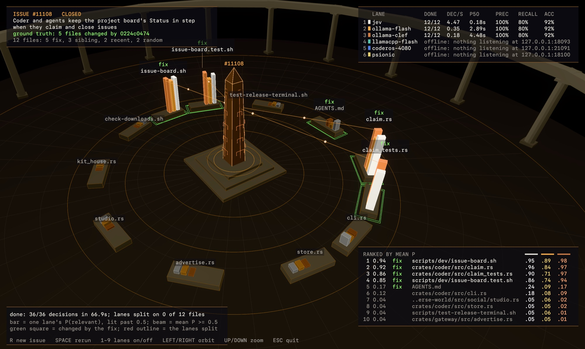

# Relevance visualizer

Status: implemented October 9, 2026 (#11208). It is a `verse` example, so it
is never part of a release build.

The visualizer compares decision backends on one question: "Is this file
relevant to solving this issue?" It takes an issue from this repository,
picks a set of candidate files, and asks every backend about every file at
the same time. Each answer arrives as a probability with its latency. When
the issue was closed by a commit on main, the files that commit changed are
the ground truth, and each backend gets precision, recall, and accuracy.
The run streams to the terminal, or plays out as a Verse scene.



## Run it

From a checkout of this repository:

```sh
# A random closed issue with a fix, every default lane, in a window
cargo run -p verse --example relevance -- --random --visual

# One issue, two lanes, in the terminal
cargo run -p verse --example relevance -- --issue 11199 --backends jev,ollama-flash

# The owner's first spelling still works: one Clef lane by server and size
cargo run -p verse --example relevance -- --random --backend clef-ollama --model clef-flash

# One frame to a PNG, without a window, when the run ends (or after --wait seconds)
cargo run -p verse --example relevance -- --issue 11108 --capture /tmp/relevance.png
```

It needs `gh` signed in, for the issue's title and body, and `origin/main`
in the checkout. The binary reads the repository it is run from.

| Flag | Meaning |
| --- | --- |
| `--issue N` | This issue. When it is closed and a commit on main names it as `(#N)`, the commit's files are the ground truth. |
| `--random` | The default: a random closed issue from the last 2,500 commits on main that has a fix commit changing one to eight files. |
| `--random --open` | A random open issue. It has no ground truth. |
| `--files K` | Candidate files (default 12). |
| `--backends a,b` | The lanes, from the table below (default: all of them except `llamacpp-27b`). |
| `--conc C` | Requests in flight per lane (default 1, so a lane's latency is its own). |
| `--timeout S` | Seconds per request (default 180). |
| `--seed S` | Replays the issue, the files, and their order. |
| `--visual` | Opens the scene. |
| `--capture PNG` | Renders one frame off screen instead of opening a window: `--size` physical pixels (default 2880x1720) at `--scale` (default 2, a Retina window's). |

## The lanes

The lanes run in parallel on the same files, in the same shuffled order. A
lane that cannot be reached shows as offline and does not slow the others.

| Lane | Server | Model | Color |
| --- | --- | --- | --- |
| `jev` | `https://api.typesafe.ai` | `jev-latest` | marble |
| `ollama-flash` | Ollama, `127.0.0.1:11434` | `clef-flash` | amber |
| `ollama-clef` | Ollama, `127.0.0.1:11434` | `clef` (27B) | copper |
| `llamacpp-flash` | llama.cpp on the Mac, `127.0.0.1:18093` | Clef-Flash Q4_K_M | verdigris |
| `llamacpp-27b` | llama.cpp on the Mac, `127.0.0.1:18094` | Clef Q4_K_M | Tyrian purple |
| `coderos-4080` | llama.cpp on CoderOS's 4080, tunneled to `127.0.0.1:21091` | Clef-Flash Q4_K_M | Egyptian blue |
| `psionic` | Our own `/v1/systemone`, at `PSIONIC_SYSTEMONE_URL` (default `127.0.0.1:18100`) | `clef-flash` | gilt |

The ports are the ones the relevance benchmark uses
(`scripts/bench/clef-relevance-bench.py`), and
[Clef self-hosting](../inference/clef-self-host.md) explains how to start
each server. `psionic` is the slot for the native door that
[Clef native](../inference/clef-native.md) plans. Until that door exists,
the lane is offline.

The Jev lane reads `TYPESAFE_API_KEY` from the environment. When it is not
set, the lane reads the key from `~/work/.secrets/typesafe.env`. The key is
never printed. Every lane goes through `crates/jev`: `jev::Config::local`
for the loopback servers, and the ordinary authenticated configuration for
TypeSafe.

## The question

Each file is one System One request, in the same shape the benchmark's
`seq` mode sends, so the visualizer's numbers can be read beside its
results. The state is:

- `RUN <nonce>`, which changes on every run so that Ollama's prompt cache
  never answers a repeated run;
- `ISSUE #N: title` and the body, cut at 6,000 characters;
- `FILE: path` and the file in a fenced block, cut at 4,096 bytes.

The request asks one question, `relevant`, of type `noul`: "Is this file
relevant to solving the issue?" A probability of 0.5 or more counts as
relevant.

## How the files are picked

The issue's text plays no part in picking files. Deciding which files an
issue is about is exactly the judgment being measured, and a keyword match
on the issue would route that judgment around the model. The workspace
rules forbid that kind of routing. The candidates come from four pools,
each one structural:

| Pool | Share | What it is |
| --- | --- | --- |
| fix | up to half | Files the fix commit changed. These are the ground truth. |
| sibling | up to a quarter | Files in the same directory as a fix file that the fix did not touch. These are hard negatives, picked the way the benchmark's dataset picks them. |
| recent | half of the rest | Files in directories that the last 60 commits on main touched. |
| random | the rest | Any file in the repository. |

Only tracked source and document files of at least 400 bytes are picked.
Lockfiles and files under fixtures, generated output, traces, and
artifacts are left out. Files are read at the fix's parent commit, which is
the code as it stood while the issue was open. A file the fix created is
read as that commit added it. An issue without a fix is read at
`origin/main` and draws only on the recent and random pools.

## The scene

The scene is a Greco-futurist plaza at dusk, in the palette of
[Greco-futurism](greco-futurism.md):

- **The issue** is a bronze obelisk on a stepped podium in the center. It
  has amber edges and copper circuit traces, and its number floats above
  it. A halo at its foot breathes while the lanes run.
- **Each file** stands on a stone plinth around the obelisk, grouped by
  directory with a gap between groups. Its name floats above it.
- **Each lane** has one bar on every plinth, in the lane's color. A bar is
  a dim stub until its answer arrives. Then it rises to a height
  proportional to that lane's probability and flares. A bar past 0.5 stays
  lit, and a bar under 0.5 stays dark.
- **Ground truth:** a laurel-green square frames each file the fix
  changed, and the label "fix" floats over it.
- **Disagreement:** when the lanes split across 0.5 on a file, its plinth
  flashes a red outline.
- **Beams** of amber light run from the obelisk to every file whose mean
  probability across the lanes is 0.5 or more. Sparks travel along them.
- **The scoreboard** (top right) shows each lane's progress, decisions per
  second, median latency, and, with ground truth, its precision, recall,
  and accuracy. A lane with no answer yet says why instead of showing
  dashes: offline and the reason, its last error, "loading clef into
  Ollama" when Ollama's `/api/ps` shows the model is not in memory, or how
  long its first request has waited.
- **The ranking** (bottom right) lists the files by mean probability, with
  each lane's probability in the lane's color.

File names that would overlap move up (or down) a row until they are
clear, with a thin leader to their plinth; ground-truth and relevant files
keep their place first.

The window renders the scene and the overlay at the display's backing
scale: on a Retina display the HUD font is rasterized at physical pixels
(13 points at 2x is 26 pixels) and laid out in points, the same way
`verse`'s own window does it (`ui_atlas` in `crates/verse/src/app.rs`).
Moving the window to a display of another scale rebuilds the renderer.

The camera orbits slowly. The keys are:

| Key | Does |
| --- | --- |
| R | Loads a new random issue. |
| Space | Runs the same files again, with a new nonce and a new order. |
| 1 to 9 | Turns a lane on or off, by its scoreboard number, and reruns. |
| Left, Right | Turns the orbit. |
| Up, Down | Moves the camera in and out. |
| Esc | Quits. |

When a run ends, and again when the window closes, the comparison table is
printed to the terminal.

## The comparison table

The terminal mode streams one line per answer, then prints the ranking and
the lanes:

```text
rank  mean truth      jev ollama-f ollama-c  file
   1 0.825 fix      0.880    0.684    0.909  crates/bunny-web/src/app.rs
   ...
lane              done   dec/s     p50     p90   prec recall    acc  err  model
jev              12/12    6.37   0.15s   0.18s   100%    83%    92%    0  jev-latest at https://api.typesafe.ai
ollama-flash     12/12    0.27   4.09s   4.99s   100%    50%    75%    0  clef-flash at http://127.0.0.1:11434
ollama-clef      12/12    0.11   9.18s   13.0s   100%    83%    92%    0  clef at http://127.0.0.1:11434
```

### Why an Ollama lane can sit at 0/12

Ollama unloads a model five minutes after its last request. The next run
loads it again before answering: about 8 seconds for Clef-Flash and about
33 seconds for Clef 27B on the M5 Max, while Jev finishes all 12 files in
about 2 seconds. Both Clef lanes share one Ollama, so they also wait on
each other and on any other client (a benchmark, say). The scoreboard now
says "loading clef into Ollama" in that case. A rerun (Space, R, or a lane
key) abandons the last run's requests in flight, so it does not queue
behind them.

`dec/s` counts one lane's answers over that lane's own time, from its
first request to its last answer. Lanes that share a server, as the two
Ollama lanes do, slow each other down. To time one server alone, run its
lane by itself. For throughput, use the benchmark, which controls for
warmup, concurrency, and the cache.

## Code

The example lives in `crates/verse/examples/relevance/`:

| File | Holds |
| --- | --- |
| `cases.rs` | The case, the lanes, candidate selection, the request, and scoring. Has unit tests. |
| `source.rs` | Reading the issue with `gh`, and the fix and the files with `git`. |
| `run.rs` | The lanes in parallel on a Tokio runtime, the reachability probe, and the scoreboard. Has unit tests. |
| `scene.rs` | The models (made in code, unlit, with the shading baked into the face tints), the layout, and the overlay. Has unit tests. |
| `main.rs` | Flags, the terminal mode, the window, and the capture. |

Run the tests with:

```sh
cargo test -p verse --example relevance
```
