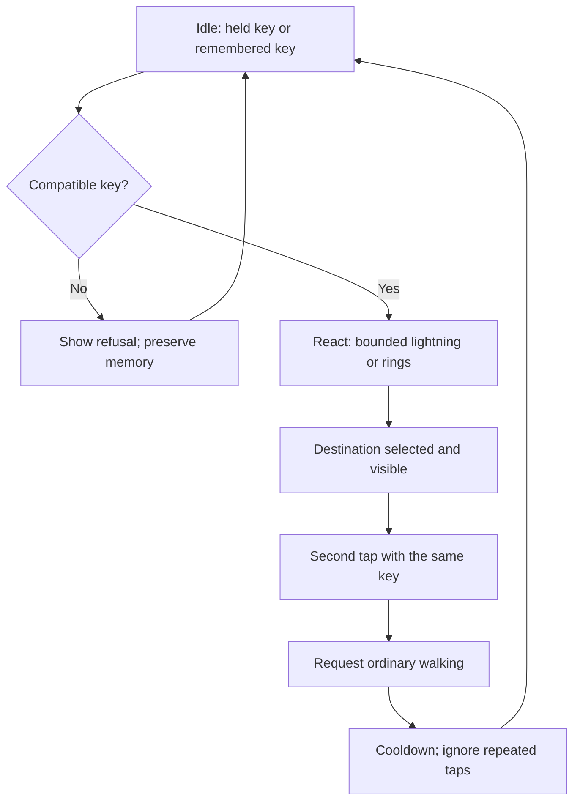

# Maps, companions, and doors

This ordered implementation extends the shared Verse world in Coder.
Map navigation [#9720](https://github.com/OpenAgentsInc/openagents/issues/9720),
companion interaction [#9721](https://github.com/OpenAgentsInc/openagents/issues/9721),
and door demos [#9722](https://github.com/OpenAgentsInc/openagents/issues/9722)
ship together in internal TestFlight **0.5.0 (46)** with the mobile connection
corrections in [#9718](https://github.com/OpenAgentsInc/openagents/issues/9718).
See the [checks and release receipt](../../bins/coder-ios/verification/2026-09-26-world-interactions/README.md).
Physical-device acceptance remains separate.

## Map navigation

The compact map sits at the top right, below the system status area. Tap it to
expand. The expanded map shows the seeded city's building footprints and named
wards, your position, destinations, and your remaining route. A slow scanning
line and breathing destination marker show activity without another status
banner. Eight landmark shortcuts target clear approaches to the Computer, Gym,
Oracle, Library, proving ground, plaza, Spark gate, and Halo gate. Routes remain
visible where they cross the compact map's edge. The overlay hides when the
available viewport is too small to display its controls.

Tap a clear map position or landmark to walk there. The map folds away while
the character walks. Reopen it to inspect the route or select **Stop walk**.
On desktop, `M` toggles the map and `Esc` closes it or cancels the route. Manual
movement or jumping cancels automatic walking; camera-only input can continue.
Opening an application panel or backgrounding stops the route. A blocked
position produces a map error and stops an earlier route instead of silently
substituting a different destination.

Navigation plans a bounded route around the same inflated collision footprints
as the player controller, including the Gym's real entrance. The character
walks through that controller at ordinary speed. Clicking the map never
teleports the player through a building. Destination coordinates are local
world positions, not relay addresses, URLs, commands, or grants.

The map and its animation draw through Verse's existing Rust GPU overlay. Rust
also owns click capture, coordinate projection, route state, and bounds. Native
adapters supply safe areas, pointer contacts, and accessibility callbacks.
Product styling remains in `coder-ui`; Rust Native remains a generic drawing
surface foundation.

## Companion interaction

Tap the nearby floating companion to make it wiggle and hop. The reaction lasts
0.9 seconds, and accepted taps have a 1.5-second cooldown. Repeated taps do not
queue reactions. The companion continues following the player and returns to
its normal idle behavior afterward.

Rust checks the actual spade geometry within four meters, including occlusion
by the world, the player, and the remote entities in the last displayed frame.
The ground ring is not a target. Map and application controls take input first;
a drag, cancelled contact, pinch, or replay cannot trigger the reaction. On
desktop, a short click activates it; dragging from the companion resumes camera
orbit. Mobile exposes the same action through accessibility.

This is a local animation with no model call. An existing world connection may
continue publishing its ordinary NIP-MV pose frames; the tap adds no new grant,
service request, or persistent interaction record.

## What the existing doors mean

The oracle arch marks where replayed agents ask typed decision questions. Its
shape visualizes a model *door*, an endpoint with a declared contract. A replay
visiting that arch does not call a model. The Gym doorway is a physical opening
in collision geometry. Entering the Gym starts observation only under an
existing, separate Gym grant.

Neither structure currently defines general cross-world travel. The local gate
demo adds an explicit, inspectable routing layer. Local demo routes to the Gym stop
outside its observation boundary. A visual key is an item in the demo, not a
signing key, pairing invitation, or authorization credential.

## Spark and Halo demo gates

Two small arches in the plaza are local route selectors. **Spark** uses
jagged amber lightning; **Halo** emits rising rings. Their labels and selected
destinations belong to depth-tested world geometry. Foreground structures can
hide both the arches and their labels.

Use the expanded map's gate shortcuts to approach. Near the front of a gate,
a compact Rust-drawn strip offers **Prism**, **Ring**, **Bolt**, **Empty**, and
**Reset**. A small shape beside the avatar shows the held item. The strip
appears only near an available gate and stays above native camera controls.
It hides while the map is expanded or an application panel is open.

1. Choose an item, then tap the gate for its effect and destination.
2. Read the destination on the gate. Tap again after the effect to walk there.
3. Select **Empty** to reuse that gate's remembered compatible key.
4. Select **Reset** to clear that gate's choice. Other gates keep their memory.

An incompatible key shows a refusal and leaves the previous compatible key
intact. Changing the held item clears transient selection, so the next tap
previews its result before walking. Keys are reusable demo objects. They are
not Nostr signing keys, invitations, host grants, or payment proofs.

| Gate | Prism | Ring | Bolt |
| --- | --- | --- | --- |
| Spark | Library approach | Does not fit | Gym approach |
| Halo | Proving ground approach | Oracle approach | Does not fit |

The local destinations use the same clear approaches as the map. The Gym
route stops outside its observation boundary. Walking inside afterward remains
a separate player action under the existing Gym connection's authority.

### State and input



The reducer owns two fixed gate slots, a closed item catalog, and finite
animation timers. A reaction lasts 0.8 seconds; travel enters a 0.5-second
cooldown. Repeated taps do not queue effects. Reset clears selection and memory
for one gate and cancels only walking attributed to that gate. A failed route
remains a visible failure; it does not teleport the player or substitute an
unannounced destination.

A valid tap must start and end on the visible gate, remain within the tap
movement/time bounds, and pass shared Rust range, front-face, and ray occlusion
checks. Static geometry, the local avatar/companion, and the last presented
remote geometry can block a hit. Picking does not advance remote interpolation.
A visible part of the gate remains tappable when another object hides its
center. Contextual controls and accessibility instead require their advertised
anchor to remain visible.
Map and item-strip contacts take precedence over world controls. Drags,
cancelled contacts, and recognized pinches do not activate gates. Door taps
clear the pending double-tap jump candidate.

Native accessibility exposes the current closed item and gate actions. Rust
rechecks their eligibility when invoked; native labels are not permission.
On desktop, `1`–`4` select Prism, Ring, Bolt, or Empty, `5` resets the
nearby gate, and `F` taps it. These shortcuts are active only while its item
strip is visible; replay speed and movement keys retain their existing meaning.
Mouse and keyboard reach the same domain operations. Backgrounding,
replay, and application panels clear transient interaction and pending input.
Active world frames drive effects; no animation or route catches up after an
inactive interval.

### Bounded visual effects

Spark uses deterministic short zigzag paths. Halo uses a fixed number of rising
segmented rings. A gate identity, reaction count, and bounded elapsed time
select the geometry. There is no accumulating particle list, texture download,
shader injection, random model call, or unbounded spawn loop. All colors use
Coder's amber intensity palette. The generic `rust-native` crate gains no Coder
items, game rules, colors, or credentials.

### Persistence

Rust exports a canonical document, at most 2 KiB, with the held item and each
gate's last compatible key. A changed choice advances its revision; restoration
establishes a fresh baseline without writing the same document again:

```json
{"v":1,"world":"verse-plaza","definition":"demo-doors-v1","held":"prism","last":[null,"ring"]}
```

The fixed slot order is Spark, then Halo. Rust rejects unknown versions,
world/definition names, extra fields or slots, and incompatible saved keys.
A corrupt or future document does not partially import state. The session can
use defaults with a visible storage/validation error; the first frame does not
silently overwrite the original saved document.

Animation phases, clocks, route plans, and pointer contacts are not saved.
Restoring a valid choice never resumes travel or an effect. iOS uses a separate
device-only Keychain record; Android uses its encrypted atomic device store.
Desktop uses a profile-scoped owner-only file. Synthetic acceptance has its
own storage scope. These records contain no pairing or relay credentials.

Native adapters observe the synchronous Rust result and attempt one write per
changed revision, rather than writing from delayed view updates or every frame.
A failed save leaves the session usable, reports that the choice was not saved,
and supports an explicit retry. Reset writes a new document when it removes a remembered key; resetting an
already empty gate does not cause a redundant write. Desktop writes to
`<profile>-verse-plaza-doors.json` in `VERSE_HOME` or
`~/.openagents/verse/`. It retries a failed save on the next admitted gate action.

## Nostr and future service doors

This demo adds local object state and navigation. When a world connection is
active, ordinary NIP-MV avatar/companion pose frames can show movement and the
companion's reaction. They do not transmit a held-item inventory, route grant,
or authoritative portal transition. Older clients can share presence without
rendering these new local objects; interoperable geometry negotiation remains
future work.

| Concern | Existing foundation | Further work before claiming support |
| --- | --- | --- |
| World identity and presence | [NIP-MV](../../nips/openagents/NIP-MV.md) world definitions, entity states, and pose frames | Pin and validate the world-definition address, revision/digest, geometry profile, coordinate system, and arrival bounds. |
| Remembered personal choices | Device-local validated gate document | An owner-only [NIP-78](../../nips/official/78.md) settings profile, privacy/encryption policy, and explicit conflict resolution. Local persistence does not imply synchronization. |
| Public or transferable items | No implemented inventory protocol | Ownership, transfer/double-use rules, provenance, and authority checks in a reviewed protocol. Cosmetic shapes do not establish ownership. |
| Travel to another relay/world | Existing independently chosen world connection | Preview disclosure and destination, admit the target definition, explicitly approve any relay change, retain source state until successful admission, and provide a safe return. |
| Model or program door | [NIP-CAP](../../nips/openagents/NIP-CAP.md), [NIP-CJ](../../nips/openagents/NIP-CJ.md), and [NIP-POL](../../nips/openagents/NIP-POL.md) | Bind the visible destination to a verified capability/implementation and separately admitted action, budget, and receipt. |
| Computer access | [NIP-HOST](../../nips/openagents/NIP-HOST.md) and [NIP-REACH](../../nips/openagents/NIP-REACH.md) | Existing scoped grants still apply; an object interaction cannot enroll a host or expand access. |
| Downloadable world components | [NIP-EXT](../../nips/openagents/NIP-EXT.md) release identities | A reviewed supported component set and host admission. A signed manifest must not become arbitrary executable content. |

A future portal request should be a typed preview followed by explicit
admission, not an arbitrary URL or command hidden inside a key. An unsupported
world definition or failed destination connection leaves the player in the
source world. The app should expose the chosen destination, active definition,
and reason for refusal without filling the normal view with transport details.

Service execution is a separate operation from walking or visual effects.
Pairing, model work, training launches, paid labor, and Lightning settlement
keep their own scopes, confirmations, prices, limits, and retained receipts.
A successful animation proves none of those operations occurred.

## Iteration plan

| Stage | Scope | Evidence needed |
| --- | --- | --- |
| This local demo | Two gates, fixed keys, bounded effects, local memory, ordinary walking | Reducer, geometry, picking, persistence, and real native input checks. |
| Interaction refinement | Tune reach, labels, effect timing, item selection, map scale, and motion accessibility | Physical-device feedback and frame-time measurements, without expanding authority. |
| Authored destinations | Signed definitions and supported local geometry/component contracts | Pin validation, compatibility refusal, safe placement, and migration tests. |
| Cross-world travel | Explicit target relay/world admission and return | Failed-join recovery, disclosure, lifecycle, and peer compatibility evidence. |
| Authorized service doors | A visual front end to existing typed service operations | End-to-end authority, bounded execution, cost, cancellation, and receipts. |

## Ordered delivery

| Issue | Deliverable | Acceptance |
| --- | --- | --- |
| #9720 | Shared navigation, expandable map, and native input adapters | Select a real map position, follow a collision-safe route, cancel, and preserve camera/gesture behavior. |
| #9721 | Companion tap and playful bounded emote | A visible tap animates the companion; drags and occluded targets do not. |
| #9722 | Reactive doors, held demo items, destination memory, and portal specification | Inspect and change destinations, see distinct bounded effects, and exercise local routes without service execution. |

The simulator establishes rendering and adapter behavior. It cannot establish
physical-device sensor quality or two-thumb comfort. No model or benchmark
runs are part of this work. A single combined TestFlight build follows the
ordered acceptance checks.
