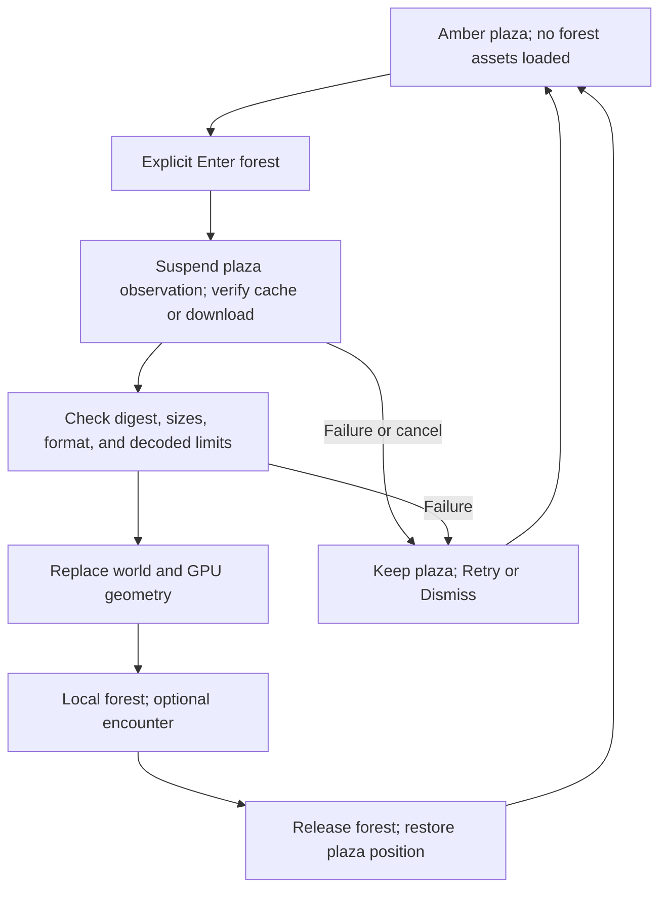

# Loaded zones and the Atlantis forest

Verse opens in the shared amber plaza. A separate forest portal loads
**Atlantis forest**, a local scene with its own green and earth-tone appearance,
animated wizards and zombies, and an optional fifth-edition encounter. The
forest's heavy geometry is fetched and decoded only when the player enters.

This page describes the source implementation. Release and device acceptance
belong in the [iOS](../../bins/coder-ios/README.md) and
[Android](../../bins/coder-android/README.md) build records. It does not claim
that a new TestFlight build or a shared forest session has been verified.

## Enter and return

Use the expanded map's **Forest portal** shortcut to approach the new arch in
the plaza. Tap its opening or select **Enter forest** when in reach. This portal
is separate from the Spark and Halo local walking demos.

The loading control shows progress and **Cancel**. The plaza remains the active
scene until the pack passes content and decode checks. A failed load leaves it
available and offers **Retry** or **Dismiss**. Entry never runs a model or starts
a benchmark. Walking past a portal does not fetch the forest pack.

Inside the forest, explore with the usual movement, camera, and map controls.
Wizards and zombies use sampled animations from the original Ruins of Atlantis
models. The optional **Encounter** control starts the local rules demo;
**Fire Bolt**, **End turn**, and **Reset** operate it. **Plaza** returns without
requiring an encounter win. The return portal supplies the same destination.
Return restores the saved plaza position and releases the forest's decoded
geometry and active GPU buffers. The verified asset file can stay in the disk
cache for the next visit.

The forest is a new Verse rendition of the source artwork, not the entire Ruins
of Atlantis executable or its original terrain and combat engine. It uses a
flat walking world, a clear encounter area, trees, and a small group of animated
characters. Per-pixel textures, normal maps, full skeletal interpolation,
terrain physics, and the source game's wider systems are not imported.

## Zone identity, appearance, and simulation

A *loaded zone* is an independently loaded scene. It differs from a named
district used by ZONE chat inside the plaza. Each loaded zone has a distinct
world ID even if no relay is connected.

| Concern | Amber plaza | Atlantis forest |
| --- | --- | --- |
| World ID | `verse-plaza` | `atlantis-forest-v1` |
| Presentation | Coder's four amber intensities on near-black | Forest colors, baked model colors, and independent fog |
| Geometry | Built by the shared Rust world | Reviewed on-demand pack plus a Rust-authored clearing and trees |
| Physics | Shared flat-ground walking, collision, and jump controller | `verse.walk-flat.v1`; the same controller with forest bounds and tree footprints |
| Rules | Exploration and existing product interactions | Exploration, plus optional `srd-5.1-encounter-v1` |
| Network | Existing NIP-MV plaza presence; separate Gym connection | Local-only; no shared combat, presence, or forest chat |

The amber palette rule belongs to the plaza and Coder application UI. It does
not apply to every world asset. Forest colors and atmosphere belong to Verse's
zone implementation. Rust Native remains a product-independent surface and UI
foundation; it gains no forest, Coder colors, or game rules.

The [encounter rules](zone-rules.md) pin SRD **5.1**, distinguish the authored
wizard statistics from the Zombie reference, and list the implemented subset.
The full fifth-edition game is not implemented. A scene's appearance, its
physics, and its game rules remain separate choices for future creators.

## Asset loading and cache

[`zones/assets.rs`](../../crates/verse/src/zones/assets.rs) loads a single
reviewed pack from an HTTPS locator. Its compiled content pin is:

| Property | Value |
| --- | --- |
| Pack | [Content-addressed forest pack](../../assets/verse/forest/7c1535256a4687e70a0f624f4b97c651bfd0b36ba91347a09041698ef8d246a7.vzp) |
| Exact transfer size | 6,629,578 bytes, about 6.6 MB |
| SHA-256 | `7c1535256a4687e70a0f624f4b97c651bfd0b36ba91347a09041698ef8d246a7` |
| Format | `verse-zone-pack-v1`, with bounded triangle meshes and sampled animation frames |
| Current decoded pack geometry | About 12 MiB of face vertices; this excludes world instances, GPU buffers, and temporary transfer storage |

The pack is not embedded in the application binary or downloaded during plaza
startup. Configuring its cache directory starts no file read or transfer.
Explicit entry creates one background worker. It first checks a content-addressed
cache file; otherwise it downloads, verifies the exact byte count and digest,
decodes, and installs the cache file atomically. Redirects are refused. The URL
is a locator: serving different bytes at that URL cannot alter the accepted
pack, although unavailable original bytes can prevent a fresh entry.

The asset filename contains its digest. Retain earlier pack files when publishing
new versions so an older app can still load its reviewed content. The baker writes
the digest filename and its checksum; it does not replace another revision.

Cache reads on the supported Unix hosts use no-follow file opens and validate
the opened regular file. Unsupported hosts refuse local file loading rather than
weakening that check. A successful verified cache hit or atomic installation
prunes only explicitly listed older forest digests and recognized forest temporary
files older than 24 hours. It preserves the current pack, recent transfers,
symlinks, and unknown files. Cleanup is best effort, bounded to 32 known revisions
and 256 directory entries per pass. When updating the pack, retain the old digest
in `FOREST_PACK_HISTORY` so older forest cache entries can be reclaimed. Invalid
entries remain in place until a replacement download passes every check.

The decoder checks finite coordinates, triangle counts, animation timing,
trailing bytes, and cumulative allocation before constructing the assets. Its
defense-in-depth limits are 25 MiB of transferred data, 96 MiB of decoded
vertices, 400,000 vertices per mesh, and 24 frames per animation; the admitted
pack's exact size is tighter than the general transfer bound. These decoder
limits do not claim a bound on all renderer or driver allocations.

Cancellation prevents late worker results from replacing the scene. A cancelled
worker must finish before another transfer starts. Returning drops live forest
assets while keeping its verified cache entry. A cache miss, invalid cache, or
download failure never silently substitutes unrelated artwork.

The [pack documentation](../../assets/verse/forest/README.md) records the baker,
sampling choices, source commit, original input hashes, and notices. Its
provenance record retains the unresolved asset-specific attribution for the
wizard and zombie; the repository's code license is not a claim that those
upstream asset records have been recovered.

## Entry state



Scene transition clears movement/navigation and transient interaction state.
The loader's generation is separate from the active scene. The renderer replaces
its world buffers when the zone revision changes instead of keeping every
zone's geometry resident. Shared native surface activation and disposal still
control rendering; a background interval does not advance encounter turns.

## Nostr scope and current limits

Plaza presence and Gym observation pause during loading and the forest visit.
Returning resumes the configured plaza behavior. The forest does not publish
coordinates under `verse-plaza`, reuse its crowd, or silently join a different
relay. A failed offline-state delivery remains possible, so other clients still
need to expire stale presence.

[NIP-MV's scene manifest profile](../../nips/openagents/NIP-MV.md#scene-manifest-profile)
is **Designed**. It pins a `33300` definition event and an exact scene manifest,
can use NIP-94 asset locators, and separates content identity from host admission.
The current app does not discover, publish, or load arbitrary signed scene
definitions. The curated forest catalog is a local implementation, not evidence
that the proposed Nostr authoring contract is complete.

The forest is also not a multiplayer combat server. Its local dice, HP, turns,
and NPCs are not shared authoritative state. A future shared rules profile
needs admitted actors, sequence and replay semantics, exact rules versions,
recovery, and explicit authority. Signing a pose is insufficient.

## Manifest contract and authoring roadmap

The current Rust `Manifest` admits exactly this six-field document:

```json
{
  "schema": "verse.zone.v1",
  "world": "atlantis-forest-v1",
  "ruleset": "srd-5.1-encounter-v1",
  "physics": "verse.walk-flat.v1",
  "asset_sha256": "7c1535256a4687e70a0f624f4b97c651bfd0b36ba91347a09041698ef8d246a7",
  "asset_bytes": 6629578
}
```

Unknown fields and values refuse. The host fixes the palette, bounds, arrivals,
collision construction, and asset interpretation. This is a closed admission
contract for the reviewed forest, not a general downloadable game format.

Future creator support needs a new schema version that makes those currently
compiled choices explicit. The order is:

1. Publish and validate exact world-definition and manifest pins, including
   identity, units, bounds, spawn/return placement, and supported format IDs.
2. Admit asset manifests with resource budgets, provenance, supported media,
   content-addressed availability, cancellation, and cache eviction behavior.
3. Add reviewed presentation, physics, and rules profiles with versioned
   configuration and coverage. Refuse unsupported required behavior.
4. Add safe travel between independently admitted worlds and relays, including
   source recovery and destination disclosure.
5. Add shared simulation only with a separately reviewed authority and recovery
   protocol. Then add creator tooling over those admitted contracts.

Creators select host-supported behavior; an asset manifest does not inject
scripts, native code, arbitrary shader programs, model calls, or spending.
[NIP-EXT](../../nips/openagents/NIP-EXT.md) can distribute reviewed definitions
and schemas but does not grant execution merely because a package is signed.

The L1 spaceship-construction station remains **design only**. Its future
physics profile needs explicit celestial bodies, reference frame, units,
gravity approximation, time step, rigid-body constraints, save/load, and
collaborative edit authority. None of those behaviors follow from loading a
space-themed scene. See [the L1 design](zone-rules.md#l1-construction-station-design-only).
