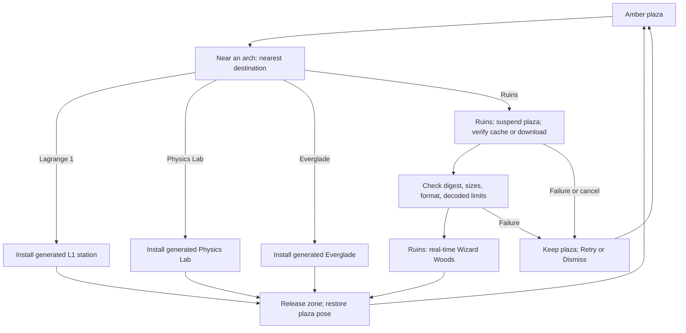

# Loaded zones: Ruins, Lagrange 1, Physics Lab, Everglade, and building new zones

Verse opens in the shared amber plaza. Four portal arches on the plaza lead to
separately loaded **zones**:

- **Ruins** (west arch, `RUINS`): the original Ruins of Atlantis Wizard Woods
  real-time combat on its retained heightfield. Models download on first entry.
- **Lagrange 1** (east arch, `LAGRANGE 1`): a construction station on a
  Lissajous orbit about the Sun–Earth L1 point, with restricted three-body
  orbital mechanics, station-keeping, and rigid-body EVA construction. Its
  geometry is generated in Rust; nothing is downloaded.
- **Physics Lab** (north arch, behind the spawn, `PHYSICS LAB`): a sandbox that
  runs each mechanism of the shared [`physics`](../../crates/physics/) crate
  live, with a scenario selector and parameter knobs. Its geometry is
  generated in Rust; nothing is downloaded.
- **Everglade** (southwest arch, `EVERGLADE`): the forest glade where the
  [Agent Studio](agent-studio.md) will live ([specification](everglade.md)).
  Its ground is generated; its trees, workshop, and station furniture come
  from a pinned pack of CC0 Quaternius models that loads on entry.

A *loaded zone* is an independently loaded scene with its own world ID,
presentation, physics profile, and rules profile. It differs from the named
districts used by ZONE chat inside the plaza.

This page describes the source implementation. Release and device acceptance
belong in the [iOS](../../bins/coder-ios/README.md) and
[Android](../../bins/coder-android/README.md) build records.

## Zone catalog

| Concern | Amber plaza | Ruins | Lagrange 1 | Physics Lab | Everglade |
| --- | --- | --- | --- | --- | --- |
| `ZoneId` / serialized ID | `Plaza` / `plaza` | `Ruins` / `ruins` | `Lagrange1` / `lagrange1` | `PhysicsLab` / `physics_lab` | `Everglade` / `everglade` |
| World ID | `verse-plaza` | `ruins-v1` | `verse-lagrange-1` | `physics-lab-v1` | `verse-everglade` |
| Presentation | Coder's four amber intensities on near-black | Forest greens, baked model colors, fog 24–82 m | Vacuum black, direct sunlight from −Z, fog only at the 1–2 km sky shell | Dark blueprint hall, cyan edges on dark faces, fog 30–90 m | Daylight sky with clouds and sky-colored fog on a lit stage, textured Quaternius models with alpha-tested foliage, fog 40–170 m |
| Geometry | Shared Rust world | Pinned on-demand pack plus retained heightfield and voxel ruins | Procedural station, stars, Sun, Earth, and Moon | Procedural hall, railed stage, and scenario bodies | Generated heightfield (flat 34 m clearing rising to the 58 m tree ring) and a pinned textured pack: tree ring, workshop hall, yard, and station furniture, with Verse-drawn boards |
| Physics | Flat-ground walking, collision, jump | `ruins.heightfield.v1`: original controller on the retained heightfield | Sun–Earth CR3BP orbit, linearized L1 field locally, rigid bodies, cold-gas EVA pack ([details](lagrange-1.md)) | Flat-ground walking; nine `physics` crate scenarios at 1/120 s ([details](physics-lab.md)) | Plaza walking and jumping over the heightfield |
| Rules | Exploration and product interactions | `ruins.wizard-woods.v1`: retained real-time ECS | Construction sandbox: grab, carry, latch | Sandbox: choose a scenario and turn knobs | Exploration; the caption names the station in reach |
| Assets | Built in | 6.6 MB verified pack, cached on disk | None | None | 13.4 MB verified pack, cached on disk |
| Network | NIP-MV plaza presence; Gym connection | Local-only | Local-only | Local-only | Local-only |
| Code | [`world.rs`](../../crates/verse/src/world.rs) | [`zones/ruins.rs`](../../crates/verse-zone-ruins/src/lib.rs), [`verse-ruins`](../../crates/verse-ruins/) | [`zones/lagrange/`](../../crates/verse-zone-lagrange/src/lib.rs), [`pbr`](../../crates/verse-pbr/src/pbr/mod.rs), [`verse-lagrange`](../../crates/verse-lagrange/) | [`zones/lab/`](../../crates/verse-zone-lab/src/lib.rs), [`physics`](../../crates/physics/) | [`zones/everglade/`](../../crates/verse-zone-everglade/src/zones/everglade/mod.rs) |

The amber palette rule belongs to the plaza and Coder application UI, not to
every world. Zone colors belong to Verse's zone implementation. Rust Native
remains product-independent; it gains no zone, Coder colors, or game rules.

## Enter and return

Expand the map and choose **Ruins portal**, **L1 portal**, **Lab portal**, or
**Everglade portal** to walk to an arch. Near an arch, tap its opening or
select the HUD control (**Enter Ruins**, **Enter L1**, **Enter Lab**, or
**Enter Everglade**). The nearest arch decides the
destination. Desktop uses **F**.

- **Ruins** and **Everglade** show loading progress with **Cancel**. The plaza
  stays active until the pack passes content and decode checks. A failed load
  keeps the plaza and offers **Retry** or **Dismiss**. Walking past an arch
  never fetches a pack.
- **Lagrange 1** and the **Physics Lab** install immediately because their
  geometry is generated.

Inside a zone, **Plaza** returns without requiring a win or a finished build.
Return restores the saved plaza position and releases the zone's geometry,
simulation, and GPU buffers. The Ruins and Everglade packs can stay in the disk cache.
Re-entering any zone starts a fresh local simulation.

The OpenAgents app's bare world (the Grid) has one walk-in arch instead, to
Lagrange 1, with no button: walking through its opening enters, and flying
through the station's return arch comes back in front of the Grid's arch
([`zones/gate.rs`](../../crates/verse/src/zones/gate.rs)). Entered from the
Grid, Lagrange 1 draws its guides, overlays, arch, and panel in the neutral
palette. See [the Grid's portal](mobile.md#the-grids-portal-to-lagrange-1).

On the desktop, a `~/.verse/ritual.json` (or `verse --ritual CONFIG`) adds a
third arch to the Grid, `RITUAL`, centered beyond the blocks. It pins an
authoritative chamber the desktop trusts out of band: the host's address and
instance, its DER certificate, and the local pack, scene, and asset directory
whose content identity the host checks
([`ritual.rs`](../../crates/verse-imported/src/ritual.rs)). Walking through the arch
opens the chamber in its own window, signed by the profile key, which a
public host admits as a guest (`docs/cli/README.md`, "Public chambers").
While that window is open the Grid's presence, chat, feed, XP, and board
pause as in a zone; closing it puts the player back in front of the arch.
`verse --no-ritual` hides the arch. The chamber window needs a `verse`
built with `--features remote-chamber,imported-desktop`.

On the phone, a `ritual.json` in the app's zone cache directory opens the
same arch on the Grid. Walking through it plays the chamber on the Grid's
engine surface, signed by the phone's world identity: the left stick moves,
the look stick turns the camera, and a four-slot hotbar, **Leave**, and
**Respawn** sit over the chamber's own HUD. Backgrounding the app stops the
connection and returning reconnects to the same character. Each visit writes
`chamber-frames.json` beside `ritual.json` with the frame intervals and
actor count the phone saw. The phone and the desktop window share one client
session, `imported::chamber_session::Session`, for the transport, the
replica, and movement prediction.

### Ruins controls

Movement and combat run together. The bottom hotbar supplies **Firebolt**,
**Missile**, and **Fireball**, replacing the source game's keys 1–3 (still
available on desktop). HP, mana, and cooldowns come from the original
simulation; there is no round, movement budget, or **End turn**.
[The source audit](ruins-source-parity.md) records the runtime, behaviors,
adaptations, and rendering differences.

### Lagrange 1 controls

You fly a suited astronaut with a cold-gas maneuvering pack. The joystick or
**W/A/S/D** commands a velocity; with no input, the pack holds position
relative to the station. Tilt the camera above or below level to climb or dive
along the view; double-tap (Space on desktop) for a short climb. A map tap sets
an autopilot target at the current altitude. Thrust is 40 N, so a loaded pack
accelerates slowly: carrying the 450 kg engine cuts acceleration by about
two-thirds. Propellant refills at the airlock ring.

**Grab** takes the next part at the depot or a free-floating part within reach.
Carry it to its outlined slot on the keel jig. When the part is within 1.6 m of
the slot, aligned within 15 degrees, moving below 0.35 m/s, and turning below
0.05 rad/s, the control reads **Latch** and releasing welds it to the jig.
Releasing elsewhere lets it drift and tumble as a free rigid body.
**Unclip** lets the safety tether go, and its reel winds the loose end back to
the airlock; **Clip** clips it back on when its clip is within 3 m. The tether
and the depot lines wrap around the structure they touch rather than passing
through it. **Forces** toggles an overlay of contacts, joints, and thrust.
Six parts complete the keel: main engine, propellant tank, two keel trusses, RCS
pod, and avionics bay. [Lagrange 1](lagrange-1.md) documents the physics.

### Physics Lab controls

You walk around a railed stage where the current scenario runs. The HUD shows
the scenario, the selected knob, and two lines of readouts above two rows of
controls: **Prev** and **Next** select a knob, **-** and **+** change it,
**Reset** rebuilds the scenario, **Pause** or **Run** stops or resumes time,
**Step** advances one fixed step, and **Plaza** returns. On desktop, keys 1–8
press the controls in order. The first knob chooses among nine scenarios; the
shared knobs also set the time scale, gravity, and the debug overlay.
[Physics Lab](physics-lab.md) lists the scenarios, their knobs, and the
physics API gaps the lab works around.

### Everglade controls

You walk the plaza character over the glade's generated ground; the camera
stays above the slope. The map lists the return portal and the studio
stations, and the caption names the station whose marker you stand at.
**Plaza** returns. Station coordinates are fixed in
[`zones/everglade/mod.rs`](../../crates/verse-zone-everglade/src/zones/everglade/mod.rs)
(`STATIONS`); the textured layout replaces the markers at the same points.

### Crypt controls

The crypt lab is the candlelit hall that
[`chamber_lab.py`](../../scripts/blender/chamber_lab.py) models, with every prop
where the `crypt_lab` capture places it
([`verse-zone-crypt`](../../crates/verse-zone-crypt/src/lib.rs)). Desktop builds
carry its models (the `crypt` feature, on with `desktop`), so its arch,
`CRYPT`, stands on the plaza opposite Everglade's, and `verse --crypt` opens it
directly. Entry loads Everglade's pack, because the player walks as Everglade's
character with Everglade's hotbar: **1** or **L** levitates under the vault,
**2** to **5** cast Feather Fall, Wind Wall, Reverse Gravity, and Wall of
Stone, and Space jumps. Zooming all the way in is first person. The walls,
pillars, tables, shelves, cauldrons, cage, sarcophagus, and door block; the
floor and the dais's steps carry the player; and the camera pulls in when a
wall, a pillar, or the vault is behind it. The player arrives just inside the
heavy door, facing the hall. At the door, **F** (or **Plaza** on the panel
that shows there) opens it and returns to the plaza. Builds without the models,
such as the phones and the browser, have neither the arch nor the zone.

### The great crypt fight

`verse --crypt-fight` opens the ritual chamber's cultist fight, played alone,
in a crypt about four times the lab's floor:
[`great_crypt.py`](../../scripts/blender/great_crypt.py)'s nave, aisles,
gallery, four side chapels, entrance landing and stairs, and a dais under a
barred window, furnished with the lab's props
([`verse_world::great_crypt`](../../crates/verse-world/src/great_crypt.rs)).
The rules, the abilities, the action bar and its tooltips, health and mana,
the enemy AI, and respawn are the chamber's (`verse_world::play::Game`), and so
are the controls: W, A, S, D, Q, and E move, the mouse buttons steer and orbit,
**1** to **0** cast, Shift with a digit casts the second row, Tab and a click
target, Space jumps, the wheel zooms, **F1** restarts the fight, **F2**
restarts it with the chamber's combat agent playing, and Enter or the death
screen's button returns to the landing.

Six acolytes chant around the summoning circle while the ritual's bar fills;
each one that falls or leaves the circle slows it. Guards hold the nave,
pairs of cultists come out of the chapels in two waves, and the High Priest
throws three shadow bolts at once and, at half health, calls every chapel.
Claude sleeps on the circle until the priest falls, the player strikes him, or
the ritual completes, which wakes him empowered. Killing him ends the fight.
The authority walks, paths, aims, and keeps the camera inside with the crypt's
collision boxes and the props' footprints. Desktop builds carry the crypt's
models inside the binary (the `crypt-fight` feature, about 2.1 MB beside the
crypt lab's props, which it shares), so the fight opens from any directory;
the browser and phone builds do not carry them. The characters still come from
the repository's `assets/verse/characters`. `crypt_fight_capture OUT_DIR` in `crates/verse/examples`
renders the opening, the ritual, a fight, the boss, and a video of the run.

## Entry state



A transition clears movement, navigation, and transient interaction state and
increments `WorldRuntime::zone_revision`. Hosts compare that revision each
frame, replace the world GPU buffers, and apply the zone's atmosphere. A
suspended surface does not catch up simulated time spent in the background.

## Build and register a new zone

Zones are closed, host-supported code. A zone never downloads scripts, native
code, or shaders; an asset pack is only data. Adding one is a source change in
these places:

1. **Simulation crate (optional).** Put engine-independent simulation in its own
   crate with no renderer or I/O, as [`verse-ruins`](../../crates/verse-ruins/)
   and [`verse-lagrange`](../../crates/verse-lagrange/) do. Give it unit tests
   for its physical or rules invariants. Add it to
   [`crates/verse/Cargo.toml`](../../crates/verse/Cargo.toml).
2. **Identity.** Add a variant to `ZoneId` in
   [`zones/mod.rs`](../../crates/verse/src/zones/mod.rs) and fill in
   `world_id` (a new stable ID, versioned like `name-v1`), `label`,
   `half_extent`, `portals` (its return portal, plus a plaza arch), `sign` (arch
   lettering: A–Z, 0–9, space, `/`, `.`), and `atmosphere` (validated: colors in
   0–1, fog end at most 2 km). Serde derives the snake_case ID that native hosts
   see.
3. **Scene adapter.** Add `zones/<name>.rs` with a type that owns the zone's
   simulation and provides `world()` (static mesh and footprints),
   `move_player` (map `InputState` into the zone's physics and write back the
   shared `PlayerController`), `tick`, and a cached `dynamic()` mesh. Existing
   helpers: `crate::doors::scene_label` for text, `Mesh::cube` for amber boxes,
   or raw `Vertex` faces and lines with explicit colors. Vertex `fog` of 0
   ignores fog, which suits sky objects.
4. **State and runtime.** Add an `Option<YourZone>` to `zones::State`. In
   [`zones/runtime.rs`](../../crates/verse/src/zones/runtime.rs): install it
   (save the plaza pose, set `world`, `zone`, spawn, reset the camera, and bump
   `zone_revision`), route `update_player`, tick it in `ruins_tick`, add its
   dynamic mesh to `zone_dynamic_mesh` and `zone_dynamic_occludes`, drop it on
   `Intent::Return`, and describe its HUD controls and caption in
   `zone_snapshot`. `Intent::Enter` dispatches on the nearest portal's
   destination.
5. **Intents and HUD.** New actions become `Intent` variants. The GPU HUD in
   [`zones/hud.rs`](../../crates/verse/src/zones/hud.rs) draws a caption of up
   to four lines (split on `\n`) above one row of controls, or two rows when
   there are more than five. Desktop number keys 1–9 press the controls in
   order. Add the new intent and zone IDs to the native validators:
   [`ZoneView.swift`](../../bins/coder-ios/host/App/ZoneView.swift) (`valid`,
   `intents`) and Android's allowed list in
   [`VerseSurface.kt`](../../bins/coder-android/host/app/src/main/java/com/openagents/coder/VerseSurface.kt).
   An unknown ID or intent is refused by native decoding.
6. **Plaza placement.** The plaza arch goes in `ZoneId::Plaza.portals()`;
   [`world.rs`](../../crates/verse/src/world.rs) adds pillar footprints for
   every arch automatically. Add a map landmark in
   [`minimap.rs`](../../crates/verse/src/minimap.rs) and zone-local landmarks
   in `snapshot_for_zone`. Keep the arch's approach clear; the
   `plaza_portals_stand_clear_of_structures` test checks it.
7. **Camera and bounds.** `WorldRuntime::view` clamps the eye above ground per
   zone; free-flight zones use the unclamped eye. `set_spawn` requires a finite
   position inside `half_extent`.
8. **Assets (only if needed).** A downloaded pack follows the Ruins pattern in
   [`zones/assets.rs`](../../crates/verse-zone-ruins/src/assets.rs): a compiled
   SHA-256 and byte length, a content-addressed file name, a bounded decoder,
   and a manifest in `assets/verse/<zone>/zone.json` admitted by
   `Manifest::validate`. Keep every published digest file in the repository so
   older app builds can still fetch their reviewed bytes.
9. **Tests and captures.** Cover entry, return to the saved plaza pose,
   intents scoped to their zone, and the zone's own invariants. The
   `lagrange_capture`, `ruins_capture`, `lab_capture`, and `everglade_capture`
   examples render a zone offline with the shared renderer for visual review.
   Add a native UI test in
   [`ZoneUITests.swift`](../../bins/coder-ios/host/UITests/ZoneUITests.swift).
10. **Docs.** Add the zone to the catalog above, the
    [rules page](zone-rules.md), the [mobile guide](mobile.md), and the
    [glossary](../glossary.md).

## Ruins asset loading and cache

[`zones/assets.rs`](../../crates/verse-zone-ruins/src/assets.rs) loads one reviewed
pack from an HTTPS locator. Its compiled content pin is:

| Property | Value |
| --- | --- |
| Pack | [Content-addressed Ruins pack](../../assets/verse/ruins/7c1535256a4687e70a0f624f4b97c651bfd0b36ba91347a09041698ef8d246a7.vzp) |
| Exact transfer size | 6,629,578 bytes, about 6.6 MB |
| SHA-256 | `7c1535256a4687e70a0f624f4b97c651bfd0b36ba91347a09041698ef8d246a7` |
| Format | `verse-zone-pack-v1`, with bounded triangle meshes and sampled animation frames |
| Decoded geometry | About 12 MiB of face vertices, excluding world instances and GPU buffers |

Builds through 49 fetch the same bytes from the earlier `assets/verse/forest/`
path, which is retained unchanged. The pack is not embedded in the application
or downloaded at plaza startup. Explicit entry starts one background worker. It
checks a content-addressed cache file; otherwise it downloads, verifies the
exact size and digest, decodes, and installs the cache file atomically.
Redirects are refused. The URL is a locator: different bytes at that URL cannot
alter the accepted pack.

Cache reads on supported Unix hosts use no-follow opens and validate the opened
regular file. A verified cache hit or install prunes only explicitly listed
older Ruins digests (`RUINS_PACK_HISTORY`) and recognized `.ruins-*.part`
temporary files older than 24 hours, preserving the current pack, recent
transfers, symlinks, and unknown files. The decoder checks finite coordinates,
triangle counts, animation timing, trailing bytes, and cumulative allocation.
Its limits are 25 MiB transferred, 96 MiB of decoded vertices, 400,000 vertices
per mesh, and 24 frames per animation.

The [pack documentation](../../assets/verse/ruins/README.md) records the baker
([`scripts/bake-verse-ruins.py`](../../scripts/bake-verse-ruins.py)), sampling
choices, source commit, input hashes, and notices, including the unresolved
asset-specific attribution for the wizard and zombie.

## Manifest contract

The Rust `Manifest` admits exactly this six-field document for the Ruins:

```json
{
  "schema": "verse.zone.v1",
  "world": "ruins-v1",
  "ruleset": "ruins.wizard-woods.v1",
  "physics": "ruins.heightfield.v1",
  "asset_sha256": "7c1535256a4687e70a0f624f4b97c651bfd0b36ba91347a09041698ef8d246a7",
  "asset_bytes": 6629578
}
```

Unknown fields and values refuse. The host fixes palette, bounds, arrivals,
collision, and asset interpretation. Lagrange 1 has no downloaded content and
so no manifest; its profile is compiled.

## Nostr scope and current limits

Plaza presence and Gym observation pause while a zone loads or is visited, and
resume on return. A zone does not publish coordinates under `verse-plaza`, reuse
its crowd, or join a different relay. Neither zone is a multiplayer server:
Ruins combat and L1 construction are local, unshared state.

[NIP-MV's scene manifest profile](../../nips/openagents/NIP-MV.md#scene-manifest-profile)
is **Designed**. The app does not discover, publish, or load arbitrary signed
scene definitions. Future creator support needs a new schema version that makes
the compiled choices explicit, then admitted asset manifests with budgets,
reviewed physics and rules profiles, safe travel between independently admitted
worlds, and, last, shared simulation with a reviewed authority and recovery
protocol. [NIP-EXT](../../nips/openagents/NIP-EXT.md) can distribute reviewed
definitions but does not grant execution because a package is signed.
