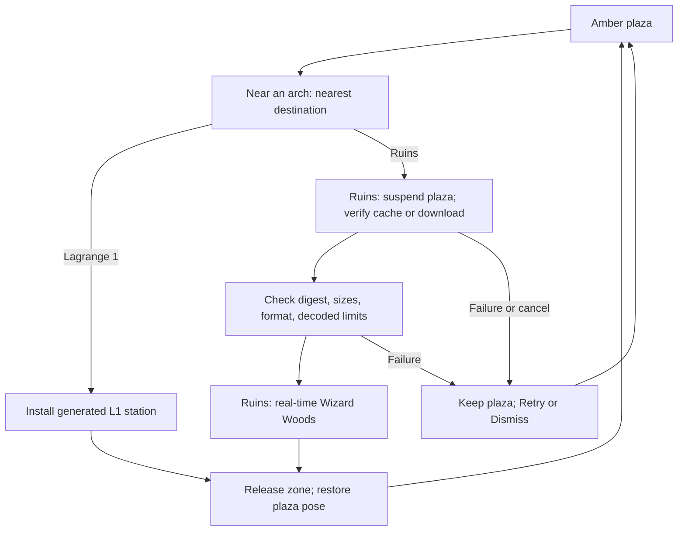

# Loaded zones: Ruins, Lagrange 1, and building new zones

Verse opens in the shared amber plaza. Two portal arches on the plaza lead to
separately loaded **zones**:

- **Ruins** (west arch, `RUINS`): the original Ruins of Atlantis Wizard Woods
  real-time combat on its retained heightfield. Models download on first entry.
- **Lagrange 1** (east arch, `LAGRANGE 1`): a construction station on a
  Lissajous orbit about the Sun–Earth L1 point, with restricted three-body
  orbital mechanics, station-keeping, and rigid-body EVA construction. Its
  geometry is generated in Rust; nothing is downloaded.

A *loaded zone* is an independently loaded scene with its own world ID,
presentation, physics profile, and rules profile. It differs from the named
districts used by ZONE chat inside the plaza.

This page describes the source implementation. Release and device acceptance
belong in the [iOS](../../bins/coder-ios/README.md) and
[Android](../../bins/coder-android/README.md) build records.

## Zone catalog

| Concern | Amber plaza | Ruins | Lagrange 1 |
| --- | --- | --- | --- |
| `ZoneId` / serialized ID | `Plaza` / `plaza` | `Ruins` / `ruins` | `Lagrange1` / `lagrange1` |
| World ID | `verse-plaza` | `ruins-v1` | `lagrange-1-v1` |
| Presentation | Coder's four amber intensities on near-black | Forest greens, baked model colors, fog 24–82 m | Vacuum black, direct sunlight from −Z, fog only at the 1–2 km sky shell |
| Geometry | Shared Rust world | Pinned on-demand pack plus retained heightfield and voxel ruins | Procedural station, stars, Sun, Earth, and Moon |
| Physics | Flat-ground walking, collision, jump | `ruins.heightfield.v1`: original controller on the retained heightfield | Sun–Earth CR3BP orbit, linearized L1 field locally, rigid bodies, cold-gas EVA pack ([details](lagrange-1.md)) |
| Rules | Exploration and product interactions | `ruins.wizard-woods.v1`: retained real-time ECS | Construction sandbox: grab, carry, latch |
| Assets | Built in | 6.6 MB verified pack, cached on disk | None |
| Network | NIP-MV plaza presence; Gym connection | Local-only | Local-only |
| Code | [`world.rs`](../../crates/verse/src/world.rs) | [`zones/ruins.rs`](../../crates/verse/src/zones/ruins.rs), [`verse-ruins`](../../crates/verse-ruins/) | [`zones/lagrange.rs`](../../crates/verse/src/zones/lagrange.rs), [`verse-lagrange`](../../crates/verse-lagrange/) |

The amber palette rule belongs to the plaza and Coder application UI, not to
every world. Zone colors belong to Verse's zone implementation. Rust Native
remains product-independent; it gains no zone, Coder colors, or game rules.

## Enter and return

Expand the map and choose **Ruins portal** or **L1 portal** to walk to an arch.
Near an arch, tap its opening or select the HUD control (**Enter Ruins** or
**Enter L1**). The nearest arch decides the destination. Desktop uses **F**.

- **Ruins** shows loading progress with **Cancel**. The plaza stays active until
  the pack passes content and decode checks. A failed load keeps the plaza and
  offers **Retry** or **Dismiss**. Walking past the arch never fetches the pack.
- **Lagrange 1** installs immediately because its geometry is generated.

Inside a zone, **Plaza** returns without requiring a win or a finished build.
Return restores the saved plaza position and releases the zone's geometry,
simulation, and GPU buffers. The Ruins pack can stay in the disk cache.
Re-entering either zone starts a fresh local simulation.

### Ruins controls

Movement and combat run together. The bottom hotbar supplies **Firebolt**,
**Missile**, and **Fireball**, replacing the source game's keys 1–3 (still
available on desktop). HP, mana, and cooldowns come from the original
simulation; there is no round, movement budget, or **End turn**.
[The source audit](ruins-source-parity.md) records the runtime, behaviors,
adaptations, and rendering differences.

### Lagrange 1 controls

You fly a suited astronaut with a cold-gas maneuvering pack. The joystick or
**W/A/S/D** commands a velocity; with no input, the pack holds position
relative to the station. Tilt the camera above or below level to climb or dive
along the view; double-tap (Space on desktop) for a short climb. A map tap sets
an autopilot target at the current altitude. Thrust is 40 N, so a loaded pack
accelerates slowly: carrying the 450 kg engine cuts acceleration by about
two-thirds. Propellant refills at the airlock ring.

**Grab** takes the next part at the depot or a free-floating part within reach.
Carry it to its outlined slot on the keel jig. When the part is within 1.6 m of
the slot, aligned within 15 degrees, moving below 0.35 m/s, and turning below
0.05 rad/s, the control reads **Latch** and releasing welds it to the jig.
Releasing elsewhere lets it drift and tumble as a free rigid body.
**Forces** toggles an overlay of contacts, joints, and thrust.
Six parts complete the keel: main engine, propellant tank, two keel trusses, RCS
pod, and avionics bay. [Lagrange 1](lagrange-1.md) documents the physics.

## Entry state



A transition clears movement, navigation, and transient interaction state and
increments `WorldRuntime::zone_revision`. Hosts compare that revision each
frame, replace the world GPU buffers, and apply the zone's atmosphere. A
suspended surface does not catch up simulated time spent in the background.

## Build and register a new zone

Zones are closed, host-supported code. A zone never downloads scripts, native
code, or shaders; an asset pack is only data. Adding one is a source change in
these places:

1. **Simulation crate (optional).** Put engine-independent simulation in its own
   crate with no renderer or I/O, as [`verse-ruins`](../../crates/verse-ruins/)
   and [`verse-lagrange`](../../crates/verse-lagrange/) do. Give it unit tests
   for its physical or rules invariants. Add it to
   [`crates/verse/Cargo.toml`](../../crates/verse/Cargo.toml).
2. **Identity.** Add a variant to `ZoneId` in
   [`zones/mod.rs`](../../crates/verse/src/zones/mod.rs) and fill in
   `world_id` (a new stable ID, versioned like `name-v1`), `label`,
   `half_extent`, `portals` (its return portal, plus a plaza arch), `sign` (arch
   lettering: A–Z, 0–9, space, `/`, `.`), and `atmosphere` (validated: colors in
   0–1, fog end at most 2 km). Serde derives the snake_case ID that native hosts
   see.
3. **Scene adapter.** Add `zones/<name>.rs` with a type that owns the zone's
   simulation and provides `world()` (static mesh and footprints),
   `move_player` (map `InputState` into the zone's physics and write back the
   shared `PlayerController`), `tick`, and a cached `dynamic()` mesh. Existing
   helpers: `crate::doors::scene_label` for text, `Mesh::cube` for amber boxes,
   or raw `Vertex` faces and lines with explicit colors. Vertex `fog` of 0
   ignores fog, which suits sky objects.
4. **State and runtime.** Add an `Option<YourZone>` to `zones::State`. In
   [`zones/runtime.rs`](../../crates/verse/src/zones/runtime.rs): install it
   (save the plaza pose, set `world`, `zone`, spawn, reset the camera, and bump
   `zone_revision`), route `update_player`, tick it in `ruins_tick`, add its
   dynamic mesh to `zone_dynamic_mesh` and `zone_dynamic_occludes`, drop it on
   `Intent::Return`, and describe its HUD controls and caption in
   `zone_snapshot`. `Intent::Enter` dispatches on the nearest portal's
   destination.
5. **Intents and HUD.** New actions become `Intent` variants. The GPU HUD in
   [`zones/hud.rs`](../../crates/verse/src/zones/hud.rs) draws up to a row of
   controls and a two-line caption (split on `\n`). Add the new intent and
   zone IDs to the native validators:
   [`ZoneView.swift`](../../bins/coder-ios/host/App/ZoneView.swift) (`valid`,
   `intents`) and Android's allowed list in
   [`VerseSurface.kt`](../../bins/coder-android/host/app/src/main/java/com/openagents/coder/VerseSurface.kt).
   An unknown ID or intent is refused by native decoding.
6. **Plaza placement.** The plaza arch goes in `ZoneId::Plaza.portals()`;
   [`world.rs`](../../crates/verse/src/world.rs) adds pillar footprints for
   every arch automatically. Add a map landmark in
   [`minimap.rs`](../../crates/verse/src/minimap.rs) and zone-local landmarks
   in `snapshot_for_zone`. Keep the arch's approach clear; the
   `plaza_portals_stand_clear_of_structures` test checks it.
7. **Camera and bounds.** `WorldRuntime::view` clamps the eye above ground per
   zone; free-flight zones use the unclamped eye. `set_spawn` requires a finite
   position inside `half_extent`.
8. **Assets (only if needed).** A downloaded pack follows the Ruins pattern in
   [`zones/assets.rs`](../../crates/verse/src/zones/assets.rs): a compiled
   SHA-256 and byte length, a content-addressed file name, a bounded decoder,
   and a manifest in `assets/verse/<zone>/zone.json` admitted by
   `Manifest::validate`. Keep every published digest file in the repository so
   older app builds can still fetch their reviewed bytes.
9. **Tests and captures.** Cover entry, return to the saved plaza pose,
   intents scoped to their zone, and the zone's own invariants. The
   `lagrange_capture` and `ruins_capture` examples render a zone offline with
   the shared renderer for visual review. Add a native UI test in
   [`ZoneUITests.swift`](../../bins/coder-ios/host/UITests/ZoneUITests.swift).
10. **Docs.** Add the zone to the catalog above, the
    [rules page](zone-rules.md), the [mobile guide](mobile.md), and the
    [glossary](../glossary.md).

## Ruins asset loading and cache

[`zones/assets.rs`](../../crates/verse/src/zones/assets.rs) loads one reviewed
pack from an HTTPS locator. Its compiled content pin is:

| Property | Value |
| --- | --- |
| Pack | [Content-addressed Ruins pack](../../assets/verse/ruins/7c1535256a4687e70a0f624f4b97c651bfd0b36ba91347a09041698ef8d246a7.vzp) |
| Exact transfer size | 6,629,578 bytes, about 6.6 MB |
| SHA-256 | `7c1535256a4687e70a0f624f4b97c651bfd0b36ba91347a09041698ef8d246a7` |
| Format | `verse-zone-pack-v1`, with bounded triangle meshes and sampled animation frames |
| Decoded geometry | About 12 MiB of face vertices, excluding world instances and GPU buffers |

Builds through 49 fetch the same bytes from the earlier `assets/verse/forest/`
path, which is retained unchanged. The pack is not embedded in the application
or downloaded at plaza startup. Explicit entry starts one background worker. It
checks a content-addressed cache file; otherwise it downloads, verifies the
exact size and digest, decodes, and installs the cache file atomically.
Redirects are refused. The URL is a locator: different bytes at that URL cannot
alter the accepted pack.

Cache reads on supported Unix hosts use no-follow opens and validate the opened
regular file. A verified cache hit or install prunes only explicitly listed
older Ruins digests (`RUINS_PACK_HISTORY`) and recognized `.ruins-*.part`
temporary files older than 24 hours, preserving the current pack, recent
transfers, symlinks, and unknown files. The decoder checks finite coordinates,
triangle counts, animation timing, trailing bytes, and cumulative allocation.
Its limits are 25 MiB transferred, 96 MiB of decoded vertices, 400,000 vertices
per mesh, and 24 frames per animation.

The [pack documentation](../../assets/verse/ruins/README.md) records the baker
([`scripts/bake-verse-ruins.py`](../../scripts/bake-verse-ruins.py)), sampling
choices, source commit, input hashes, and notices, including the unresolved
asset-specific attribution for the wizard and zombie.

## Manifest contract

The Rust `Manifest` admits exactly this six-field document for the Ruins:

```json
{
  "schema": "verse.zone.v1",
  "world": "ruins-v1",
  "ruleset": "ruins.wizard-woods.v1",
  "physics": "ruins.heightfield.v1",
  "asset_sha256": "7c1535256a4687e70a0f624f4b97c651bfd0b36ba91347a09041698ef8d246a7",
  "asset_bytes": 6629578
}
```

Unknown fields and values refuse. The host fixes palette, bounds, arrivals,
collision, and asset interpretation. Lagrange 1 has no downloaded content and
so no manifest; its profile is compiled.

## Nostr scope and current limits

Plaza presence and Gym observation pause while a zone loads or is visited, and
resume on return. A zone does not publish coordinates under `verse-plaza`, reuse
its crowd, or join a different relay. Neither zone is a multiplayer server:
Ruins combat and L1 construction are local, unshared state.

[NIP-MV's scene manifest profile](../../nips/openagents/NIP-MV.md#scene-manifest-profile)
is **Designed**. The app does not discover, publish, or load arbitrary signed
scene definitions. Future creator support needs a new schema version that makes
the compiled choices explicit, then admitted asset manifests with budgets,
reviewed physics and rules profiles, safe travel between independently admitted
worlds, and, last, shared simulation with a reviewed authority and recovery
protocol. [NIP-EXT](../../nips/openagents/NIP-EXT.md) can distribute reviewed
definitions but does not grant execution because a package is signed.
