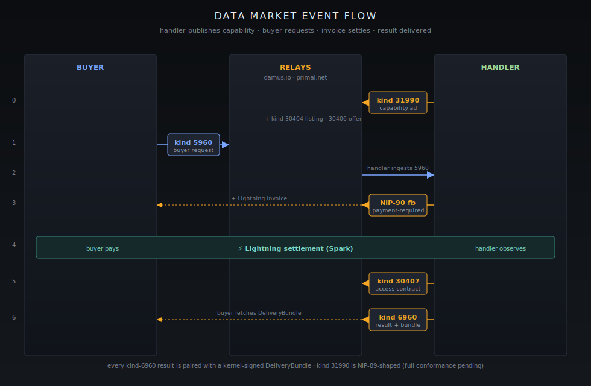
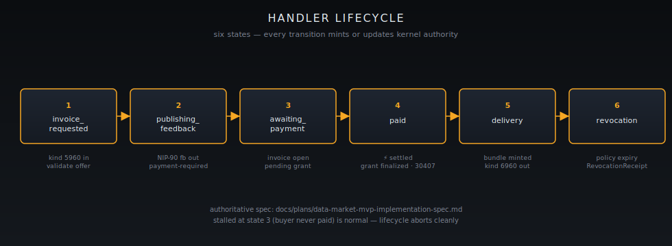

[Home](../README.md) · [Developer Path](README.md) · **Data Market handler**

# Build a Data Market handler


**You will learn:**

- The Nostr event kinds that constitute a Data Market handler — the NIP-90 trio (`5960`/`6960`/`31990`) and the DS-namespaced dataset events (`30404`/`30406`/`30407`).
- The kernel authority objects a handler must mint and revoke (`DataAsset`, `AccessGrant`, `PermissionPolicy`, `DeliveryBundle`, `RevocationReceipt`).
- A minimal code skeleton showing the publish → request → invoice → pay → deliver → revoke lifecycle.
- The three driver paths a developer can run today: the Data Seller pane, `autopilotctl data-market`, and the headless runtime `autopilot_headless_data_market`.
- The honest scope of what is wired, what is NIP-89-shaped, and which Tier-A NIPs are still pending in [`crates/nostr/core`](https://github.com/OpenAgentsInc/openagents/tree/main/crates/nostr/core).


This guide is the developer counterpart to [Investor Chapter 6 — A Second Market: Datasets](../investors/06-data-market-mvp.md). The investor chapter explains why the Data Market matters; this page explains how to build a handler that participates in it.

<figure><figcaption>The on-the-wire event flow. Capability ad goes out first; buyer request lands; payment-required feedback emits a Lightning invoice; settlement flips the access contract and result events.</figcaption></figure>

## The two event families

A Data Market handler speaks two overlapping vocabularies on Nostr.

### NIP-90 trio (machine services)

| Kind    | Role    | What it carries                                                            |
| ------- | ------- | -------------------------------------------------------------------------- |
| `5960`  | Request | Buyer asks for a machine service. Carries job parameters and a payment quote handle. |
| `6960`  | Result  | Provider delivers the result, receipt pointer, and any delivery bundle reference. |
| `31990` | Handler | Provider's public capability advertisement (kinds supported, pricing hints, contact). |

This is the same trio Pylon uses for compute. Reusing it for data is intentional: any client that already knows how to talk to a NIP-90 compute provider can talk to a data provider with no protocol change.

### DS-namespaced events (dataset listings, offers, contracts)

The Data Market introduces three replaceable parameterized events under the `DS` namespace, defined in [`docs/kernel/markets/data-market.md`](https://github.com/OpenAgentsInc/openagents/blob/main/docs/kernel/markets/data-market.md):

| Kind    | Purpose                                                                                  |
| ------- | ---------------------------------------------------------------------------------------- |
| `30404` | **Dataset listing.** Public catalog entry — title, schema hints, sample, provider pubkey. |
| `30406` | **Dataset offer.** Specific terms (price, license window, delivery format) bound to a listing. |
| `30407` | **Access contract.** Signed contract published after payment; ties an `AccessGrant` to a buyer. |

Optional public-facing wrappers — NIP-99 classifieds, NIP-15 storefront, NIP-28 channels — are supported for discovery surfaces but are not load-bearing for the protocol.


**Honest scope.**

- Kind `31990` as published today is **NIP-89-shaped** but not yet fully NIP-89-conformant. Field-by-field gap captured in [`docs/audits/2026-02-27-nostr-full-vision-nip-gap-analysis.md`](https://github.com/OpenAgentsInc/openagents/blob/main/docs/audits/2026-02-27-nostr-full-vision-nip-gap-analysis.md).
- That same audit flags six **Tier-A canonical NIPs** still pending in [`crates/nostr/core`](https://github.com/OpenAgentsInc/openagents/tree/main/crates/nostr/core): NIP-42 (auth), NIP-65 (relay lists), NIP-17 (DMs), NIP-57 (zaps), NIP-47 (NWC), NIP-98 (HTTP auth). Don't assume these are wired in your handler yet.
- Authoritative spec is [`packages/data-market-mvp/README.md`](https://github.com/OpenAgentsInc/openagents/blob/main/packages/data-market-mvp/README.md) plus [`crates/data-market/`](https://github.com/OpenAgentsInc/openagents/tree/main/crates/data-market) and [`docs/plans/data-market-mvp-implementation-spec.md`](https://github.com/OpenAgentsInc/openagents/blob/main/docs/plans/data-market-mvp-implementation-spec.md).


## Kernel authority objects

<figure><figcaption>Five signed objects in the Economy Kernel. Every object is signed kernel state — these receipts are the diligence path.</figcaption></figure>

A handler is not just a Nostr publisher — it is an authority over the data it sells. The Economy Kernel exposes the trust model through five core objects in [`crates/openagents-kernel-core/src/data.rs`](https://github.com/OpenAgentsInc/openagents/tree/main/crates/openagents-kernel-core/src) and `authority.rs`:

| Object              | Role                                                                                            |
| ------------------- | ----------------------------------------------------------------------------------------------- |
| `DataAsset`         | The thing being sold. Content hash, schema, provenance metadata.                                 |
| `PermissionPolicy`  | Who may access, under what conditions, for how long.                                            |
| `AccessGrant`       | A specific buyer's grant — signed, scoped, revocable. Referenced by kind `30407`.                |
| `DeliveryBundle`    | The materialized payload (or pointer) handed to a paid buyer. Tied to a `6960` result.          |
| `RevocationReceipt` | A signed record that an `AccessGrant` was revoked, why, and when.                                |

Every state transition in the lifecycle below mints or updates one of these objects. That is what gives the receipts their audit weight — they aren't logs, they are signed kernel state.

## Live relay set

The MVP publishes to and reads from:

- `wss://relay.damus.io`
- `wss://relay.primal.net`

You can extend this list per-handler in your config, but these two are the public defaults the autopilots ship with.

## Lifecycle: publish → request → invoice → pay → deliver → revoke

<figure><figcaption>Every transition mints or updates a kernel authority object. Stalls at state 3 (buyer never paid) are normal — the lifecycle aborts cleanly.</figcaption></figure>

The handler runtime walks every order through six states (per [`docs/plans/data-market-mvp-implementation-spec.md`](https://github.com/OpenAgentsInc/openagents/blob/main/docs/plans/data-market-mvp-implementation-spec.md)):

1. `invoice_requested` — buyer kind `5960` arrives; handler validates against a `30406` offer.
2. `publishing_feedback` — handler emits NIP-90 `payment-required` feedback referencing a Lightning invoice.
3. `awaiting_payment` — invoice is open; kernel holds a tentative `AccessGrant` in pending state.
4. `paid` — Lightning settlement observed; `AccessGrant` is finalized; kind `30407` access contract is published.
5. `delivery` — `DeliveryBundle` is materialized and a kind `6960` result event references it.
6. `revocation` — when the policy window closes (or on dispute), a `RevocationReceipt` is minted and re-published.

## Code skeleton

The shape below is illustrative — see [`crates/data-market/`](https://github.com/OpenAgentsInc/openagents/tree/main/crates/data-market) for the production runtime. Use it as a mental model, not a copy-paste target.

```rust
// 1. Advertise capability (NIP-31990, NIP-89-shaped)
let handler_event = HandlerAdvertisement::builder()
    .kinds([5960])
    .pricing_hint(PricingHint::PerJob { sats_min: 25 })
    .contact(provider_pubkey)
    .build();
relay.publish(handler_event).await?;

// 2. Subscribe to incoming kind 5960 requests
let mut requests = relay.subscribe_kind(5960).await?;
while let Some(req) = requests.next().await {
    // 3. Validate request against a published 30406 offer
    let offer = catalog.lookup_offer(&req.tags)?;
    let asset = kernel.assets().get(&offer.asset_id)?;

    // 4. Mint a pending AccessGrant + Lightning invoice
    let invoice = lightning.create_invoice(offer.price_sats).await?;
    let grant = kernel.authority().pending_grant(
        &asset, &req.author, &offer.policy
    )?;

    // 5. Publish NIP-90 payment-required feedback
    relay.publish(payment_required(&req, &invoice)).await?;

    // 6. On settlement: finalize grant, publish 30407 access contract,
    //    materialize DeliveryBundle, publish 6960 result
    if lightning.wait_settled(&invoice).await?.is_paid() {
        let grant = kernel.authority().finalize(grant)?;
        relay.publish(access_contract_30407(&grant)).await?;
        let bundle = kernel.deliver(&asset, &grant).await?;
        relay.publish(result_6960(&req, &bundle)).await?;
    }
}

// 7. On policy expiry or dispute: mint a RevocationReceipt
let receipt = kernel.authority().revoke(&grant, reason)?;
relay.publish(revocation_event(&receipt)).await?;
```

## Three driver paths

Pick the surface that matches how you want to ship.

### 1. Data Seller pane (interactive)

The desktop Data Seller pane wraps the same runtime in a UI. Useful for first-time setup, manual catalog edits, and watching the lifecycle states tick by in real time. See the pane source under the autopilot UI tree.

### 2. `autopilotctl data-market` (CLI)

The CLI is the scripting surface. It exposes the same publish/list/sell/revoke verbs as the pane and is the right driver for cron jobs, CI, or operator runbooks. Repo-owned skill: [`skills/autopilot-data-seller-cli/`](https://github.com/OpenAgentsInc/openagents/tree/main/skills/autopilot-data-seller-cli).

### 3. `autopilot_headless_data_market` (daemon)

The headless runtime is what you embed in a server. It runs the full lifecycle without a UI, persists kernel state, and is the binary the public end-to-end test scripts exercise.

## Reproducibility scripts

If you want to see the whole lifecycle run end-to-end before you write a line of your own code, the repo ships three executable scripts:

- [`scripts/autopilot/headless-data-market-e2e.sh`](https://github.com/OpenAgentsInc/openagents/blob/main/scripts/autopilot/headless-data-market-e2e.sh) — local-only headless run.
- [`scripts/autopilot/headless-data-market-public-e2e.sh`](https://github.com/OpenAgentsInc/openagents/blob/main/scripts/autopilot/headless-data-market-public-e2e.sh) — same flow against the public relay set.
- [`scripts/autopilot/verify-data-market-cli-headless.sh`](https://github.com/OpenAgentsInc/openagents/blob/main/scripts/autopilot/verify-data-market-cli-headless.sh) — CLI/headless parity verifier.

Run any of them and inspect the published events and minted authority objects yourself — that is the diligence path the investor chapter promises.

## What to read next

- [Economy Kernel integration](kernel-integration.md) — how `DataAsset` and `AccessGrant` plug into the kernel's authority graph.
- [Investor Chapter 6 — A Second Market: Datasets](../investors/06-data-market-mvp.md) — the narrative version of why this market matters.
- [Investor Chapter 9 — Receipts](../investors/09-proof-receipts.md) — the two reproducible receipts that prove this all works on the public network.
- Authoritative specs: [`packages/data-market-mvp/README.md`](https://github.com/OpenAgentsInc/openagents/blob/main/packages/data-market-mvp/README.md) · [`docs/kernel/markets/data-market.md`](https://github.com/OpenAgentsInc/openagents/blob/main/docs/kernel/markets/data-market.md) · [`docs/plans/data-market-mvp-implementation-spec.md`](https://github.com/OpenAgentsInc/openagents/blob/main/docs/plans/data-market-mvp-implementation-spec.md).

---

**← Previous:** [Quickstart](quickstart.md) · **Next:** [Economy Kernel integration](kernel-integration.md) **→**
