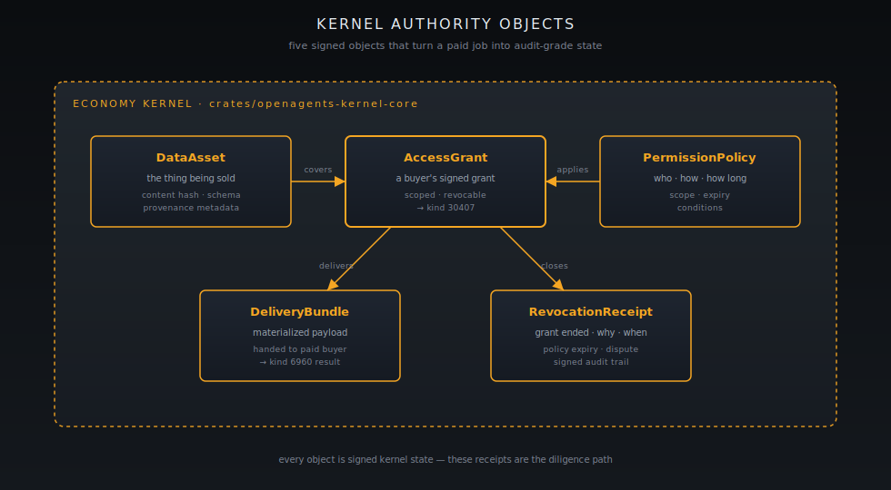

[Home](../README.md) · [Developer Path](README.md) · **Kernel integration**

# Economy Kernel integration

The Economy Kernel is the authority. Pylon is a connector; Spark is a wallet; the desktop is a projection. The kernel is what mints the receipts, signs off on every settled sat, and decides what is actually true about the system. This page is how a developer integrates with that authority.


**You will learn:**

- The `sv` control loop the kernel runs and where your code plugs into it.
- The five authority objects (`DataAsset`, `PermissionPolicy`, `AccessGrant`, `DeliveryBundle`, `RevocationReceipt`) and the data/authority module split that owns them.
- The ADR-0001 authority boundary — what is kernel authority and what is not.
- How to reconcile a kernel-authored payout id against wallet history (the receipts diligence path).
- The two anchors that ground every claim on this page: [`crates/openagents-kernel-core/src/data.rs`](https://github.com/OpenAgentsInc/openagents/tree/main/crates/openagents-kernel-core/src) and `authority.rs`, plus [ADR-0001 Authority Boundaries](https://github.com/OpenAgentsInc/openagents/blob/main/docs/adr/0001-authority-boundaries.md).


## The `sv` control loop

The kernel is shaped around one loop. Every pass through it is one settled sat, one signed receipt, one policy delta.

```
WORK ─▶ VERIFY ─▶ RECEIPT ─▶ POLICY ─▶ THROTTLE ─▶ WORK
```

| Stage    | What the kernel does                                                                              |
| -------- | ------------------------------------------------------------------------------------------------- |
| WORK     | A handler delivers; a buyer pays; the kernel observes Lightning settlement and Nostr result event. |
| VERIFY   | The kernel validates the result against the contract (kind `30407`) and the policy.               |
| RECEIPT  | If valid, the kernel mints a signed `DeliveryBundle` and updates the `AccessGrant` to finalized.   |
| POLICY   | The kernel applies the active `PermissionPolicy` — windows, caps, revocation rules.                |
| THROTTLE | The kernel updates the autonomy throttle for this provider (rate limits, error backoff).          |
| (loop)   | New work resumes under the updated policy.                                                         |

The receipts you ship to investors and to auditors are kernel state from the RECEIPT stage. They are not application logs. They are signed.

## The five authority objects

<figure><figcaption>The five signed objects. Together they describe the full audit graph for a single buyer-provider relationship.</figcaption></figure>

| Object              | Lives in                  | What it represents                                                                              |
| ------------------- | ------------------------- | ----------------------------------------------------------------------------------------------- |
| `DataAsset`         | [`data.rs`](https://github.com/OpenAgentsInc/openagents/tree/main/crates/openagents-kernel-core/src) | The thing being sold. Content hash, schema, provenance. |
| `PermissionPolicy`  | [`authority.rs`](https://github.com/OpenAgentsInc/openagents/tree/main/crates/openagents-kernel-core/src) | Who may access, under what conditions, for how long. |
| `AccessGrant`       | `authority.rs`            | One buyer's grant against an asset. Pending → finalized → revoked.                              |
| `DeliveryBundle`    | `data.rs`                 | The materialized payload (or pointer) handed to a paid buyer. Tied to a Nostr kind `6960` event. |
| `RevocationReceipt` | `authority.rs`            | A signed record that an `AccessGrant` was revoked, why, and when.                                |

Every state transition in the [Data Market lifecycle](data-market-handler.md#lifecycle-publish--request--invoice--pay--deliver--revoke) mints or updates one of these objects. That is the receipt graph.

## What is and isn't kernel authority — ADR-0001

**Spacetime is not an authority for money or verdicts.** The kernel is. The desktop is allowed to lag, render stale state, and disagree with the wire — the money is still correct because the kernel signed off, not because the pane caught up.

[ADR-0001 Authority Boundaries](https://github.com/OpenAgentsInc/openagents/blob/main/docs/adr/0001-authority-boundaries.md) makes this concrete:

- **Kernel authority:** payout decisions, policy decisions, signed receipts, the autonomy throttle.
- **Not kernel authority:** UI state, log lines, projection caches, the desktop snapshot, the `autopilotctl` JSON view.

When two of those disagree — a pane shows a balance that the kernel doesn't — trust the kernel events on relay. The other side is a projection bug. This is the rule the [Troubleshooting](../users/troubleshooting.md) ladder applies under the hood.

## Wiring a handler into the kernel

A handler doesn't need to import the whole kernel. It needs four touchpoints.

### 1. Mint a `DataAsset` for what you sell

Every kind `30404` listing you publish should be backed by a `DataAsset` in the local kernel store. The asset is the source of truth for the content hash, schema, and provenance. The Nostr listing is the public projection.

### 2. Define a `PermissionPolicy` per offer

Every kind `30406` offer is an offer to enter into a contract under a specific `PermissionPolicy`. Express the policy in kernel terms (windows, caps, revocation rules) before you publish the Nostr event, not after.

### 3. Use the kernel's grant lifecycle

When a buyer pays:

1. Call `kernel.authority().pending_grant(asset, buyer, policy)` to mint a pending grant.
2. On Lightning settlement, call `kernel.authority().finalize(grant)`.
3. Publish the signed access contract (kind `30407`) referencing the finalized grant.
4. Materialize the `DeliveryBundle` and publish the kind `6960` result event.

The shape lives in the [Data Market handler code skeleton](data-market-handler.md#code-skeleton).

### 4. Mint revocations explicitly

When a window closes or a dispute lands, mint a `RevocationReceipt` and re-publish. Revocation is not implicit — the kernel won't reclaim the grant just because the policy window expired in real time. That receipt is the audit signal.

## Receipt reconciliation — the diligence path

Every paid job that completes leaves three artifacts you can cross-check independently:

1. **Kernel payout id** — produced at the RECEIPT stage. Example from the public earn-loop: `019db8a2-98d2-7890-95e4-6a1d78709a3c`.
2. **Spark wallet outbound / inbound entry** — the corresponding ledger entry on the wallet side.
3. **Nostr kind `6960` result event** — the public delivery event that referenced the `DeliveryBundle`.

When a finance team wants diligence, this is what you hand them. All three should agree. If they don't, the kernel record is authoritative.

The worked example for v0.1.13 is in [Investor Chapter 9 — Receipts](../investors/09-proof-receipts.md). Reproduce it against your own node by following the [Quickstart](quickstart.md#4-reproduce-the-public-earn-loop-receipt).

## Where the kernel runs

The kernel runs locally. It is not a remote service. It runs inside the Pylon process (and inside Autopilot when the desktop ships) and persists state to the Pylon home at `~/.openagents/pylon/` (override with `OPENAGENTS_HOME` for isolation).

This is intentional and load-bearing for the sovereignty claim — the authority that signs off on your sats lives on the same machine you do, behind the same mnemonic. There is no "kernel server" to be down, censored, or seized.

## What to read next

- [Data Market handler](data-market-handler.md) — the publish → request → pay → deliver → revoke lifecycle in protocol detail, with the code skeleton showing every kernel touchpoint.
- [TreasuryRouter glossary](../shared/glossary/treasury-router.md) — the payout-cutting half of the kernel's settlement story.
- [Investor Chapter 7 — Economy Kernel](../investors/07-economy-kernel.md) — narrative version of why the kernel matters.
- [Investor Chapter 8 — Authority Model](../investors/08-authority-model.md) — the authority graph for non-developers.
- [ADR-0001 Authority Boundaries](https://github.com/OpenAgentsInc/openagents/blob/main/docs/adr/0001-authority-boundaries.md) — the canonical decision record this page anchors to.


**Under the hood.** Kernel data module: [`crates/openagents-kernel-core/src/data.rs`](https://github.com/OpenAgentsInc/openagents/tree/main/crates/openagents-kernel-core/src). Kernel authority module: [`crates/openagents-kernel-core/src/authority.rs`](https://github.com/OpenAgentsInc/openagents/tree/main/crates/openagents-kernel-core/src). ADR: [`docs/adr/0001-authority-boundaries.md`](https://github.com/OpenAgentsInc/openagents/blob/main/docs/adr/0001-authority-boundaries.md). Lifecycle spec: [`docs/plans/data-market-mvp-implementation-spec.md`](https://github.com/OpenAgentsInc/openagents/blob/main/docs/plans/data-market-mvp-implementation-spec.md). Receipts walkthrough: [Investor Chapter 9](../investors/09-proof-receipts.md).


---

**← Previous:** [Data Market handler](data-market-handler.md) · **Next:** [Bounties](bounties.md) **→**
