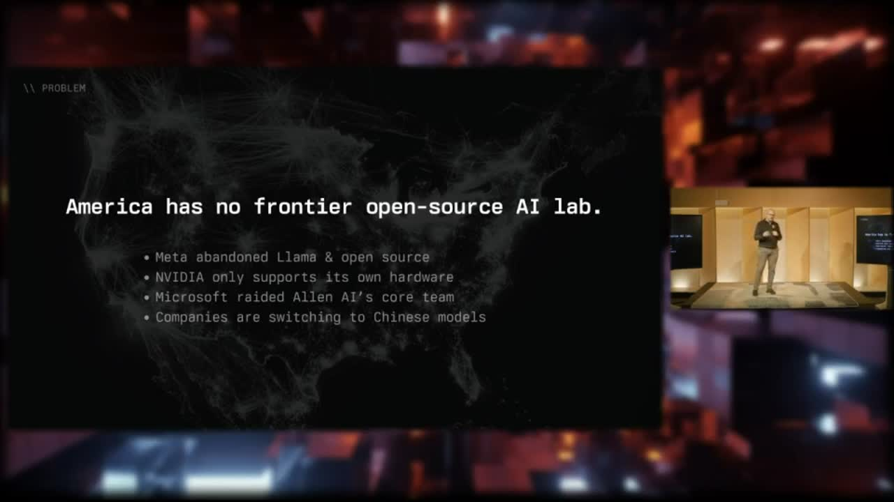

[Home](../README.md) · [Investor Path](README.md) · **01. Why OpenAgents**

# 1. Why OpenAgents

> _"OpenAgents exists to solve one problem. America has no frontier open-source AI lab. This is a massive problem."_
>
> — Christopher David, [BitcoinFi Accelerator Demo Day, April 21, 2026](https://bitcoinfi.network/demoday)

**You will learn:**

- Why this company exists — and why it has to be a Bitcoin company
- What we've already shipped vs. what we're raising to build
- The 90-second version of the pitch

## The wound

In 2026, American open-source AI is in a bad place. The names that carried it from 2023 to 2025 either left the field or were taken off it.

Meta abandoned Llama, and with it abandoned open source. NVIDIA's "open" models only run on NVIDIA hardware — that's a vendor lock-in dressed up as open source, not the real thing. Allen AI tried to be the American DeepSeek — small, scrappy, independent — and Microsoft acqui-hired their core team. The lab didn't survive.

Meanwhile, the companies that used to depend on Llama are switching to Chinese models, because China is the only place still shipping frontier open weights. In 2026, building America's AI supply chain on top of Chinese models is not a strategy. It's the absence of one.

<figure>
  
  <figcaption>BitcoinFi Demo Day, April 21, 2026 — the wound in one slide.</figcaption>
</figure>

Chris names the answer in one breath:

> _"OpenAgents is America's leading open-source AI lab. Hey, there's not many open-source AI labs, but we're leading. Proudly based in Austin, Texas, Bitcoin capital of the world."_

## What we are, in three lines

**A lab.** We're the world's second open-source reproduction of Percepta's _"Can LLMs Be Computers?"_ paper. We ship Psionic — the world's fastest edge inference engine, 30% faster than Ollama on the same hardware. And as of this month, we've begun what we believe is about to be the largest decentralized model-training run in history.

**A marketplace.** Five interlocking markets — Compute, Data, Labor, Liquidity, Risk — that settle autonomous machine work in Bitcoin. Detail in [Chapter 2](02-five-markets.md).

**A shipped product.** Autopilot turns your computer into a Bitcoin-paying compute provider, today. Real machines, real Bitcoin, real receipts. Detail in [Chapter 3](03-autopilot-wedge.md) and the proof in [Chapter 9](09-proof-receipts.md).

## Why Bitcoin, why now

Agents need a native unit of account. Something that settles across machines, crosses borders without permission, and carries a cryptographic proof of work. In 2026, only one thing fits.

Chris on _OAPN #2 — Pylon Launch_:

> _"We have the benefit in the Bitcoin space of everyone already speaking the same language. We speak Bitcoin at the base layer. We speak Lightning and other related L2s that all use Lightning for interop. There's increasing consensus around Nostr for this sort of like data layer that's adjacent, but not like spraying data onto the chains. So we've got all the makings of decentralized applications — all the substrate for what should be like the agentic AI layers."_
>
> — [_OAPN #2, Pylon Launch_](https://www.youtube.com/watch?v=uvRO-E9SXI8)

The substrate already exists. The applications don't. That's the gap we're filling.

## The 20 GW question

Bitcoin's total mining capacity is roughly 20 gigawatts of electricity, distributed across hundreds of thousands of independent operators worldwide. That same capacity, redirected toward useful machine work, is bigger than any single AI hyperscaler today.

The Demo Day slide makes the comparison directly: OpenAI runs on roughly 2 GW. Stranded consumer compute — the GPUs in millions of gaming rigs, workstations, and idle home machines — is closer to 20 GW.

The company that unlocks even a small percentage of that gap has a path to becoming the most valuable company in the world. The only question is whose stack the unlock runs on.

## Why Vegas, why this panel

At Bitcoin 2026 in Las Vegas, Chris is on the **"Why AI Agents Want Bitcoin"** panel — Open Source Stage, 10:45 AM — alongside Erik Cativo (Cashu), Roland Bewick (Alby), and Eric Hadley (Hyperdope, moderating).

That panel is the public version of this document. This GitBook is the long form, written for investors who want the architecture behind the panel and the receipts behind the architecture.

## The 90-second version


Christopher David, BitcoinFi Accelerator Demo Day — 90-second highlight from the April 21, 2026 pitch.


For the full 4:55 Demo Day segment, see [`assets/clips/cdavid-demoday-41m38s-full.mp4`](../assets/clips/cdavid-demoday-41m38s-full.mp4) or the broadcast at [bitcoinfi.network/demoday](https://bitcoinfi.network/demoday) starting around the 41:38 mark.

---


**Under the hood.** The full repo problem statement (_"agent misuse can create massive economic damage when output outruns verification… compute supply is constrained, so capacity has to be allocated more intelligently"_) lives in [`OpenAgentsInc/openagents`](https://github.com/OpenAgentsInc/openagents/blob/main/README.md). Engineers should start in the [Developer Path](../developers/README.md).


---

**Next:** [02. The Five Markets](02-five-markets.md) **→**
