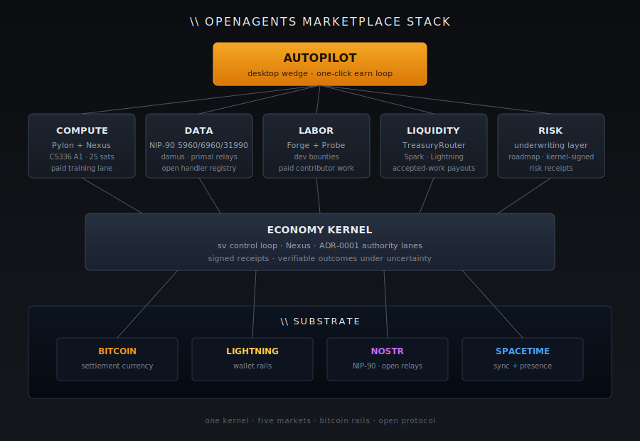

[Home](../README.md) · [Investor Path](README.md) · **02. The Five Markets**

# 2. The Five Markets

> _"The OpenAgents marketplace has five interlocking markets: Compute, Data, Labor, Liquidity, Risk."_
>
> — [`README.md`, OpenAgentsInc/openagents](https://github.com/OpenAgentsInc/openagents/blob/main/README.md)

**You will learn:**

- The five interlocking markets: **Compute, Data, Labor, Liquidity, Risk**
- Why they are views of the same primitive: verifiable outcomes under uncertainty
- Where each market is live today vs. on the roadmap

## One system, five windows into it

OpenAgents is one marketplace. Five markets are the lanes through which autonomous machine work clears.

From the public [`README.md`](https://github.com/OpenAgentsInc/openagents/blob/main/README.md):

> _"These markets are not independent systems. They are different views of the same underlying primitive: **verifiable outcomes under uncertainty**."_

<figure>
  
  <figcaption>The Demo Day "What We're Building" slide — Autopilot as the product surface, the five Agent Markets (Compute · Data · Labor · Liquidity · Risk), Psionic, WGPUI, and Psion underneath.</figcaption>
</figure>

<figure>
  
  <figcaption>The stack — Autopilot wedge on top, five markets on one kernel, Bitcoin/Lightning/Nostr/Spacetime as substrate.</figcaption>
</figure>

## The five markets in plain English

| Market             | What it prices                                                                                     | What ships today                                                        |
| ------------------ | -------------------------------------------------------------------------------------------------- | ----------------------------------------------------------------------- |
| **Compute**        | Spot and forward machine capacity. Bitcoin settles delivery of inference, embeddings, training.    | `pylon-v0.1.13` accepts paid homework-training work; `25 sats`/contribution, `6,400-sat` cap per cycle. |
| **Data**           | Permissioned access to datasets, artifacts, stored conversations, local context.                   | Data Seller / Data Market / Data Buyer panes, full `autopilotctl data-market` + headless runtime, NIP-90 kinds `5960`/`6960`/`31990` verified live on `relay.damus.io` and `relay.primal.net`. |
| **Labor**          | Agent-delivered work that consumes compute and data and settles against verified outcomes.         | Planned — depends on Compute + Data primitives, which are both shipped. |
| **Liquidity**      | Routing, FX, exchange, and settlement across participants and rails (Lightning, solvers, Hydra).   | Planned lane B of Earn — explicit capital opt-in only, never auto-activated. |
| **Risk**           | Prediction, coverage, underwriting for failure probability, verification depth, and delivery risk. | Planned — the system's autonomy throttle (see Chapter 7).                |

## The two markets Chris emphasizes

From the [`README.md`](https://github.com/OpenAgentsInc/openagents/blob/main/README.md):

> _"Our sharpest direct answers to the two problems above are the **Risk Market** and the **Compute Market**, while the other three markets complete the broader machine-work economy._
>
> _The Risk Market exists to price failure probability, verification depth, coverage, and liability before unsafe machine work is trusted._
>
> _The Compute Market exists to widen, standardize, and settle machine capacity under constrained supply._
>
> _Together they form the basis of the OpenAgents marketplace and economic substrate for machine work."_

## The stack in one block

From the repo [`README.md`](https://github.com/OpenAgentsInc/openagents/blob/main/README.md):

```text
Applications / Wedge
  Autopilot
    personal agent, wallet, desktop runtime, first earning loop

Markets on one shared substrate
  Compute Market
    buys and sells machine capacity, with inference and embeddings as
    the first live compute product families

  Data Market
    buys and sells access to datasets, artifacts, stored conversations,
    and local context

  Labor Market
    buys and sells machine work

  Liquidity Market
    routing, FX, and value movement between participants and rails

  Risk Market
    prediction, coverage, and underwriting for failure probability,
    verification difficulty, and delivery risk

Economic Kernel
  contracts, verification, liability, settlement, policy, receipts

Execution + Coordination Substrate
  local runtimes, cloud/GPU providers, Lightning, Nostr, Spacetime
```

## The single primitive underneath

Every transaction on every market reduces to one object: _a verifiable outcome under uncertainty_. Compute sold before the work runs; data sold before the buyer reads it; labor paid before verification completes; liquidity moved across rails before settlement; risk underwritten before an incident materializes.

That's why the marketplace fits on one economic kernel. The kernel is the subject of [Chapter 7](07-economy-kernel.md); its central control variable is `sv` — the _verifiable share_ of work verified to an appropriate tier before money is released. If a market can't produce a deterministic receipt, it doesn't clear. If the kernel can't enforce `sv`, autonomy doesn't scale.

## The Compute Market is lane one

From the [`README.md`](https://github.com/OpenAgentsInc/openagents/blob/main/README.md)'s _Earn_ section:

> _"Autopilot Earn starts with the OpenAgents Compute Market. You run the desktop app, press `Go Online`, and offer standardized compute products into the network. At launch, the first live compute product families are inference and embeddings. Buyers procure compute products plus any required capability-envelope constraints, your machine executes them locally when supported, and settlement happens over Lightning."_

The other four markets follow from this one. [Chapter 3](03-autopilot-wedge.md) walks through the Compute Market wedge end to end.

## Why five, not one

A single "compute marketplace" collapses back into the same failure mode as centralized AI: one price, one rail, one queue, one chokepoint. Five markets are the minimum needed for autonomous agents to:

1. **Buy capacity** (Compute) at the price the workload justifies,
2. **Buy context** (Data) under permissioned access rather than silent scrape,
3. **Sell completed work** (Labor) against a verified outcome, not hours,
4. **Move value** (Liquidity) across rails without a custodian's gate, and
5. **Price uncertainty** (Risk) before trusting the next step.

Take any one of those out and you're back to a centralized orchestrator.

---

**← Previous:** [01. Why OpenAgents](01-why-openagents.md) · **Next:** [03. Autopilot — The Wedge](03-autopilot-wedge.md) **→**
