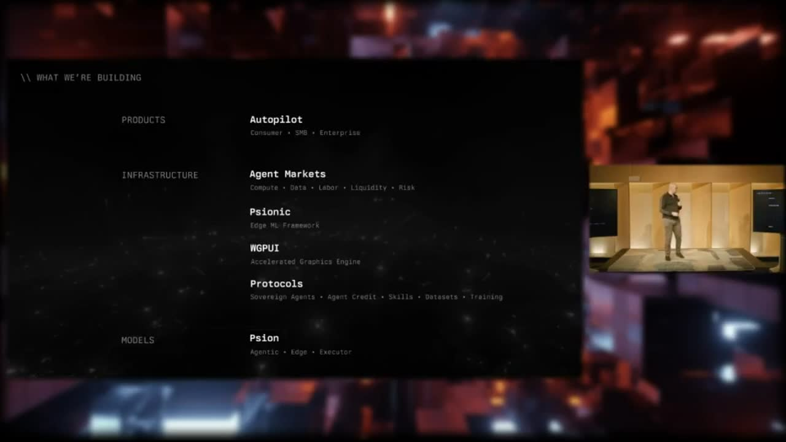

[Home](../README.md) · [Investor Path](README.md) · **02. The Five Markets**

# 2. The Five Markets

> _"These markets are not independent systems. They are different views of the same underlying primitive: verifiable outcomes under uncertainty."_
>
> — [`OpenAgentsInc/openagents` README](https://github.com/OpenAgentsInc/openagents/blob/main/README.md)

**You will learn:**

- The five markets, in plain English
- Which two are live today and which three follow
- Why this is one company, not five

## One stack, five revenue surfaces

OpenAgents is a single marketplace with five lanes through which autonomous machine work clears. Each lane prices a different thing. All five settle in Bitcoin. All five run on the same kernel.

<figure>
  
  <figcaption>The Demo Day "What We're Building" slide — Autopilot on top, the five markets in the middle, Psionic and the open substrate underneath.</figcaption>
</figure>

## The five markets, in plain English

| Market           | What it sells                                          | Where it is today                                                              |
| ---------------- | ------------------------------------------------------ | ------------------------------------------------------------------------------ |
| **Compute**      | Spot machine capacity — inference, embeddings, training. | **Live.** 25 sats per accepted contribution. 1,000,000+ sats already paid out. |
| **Data**         | Permissioned access to datasets, conversations, local context. | **Live** on the public Nostr relays.                                       |
| **Labor**        | Agent-delivered work, paid against verified outcomes.   | Building. Forge + Probe pattern in the public roadmap.                          |
| **Liquidity**    | Routing, FX, settlement across rails.                   | Building. Treasury rails live; open underwriters next.                          |
| **Risk**         | Pricing failure probability before it costs anyone.     | The quiet one. The market that makes the other four scale safely.               |

## The two markets Chris emphasizes

If you have to remember two of the five, remember **Compute** and **Risk**.

**Compute** is the supply-side story. The world is short on AI compute, and most of the spare capacity that exists is stranded — locked inside individual machines, behind no marketplace. Every gaming PC and home workstation is a latent compute provider. Compute is how those machines get paid.

**Risk** is the safety story. Autonomous agents will do unsafe things if no one is pricing the chance that they fail. The Risk Market prices that chance in real time, and the kernel uses those prices to decide how much autonomy to allow, how much collateral to require, when to slow things down. It's a circuit breaker built out of markets instead of out of policy committees.

Together they answer the two problems we set out to solve: _capacity allocation_ and _verified autonomy_. The other three markets — Data, Labor, Liquidity — complete the economy.

## Why this is one company, not five

A single "compute marketplace" is just another centralized AI layer with extra steps. One queue, one price, one chokepoint. We've seen that movie.

Five markets is the minimum needed for autonomous agents to:

1. **Buy capacity** at the price the workload justifies (Compute),
2. **Buy context** under permissioned access rather than silent scrape (Data),
3. **Sell completed work** against a verified outcome, not hours (Labor),
4. **Move value** across rails without a custodian's gate (Liquidity), and
5. **Price uncertainty** before trusting the next step (Risk).

Take any one of those out, and you're back to a centralized orchestrator. Build all five on one kernel, and you have an open economy that compounds — every transaction in any lane makes the others more efficient.

## The architecture, one block

```text
Applications     →   Autopilot (the wedge)
Markets          →   Compute · Data · Labor · Liquidity · Risk
Economic Kernel  →   contracts, verification, settlement, receipts, policy
Substrate        →   Bitcoin · Lightning · Nostr · Spacetime
```

The kernel is what makes a five-market marketplace work as one stack instead of five products glued together. Detail in [Chapter 7](07-economy-kernel.md).

## Two markets shipped, three to go

The headline you can verify today: Compute and Data are both live. Compute has paid more than 1,000,000 sats to over 1,300 Pylons. Data is published on `wss://relay.damus.io` and `wss://relay.primal.net` — independent, public infrastructure, no OpenAgents-controlled relays in the loop.

Labor, Liquidity, and Risk are the next three years. They are not vaporware — each is anchored to a kernel primitive that already exists, and to a substrate that already settles money. We are shipping in order, with receipts, on a public repo.

---


**Under the hood.** Engineers can read the full kernel object model — `WorkUnit`, `DataAsset`, `AccessGrant`, `DeliveryBundle`, `RevocationReceipt` — in the [Developer Path → Economy Kernel integration](../developers/kernel-integration.md). The normative spec is [`docs/kernel/economy-kernel.md`](https://github.com/OpenAgentsInc/openagents/blob/main/docs/kernel/economy-kernel.md).


---

**← Previous:** [01. Why OpenAgents](01-why-openagents.md) · **Next:** [03. Autopilot — The Wedge](03-autopilot-wedge.md) **→**
