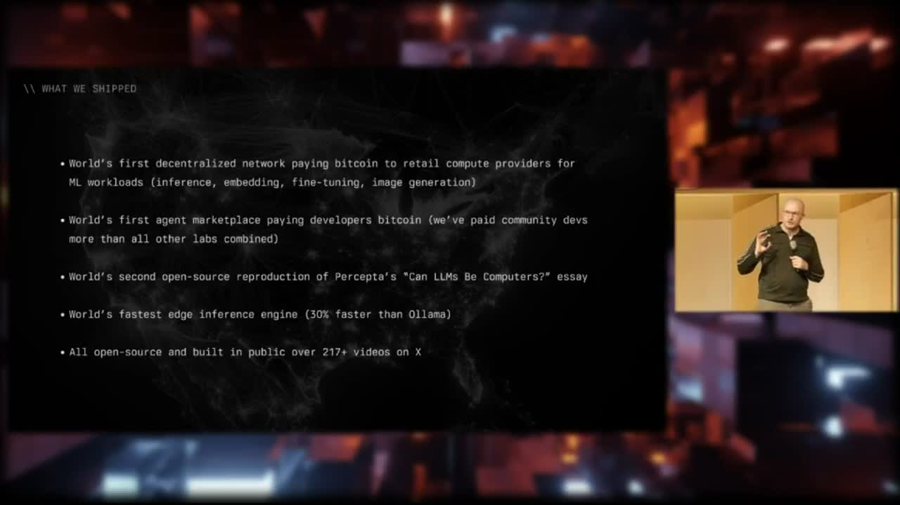

[Home](../README.md) · [Investor Path](README.md) · **03. Autopilot — The Wedge**

# 3. Autopilot — The Wedge

> _"Autopilot turns your machine into a money printer — it prints Bitcoin."_
>
> — [`docs/MVP.md`, OpenAgentsInc/openagents](https://github.com/OpenAgentsInc/openagents/blob/main/docs/MVP.md)

<figure>
  
  <figcaption>What we've already shipped: decentralized Bitcoin-paid compute, the first agent marketplace, the Percepta reproduction, and Psionic edge inference.</figcaption>
</figure>

**You will learn:**

- The product, in one paragraph
- The "holy shit" moment we're designing for
- Why the wedge is desktop-first

## The product, in one paragraph

Autopilot is a desktop app. You install it. You flip a single switch labeled **Go Online**. Your computer starts taking real machine work — paid, in Bitcoin, on Lightning. You watch the wallet number tick up. When you want, you withdraw.

That's the whole product surface. Everything else exists to make that loop honest.

## The irreducible loop

The MVP is intentionally narrow. From [`docs/MVP.md`](https://github.com/OpenAgentsInc/openagents/blob/main/docs/MVP.md):

> _"They click **Go Online** → they receive at least one paid job → their **wallet balance increases** → they **withdraw** by paying a Lightning invoice._
>
> _Everything else is in service of making that loop real, repeatable, and not fake."_

Four steps. Four real things that have to happen on a stranger's machine, in their first sixty seconds, with no fake numbers in between. The whole company has been organized around that one constraint.

## The first "holy shit" moment

The MVP doc is explicit about the emotional design target:

> _"The MVP is designed to make the core emotional beat unavoidable: 'holy shit, the numbers are ticking up.' If that moment doesn't happen, nothing else matters."_
>
> _"The first 'ah ha' moment should happen within 30-60 seconds."_

Inside that minute, the wallet has to move. Not a placeholder, not "pending" — a real Lightning balance, paid by a real machine on the network for real work. The earnings scoreboard is built around four ceremonial milestones: 10, 25, 50, 100 sats. We celebrate the first ten. The first hundred is the moment a user goes from _"this works"_ to _"this thing is paying me."_

That moment is the company. Make it happen reliably, on a stranger's machine, and you have a new kind of AI infrastructure — one that recruits its own supply.

## Why desktop-first

We didn't build a web app. We built a desktop app on purpose:

> _"Desktop-first isn't a style choice, it's the substrate. Autopilot needs:_
>
> - _access to local files and local toolchains_
> - _a stable always-on process model when 'Go Online' is enabled_
> - _GPU/CPU resources for local execution_
> - _a place to safely hold keys, wallet state, and job receipts_
> - _a fast, game-like UI with immediate feedback_
>
> _Web-first would make this feel like a dashboard. Desktop-first makes it feel like a machine you own and can upgrade."_
>
> — [`docs/MVP.md`](https://github.com/OpenAgentsInc/openagents/blob/main/docs/MVP.md)

That last sentence is the wedge. **Autopilot is not SaaS. It's a rig.** The same way Bitcoin miners stopped feeling like a service product and started feeling like a hardware project, AI compute providers want to feel like operators of something they own.

## A two-sided marketplace, collapsed into one app

> _"This is not 'another chat app.' It is a **two-sided marketplace** collapsed into one product surface:_
>
> - _**Buy side:** you use Autopilot as a personal agent through an app-owned local coding shell, currently backed by Codex and designed to host our own Probe runtime later, and can submit work requests out to the network when it makes sense._
> - _**Sell side:** you provide compute now (and later additional provider lanes such as liquidity solving and plugins/skills) to the network and **earn Bitcoin**."_
>
> — [`docs/MVP.md`](https://github.com/OpenAgentsInc/openagents/blob/main/docs/MVP.md)

In v0.1, we ship the sell side first — your machine selling compute work to the network. The buy side exists to validate that the sell side works, not as a general buyer client yet. The reason is simple: a two-sided market dies of cold-start. Get the sellers earning, then turn buyers on.

## Where the demand comes from on day one

A two-sided marketplace dies if the seller earns nothing. The MVP doc names the failure mode by name:

> _"The main failure mode is not crashes or bugs. The main failure mode is **earning nothing**."_

The answer is seeded demand. OpenAgents itself is the buyer of first resort. Our hosted server dispatches a real, bounded paid-training job (CS336 A1 from Stanford) to every online Pylon, on a roughly ten-minute cadence, paying 25 sats per accepted contribution with a 6,400-sat cap per cycle.

That's how the first scoreboard tick is guaranteed. The full mechanics are in [Chapter 4](04-earn-loop.md).

## A second market is already shipped

Autopilot doesn't stop at compute. The Data Market — our second live revenue surface — is already in the desktop app. Sell access to your own datasets, conversations, or local context, on a permissioned, paid, revocable basis. It's live on the public Nostr relays. Detail in [Chapter 6](06-data-market-mvp.md).

One operator. Two ways to get paid. More on the way.

## Why it has to be a wedge

Most AI infrastructure companies sell to other AI companies. We sell to the user holding the rig. If the desktop install → go-online → first-sats loop works on a fresh machine in under a minute, the rest of the five-market marketplace has someone to hand off to.

Without the wedge, the kernel is an economy with no entry door. With the wedge, every Bitcoiner with idle compute is a latent customer, and the marketplace fills itself.

The MVP doc closes with a one-sentence test we apply to every feature:

> _"If a proposed feature does not make it easier for a user to:_
>
> 1. _go online,_
> 2. _earn sats,_
> 3. _trust the earnings are real,_
> 4. _withdraw instantly,_
>
> _…it is not MVP."_

---


**Under the hood.** The honest scope of v0.1 is that the **earning proof in [Chapter 9](09-proof-receipts.md) was produced by the headless `pylon` binary** running the live runtime, not by a user driving the desktop UI today. Wiring the desktop panes to the same runtime that already produces real receipts is the next slice of product work. Engineers should start in the [Developer Path → Quickstart](../developers/quickstart.md). The full pane inventory and source-of-truth map is tracked in the monthly audit cadence at [`docs/audits/`](https://github.com/OpenAgentsInc/openagents/tree/main/docs/audits).


---

**← Previous:** [02. The Five Markets](02-five-markets.md) · **Next:** [04. The Earn Loop](04-earn-loop.md) **→**
