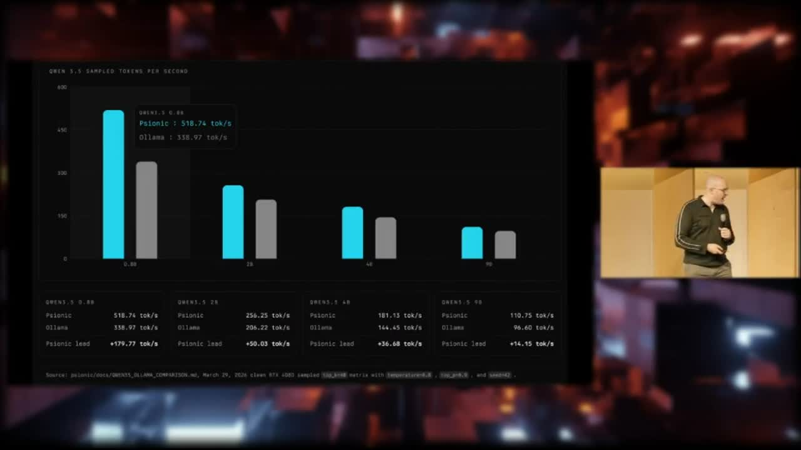

[Home](../README.md) · [Investor Path](README.md) · **05. Pylon, the Provider**

# 5. Pylon Provider

> _"Pylon is the standalone provider node for the current paid training path. It is the easiest way to put a machine online for OpenAgents jobs without running the full Autopilot desktop app."_
>
> — [`README.md`, OpenAgentsInc/openagents](https://github.com/OpenAgentsInc/openagents/blob/main/README.md)

**You will learn:**

- The one-line `nppx` install path and what it gives you
- The version ladder from 0.1.8 to the current 0.1.13
- Psionic, the Rust-first ML engine underneath Pylon

## The one-line install

```bash
npx @openagentsinc/pylon
```

That's the whole install. No desktop app, no build-from-source, no account creation. Keep the process running, and — from the [`README.md`](https://github.com/OpenAgentsInc/openagents/blob/main/README.md):

> _"Pylon creates local node identity and wallet state, marks the node online, advertises eligible capabilities to Nexus, asks for available work, executes assigned jobs locally, and watches for accepted-work payouts. A normal Pylon operator should not need a Nexus admin bearer token, a CS336-specific command, a direct artifact-store credential, or a separate course opt-in. The user-facing contract is: run `pylon`, stay online, and get paid when assigned work closes out as accepted."_

## Why Pylon exists alongside Autopilot

Autopilot is the wedge for individual users who want a personal agent _and_ an earn loop. Pylon is the zero-ceremony path for:

- operators who just want a machine earning
- Bitcoiners with idle compute who don't want to run an agent UI
- developers testing the paid-training lane from servers, cloud VMs, or headless rigs
- institutions running fleets of provider nodes across multiple machines

Chris described Pylon's design intent on _OAPN #2 — Pylon Launch_:

> _"If everyone, like literally everybody can, using these Bitcoin, Lightning, Nostr little tech based on top of it, can do something really cool like plug in any spare compute that you have and make that available into this open network, we are gonna be using it. We are buyer number one. We want your compute. But guess what? All this is on an open network. It's Nostr and NIP-90. If someone else wants to come and outbid us for your compute and pay more than we do, we want that to happen."_

— [_OAPN #2, Pylon Launch_](https://www.youtube.com/watch?v=uvRO-E9SXI8)

That is the distinction from Bittensor and the shitcoin decentralized-training projects: Pylon is _open-market_ supply. OpenAgents is the current buyer of first resort, not the only buyer.

## Current production build

From [`README.md`](https://github.com/OpenAgentsInc/openagents/blob/main/README.md):

- **Recommended build**: `pylon-v0.1.13` via `@openagentsinc/pylon` `0.1.13` or newer.
- Release receipt: [`docs/reports/nexus/20260423-pylon-v0.1.13-release.json`](https://github.com/OpenAgentsInc/openagents/blob/main/docs/reports/nexus/20260423-pylon-v0.1.13-release.json)
- Release commit: `8590d04a`
- Release branch: `pylon-v0.1.13`
- Build date: `2026-04-23`

From the release receipt itself, the `0.1.13` build:

> _"keeps the worker-launch behavior [from 0.1.12] and removes the last legacy runtime wording plus automatic runtime mutation from the public install path. Pylon runs a current `target/release/psionic-train` when present and otherwise falls back to `cargo run --release`, with failure receipts that show signal/log-tail details instead of only `code -1`."_

## The Pylon version ladder, in plain English

| Version        | What changed                                                                                                                               |
| -------------- | ------------------------------------------------------------------------------------------------------------------------------------------ |
| `0.1.8`        | First npm release-asset production proof; one accepted contribution, `closeout_status=rewarded`, `25-sat` worker wallet balance.            |
| `0.1.9`        | (Public release tag lagged behind the source fixes; superseded.)                                                                           |
| `0.1.10`       | Carried the Autopilot/Pylon fixes through public release asset + npm bootstrap path.                                                        |
| `0.1.11`       | Opens the minimal homework dashboard on `pylon`; TUI starts and supervises the earning worker; Gemma diagnostics/downloads are opt-in.     |
| `0.1.12`       | Fixed the Psionic-backed Mac training-worker launch path; remains the live hosted-Nexus homework-dispatcher _floor_ for the automatic loop. |
| **`0.1.13`**   | **Current recommended public build.** Keeps the 0.1.12 worker-launch path and removes the last legacy runtime wording and automatic runtime mutation from the public install flow. |

This is the "honest-scope posture" the user asked for: we ship frequently, we label what each release fixed, and the audit trail is public.

## Inspection commands (operator-facing)

From [`README.md`](https://github.com/OpenAgentsInc/openagents/blob/main/README.md):

```bash
pylon --version
pylon status --json
pylon training status --json
pylon wallet balance --json
pylon wallet history --limit 20 --json
```

`pylon doctor` and `pylon training status --json` report missing runtime prerequisites. For non-interactive operator proof, bootstrap with `--no-launch`, then run the installed `pylon` binary directly from the bootstrap cache or install root.

## Runtime prerequisites (honest scope)

From [`README.md`](https://github.com/OpenAgentsInc/openagents/blob/main/README.md):

> _"Pylon currently still needs the local training runtime prerequisites for this homework lane. In practice, keep a compatible Psionic checkout discoverable until that runtime is bundled more tightly."_

Translation for investors: Pylon is a one-line install for the _NPM_ path, but the Psionic training runtime is a separate compile target for now. Bundling that runtime more tightly is near-term roadmap, not done.

## Psionic, the ML engine underneath

`Psionic` is our Rust-first ML framework, and — per Chris at Demo Day — it's the world's fastest edge inference engine:

> _"Open agents' Psionic: 518 tokens per second on the lightest-weight Qwen model. We've since gotten that up to 530. Here's Ollama: 338 tokens per second. We are beating them by 30 percent. It's not because we're better ML engineers. We are better software engineers. We're building one vertically integrated agentic AI stack across products, infrastructure, and as of this month, by the time you watch this, we will have begun what we believe is about to be the largest decentralized model training run in history."_

<figure>
  
  <figcaption>Source: psionic/docs/QWEN35_OLLAMA_COMPARISON.md, March 29, 2026 — clean RTX 4080, sampled top_k=40, temperature=0.8, top_p=0.9, seed=42.</figcaption>
</figure>

— [Christopher David, Demo Day, April 21, 2026](https://bitcoinfi.network/demoday)

Psionic is also the reason Pylon can execute paid training work locally rather than handing it off to a cloud GPU. That is the supply-side unlock.

## The decentralized training ambition

From _OAPN #5 — Distributed Training 101_, Chris frames why Pylon matters beyond the 25-sat loop:

> _"The multi-billion dollar training runs, the multi, multi hundreds of billions of dollars that are allocated by the massive AI companies for compute, a lot of that goes to training. It's like instead of that going out to Nvidia and these big cloud people, like why don't we pay that to actual people? There's been great work… where they've taken the ideas come out of DeepMind for Diloco and some of these algorithms for decentralized training, and they've put them to use. Now, they've generally attached these shitcoins that I think are completely unnecessary, but hey, if you have 70 people that will contribute compute to be paid in your shitcoin, if we make it easy for Bitcoin, the massive, biggest, most secure, coolest, awesomest network, why don't we get 700 people or 7,000 or 70,000 people contributing their compute to this?"_

— [_OAPN #5, Distributed Training 101_](https://openagents.substack.com/p/oapn-5-distributed-training-101)

As of OAPN #5, the network crossed **1,300 Pylons online** and **1,000,000+ sats paid**. Those are the first two milestones of that ramp.

---

**← Previous:** [04. The Earn Loop](04-earn-loop.md) · **Next:** [06. Data Market MVP](06-data-market-mvp.md) **→**
