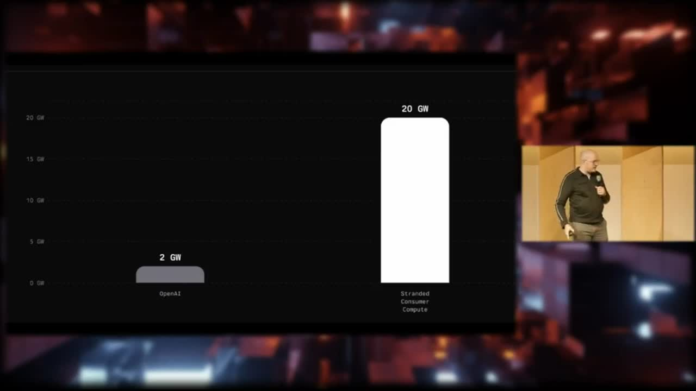
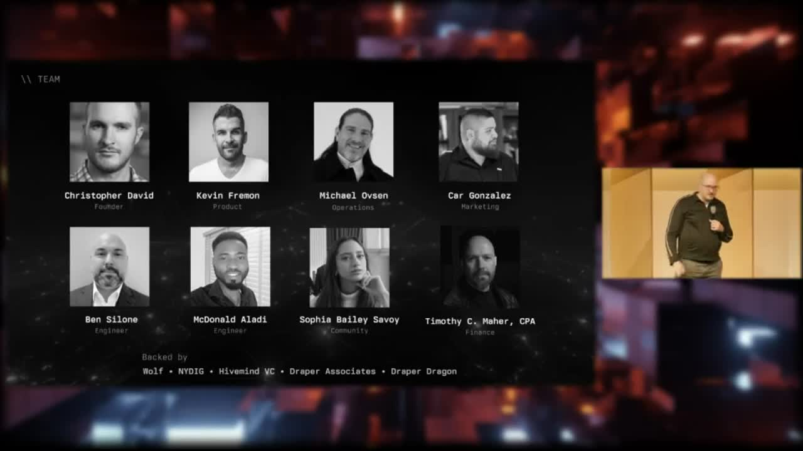

[Home](../README.md) · [Investor Path](README.md) · **10. Roadmap & Ask**

# 10. Roadmap & Ask

> _"We're raising a seed round. Help us out."_
>
> — Christopher David, [Bitcoinfi Demo Day](../assets/clips/cdavid-demoday-highlight-90s.mp4)

**You will learn:**

- The twelve-month arc, market by market
- The three pieces of infrastructure that cut across all of it
- How to reach Christopher David

## Where we are, in one paragraph

OpenAgents is a live project. Pylon is at [v0.1.13](https://github.com/OpenAgentsInc/openagents/releases/tag/pylon-v0.1.13) on the public npm registry. The earning loop has a reproducible end-to-end [proof](https://github.com/OpenAgentsInc/openagents/tree/main/docs/reports) dated 2026-04-23 — `0 → 25 sats`, real Lightning, payout id `019db8a2-98d2-…`. The Data Market is published on the public Nostr relays at `wss://relay.damus.io` and `wss://relay.primal.net`. The network has crossed 1,300 Pylons online and 1,000,000+ sats paid out (OAPN #5).

We are not at clearing prices. We are not at an equilibrium cap table. We are at the narrow, demonstrable wedge that [Chapter 3](03-autopilot-wedge.md) describes: _a single user can install an app and earn Bitcoin for useful machine work, today._

Twelve months from now, we'll be at the next thing.

## The twelve-month arc, by market

### Compute — from starter jobs to the 20 GW wedge

**Now.** CS336 paid-training is the starter lane. OpenAgents is buyer of first resort. Real work, real payouts, signed receipts on every contribution.

**Next six months.** Broaden the job menu past CS336 — a second paid-training lane, more starter-grade jobs for devices that can't run the heavy training loop, and a stronger anti-spoofing layer so the subsidized lane is harder to game. Ship the next milestones of the largest decentralized model-training run in history, which we have begun this month.

**Twelve months.** Open the buyer seat. Move from "OpenAgents pays 25 sats to train CS336" to "anyone can buy trained tokens, embeddings, or fine-tunes from retail providers on an open market." That's the inflection from supply-side seeding to a real venue.

### Data — from MVP to paid retrieval

**Now.** Live on two independent public relays. Targeted-request flow with permissioned grants and revocation receipts. Same kernel primitives that the Compute Market uses.

**Next six months.** Grow the handler registry past the seed providers. Lightning escrow for paid retrieval. A ratings layer across handlers so buyers can choose by track record.

**Twelve months.** Close the loop from buyer-initiated request to buyer-paid-on-delivery, on the open relay set. Bridge from "discoverable machine services" to "priced, contestable machine services."

### Labor — Forge, Probe, and paid contributors

**Now.** OpenAgents has paid out more Bitcoin to developer contributors than most AI labs have paid to engineers, period. From the Demo Day pitch:

> _"We've paid more Bitcoin, we've paid more anything to developers than every other AI lab combined."_

Developer bounties were reactivated on OAPN #6, _Pay the People_.

**Next six months.** Productize the Forge + Probe pattern Chris described:

> _"Forge should be able to deploy multiple probes. Insert StarCraft analogy here, but like the Forge, you know, you're equipping probes with arms… One system where all their developers can push changes and do PRs. We've already begun building this internally."_
>
> — Christopher David, OAPN #6

**Twelve months.** A business-targeted Autopilot — same kernel, same receipts, a different pane inventory. Chris on OAPN #6:

> _"There will be a business version of that for like putting your business on autopilot. Intended to be a drop-in replacement for Microsoft Copilot."_

### Liquidity — from Treasury rails to open underwriting

**Now.** The Treasury cuts every starter-job payout. Lightning rails are live on both ends of the earning proof.

**Next six months.** Formalize the open-treasury surface — kernel-signed reports any holder can reconcile against, without trusting a Treasury blob. Begin work on threshold signing for split-key issuance.

**Twelve months.** Multiple underwriters. Today, OpenAgents subsidizes starter paid-training demand. In twelve months, third parties become underwriters for classes of jobs they care about — companies that want an open American model trained, researchers funding retail compute pools, app platforms that want minimum SLA for their handlers.

### Risk — the quiet one

**Now.** No live underwriting layer. OpenAgents itself is currently absorbing the risk that starter work will be invalid — because we are buyer, underwriter, and subsidizer at once.

**Next twelve months.** Replace that implicit underwriting with explicit, kernel-authored risk receipts. A request can carry a risk addendum describing its coverage pool. A settled payout becomes a data point for pricing the next job of the same shape. A malfunctioning handler can be priced out, or priced in at a discount.

This is the slow market to build, and the most defensible one once it exists.

## Three pieces of infrastructure that cut across everything

- **Psionic.** The in-house ML engine that makes a home GPU competitive with rented cloud compute. Already 30% faster than Ollama on the benchmarks, getting faster.
- **Audit-grade trust.** The architecture where the receipts can't lie even if the app does. The continuing work is stronger device-bound attestation and independent audits of the components that touch the user's wallet.
- **Self-hosting turnkey.** Autopilot already supports pointing at user-owned backends and relay sets. The twelve-month goal is to make that the default story for any user who wants to run their own — same receipts, same authority lanes, different underwriter.

## What this all adds up to

Two lines:

1. **Keep the wedge narrow, demonstrable, and reproducible** — so any interested party can install, earn, and reconcile without trusting us.
2. **Widen the underwriting surface** — so OpenAgents is the buyer-of-first-resort on an open network, not the owner of the network.

The Demo Day pitch put the stakes plainly:

> _"The company that unlocks any percentage of this twenty gigawatts has a path to becoming the most valuable company in the world. Wouldn't it be cool if that was a Bitcoin company?"_

<figure>
  
  <figcaption>OpenAI runs on roughly 2 GW. Stranded consumer compute is closer to 20 GW. The twelve-month arc is about unlocking even a small percentage of that gap.</figcaption>
</figure>

## The ask

OpenAgents is raising a seed round. No figure, no terms, and no dilution targets are published here.

<figure>
  
  <figcaption>Team — Christopher David, Kevin Fremon, Michael Ovsen, Car Gonzalez, Ben Silone, McDonald Aladi, Sophia Bailey Savoy, Timothy C. Maher. Existing backers — Wolf, NYDIG, Hivemind VC, Draper Associates, Draper Dragon.</figcaption>
</figure>

The closer Chris uses on stage:

> _"I built a team. I've worked with some of these people for over a decade — Bitcoiners, open protocol people. We're shipping product. We're backed by some of the best early-stage Bitcoin investors in the space. Hopefully soon to include some of you. We're raising a seed round. Help us out."_

If you're reading this ahead of Bitcoin Vegas 2026 and want to talk, the right paths are, in order:

1. **The panel.** [Christopher David](https://x.com/OpenAgentsInc) is on the _"Why AI Agents Want Bitcoin"_ panel — Open Source stage, 10:45 AM.
2. **A warm intro.** If you already know an existing OpenAgents investor or contributor, that's the highest-signal path.
3. **The demo.** You can install Pylon today with `npx @openagentsinc/pylon` and earn 25 sats yourself.
4. **The receipts.** [Chapter 9](09-proof-receipts.md) points at the two signed artifacts that matter most. If those don't already answer the diligence question, the deck won't either.

Conversations are active. No terms are public.

## Where to find the source of truth

- Upstream repo: [`OpenAgentsInc/openagents`](https://github.com/OpenAgentsInc/openagents)
- Releases: [`/releases`](https://github.com/OpenAgentsInc/openagents/releases)
- Proof receipts: [`docs/reports/`](https://github.com/OpenAgentsInc/openagents/tree/main/docs/reports)
- Architecture decisions: [`docs/adr/`](https://github.com/OpenAgentsInc/openagents/tree/main/docs/adr)
- Developer Substack: [openagents.substack.com](https://openagents.substack.com)
- YouTube (OAPN, demos, build logs): [`@OpenAgentsInc`](https://www.youtube.com/@OpenAgentsInc)

This GitBook stays in sync with the repo. Every claim is anchored to a file, commit, or receipt in [OpenAgentsInc/openagents](https://github.com/OpenAgentsInc/openagents). If any claim drifts from the source, the receipts are the authority — not the chapter prose.

---


**Under the hood.** Engineers wanting to build on the roadmap should start in the [Developer Path](../developers/README.md). The Bifrost Threshold Coordination Profile (the open NIP-draft work blocking the Liquidity Market expansion) is detailed in the [2026-02-27 Nostr gap analysis](https://github.com/OpenAgentsInc/openagents/blob/main/docs/audits/2026-02-27-nostr-full-vision-nip-gap-analysis.md). The current Tier-A NIP gap (NIP-42, NIP-65, NIP-17, NIP-57, NIP-47, NIP-98) is tracked in the same audit.


---

**← Previous:** [09. Proof Receipts](09-proof-receipts.md)
