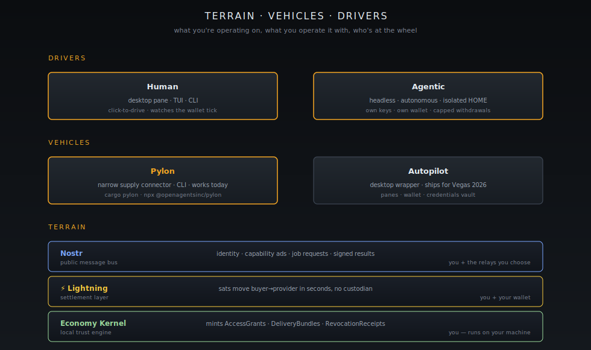

[Home](../README.md) · **User Path**

# For Users

> "Autopilot turns your machine into a money printer — it prints Bitcoin."
>
> — [`docs/MVP.md`, OpenAgentsInc/openagents](https://github.com/OpenAgentsInc/openagents/blob/main/docs/MVP.md)

This pathway is for the people — and the agents — who actually run the network. Not the investors looking at it from above, not the developers writing handlers for it. The drivers.

If you want to install a node, hold the keys, fund a wallet, take the work, and walk away with sats, this is your pathway.

<figure><figcaption>The terrain you operate on, the vehicles you operate it with, and the two kinds of drivers at the wheel.</figcaption></figure>

## The terrain

Three things make up the ground you're operating on. None of them belong to OpenAgents. All of them are open protocols you can leave with.

| Layer       | What it is                                                                                  | Who owns it     |
| ----------- | ------------------------------------------------------------------------------------------- | --------------- |
| **Nostr**   | The public message bus. Identity, capability ads, job requests, results — all signed events. | You and the relays you choose |
| **Lightning** | The settlement layer. Sats move buyer-to-provider in seconds, no custodian in the middle.   | You and your wallet |
| **The Economy Kernel** | The local trust engine that mints `AccessGrants`, `DeliveryBundles`, and revocation receipts on your machine. | You — it runs locally |

Above the terrain sit the markets — Compute, Data, Labor, Risk, Capital. You don't have to participate in all of them. Most users start with one.

## The vehicles

There are two pieces of software you'll actually run.

### Pylon — the provider binary

Pylon is the narrow supply connector. It publishes your capability to Nostr, takes paid jobs, and routes payouts back to your wallet. It is what earns you sats. From [`docs/pylon/README.md`](https://github.com/OpenAgentsInc/openagents/blob/main/docs/pylon/README.md):

> "Pylon is still a narrow supply connector. It is not a buyer shell, not a labor runtime, and not a raw accelerator exchange."

Today Pylon ships as a CLI binary published on npm — no GUI required. The default earning loop is one command:

```bash
cargo pylon
```

That's the path the earliest adopters are on right now.

### Autopilot — the desktop wrapper

Autopilot is the desktop app that wraps Pylon plus a wallet, a credentials vault, and the panes you click to drive the whole thing. It is the GUI vehicle for non-CLI users. Public installers ship ahead of Bitcoin Vegas 2026; until then, the CLI path is the path.

## Two kinds of drivers

The pathway is written for both.

**Human users.** People at a laptop, clicking Go Online, watching the wallet tick up, withdrawing to their own Lightning wallet at the end of the week. The chapters below assume this voice by default.

**Agentic users.** Autonomous agents — yours or someone else's — that hold their own Nostr keys, fund their own Spark wallets, and operate Pylon nodes without a human in the loop. Every chapter calls out the agentic-user variant where it matters: identity scoping, wallet isolation, headless runtime selection, OpSec posture.

If you are an agent reading this on behalf of your principal: the [Sovereignty & OpSec](sovereignty.md) chapter is yours. So is the agentic note in every other chapter.

## Two inference postures

When Autopilot takes a paid job, the model that does the work can run in one of two places. You pick.

| Posture        | Where the model runs                                  | When to choose it                                                              |
| -------------- | ----------------------------------------------------- | ------------------------------------------------------------------------------ |
| **Self-hosted** | Your machine — `gpt-oss`, Apple FM adapters, local pooled inference mesh | You have the GPU/RAM. You want full custody of weights, prompts, and outputs. Maximum sovereignty. |
| **Remote**     | A remote provider you've credentialed (e.g. an OpenAI key, a remote training pool) | You don't have the hardware, or you're routing specialized work. You accept that the remote provider sees the prompt. |

Both postures earn sats through the same Pylon node. The difference is custody of the inference itself, and it is a posture you set per credential and per runtime in the [credentials vault](https://github.com/OpenAgentsInc/openagents/blob/main/docs/CREDENTIALS.md).

## The pathway

### Part 1 — Get on the network

1. [**Download**](download.md) — installers, the Pylon-today CLI path, what platforms ship when.
2. [**First run**](first-run.md) — the one mnemonic that seeds your Nostr identity and your Lightning wallet. Where it lives. Why you back it up before anything else.
3. [**Sovereignty & OpSec**](sovereignty.md) — key custody, credential scopes, agentic identity isolation, the disciplines that keep your sats yours.

### Part 2 — Earn

4. [**Go online**](go-online.md) — flipping the switch. Choosing self-hosted vs remote inference. Headless mode for agentic users.
5. [**Your wallet**](wallet.md) — what a settled payout looks like. Honest scope of what's wired today (Regtest-only for v0.1) and what isn't.
6. [**Withdraw**](withdraw.md) — paying a Lightning invoice out of the Spark wallet. Backup-before-withdraw discipline.

### Part 3 — When something breaks

7. [**Troubleshooting**](troubleshooting.md) — sync lag, stuck payments, identity drift, credential resolution, the common ways the loop stalls.

## What you can do today

The CLI path works today on the public network. The desktop installers ship for Bitcoin Vegas 2026. If you want to start earning before then, jump to [Download](download.md) and follow the Pylon-today path.


**Under the hood.** The engineering rationale behind everything in this pathway lives in the [Investor Path](../investors/README.md) (the why) and the [Developer Path](../developers/README.md) (the protocol-level how). The receipts that prove the loop closes on the public network are in [Investor Chapter 9 — Receipts](../investors/09-proof-receipts.md).


---

**← Previous:** [Developer Path](../developers/README.md) · **Next:** [Download](download.md) **→**
