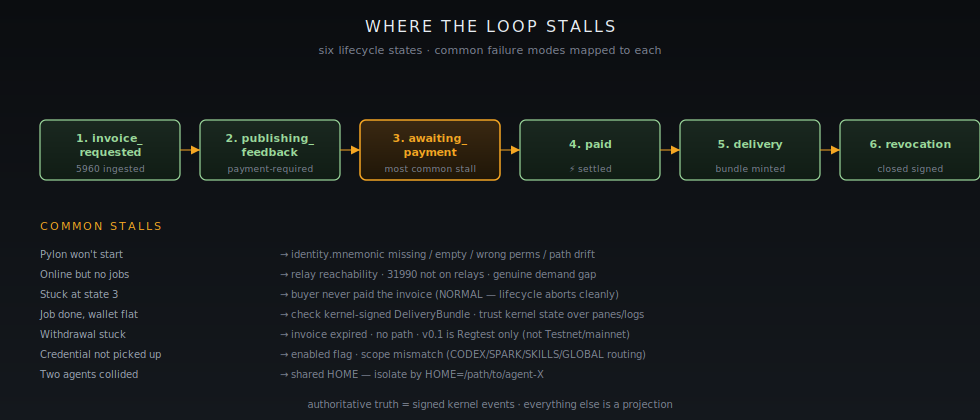

[Home](../README.md) · [User Path](README.md) · **Troubleshooting**

# Troubleshooting

The loop has known stall points. Each one has a diagnostic ladder. Walk the rungs in order — most issues clear on rung 1 or 2.

<figure><figcaption>The six lifecycle states and where the seven most common failures actually live. State 3 stalls are normal; the rest deserve a ladder walk.</figcaption></figure>

## "Pylon won't start" / "identity error"

**Symptoms:** binary exits on launch, log mentions identity, mnemonic, or path resolution.

1. **Check the canonical path exists and is readable.**
   ```bash
   ls -la ~/.openagents/pylon/identity.mnemonic
   ```
   Mode should be `600`. If the file is missing, see [First run](first-run.md). If the file is empty, the binary will refuse to load (intentionally — see [`crates/nostr/core/src/identity.rs:55-60`](https://github.com/OpenAgentsInc/openagents/blob/main/crates/nostr/core/src/identity.rs)).
2. **Don't fall for path drift.** If something tells you the identity lives at `~/.openagents/nostr/identity.json`, ignore it — that is settings drift flagged in [`docs/audits/2026-02-28-full-codebase-architecture-audit.md`](https://github.com/OpenAgentsInc/openagents/blob/main/docs/audits/2026-02-28-full-codebase-architecture-audit.md). The authoritative path is `~/.openagents/pylon/identity.mnemonic`.
3. **Confirm `OPENAGENTS_HOME` is what you expect** if you've ever set it. Agentic isolation patterns rely on it; a stale value points to the wrong home.

## "I clicked Go Online but no jobs are landing"

**Symptoms:** Pylon is up, identity loaded, no kind `5960` requests arriving.

1. **Confirm provider presence is actually published.** The log should show `provider presence published` after startup. If it doesn't, the relay set is unreachable — try `wss://relay.damus.io` directly with a Nostr client to confirm outbound WSS.
2. **Confirm the kind `31990` capability ad is on the relays.** Use any Nostr client to query for events from your pubkey. If it isn't there, your event isn't being accepted (rare) or isn't being published (more common — usually a relay-list config issue).
3. **There simply may not be matching demand.** v0.1 daily volume is bounded; the public earning proof ([Investor Chapter 9 — Receipts](../investors/09-proof-receipts.md)) settled at 25-sat unit prices against a 6,400/day cap. Demand fluctuates.

## "A job came in but the wallet didn't update"

**Symptoms:** kind `5960` request observed, possibly a `payment-required` feedback emitted, balance stays flat.

1. **Trust the kernel events first.** If the kernel minted a `DeliveryBundle`, the work was delivered and the payment is part of the same transition. If it didn't, the lifecycle stalled before delivery.
2. **Walk the lifecycle states.** From [`docs/plans/data-market-mvp-implementation-spec.md`](https://github.com/OpenAgentsInc/openagents/blob/main/docs/plans/data-market-mvp-implementation-spec.md): `invoice_requested → publishing_feedback → awaiting_payment → paid → delivery → revocation`. Find which state you're stuck in. The most common stall is `awaiting_payment` (buyer never paid the invoice — the invoice expires and the lifecycle aborts cleanly).
3. **Pane / log / kernel disagreement?** The kernel-signed events are authoritative. A pane that disagrees with the kernel is a projection bug, not a settlement bug.

## "Withdrawal is stuck"

**Symptoms:** outbound HTLC issued, receiving wallet not seeing it, or balance not decrementing.

1. **Did the invoice expire?** Lightning invoices have short windows. Re-generate from the receiving wallet and try again.
2. **Is there a path?** No-route errors mean Lightning network conditions, not Pylon. Try a smaller amount or a different destination.
3. **Regtest vs other networks.** v0.1 is Regtest only ([`crates/spark/src/wallet.rs:22`](https://github.com/OpenAgentsInc/openagents/blob/main/crates/spark/src/wallet.rs), Finding 6 in the [code-smell audit](https://github.com/OpenAgentsInc/openagents/blob/main/docs/audits/2026-02-26-codebase-code-smell-audit.md)). A Testnet or mainnet invoice will not pay out — those flags are silently remapped to Regtest in v0.1.
4. **Confirm the kernel saw the outbound.** If the local Spark balance decremented but the kernel has no outbound entry, that is a state mismatch worth filing.

## "I can see my secret keys in the terminal — is that a bug?"

Yes. It's a known one. The renderer at [`apps/autopilot-deprecated/src/render.rs:329, 350`](https://github.com/OpenAgentsInc/openagents/blob/main/apps/autopilot-deprecated/src/render.rs) prints full secret material in its default state — Finding 5 in [`docs/audits/2026-02-26-codebase-code-smell-audit.md`](https://github.com/OpenAgentsInc/openagents/blob/main/docs/audits/2026-02-26-codebase-code-smell-audit.md). Until that lands hardened:

- Treat Pylon terminal output as secret material.
- Don't screen-share Pylon log streams.
- Redact log output before pasting it into bug reports.

This is on the v0.1 fix list, not in steady state.

## "The desktop Go Online pane says I'm online but no events are landing"

**Symptoms:** the WGPUI Go Online pane shows green / online, but no kind `31990` capability ad appears on the relays and no kind `5960` requests arrive.

In v0.1 the desktop Go Online pane is a UI simulation — it is not yet wired to the live Pylon backend. The lane that actually publishes capability and takes work is the packaged-app `autopilotctl` surface plus the `cargo pylon` binary.

1. **Confirm via `autopilotctl`, not the pane.**
   ```bash
   autopilotctl provider status
   ```
   That output is the truth. If it shows offline while the pane shows online, trust `autopilotctl`.
2. **Bring the live lane online from the CLI.** Use `cargo pylon` (or `autopilotctl` per [`docs/headless-compute.md`](https://github.com/OpenAgentsInc/openagents/blob/main/docs/headless-compute.md)). The desktop pane will reach parity with that lane ahead of GA; until then the CLI is the working path.
3. **Don't file a bug just because the pane and the CLI disagree** — that is the v0.1 simulation gap, not a regression. Worth filing if `autopilotctl` itself disagrees with the kernel-signed events on relay.

## "Credential isn't being picked up by the runtime"

**Symptoms:** API key set in the vault, runtime acts like it isn't there.

Walk the [`docs/CREDENTIALS.md`](https://github.com/OpenAgentsInc/openagents/blob/main/docs/CREDENTIALS.md) resolution order:

1. Process env fallback (`ENV_NAME`) wins if non-empty.
2. Keychain value next.
3. Empty / errored keychain falls back to env.
4. If neither has a usable value, the credential is unset.

The most common cause: `enabled` flag is off, or the scope (`CODEX` / `SPARK` / `SKILLS` / `GLOBAL`) doesn't include the runtime that needs the key. Codex receives `CODEX | SKILLS | GLOBAL`. Spark receives `SPARK | GLOBAL`.

## "Two agents on the same machine collided"

**Symptoms:** state corruption, duplicated events under the wrong pubkey, wallet weirdness.

You ran two Pylons against the same `~/.openagents/pylon/` home. Don't.

The fix is the bilateral-loop pattern: isolate by `HOME`. See [`docs/autopilot-earn/AUTOPILOT_EARN_RECIPROCAL_LOOP_RUNBOOK.md`](https://github.com/OpenAgentsInc/openagents/blob/main/docs/autopilot-earn/AUTOPILOT_EARN_RECIPROCAL_LOOP_RUNBOOK.md):

```bash
HOME=/path/to/agent-a cargo pylon
HOME=/path/to/agent-b cargo pylon
```

Each `HOME` gets its own mnemonic, its own wallet, its own ledger. Recover the mixed-state home by exporting any usable receipts, then start fresh in a new `HOME`.

## "The earning proof says it works on the public network — how do I reproduce it?"

You don't need to take our word for it. The [public earn-loop receipts](../investors/09-proof-receipts.md) include the exact event ids, payout id `019db8a2-98d2-7890-95e4-6a1d78709a3c`, and the relay set used. Query any of the listed relays for those events with a Nostr client. The kernel-signed `DeliveryBundle` events are public.

## When to file an issue

If you've walked the relevant ladder and the kernel-signed events disagree with what the binary is reporting — file. That's a real bug.

If logs and panes disagree but the kernel events are consistent — check your projection layer (likely a stale snapshot), but the underlying loop is fine.

If you're stuck on `awaiting_payment` and the buyer never paid — that's normal. The lifecycle aborts and you move on.


**Under the hood.** Identity loader: [`crates/nostr/core/src/identity.rs`](https://github.com/OpenAgentsInc/openagents/blob/main/crates/nostr/core/src/identity.rs). Lifecycle states: [`docs/plans/data-market-mvp-implementation-spec.md`](https://github.com/OpenAgentsInc/openagents/blob/main/docs/plans/data-market-mvp-implementation-spec.md). Findings 5 and 6 are in the code-smell audit: [`docs/audits/2026-02-26-codebase-code-smell-audit.md`](https://github.com/OpenAgentsInc/openagents/blob/main/docs/audits/2026-02-26-codebase-code-smell-audit.md). Open architecture findings: [`docs/audits/2026-02-28-full-codebase-architecture-audit.md`](https://github.com/OpenAgentsInc/openagents/blob/main/docs/audits/2026-02-28-full-codebase-architecture-audit.md). Broader hardening posture: [`docs/audits/2026-02-27-full-system-hardening-audit.md`](https://github.com/OpenAgentsInc/openagents/blob/main/docs/audits/2026-02-27-full-system-hardening-audit.md).


---

**← Previous:** [Withdraw](withdraw.md) · **Next:** [User Path](README.md) **→**
