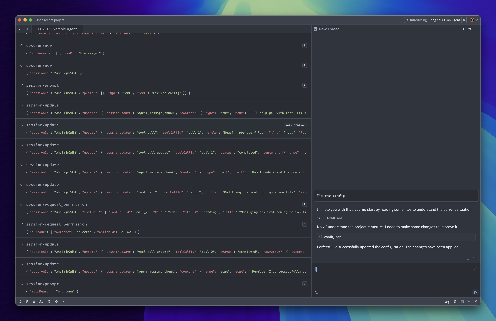

# ACP TypeScript Examples

This directory contains examples using the [ACP](https://agentclientprotocol.com) library for TypeScript:

- [`agent.ts`](./agent.ts) - A minimal agent implementation that simulates LLM interaction
- [`client.ts`](./client.ts) - A minimal client implementation that spawns the [`agent.ts`](./agent.ts) as a subprocess

## Running the Agent

### In Zed

While minimal, [`agent.ts`](./agent.ts) implements a compliant [ACP](https://agentclientprotocol.com) Agent. This means we can connect to it from an ACP client like [Zed](https://zed.dev)!

1. Clone this repo

```sh
$ git clone https://github.com/agentclientprotocol/typescript-sdk.git
```

2. Add the following at the root of your [Zed](https://zed.dev) settings:

```json
  "agent_servers": {
    "Example Agent": {
      "command": "npx",
      "args": [
        "tsx",
        "/path/to/agent-client-protocol/src/examples/agent.ts"
      ]
  }
```

❕ Make sure to replace `/path/to/agent-client-protocol` with the path to your clone of this repository.

Note: This configuration assumes you have [npx](https://docs.npmjs.com/cli/v8/commands/npx) in your `PATH`.

3. Run the `acp: open acp logs` action from the command palette (<kbd>⌘⇧P</kbd> on macOS, <kbd>ctrl-shift-p</kbd> on Windows/Linux) to see the messages exchanged between the example agent and Zed.

4. Then open the Agent Panel, and click "New Example Agent Thread" from the `+` menu on the top-right.


5. Finally, send a message and see the Agent respond!



### By itself

You can also run the Agent directly and send messages to it:

```bash
npx tsx src/examples/agent.ts
```

Paste this into your terminal and press <kbd>enter</kbd>:

```json
{"jsonrpc":"2.0","id":0,"method":"initialize","params":{"protocolVersion":1}}
```

You should see it respond with something like:

```json
{"jsonrpc":"2.0","id":0,"result":{"protocolVersion":1,"agentCapabilities":{"loadSession":false}}}
```

From there, you can try making a [new session](https://agentclientprotocol.com/protocol/session-setup#creating-a-session) and [sending a prompt](https://agentclientprotocol.com/protocol/prompt-turn#1-user-message).

## Running the Client

Run the client example from the root directory:

```bash
npx tsx src/examples/client.ts
```

This client will spawn the example agent as a subprocess, send a message, and print the content it receives from it.
